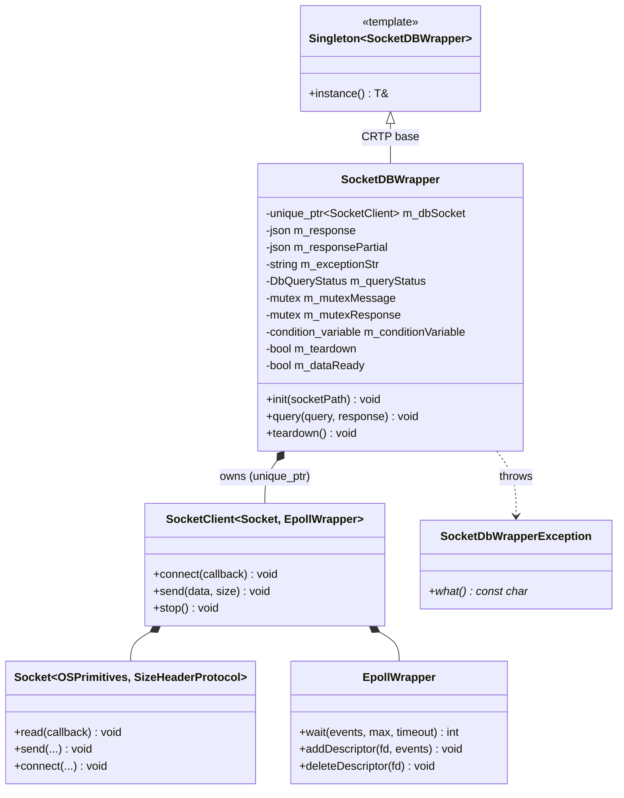
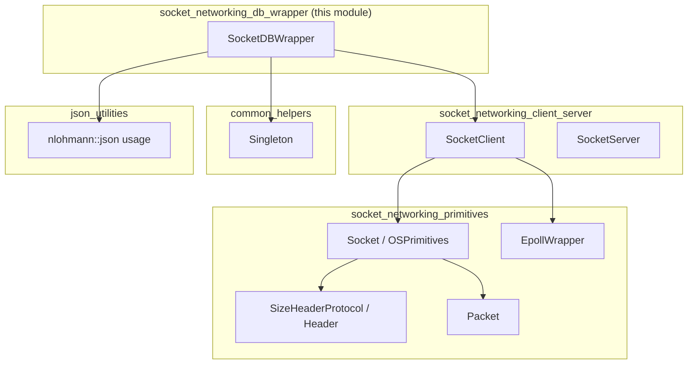
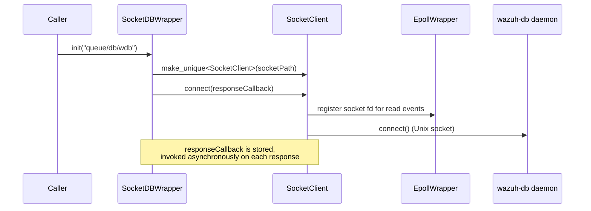
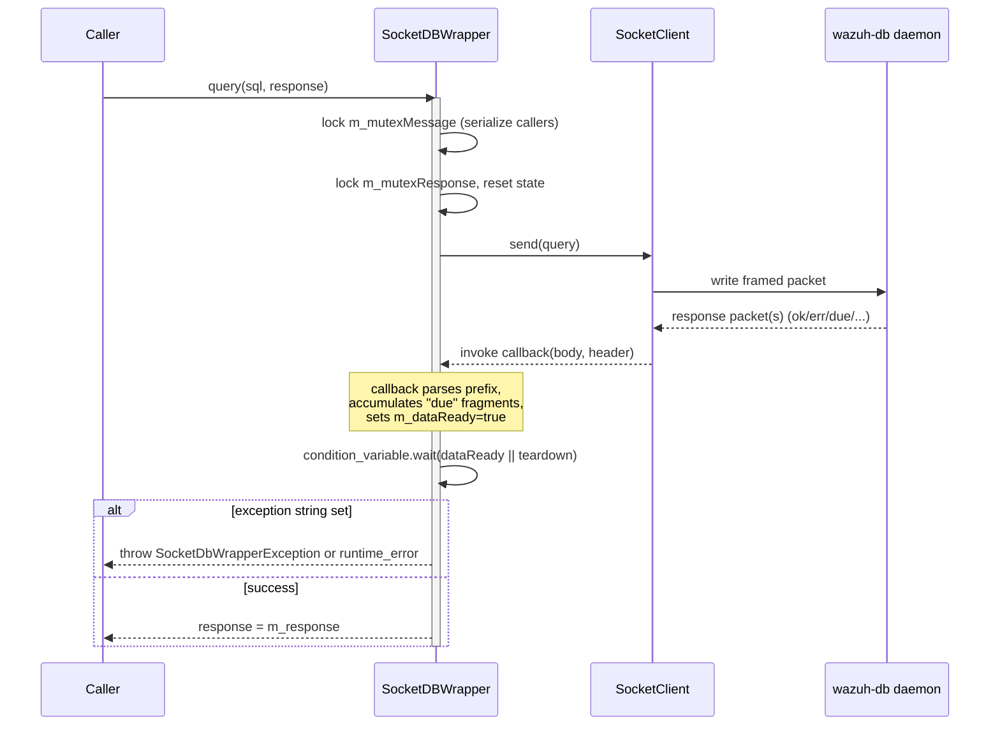
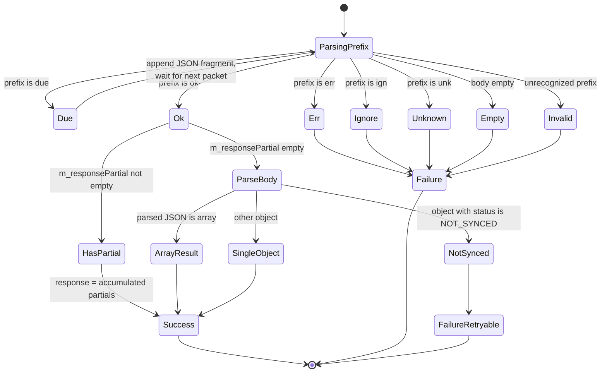
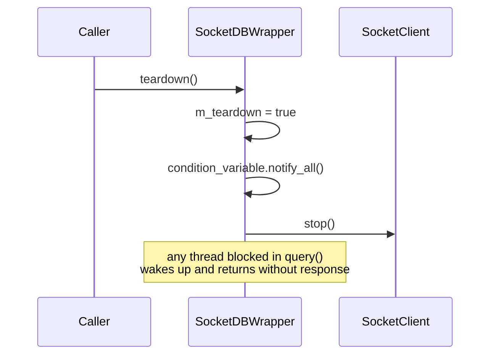

# Socket Networking – DB Wrapper (`SocketDBWrapper`)

## Introduction

The **Socket Networking DB Wrapper** module provides a thread-safe, synchronous-looking C++ API for communicating with the **Wazuh DB** daemon (`wazuh-db`) over its Unix domain socket (`queue/db/wdb`). It is implemented by a single core class, `SocketDBWrapper`, defined in `src/shared_modules/utils/socketDBWrapper.hpp`.

Although the underlying transport (`SocketClient`) is fully **asynchronous** and event-driven (backed by `epoll`), `SocketDBWrapper` hides that complexity behind a simple blocking `query()` call. Internally it uses a condition variable to suspend the calling thread until the asynchronous response callback has fully assembled and parsed the JSON reply (including multi-part "due" responses), then returns the result synchronously to the caller.

This wrapper is a foundational building block used by many higher-level C++ daemons and libraries in the Wazuh codebase (e.g., `dbsync`, `rsync`, `router`, and various `wazuh_modules`) whenever they need to query or persist data through `wazuh-db` without having to manage raw socket I/O, framing, or JSON reassembly themselves.

---

## Purpose and Core Functionality

| Responsibility | Description |
|---|---|
| **Connection management** | Opens and owns a `SocketClient` connected to the `wazuh-db` Unix socket, using `Socket<OSPrimitives, SizeHeaderProtocol>` framing and `EpollWrapper`-based event notification. |
| **Protocol translation** | Understands the `wazuh-db` textual response protocol (`ok`, `err`, `unk`, `ign`, `due`) and translates it into either a `nlohmann::json` result or a thrown C++ exception. |
| **Multi-part response reassembly** | Handles the `due` (paginated) response prefix used by `wazuh-db` for large result sets, accumulating partial JSON fragments until the final `ok` terminator arrives. |
| **Synchronization** | Converts the asynchronous socket callback model into a blocking call (`query()`) safe for use from multiple threads, serialized via a message mutex. |
| **Lifecycle control** | Exposes `init()` and `teardown()` to start/stop the socket connection cleanly, waking up any threads blocked in `query()` during shutdown. |
| **Error signaling** | Raises `SocketDbWrapperException` for the "not synced" condition (a recoverable/retryable state) and generic `std::runtime_error` for all other failure modes. |

`SocketDBWrapper` is implemented as a **Singleton** (via the shared `Singleton<T>` CRTP base from `shared_utils`), so the entire process shares one connection instance and one query queue, which is appropriate given `wazuh-db`'s single logical socket per daemon.

---

## Architecture

### Class Structure



`SocketDBWrapper` sits at the top of the `socket_networking` utility stack:



For details on the lower-level primitives referenced above, see:
- [socket_networking_primitives](socket_networking_primitives.md) – `Socket`, header protocols, `EpollWrapper`, `Packet`.
- [socket_networking_client_server](socket_networking_client_server.md) – `SocketClient` / `SocketServer` connection management.
- [design_patterns](design_patterns.md) – the generic `Singleton` pattern used here.
- [json_utilities](json_utilities.md) – JSON helpers used across `shared_utils`.

### Position in the System

`SocketDBWrapper` is the C++ analogue of the Python-side `WazuhDBConnection` / `AsyncWazuhDBConnection` classes found in [framework_core_communication_wdb](framework_core_communication_wdb.md) (`framework/wazuh/core/wdb.py`). Both provide access to the same `wazuh-db` daemon, but for different runtime environments:

- **Python API layer / framework** → `framework/wazuh/core/wdb.py` (`WazuhDBConnection`, `AsyncWazuhDBConnection`) — used by the Wazuh API, CLI scripts, and RBAC/agent management logic. See [framework_core_communication_wdb](framework_core_communication_wdb.md).
- **C++ daemons / modules** → `SocketDBWrapper` — used by native C++ components such as `dbsync`, `rsync`, `router`, `inventory_harvester`, and `vulnerability_scanner` (see [dbsync](dbsync.md), [rsync](rsync.md), [router](router.md)).

Both ultimately talk to the same backend process: the `wazuh-db` daemon and its SQLite-backed global/agent databases (see the `Unit_Tests_-_Wazuh_DB` / `wazuh_db` sources under `src/wazuh_db`).

---

## Data Flow / Sequence

### `init()` and Callback Registration



### `query()` – Synchronous Request / Async Response



### Response Classification State Machine



### `teardown()` – Shutdown



---

## Component Interaction Details

### Internal State

| Field | Purpose |
|---|---|
| `m_dbSocket` | Owns the underlying `SocketClient<Socket<OSPrimitives, SizeHeaderProtocol>, EpollWrapper>` connection. |
| `m_response` / `m_responsePartial` | Accumulate the final and in-progress (paginated) JSON results respectively. |
| `m_exceptionStr` / `m_queryStatus` | Capture error context set inside the async callback, consumed by the blocking `query()` caller. |
| `m_mutexMessage` | Serializes concurrent calls to `query()` so only one request/response cycle is in flight at a time (the underlying socket protocol is not multiplexed). |
| `m_mutexResponse` + `m_conditionVariable` + `m_dataReady` | Implements the async-to-sync bridge: the callback sets `m_dataReady` and notifies; `query()` waits on this condition. |
| `m_teardown` | Cooperative shutdown flag checked both before sending a new query and inside the wait predicate. |

### Response Protocol Prefixes

| Prefix constant | Meaning | Resulting behavior |
|---|---|---|
| `DB_WRAPPER_OK` (`"ok"`) | Successful query | Parse remaining payload as JSON; may be an array, a single object, or (if `m_responsePartial` was populated) the accumulated paginated result. |
| `DB_WRAPPER_ERROR` (`"err"`) | Query execution error | Throws `std::runtime_error` with the DB-provided error text. |
| `DB_WRAPPER_UNKNOWN` (`"unk"`) | Unknown command/query | Throws `std::runtime_error`. |
| `DB_WRAPPER_IGNORE` (`"ign"`) | Query intentionally ignored by `wazuh-db` | Throws `std::runtime_error`. |
| `DB_WRAPPER_DUE` (`"due"`) | Partial/paginated response | Payload appended to `m_responsePartial`; wrapper keeps waiting for further packets until a final `ok` arrives. |
| *(empty body)* | No data received | Throws `std::runtime_error` ("Empty DB response"). |
| *(unrecognized)* | Malformed/unexpected response | Throws `std::runtime_error` ("DB query invalid response"). |

A special case exists when the parsed JSON object contains `"status": "NOT_SYNCED"`: this is surfaced as a distinct, **catchable** `SocketDbWrapperException` (rather than a generic `runtime_error`), allowing callers to specifically detect and retry on synchronization-pending conditions.

---

## Usage Pattern

Typical usage from a C++ component (e.g., inside `dbsync`, `rsync`, or a `wazuh_modules` component):

```cpp
#include "socketDBWrapper.hpp"

// One-time initialization (e.g., at daemon startup)
SocketDBWrapper::instance().init(); // defaults to "queue/db/wdb"

// Synchronous-looking query from any thread
nlohmann::json response;
try
{
    SocketDBWrapper::instance().query("global sql SELECT * FROM agent", response);
    // use `response` (a JSON array of rows/results)
}
catch (const SocketDbWrapperException& notSyncedEx)
{
    // Handle "NOT_SYNCED" — typically retry later
}
catch (const std::exception& ex)
{
    // Handle generic DB/communication errors
}

// On shutdown
SocketDBWrapper::instance().teardown();
```

Because `SocketDBWrapper` derives from `Singleton<SocketDBWrapper>`, all callers within the same process obtain the same instance via `SocketDBWrapper::instance()`, sharing one physical connection to `wazuh-db`.

---

## Relationship to Sibling Modules

| Module | Relationship |
|---|---|
| [socket_networking_primitives](socket_networking_primitives.md) | Supplies `Socket`, `SizeHeaderProtocol`/`Header`, `EpollWrapper`, and `Packet` — the low-level building blocks that `SocketClient` (and transitively `SocketDBWrapper`) is templated on. |
| [socket_networking_client_server](socket_networking_client_server.md) | Supplies `SocketClient`, the generic asynchronous client class that `SocketDBWrapper` wraps and specializes for the `wazuh-db` protocol. |
| [design_patterns](design_patterns.md) | Provides the generic `Singleton<T>` template that `SocketDBWrapper` extends. |
| [shared_lib_networking](shared_lib_networking.md) | Related lower-level networking utilities used across `shared_utils`, including message-queue helpers. |
| [dbsync](dbsync.md) | Example shared-module consumer that relies on similar DB-socket communication patterns to persist/query state through `wazuh-db`. |
| [rsync](rsync.md) | Uses DB synchronization primitives (`DBSyncWrapper`) that build on top of the same socket-based communication approach. |
| [router](router.md) | Native C++ router module that also communicates with `wazuh-db` via socket endpoints (see `router/src/wazuh-db/*`). |
| [framework_core_communication_wdb](framework_core_communication_wdb.md) | The Python-side equivalent (`WazuhDBConnection`, `AsyncWazuhDBConnection`, `wdb_http`) providing the same kind of `wazuh-db` access for the API/framework layer. |
| [socket_networking_client_server](socket_networking_client_server.md) / [socket_networking_helpers](socket_networking_helpers.md) | Sibling submodules within the same `socket_networking` parent grouping, covering client/server socket lifecycle and generic networking helpers respectively. |

---

## Design Notes and Considerations

- **Serialization of requests**: Since `wazuh-db`'s socket protocol is strictly request/response (no correlation IDs), `SocketDBWrapper` enforces one in-flight query at a time via `m_mutexMessage`. Concurrent callers will block until the previous query completes.
- **Pagination transparency**: Large result sets are transparently reassembled from multiple `due`-prefixed packets into a single JSON array, so callers never need to handle pagination themselves.
- **Exception design**: Only the `NOT_SYNCED` condition uses the dedicated `SocketDbWrapperException` type; all other failures map to `std::runtime_error`. This lets calling code distinguish "temporarily not ready, retry" from "hard failure" without inspecting error strings.
- **Non-copyable/movable by design**: As a `Singleton`, `SocketDBWrapper` cannot be copied, moved, or independently instantiated — all access must go through `SocketDBWrapper::instance()`.
- **Thread-safety of `init`/`teardown`**: These are expected to be called once each (typically at daemon start/stop) from a controlling thread; they are not designed for concurrent re-initialization.
