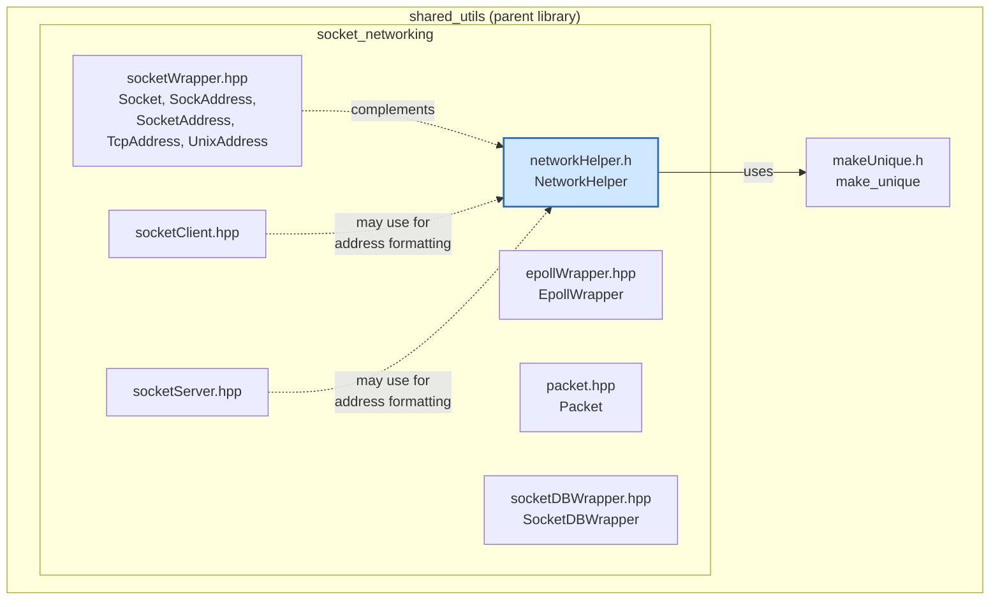
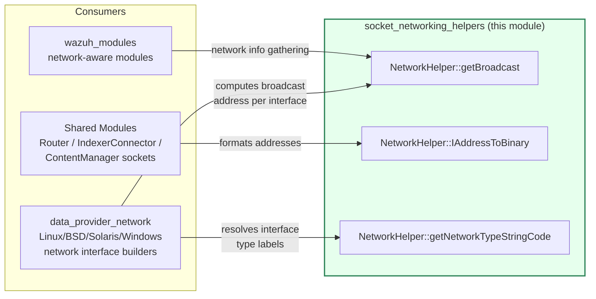
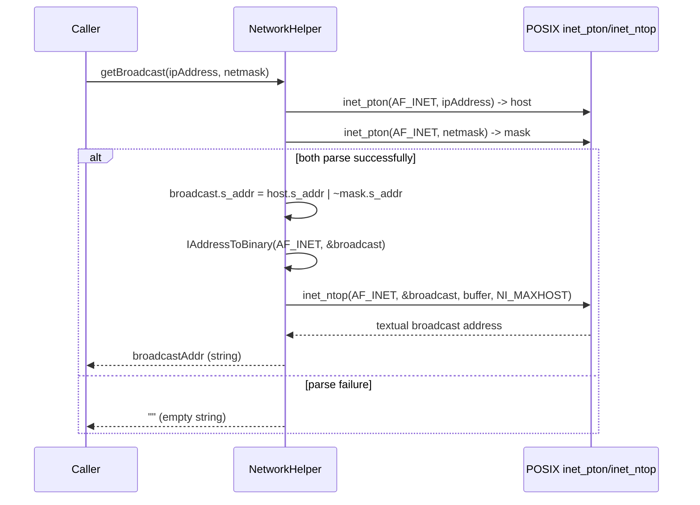
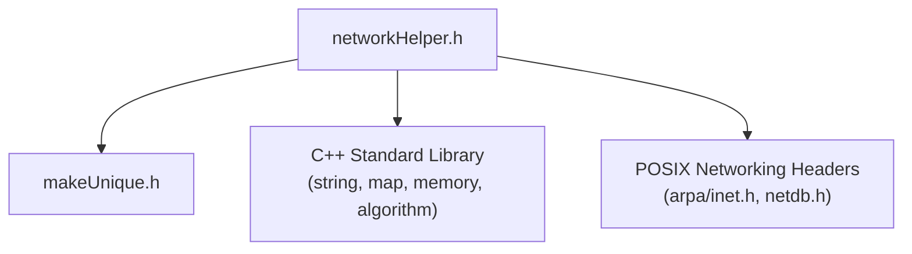

# Socket Networking Helpers

## Introduction

`socket_networking_helpers` is a small, header-only C++ utility module within Wazuh's `shared_modules/utils` library. It provides low-level IPv4 network address manipulation primitives — most notably broadcast-address calculation and binary-to-string address conversion — that are consumed by higher-level networking and socket components across the Wazuh codebase (e.g., data providers that report network interface information, and socket client/server implementations that need to format or derive addresses).

This module is intentionally minimal in scope: it does not implement sockets, connections, or protocol logic itself. Instead, it acts as a **supporting utility layer** for the [socket_networking_primitives](socket_networking_primitives.md) and [socket_networking_client_server](socket_networking_client_server.md) modules, as well as for OS-level network inventory collection performed in the [data_provider_network](data_provider_network.md) family of modules.

---

## Purpose and Core Functionality

The module exposes a single static utility class, `Utils::NetworkHelper`, defined in `src/shared_modules/utils/networkHelper.h`. It provides three related capabilities:

1. **Network type code lookup** (`getNetworkTypeStringCode`): Given an integer value and a map of `(range-low, range-high) -> label` pairs, it resolves a human-readable label for network interface type codes (e.g., mapping raw OS-reported interface type integers to descriptive strings).

2. **Binary-to-text IP address conversion** (`IAddressToBinary`): A generic template wrapper around POSIX `inet_ntop()` that converts a raw address structure (IPv4 `in_addr` or IPv6 `in6_addr`) into its textual representation, returning an empty string on failure rather than throwing.

3. **Broadcast address computation** (`getBroadcast`): Given an IPv4 address and subnet mask (both as text), computes and returns the broadcast address in textual form by combining the host address with the inverted mask (`host.s_addr | ~mask.s_addr`), leveraging `inet_pton()`/`inet_ntop()` for conversions.

Because all methods are `static` and the class has no instance state, `NetworkHelper` is used as a stateless helper — callers do not need to construct it.

### Key characteristics

- **Header-only**: All logic is implemented inline in the `.h` file; there is no corresponding `.cpp` translation unit.
- **No exceptions on parse failure**: Invalid addresses simply result in an empty `std::string` return value, simplifying error handling for callers doing best-effort network enumeration.
- **RAII-friendly**: Uses `Utils::make_unique` (from [common_helpers](common_helpers.md) via `makeUnique.h`) to safely allocate the scratch buffer used by `inet_ntop()`.
- **Platform scope**: Relies on POSIX headers (`arpa/inet.h`, `netdb.h`), so this specific implementation targets Unix-like systems (Linux/macOS agents and managers).

---

## Architecture and Component Relationships

`networkHelper.h` sits in the `shared_modules/utils` library, a broad collection of cross-cutting C++ utilities used throughout the native (C/C++) side of Wazuh (agent daemons, `wazuh_modules`, `data_provider`, `shared_modules`). Within that library, it belongs to the `socket_networking` utility group, alongside socket primitives, client/server wrappers, and the socket-based DB wrapper.

### Position in the overall system

This module has **no outbound dependency on the rest of Wazuh's domain logic** (agents, managers, RBAC, etc.) — its only internal dependency is the generic `make_unique` helper from [common_helpers](common_helpers.md). This makes it a pure leaf utility, safe to include from virtually any C++ translation unit without pulling in heavier dependencies.

---

## Component Details

### `Utils::NetworkHelper`

| Method | Signature | Description |
|---|---|---|
| `getNetworkTypeStringCode` | `static std::string getNetworkTypeStringCode(int value, const std::map<std::pair<int,int>, std::string>& interfaceTypeData)` | Looks up `value` against a table of inclusive numeric ranges to find a matching descriptive string (e.g., mapping raw SNMP/ifType-style codes to human-readable interface type names). Returns an empty string if no range matches. |
| `IAddressToBinary` | `template <class T> static std::string IAddressToBinary(int family, T address)` | Converts a binary socket address (`in_addr*`/`in6_addr*`) of the given `family` (`AF_INET`/`AF_INET6`) into its textual (dotted/colon) representation using `inet_ntop`. Allocates a `NI_MAXHOST`-sized scratch buffer via `Utils::make_unique`. Returns empty string on conversion failure. |
| `getBroadcast` | `static std::string getBroadcast(const std::string& ipAddress, const std::string& netmask)` | Parses `ipAddress` and `netmask` (IPv4 dotted-decimal strings) via `inet_pton`, computes `broadcast.s_addr = host.s_addr \| ~mask.s_addr`, and converts the result back to text via `IAddressToBinary`. Returns empty string if either input fails to parse. |

#### Data flow: `getBroadcast`

---

## Usage in the Broader System

Although this module itself contains no C API or exported symbols consumed via linkage boundaries (it is header-only, template/static-method based), its logical consumers are:

- **[data_provider_network](data_provider_network.md)** family (`networkInterfaceLinux.cpp`, `networkInterfaceBSD.h`, `networkInterfaceSolaris.cpp`, `networkInterfaceWindows.cpp`): these `buildNetworkData` implementations gather per-interface IP/netmask information and typically need to derive broadcast addresses and normalize interface type codes for reporting to the Wazuh inventory/syscollector subsystem.
- **[socket_networking_client_server](socket_networking_client_server.md)** and **[socket_networking_primitives](socket_networking_primitives.md)**: socket address wrapper types (`SocketAddress`, `TcpAddress`, `UnixAddress` in `socketWrapper.hpp`) operate at a similar layer and may rely on comparable address-formatting conventions, though `NetworkHelper` itself is not a direct dependency of those headers.
- **Shared modules with network telemetry needs** (e.g., router, content manager) that need consistent, exception-safe address-to-string conversions.

### Why it is separated from `socketWrapper.hpp`

The parent group `socket_networking` splits concerns as follows:

- `socket_networking_primitives` — raw socket/epoll/packet framing primitives (`Socket`, `EpollWrapper`, `Packet`, header protocols).
- `socket_networking_client_server` — higher-level client/server socket abstractions built on the primitives.
- `socket_networking_db_wrapper` — a specialized socket wrapper for Wazuh DB communication.
- **`socket_networking_helpers` (this module)** — pure address-math/formatting utilities that are protocol- and connection-agnostic, usable independently of any live socket.

This separation keeps `NetworkHelper` reusable in contexts that need IP arithmetic (e.g., network inventory collectors) without requiring any actual socket machinery.

---

## Dependency Summary

| Dependency | Type | Purpose |
|---|---|---|
| `makeUnique.h` (`Utils::make_unique`) | Internal (shared_utils) | Safe heap allocation of the `inet_ntop` scratch buffer |
| `<arpa/inet.h>`, `<netdb.h>` | External (POSIX) | `inet_pton`, `inet_ntop`, `NI_MAXHOST` |
| `<string>`, `<memory>`, `<map>`, `<algorithm>` (implicit) | External (STL) | Core data structures and `std::find_if` |

No component in this module depends on higher-level Wazuh subsystems (agent, manager, API, engine), reinforcing its role as a foundational, dependency-light utility.

---

## Related Documentation

- [socket_networking_primitives.md](socket_networking_primitives.md) — Socket, packet, and header-protocol primitives that this module's callers may combine with address helpers.
- [socket_networking_client_server.md](socket_networking_client_server.md) — Client/server socket wrappers built on the primitives.
- [socket_networking_db_wrapper.md](socket_networking_db_wrapper.md) — Socket-based Wazuh DB client wrapper.
- [common_helpers.md](common_helpers.md) — Generic helpers including `make_unique`, hashing, and time utilities used across `shared_utils`.
- [data_provider_network.md](data_provider_network.md) — OS-specific network interface data collection that is a primary logical consumer of broadcast/address utilities.
- [shared_utils.md](shared_utils.md) — Parent library overview for all `shared_modules/utils` components.
