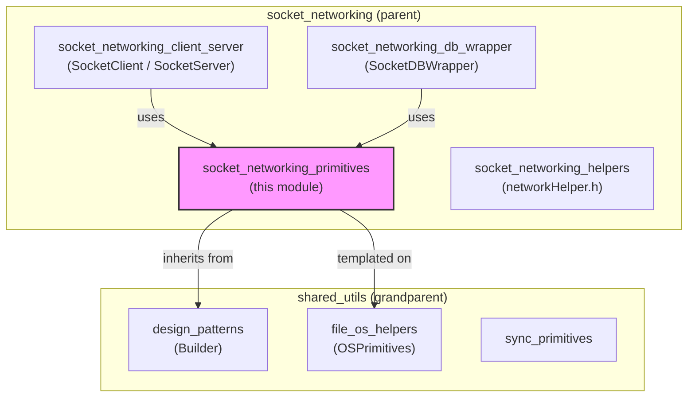
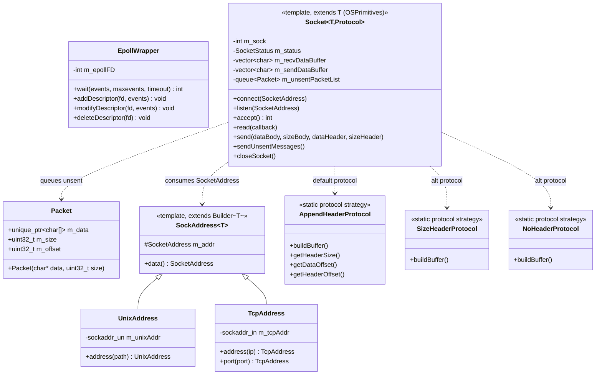
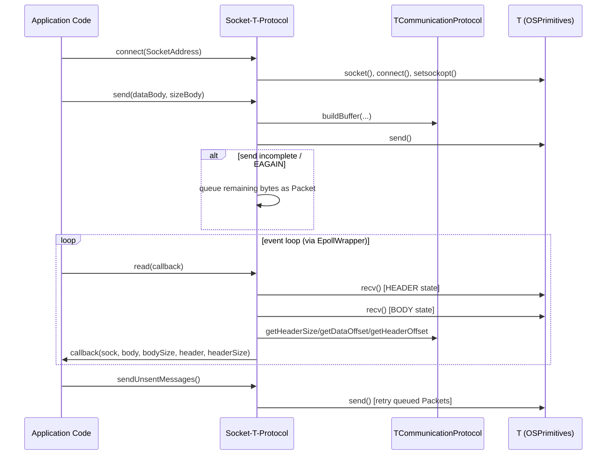
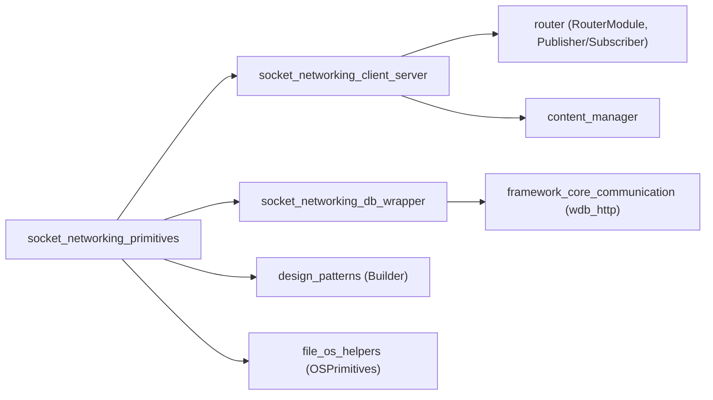

# Socket Networking Primitives

## 1. Purpose

The **Socket Networking Primitives** module provides the foundational, low-level C++ building blocks used to implement asynchronous, non-blocking network communication across the Wazuh C++ shared modules (`content_manager`, `router`, `indexer_connector`, `dbsync`, etc.). It is the innermost layer of the socket-networking family of utilities and purposefully contains **no business logic** — only generic, reusable mechanisms for:

- **Event-driven I/O notification** via Linux `epoll` (`EpollWrapper`).
- **Buffering raw byte payloads** safely and efficiently (`Packet`).
- **Abstracting Unix-domain and TCP socket addressing, connection, accept, send/receive and message framing** (`Socket`, `SockAddress`, `UnixAddress`, `TcpAddress`, and the wire-protocol strategy classes `AppendHeaderProtocol`, `SizeHeaderProtocol`, `NoHeaderProtocol`).

Because these primitives are template- and policy-based (they are parameterized on an OS-primitive-injection type and a communication-protocol strategy), they can be fully unit-tested with mocked system calls and reused identically by higher-level client/server components without duplicating socket-handling code.

## 2. Architecture Overview

The module sits directly below the higher-level socket consumers (client/server wrappers, DB socket wrapper) and directly above the OS system-call abstraction layer (`osPrimitives.hpp`) and the generic `Builder` design pattern used for fluent address construction.

### Internal component relationships

## 3. Core Components

Since this module is small and its three files are tightly interdependent, all components are documented together below rather than split into separate sub-module pages.

### 3.1 `EpollWrapper` (`epollWrapper.hpp`)

A RAII wrapper around the Linux `epoll` API used for scalable, non-blocking multiplexed I/O event notification.

- **Construction/Destruction**: Creates an epoll instance with `epoll_create1(0)` in the constructor and closes the file descriptor in the destructor. Throws `std::runtime_error` if creation fails.
- **Non-copyable / non-movable**: Copy and move constructors/assignment are explicitly deleted to guarantee single ownership of the underlying file descriptor.
- **Key operations**:
  - `wait(events, maxevents, timeout)` — thin wrapper over `epoll_wait`.
  - `addDescriptor(fd, events)` / `modifyDescriptor(fd, events)` / `deleteDescriptor(fd)` — wrap `epoll_ctl` with `EPOLL_CTL_ADD` / `EPOLL_CTL_MOD` / `EPOLL_CTL_DEL` respectively, logging to `std::cerr` on failure rather than throwing (to avoid aborting the event loop on a single bad descriptor).

This class is consumed by higher-level server/client event-loop implementations (see [socket_networking_client_server](socket_networking_client_server.md)) to drive their `epoll`-based main loops.

### 3.2 `Packet` (`packet.hpp`)

A minimal, move-friendly value type that owns a heap-allocated copy of a raw byte buffer.

- Stores `m_data` (a `std::unique_ptr<char[]>`), `m_size`, and `m_offset` (used to track partially-sent data).
- The constructor allocates `size + 1` bytes and copies the input buffer into it.
- Used exclusively as the element type of the **unsent message queue** inside `Socket` (see below) to retain data that could not be fully written to a non-blocking socket in one `send()` call, allowing it to be retried later via `sendUnsentMessages()`.

### 3.3 Socket Addressing — `SockAddress<T>`, `UnixAddress`, `TcpAddress` (`socketWrapper.hpp`)

- `SocketType` enum distinguishes `UNIX` vs `TCP` sockets.
- `SocketAddress` is a plain struct bundling the socket type, a `sockaddr*` pointer, and its size — used as the common currency passed to `connect()`/`listen()`.
- `SockAddress<T>` is a CRTP template base class that extends the generic `Builder<T>` pattern (from `builder.hpp`) so that concrete address types can be constructed fluently, e.g. `TcpAddress().address("127.0.0.1").port(1514).build()`.
- `UnixAddress` wraps a `sockaddr_un`, validating that the supplied path fits within `sun_path` and throwing `std::runtime_error` otherwise.
- `TcpAddress` wraps a `sockaddr_in`, providing fluent `address(ip)` (via `inet_pton`) and `port(port)` (via `htons`) setters.

### 3.4 Wire Framing Protocols — `AppendHeaderProtocol`, `SizeHeaderProtocol`, `NoHeaderProtocol`

These are stateless, all-static **strategy classes** injected as a template parameter into `Socket` to control how messages are framed on the wire. Each implements the same static interface:
`buildBuffer(...)`, `getHeaderSize(...)`, `getDataOffset(...)`, `getHeaderOffset(...)`.

| Protocol | Wire format | Use case |
|---|---|---|
| `AppendHeaderProtocol` (default) | `[4B packetSize][4B headerSize][headerSize B header][body]` | Messages that need an optional secondary header (e.g., routing metadata) alongside the payload. |
| `SizeHeaderProtocol` | `[4B packetSize][body]` | Simple length-prefixed messages with no separate header section. |
| `NoHeaderProtocol` | `[body]` | Raw/streaming payloads with no framing at all (caller manages boundaries). |

This strategy pattern lets `Socket` remain agnostic of the exact wire format, enabling reuse for different protocols (e.g., the `router` module vs. the `socket_networking_db_wrapper`) simply by changing the template argument.

### 3.5 `Socket<T, TCommunicationProtocol>` (`socketWrapper.hpp`)

The centerpiece of the module: a template class that wraps a raw OS socket file descriptor and provides a full non-blocking socket lifecycle, parameterized by:
- `T` — an OS system-call primitives provider (e.g., `OSPrimitives`/`OsPrimitivesMac`, see [file_os_helpers](file_os_helpers.md)), injected purely for **testability** (all `socket`, `connect`, `send`, `recv`, `bind`, `listen`, `accept`, `setsockopt`, `fcntl`, `close`, `shutdown`, `chmod`, `fchmod` calls go through `T::`).
- `TCommunicationProtocol` — one of the three framing strategies above (defaults to `AppendHeaderProtocol`).

Key responsibilities:

- **Connection establishment** (`connect`): creates the socket (`AF_UNIX` or `AF_INET`), initiates a non-blocking connect, and tunes `SO_RCVBUFFORCE`/`SO_SNDBUFFORCE` buffer sizes.
- **Server-side listening** (`listen`): creates, configures (`SO_REUSEADDR`), creates parent directories for Unix sockets, sets permissive file permissions (`0666`), binds, and starts listening (`SOMAXCONN` backlog).
- **Accepting connections** (`accept`): accepts a new connection, tunes socket buffer sizes, and sets it to non-blocking mode via `fcntl`.
- **Reading data** (`read`): implements a **state machine** (`SocketStatus::HEADER` / `SocketStatus::BODY`) that incrementally reads the packet-size header and then the body across multiple non-blocking `recv()` calls, resizing the internal buffer (`BUFFER_MAX_SIZE = 8192*8` default) as needed for oversized messages. Once a full message is assembled, it invokes a user-supplied callback with the body and optional header pointers/sizes.
- **Sending data** (`send`): builds the outgoing buffer according to the injected protocol and attempts an immediate `send()`. If the socket would block or only partially accepts the data, the remainder is queued as a `Packet` in `m_unsentPacketList` (protected by `m_mutex`) for later retry via `sendUnsentMessages()`.
- **Cleanup** (`closeSocket`): performs an orderly `shutdown(SHUT_WR)` followed by `close()`, guarded to be idempotent and `noexcept`.

## 4. Error Handling Model

The module follows a consistent convention:
- **Fatal/unrecoverable conditions** (socket creation failure, bind/listen failure, remote disconnect, unhandled `recv`/`send` errors) throw `std::runtime_error` or `std::system_error`, to be caught by the owning client/server component.
- **Non-fatal, best-effort operations** (setting socket options, epoll descriptor management) log to `std::cerr` and continue, avoiding disruption of an entire event loop over a single non-critical failure.
- **Expected transient conditions** (`EAGAIN`/`EWOULDBLOCK` during non-blocking I/O) are explicitly handled as "no more data right now" rather than treated as errors.

An accompanying `SocketError` enum (`ERROR_SUCCESS`, `ERROR_BUFFER_SOCKET_FULL`, `ERROR_INVALID_SOCKET`, `ERROR_SENDING_DATA`, `ERROR_NEED_MORE_DATA`, `ERROR_SHUTDOWN_SOCKET`, `ERROR_READ_ONLY_HEADER`) is defined for use by callers that need structured error codes rather than exceptions.

## 5. How This Module Fits Into the System

- **[socket_networking_client_server](socket_networking_client_server.md)** builds `SocketClient`/`SocketServer` on top of `Socket` + `EpollWrapper`, adding connection-management and lifecycle policies.
- **[socket_networking_db_wrapper](socket_networking_db_wrapper.md)** uses these primitives to implement `SocketDBWrapper`, a synchronous request/response wrapper for talking to `wazuh-db`.
- **[socket_networking_helpers](socket_networking_helpers.md)** provides small standalone IP-address helper functions (`networkHelper.h`) that complement, but do not depend on, this module.
- **[design_patterns](design_patterns.md)** supplies the `Builder<T>` template that `SockAddress<T>` extends for fluent address construction.
- **[file_os_helpers](file_os_helpers.md)** supplies the `OSPrimitives`/platform-specific primitive-injection types used as the `T` template parameter of `Socket`.
- **[shared_utils](shared_utils.md)** is the parent module aggregating this and all other C++ utility sub-modules (sync primitives, compression, RocksDB/SQLite wrappers, threading/dispatch queues, JSON utilities, etc.).

## 6. Summary Table

| Component | File | Responsibility |
|---|---|---|
| `EpollWrapper` | `epollWrapper.hpp` | RAII wrapper for Linux `epoll` event notification |
| `Packet` | `packet.hpp` | Owning buffer for queued/unsent socket data |
| `SocketAddress`, `SockAddress<T>` | `socketWrapper.hpp` | Common address representation + fluent builder base |
| `UnixAddress` | `socketWrapper.hpp` | Unix-domain socket address builder |
| `TcpAddress` | `socketWrapper.hpp` | TCP/IPv4 socket address builder |
| `AppendHeaderProtocol` | `socketWrapper.hpp` | Framing: packet size + header size + header + body |
| `SizeHeaderProtocol` | `socketWrapper.hpp` | Framing: packet size + body |
| `NoHeaderProtocol` | `socketWrapper.hpp` | Framing: raw body only |
| `Socket<T, Protocol>` | `socketWrapper.hpp` | Non-blocking socket lifecycle: connect/listen/accept/read/send/close |
