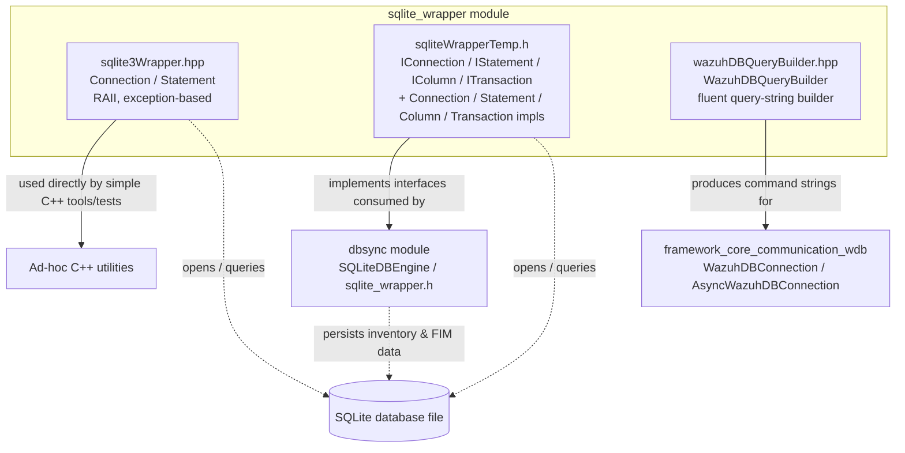
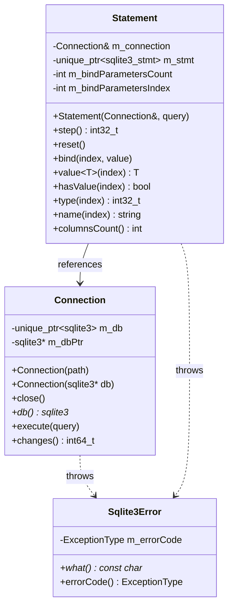
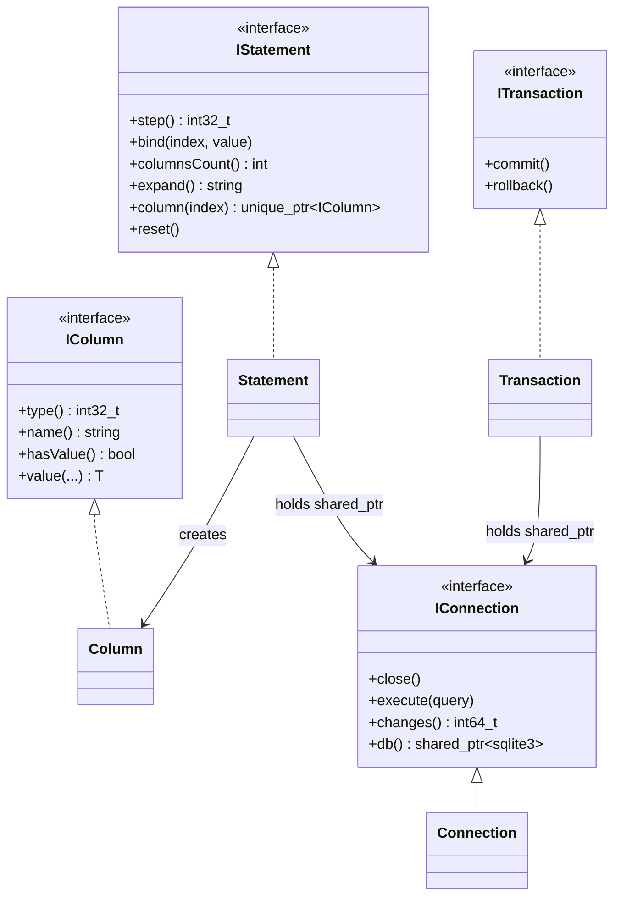
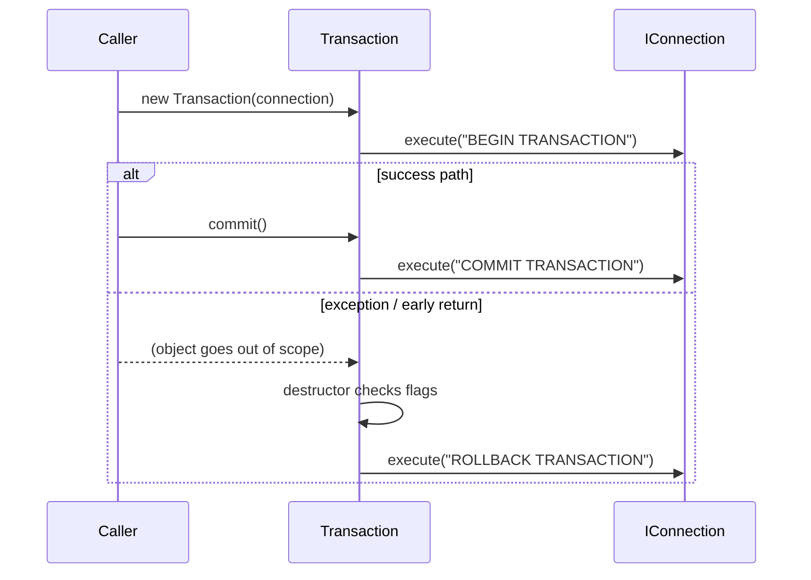
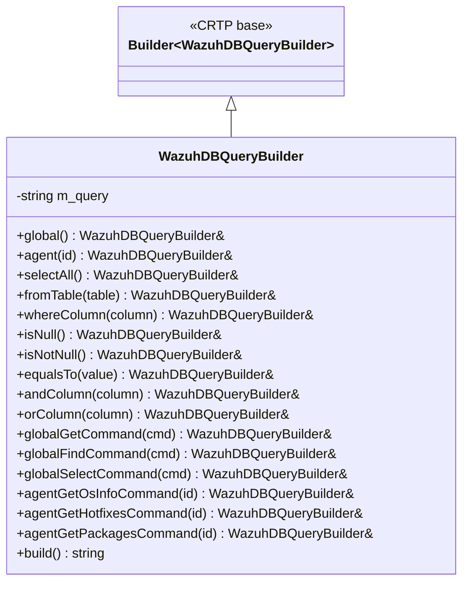
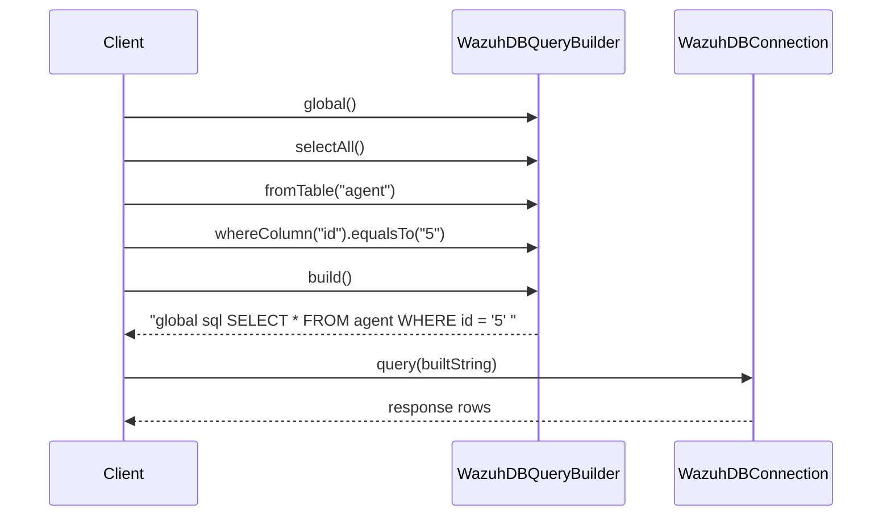
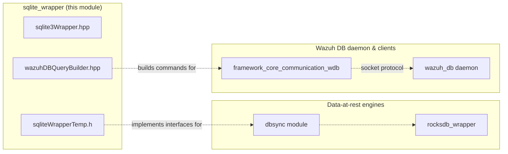

# SQLite Wrapper Module

## 1. Purpose & Overview

The **sqlite_wrapper** module is a small but critical C++ utility library, part of the broader [`shared_utils`](shared_utils.md) collection under `src/shared_modules/utils/`. It provides the low-level building blocks that Wazuh's C++ components use to:

1. **Talk directly to SQLite3 databases** in a safe, RAII-friendly, exception-driven way (`sqlite3Wrapper.hpp`).
2. **Talk to SQLite3 through an interface-based abstraction** that supports dependency injection and unit-test mocking — the pattern relied upon by the [`dbsync`](dbsync.md) engine's SQLite backend (`sqliteWrapperTemp.h`).
3. **Build well-formed query strings for the *wazuh-db* wire protocol** (not raw SQL against a local `sqlite3` handle, but the `global sql ...` / `agent <id> sql ...` command syntax understood by the `wazuh-db` daemon) via a fluent builder (`wazuhDBQueryBuilder.hpp`).

Although the three headers live in the same directory and are grouped under one logical module, they solve **three distinct but related problems**: raw SQLite access, testable/injectable SQLite access, and textual query construction for the Wazuh DB socket protocol. All three are consumed by higher-level synchronization and query components across the codebase (e.g. the [`dbsync`](dbsync.md) engine and the framework's [`framework_core_communication_wdb`](framework_core_communication_wdb.md) connection classes).

This module contains no sub-modules of its own; the documentation below covers all three components together because of their tight size and cohesion.

## 2. Architecture Overview

**Key relationships:**

- `sqlite3Wrapper.hpp` and `sqliteWrapperTemp.h` are **two independent, non-interchangeable implementations** of essentially the same concept (a C++ RAII wrapper around the SQLite3 C API). They are *not* layered on top of one another; each defines its own `Connection`/`Statement` types in the `SQLite` namespace. Code must pick one or the other depending on whether polymorphism/mockability (`sqliteWrapperTemp.h`) or simplicity (`sqlite3Wrapper.hpp`) is required.
- `wazuhDBQueryBuilder.hpp` is unrelated to the local SQLite C API — it builds **strings** sent over a Unix socket to the `wazuh-db` daemon, which itself uses SQLite internally (see [`wazuh_db`](wazuh_db.md) and [`framework_core_communication_wdb`](framework_core_communication_wdb.md)). It reuses the generic [`Builder`](shared_utils.md) CRTP pattern also used elsewhere in `shared_utils`.

## 3. Component Details

### 3.1 `sqlite3Wrapper.hpp` — Modern RAII SQLite Wrapper

**Core class:** `SQLite::Connection`, `SQLite::Statement` (and the `SQLite::Sqlite3Error` exception type).

Responsibilities:
- Wraps a raw `sqlite3*` handle in a `std::unique_ptr` with a custom deleter (`connectionDeleter`) that calls `sqlite3_close_v2`.
- Opens databases via `sqlite3_open_v2`, applying restrictive file permissions (`chmod 0640`) on non-Windows platforms, and re-opening with `SQLITE_OPEN_READWRITE` after the permission fix (skipping this for the special `:memory:` path).
- Provides `execute()` for one-shot statements (e.g. `CREATE TABLE`), and exposes `changes()` (wraps `sqlite3_changes`).
- Supports "borrowing" an already-existing `sqlite3*` (constructor overload) without taking ownership — useful when a connection is managed elsewhere.
- `Statement` wraps `sqlite3_stmt*` with RAII (`sqlite3_finalize` on destruction), exposes `bind()` overloads for `int32_t`, `uint64_t`, `int64_t`, `std::string`, `std::string_view`, and `double`, plus templated `value<T>()` accessors for reading typed column values, `hasValue()`, `type()`, `name()`, and `columnsCount()`.
- Enforces bind-parameter counting: `step()` only actually calls `sqlite3_step` once the number of `bind()` calls matches the statement's expected parameter count, otherwise it silently returns `SQLITE_ERROR`.
- All SQLite error codes are translated into a rich `ExceptionType` enum (`SQLITE_CONNECTION_ERROR`, `SQLITE_BUSY_ERROR`, `SQLITE_BIND_ERROR`, `SQLITE_STEP_ERROR`, etc.) thrown as `SQLite::Sqlite3Error`, each mapped to a human-readable message in `SQLITE_ERROR_MESSAGES`.

### 3.2 `sqliteWrapperTemp.h` — Interface-Based SQLite Wrapper (Testable / Injectable)

**Core classes:** `IConnection`, `IStatement`, `IColumn`, `ITransaction` (pure abstract interfaces) and their concrete implementations `Connection`, `Statement`, `Column`, `Transaction`, all inside the `SQLite` namespace.

This header exists specifically to let dependent components (most importantly the SQLite backend of the [`dbsync`](dbsync.md) engine — `sqlite_dbengine.h` / `sqlite_wrapper.h`) depend on **abstractions** rather than the concrete SQLite C API, enabling mocking in unit tests via dependency injection (`std::shared_ptr<IConnection>` passed around).

Responsibilities:
- `IConnection`: `close()`, `execute(query)`, `changes()`, `db()` (returns a `shared_ptr<sqlite3>`).
- `ITransaction` / `Transaction`: RAII transaction wrapper issuing `BEGIN TRANSACTION` on construction; `commit()` issues `COMMIT TRANSACTION`; the destructor automatically issues `ROLLBACK TRANSACTION` if neither `commit()` nor `rollback()` was called — guaranteeing no dangling open transactions even on exceptions.
- `IColumn` / `Column`: typed column-value accessors (`int32_t`, `uint64_t`, `int64_t`, `double_t`, `std::string`), plus `hasValue()`, `type()`, `name()`.
- `IStatement` / `Statement`: `step()`, `bind()` overloads, `reset()`, `column(index)` (factory returning `unique_ptr<IColumn>`), `columnsCount()`, and `expand()` (returns the fully-expanded SQL via `sqlite3_expanded_sql`, useful for debugging/logging).
- Defines its own exception hierarchy: `DbSync::dbsync_error` (base, carrying an error id) and `SQLite::sqlite_error` (derived, prefixes messages with `"sqlite: "`), plus a distinct `DbSync::max_rows_error` for row-limit violations. A large set of named `DBSyncExceptionType` constants (`INVALID_HANDLE`, `SQLITE_CONNECTION_ERROR`, `INVALID_PK_DATA`, `STEP_ERROR_CREATE_STMT`, etc.) standardizes error reporting across the DBSync stack.
- Free helper functions `checkSqliteResult()`, `openSQLiteDb()`, and `prepareSQLiteStatement()` centralize error-checking logic used by both `Connection` and `Statement`.

**Transaction lifecycle (safety guarantee):**

### 3.3 `wazuhDBQueryBuilder.hpp` — Wazuh DB Query Builder

**Core class:** `WazuhDBQueryBuilder`, extending the generic `Utils::Builder<WazuhDBQueryBuilder>` CRTP helper (from `shared_utils`/`design_patterns`).

Unlike the two SQLite wrappers above, this class does **not** talk to a local SQLite file. It incrementally assembles a plain `std::string` command that follows the `wazuh-db` daemon's textual query protocol (the same protocol consumed by `WazuhDBConnection`/`AsyncWazuhDBConnection` in [`framework_core_communication_wdb`](framework_core_communication_wdb.md) and processed server-side by [`wazuh_db`](wazuh_db.md)'s `wdb_parser.c`).

Responsibilities / fluent methods:
- Scope selectors: `global()` → `"global sql "`; `agent(id)` → `"agent <id> sql "` (validates `id` is numeric).
- Generic SQL fragments: `selectAll()`, `fromTable(table)`, `whereColumn(column)`, `isNull()`, `isNotNull()`, `equalsTo(value)`, `andColumn(column)`, `orColumn(column)` — each fragment is validated against an allow-list of characters (`WAZUH_DB_ALLOWED_CHARS = "-_ "` plus alphanumerics) to prevent malformed/unsafe query strings, throwing `std::runtime_error` on invalid input.
- Wazuh-DB specific command builders: `globalGetCommand(command)` → `"global get-<command> "`, `globalFindCommand(command)` → `"global find-<command> "`, `globalSelectCommand(command)` → `"global select-<command> "`, `agentGetOsInfoCommand(id)` → `"agent <id> osinfo get "`, `agentGetHotfixesCommand(id)` → `"agent <id> hotfix get "`, `agentGetPackagesCommand(id)` → `"agent <id> package get "`.
- Terminal method: `build()` returns the accumulated `std::string`.

**Typical usage pattern (fluent chaining):**

## 4. How This Module Fits Into the System

- **[`dbsync`](dbsync.md)** — its SQLite backend (`sqlite_dbengine.h`, and the dedicated `sqlite_wrapper.h`/`sqlite_wrapper_factory.h` under `dbsync_sqlite_backend`) follows the same interface pattern established by `sqliteWrapperTemp.h` (`Connection`/`Statement`/`Transaction`/`Column` abstractions), enabling DBSync to be unit-tested without a real SQLite engine.
- **[`framework_core_communication_wdb`](framework_core_communication_wdb.md)** — `WazuhDBConnection` and `AsyncWazuhDBConnection` consume command strings that can be produced by `WazuhDBQueryBuilder`, avoiding hand-built, injection-prone SQL strings scattered across the Python/C++ codebase.
- **[`wazuh_db`](wazuh_db.md)** — the server-side daemon (`wdb.c`, `wdb_parser.c`, `wdb_global.c`) is the ultimate consumer of the query strings assembled by `WazuhDBQueryBuilder` and itself relies on native SQLite3 (via its own C-level bindings, not this module).
- **Sibling utility [`rocksdb_wrapper`](rocksdb_wrapper.md)** provides the analogous RAII/interface wrapper pattern for RocksDB-backed storage, illustrating the general "storage engine wrapper" convention used across `shared_utils`.

## 5. Design Notes & Safety Considerations

- **RAII everywhere**: every wrapper (`Connection`, `Statement`, `Transaction`, `Column`) ties SQLite resource lifetime to C++ object lifetime, minimizing leaks and dangling handles even in exception-heavy code paths.
- **Fail-safe transactions**: `Transaction`'s destructor automatically rolls back if the caller forgets to `commit()`/`rollback()` explicitly (see sequence diagram above) — critical for consistency when synchronizing inventory/FIM state.
- **Input validation in the query builder**: `WazuhDBQueryBuilder` whitelists characters for identifiers/values to reduce the risk of malformed or injected query strings reaching the `wazuh-db` socket protocol.
- **Two parallel SQLite wrappers by design**: `sqlite3Wrapper.hpp` favors simplicity/performance for direct use, while `sqliteWrapperTemp.h`'s interface segregation (`IConnection`/`IStatement`/`IColumn`/`ITransaction`) exists purely to support mocking in `dbsync`'s unit tests — new code should prefer whichever variant matches its testing needs rather than mixing the two on the same connection.
- **Non-Windows permission hardening**: both SQLite `Connection` implementations `chmod` the database file to `0640` right after creation (skipped for in-memory databases), reducing the attack surface for locally stored SQLite files.
