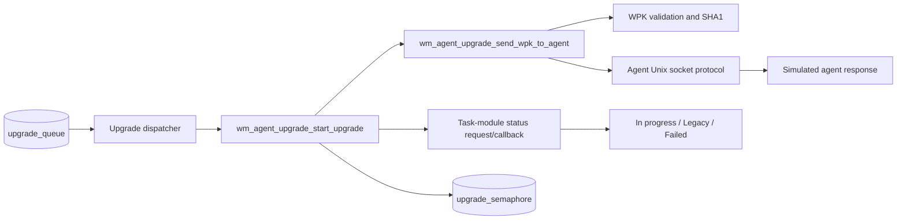
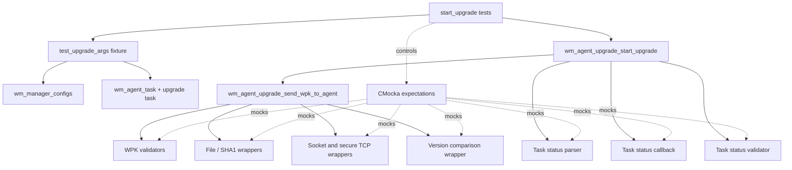
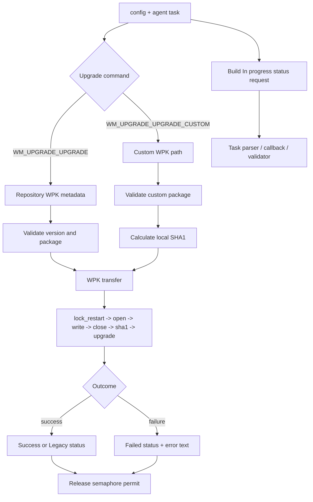
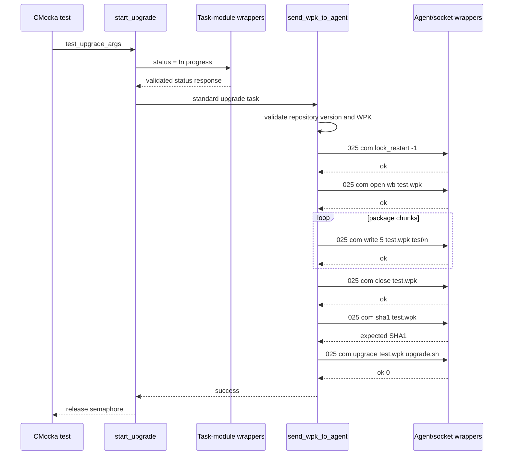
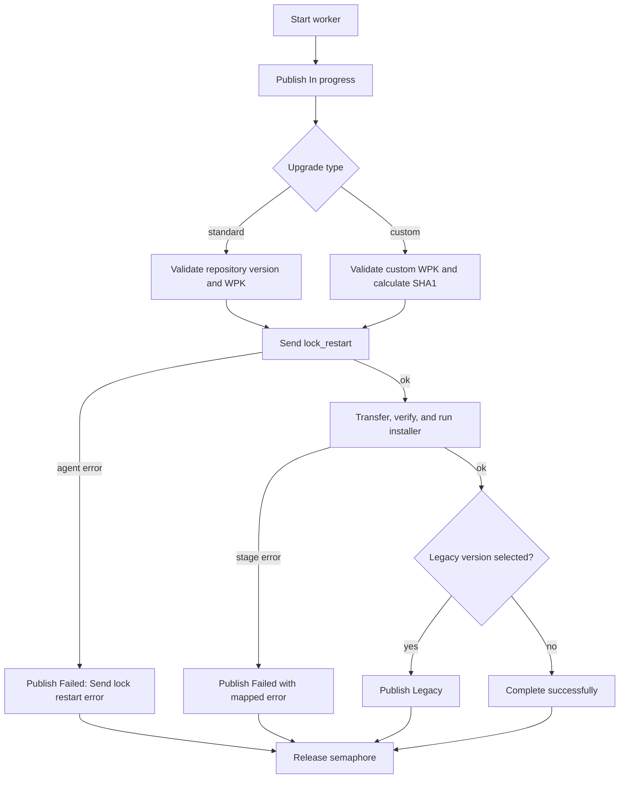

# `start_upgrade_tests`

## Introduction

`start_upgrade_tests` documents the CMocka tests that exercise
`wm_agent_upgrade_start_upgrade`, the manager-side entry point that performs an
agent upgrade and publishes its progress through the task-module interface.
The tests verify orchestration decisions and observable side effects for normal,
legacy, custom-package, and failure paths. They use mocked sockets, file I/O,
hashing, parsers, and callbacks, so no live agent or worker thread is required.

The source component is
`src/unit_tests/wazuh_modules/agent_upgrade/test_wm_agent_upgrade_upgrades.c`.
The shared fixtures and mock ownership rules are described in
[agent upgrade upgrades test infrastructure](agent_upgrade_upgrades_test_infrastructure.md).
Lower-level package transfer behavior is covered by the surrounding
[agent upgrade module](agent_upgrade_module.md).

## Scope

This module covers these four tests:

| Test | Scenario | Primary contract |
| --- | --- | --- |
| `test_wm_agent_upgrade_start_upgrade_upgrade_ok` | Standard WPK upgrade | Publish `In progress`, transfer the package successfully, and release the worker semaphore. |
| `test_wm_agent_upgrade_start_upgrade_upgrade_legacy_ok` | Standard upgrade requiring legacy handling | Complete the transfer and publish the final `Legacy` status after version comparison. |
| `test_wm_agent_upgrade_start_upgrade_upgrade_custom_ok` | Custom local WPK | Validate and hash the supplied package, transfer it, and publish success. |
| `test_wm_agent_upgrade_start_upgrade_upgrade_err` | Failure during `lock_restart` | Stop the workflow, publish `Failed` with the mapped error, and release the semaphore. |

The file also contains direct tests for command helpers, WPK transfer stages,
queue preparation, and dispatch. Those are related but outside this module’s
focused scope; see the shared infrastructure page for their relationship.

## Position in the system

`wm_agent_upgrade_start_upgrade` is the worker-level coordinator. It receives a
`test_upgrade_args` bundle, reports status through the task module, delegates
package delivery to `wm_agent_upgrade_send_wpk_to_agent`, and returns its
semaphore permit when processing ends.



The production responsibilities are intentionally split across related
modules:

- [agent upgrade tasks](agent_upgrade_tasks.md) owns task bookkeeping and
  task-manager submission.
- [agent upgrade task callbacks](agent_upgrade_tasks_callbacks.md) documents
  response conversion and callback behavior.
- [agent upgrade commands](agent_upgrade_commands.md) covers the public command
  and request-building layer.
- [Wmodules agent upgrade configuration](Wmodules_Config_agent_upgrade.md)
  describes configuration that supplies package and concurrency settings.

## Test architecture and dependencies



### Fixture objects

The focused tests use `setup_upgrade_args` and its teardown routine:

| Object | Role in the test |
| --- | --- |
| `test_upgrade_args` | Groups the manager configuration and agent task passed to the worker. |
| `wm_manager_configs` | Supplies transfer configuration, including `chunk_size` and the WPK repository. |
| `wm_agent_task` | Identifies the target agent and holds the requested upgrade command. |
| `wm_upgrade_task` | Describes a repository WPK, expected SHA1, and optional legacy version. |
| `wm_upgrade_custom_task` | Describes a local WPK and optional custom installer. |
| `upgrade_semaphore` | Models the worker-concurrency permit; the fixture starts it at `5`. |
| `upgrade_queue` | Initializes the process-wide upgrade queue expected by the production layer. |

The tests set `test_mode` through the group fixture. CMocka wrappers intercept
external boundaries, including `OS_ConnectUnixDomain`, secure send/receive,
`wfopen`/`fread`/`fclose`, `OS_SHA1_File`, version comparison, and task-module
functions. This makes every branch deterministic and verifies exact command
strings without performing real I/O.

## Data flow



For the standard success test, the fixture uses agent `25`, platform `ubuntu`,
version `v3.13.0`, a repository WPK named `test.wpk`, and a five-byte test
chunk. The custom test uses `/tmp/test.wpk` and obtains its expected digest from
the mocked `OS_SHA1_File` call.

## Successful standard-upgrade flow



The test asserts the message and response at each stage. The exact three-digit
agent representation (`025`) is part of the command protocol contract.

## Process and error flows



The error test configures the first agent response as `err ` and the response
parser as `OS_INVALID`. It therefore verifies that no open/write/close/SHA1 or
installer command is attempted, and that the task-module callback receives the
human-readable error `Send lock restart error`.

The legacy test supplies `custom_version = v3.13.1`. After a successful
transfer, the mocked version comparison selects the legacy outcome and the
second status update is `Legacy`. The custom test follows the same transfer
pipeline but enters through custom-package validation rather than repository
version validation.

## Observable contracts and assertions

### Status updates

Each focused test expects a task-module request with:

```json
{
  "origin": {"module": "upgrade_module"},
  "command": "upgrade_update_status",
  "parameters": {"agents": [25], "status": "In progress"}
}
```

The failure path adds an error string and changes the status to `Failed`. The
legacy path sends a second status update with `Legacy`.

### Transfer boundary

The tests verify that the transfer layer uses `REMOTE_LOCAL_SOCK`,
`SOCK_STREAM`, and `OS_MAXSTR`, and that every response is passed through the
agent-response parser. The fixed `chunk_size = 5` makes the write command and
file-read behavior easy to observe.

### Concurrency accounting

The fixture initializes `upgrade_semaphore` to `5`. Every focused test ends with
`sem_getvalue` equal to `6`, proving that the worker path returns its permit on
both success and failure. This assertion is about lifecycle accounting, not a
claim about the production default concurrency limit.

## Coverage boundaries

These tests do not independently prove:

- socket connection, retry, or response parsing rules for every transfer stage;
- WPK version, package, or SHA1 validation algorithms;
- queue enumeration and worker creation;
- task-manager persistence or cluster routing;
- behavior of a real agent installer.

Those concerns are covered by the direct transfer tests in the same source
file and by the linked [agent upgrade upgrades test infrastructure](agent_upgrade_upgrades_test_infrastructure.md),
[agent upgrade tasks](agent_upgrade_tasks.md), and [agent upgrade task callbacks](agent_upgrade_tasks_callbacks.md)
documentation.

## Maintenance guidance

Update this document when any of the following contracts changes:

- the status request shape or status names (`In progress`, `Legacy`, `Failed`);
- the standard/custom command selection;
- the agent command text or three-digit agent formatting;
- the semaphore ownership or worker cleanup path;
- the WPK validation, SHA1, or task-module callback seams used by the mocks.

When adding a new upgrade mode, document its input task type, validation seam,
status transitions, transfer commands, and cleanup assertion here, then place
protocol-specific details in the lower-level upgrade documentation.

## References

- [Agent upgrade module](agent_upgrade_module.md)
- [Agent upgrade tasks](agent_upgrade_tasks.md)
- [Agent upgrade task callbacks](agent_upgrade_tasks_callbacks.md)
- [Agent upgrade commands](agent_upgrade_commands.md)
- [Agent upgrade upgrades test infrastructure](agent_upgrade_upgrades_test_infrastructure.md)
- [Agent-upgrade configuration](Wmodules_Config_agent_upgrade.md)
