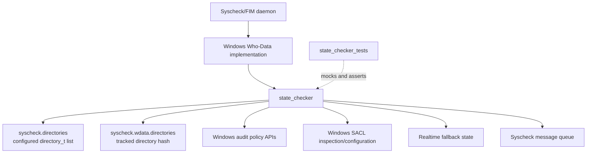
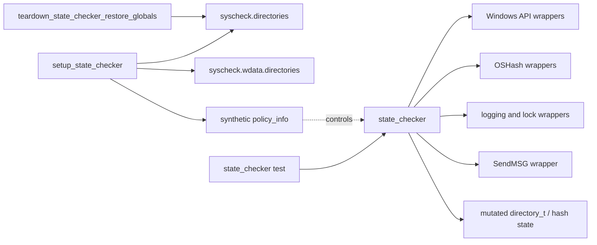
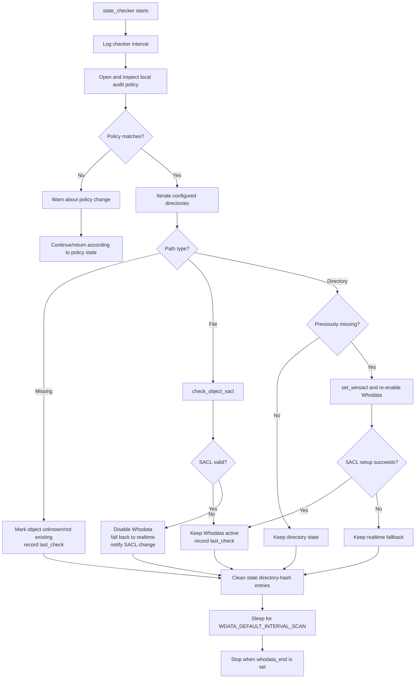
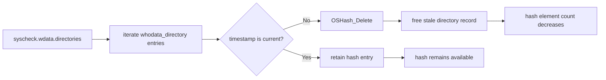
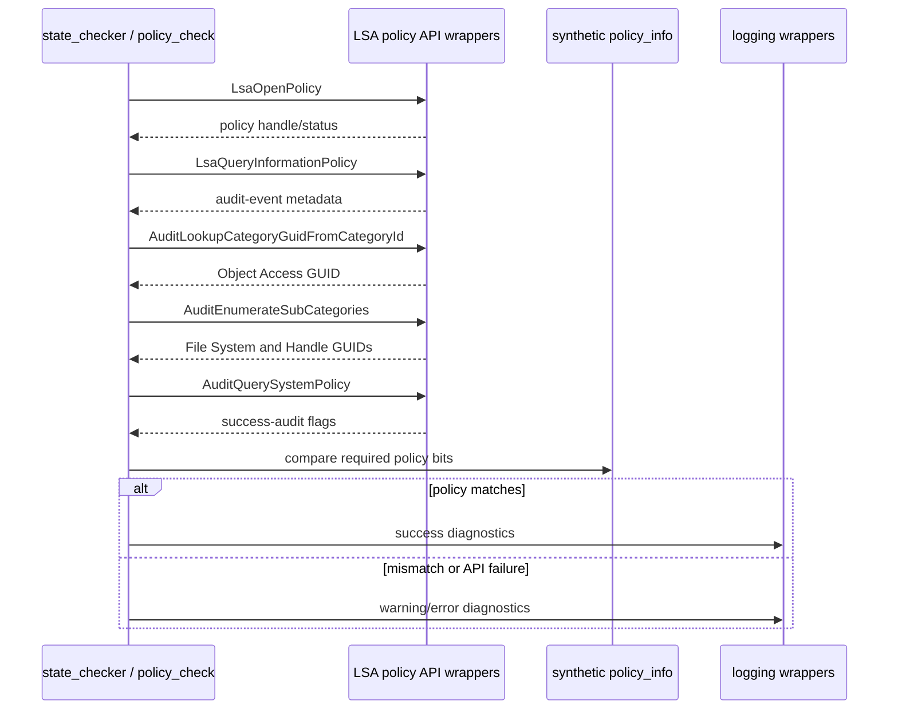
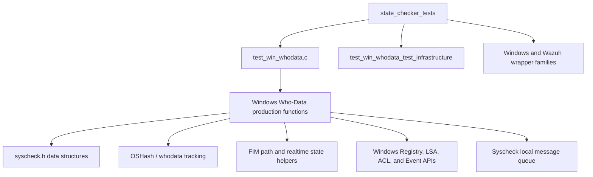

# `state_checker_tests`

## Introduction

`state_checker_tests` is the focused CMocka test group for the Windows Who-Data state checker in `src/unit_tests/syscheckd/whodata/test_win_whodata.c`. It verifies that periodic state validation keeps Syscheck's monitored-file and monitored-directory state consistent with the filesystem, Windows SACLs, and local audit policies.

The group is part of [`test_win_whodata`](test_win_whodata.md). Shared fixtures, wrapper conventions, global-state setup, and suite execution are documented in [`test_win_whodata_test_infrastructure`](test_win_whodata_test_infrastructure.md). Production ownership belongs to the Windows Who-Data implementation under the Syscheck/FIM daemon.

## Scope

The module exercises two related responsibilities of `state_checker(void *input)`:

1. Validate the local audit policy and inspect every configured Whodata directory/file.
2. Remove stale entries from `syscheck.wdata.directories`, the runtime hash used to track directories awaiting or undergoing scans.

It also covers the directly related policy-check and startup/resource behavior exposed by the supplied test file through the surrounding state-checker fixtures: `policy_check`, `whodata_audit_start`, and `win_whodata_release_resources`.

## Position in the system

`state_checker` is a recovery/maintenance loop, not the primary event-ingestion path. Event correlation is covered by the parent callback tests; file-level collection and FIM persistence are covered by neighboring FIM test modules such as [`fim_file_tests`](fim_file_tests.md).

## Test architecture

The tests invoke production functions while replacing Windows, filesystem, hash, logging, locking, and message-queue effects with CMocka wrappers.

### Fixture state

`setup_state_checker` creates:

- one configured directory, `c:\a\path`, represented by `directory_t`;
- `WHODATA_ACTIVE`, `WD_CHECK_WHODATA`, and `WD_STATUS_EXISTS` state bits;
- directory status initially marked as `WD_STATUS_DIR_TYPE`;
- `syscheck.wdata.directories`, an `OSHash` with `free` as its data destructor; and
- synthetic audit-policy metadata containing the Object Access category plus the File System and Handle Manipulation subcategories.

The policy fixture is allocated by `setup_policy_check` and released by `teardown_policy_check`. Test-specific teardown restores status/options and re-creates the configured directory because the production function intentionally mutates global Syscheck state.

## State-checker process flow

The tests configure `whodata_end` to stop the loop deterministically after one checker iteration. They therefore verify the body of the maintenance cycle without waiting for a real background thread.

## Covered scenarios

| Test | Scenario | Expected state transition |
|---|---|---|
| `test_state_checker_no_files_to_check` | Configured list is empty | Policy is checked; no file state is changed. |
| `test_state_checker_file_not_whodata` | Directory no longer has Whodata enabled | Entry is not revalidated as Whodata. |
| `test_state_checker_file_does_not_exist` | `check_path_type` reports missing path | Status loses `WD_STATUS_EXISTS`, object type becomes unknown, and `last_check` is updated. |
| `test_state_checker_file_with_invalid_sacl` | Existing file has an invalid SACL | Whodata is disabled, realtime fallback remains available, and an SACL-change message is sent. |
| `test_state_checker_file_with_valid_sacl` | Existing file has a valid SACL | File remains Whodata-active and its check timestamp is updated. |
| `test_state_checker_dir_readded_error` | Missing directory returns, but SACL setup fails | Directory remains unavailable to Whodata and is monitored in realtime. |
| `test_state_checker_dir_readded_succesful` | Missing directory returns and SACL setup succeeds | Directory is restored as Whodata-active, marked existing, and timestamped. |
| `test_state_checker_not_match_policy` | File System policy no longer audits success | A policy-change warning is emitted and the checker returns without normal validation. |

The implementation uses return codes from `check_object_sacl` to distinguish valid SACLs, invalid SACLs, and inspection failures. The tests assert the resulting status/options rather than treating all failures as equivalent.

## Directory-hash cleanup

The same `state_checker` call removes stale `whodata_directory` entries. Each entry stores a Windows `FILETIME` represented by `HighPart` and `LowPart`. Tests use a current system time for live entries and zero time for stale entries.

The cleanup cases cover no entries, one live entry, one stale entry, three live entries, mixed live/stale entries, and all-stale entries. They establish that cleanup is selective and does not remove active directory scan state.

## Policy-check interaction

`policy_check` validates the Windows Object Access category and both required success-auditing subcategories:

The dedicated policy tests cover successful matching, policy mismatch, and failures from each Windows policy API stage. `state_checker_not_match_policy` demonstrates the integration point: a policy mismatch is surfaced as a warning and prevents normal state validation for that iteration.

## Dependency map

Important neighboring documentation:

- [`test_win_whodata`](test_win_whodata.md) — complete Windows Who-Data test module and group layout.
- [`test_win_whodata_test_infrastructure`](test_win_whodata_test_infrastructure.md) — setup/teardown and wrapper details.
- [`syscheckd_whodata_audit`](syscheckd_whodata_audit.md) — related Whodata audit architecture; its detailed implementation is Linux-specific.
- [`fim_realtime_whodata_tests`](fim_realtime_whodata_tests.md) — FIM boundary behavior for Whodata/realtime events.
- [`fim_file_tests`](fim_file_tests.md) — file collection and persistence after a FIM event reaches the scan engine.

## Maintenance guidance

Update this module when changes affect any of these observable contracts:

- the audit-policy GUIDs, required success-audit flags, or policy-check call sequence;
- `directory_t` status/options transitions for missing paths, invalid SACLs, and re-added directories;
- the `check_object_sacl` or `set_winsacl` result interpretation;
- the timestamp and stale-entry rules for `syscheck.wdata.directories`;
- the checker stop condition or sleep interval; or
- lock ordering, wrapper calls, or diagnostic messages.

Keep Windows API behavior mocked. End-to-end Security-channel delivery belongs to integration testing and to the broader [`test_win_whodata`](test_win_whodata.md) callback/startup coverage.

## Test execution

The cases are registered in the `state_checker_tests[]` and `wdata_directories_cleanup_tests[]` arrays in `test_win_whodata.c`. They are run as separate CMocka groups:

1. `state_checker_tests` uses `setup_state_checker` and restores global directory state after each case.
2. `wdata_directories_cleanup_tests` uses `setup_wdata_dirs_cleanup` and recreates the directory hash after cases that mutate it.

A failure usually indicates a changed production interaction, an altered global-state transition, or an incomplete fixture reset—not a failure of the host Windows filesystem itself.
