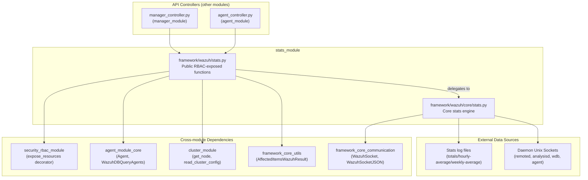
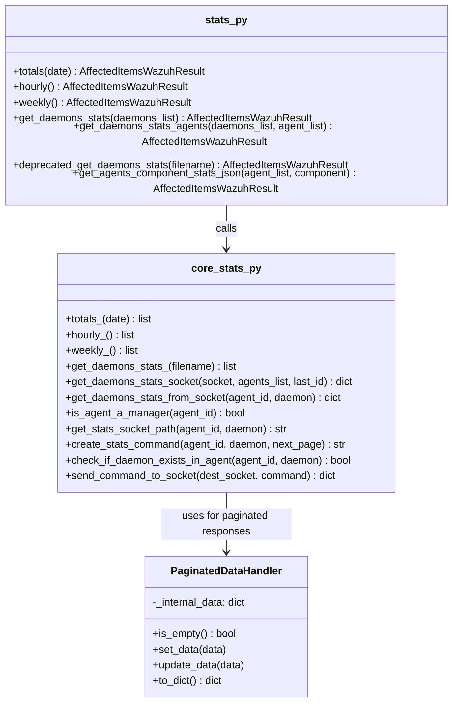

# Stats Module

## 1. Introduction and Purpose

The **Stats Module** is the component of the Wazuh Framework responsible for exposing and computing **statistical information** about the Wazuh ecosystem: managers, cluster nodes, daemons (`wazuh-remoted`, `wazuh-analysisd`, `wazuh-db`), and agents.

It answers questions such as:

- How many events/alerts has the manager processed per hour, per week, or in total for a given day?
- What are the current internal statistics (`getstate`) of a given daemon, on the manager or on a specific agent?
- What are the aggregated statistics of a component across a set (or all) of the registered agents?

The module is intentionally thin: it does not own any persistent storage. Instead, it reads pre-computed log/state files written by the C daemons (`ossec-totals-*.log`, `hourly-average`, `weekly-average`) and talks to Unix sockets exposed by those daemons (`getstats`, `getstate`, `getagentsstats`) to retrieve live data on demand.

## 2. Architecture Overview

The module is composed of exactly two files that together form a classic **API layer / Core layer** split used throughout the Wazuh framework:

| Layer | File | Responsibility |
|---|---|---|
| Public API (RBAC-aware) | `framework/wazuh/stats.py` | Exposes public, permission-checked functions consumed by the [`manager_module`](manager_module.md) and [`agent_module`](agent_module.md) API controllers. Performs agent-list validation, RBAC filtering, and result aggregation (`AffectedItemsWazuhResult`). |
| Core logic | `framework/wazuh/core/stats.py` | Implements the low-level mechanics: reading log/stat files from disk, building and sending socket messages, decoding daemon responses, and handling multi-page ("due"/paginated) socket responses via `PaginatedDataHandler`. |

### Component Relationship Diagram

## 3. Functional Areas

Since the module is small and cohesive (only two files), it is documented as a single detailed page rather than split into separate sub-module documents. See [stats_module_details.md](stats_module_details.md) for:

- The public API surface (`framework/wazuh/stats.py`) including RBAC decoration and cluster-awareness.
- The core engine (`framework/wazuh/core/stats.py`), including file-based statistics, socket-based statistics, and the `PaginatedDataHandler` used to reassemble multi-page ("due") daemon responses.
- Sequence diagrams describing the two main data-retrieval flows: **file-based totals/hourly/weekly stats** and **socket-based daemon/agent stats**.

## 4. How It Fits Into the Overall System

- **API layer callers**: The REST API controllers in [`manager_module`](manager_module.md) (`manager_controller.py` — `get_stats_hourly`, `get_stats_weekly`, `get_stats_analysisd`, `get_stats_remoted`, `get_daemon_stats`) and in [`agent_module`](agent_module.md) (`agent_controller.py` — `get_daemon_stats`, `get_component_stats`) call directly into `framework/wazuh/stats.py`.
- **RBAC**: All public functions are decorated with `@expose_resources`, delegating permission checks to the [`security_rbac_module`](security_rbac_module_engine.md) decorators (`framework/wazuh/rbac/decorators.py`).
- **Agent data**: `get_daemons_stats_agents` and `get_agents_component_stats_json` rely on `Agent`, `get_agents_info`, `get_rbac_filters`, and `WazuhDBQueryAgents` from [`agent_module_core`](agent_module_core.md) to validate and filter the target agents before querying their stats.
- **Cluster awareness**: `framework/wazuh/stats.py` determines whether the manager is running in cluster mode via `read_cluster_config` and `get_node` from the [`cluster_module`](cluster_high_level_api.md) / [`cluster_utils`](cluster_utils.md), which affects the RBAC resource used (`node:id:{node_id}` vs `*:*:*`) and the required action (`cluster:read` vs `manager:read`).
- **Common infrastructure**: `framework/wazuh/core/stats.py` uses shared building blocks from [`framework_core_utils`](framework_core_utils.md) (`common`, `utils`, `exception`) for path resolution, date parsing, and standardized Wazuh exceptions, and from [`framework_core_communication`](framework_core_communication.md) (`wazuh_socket.WazuhSocket`, `WazuhSocketJSON`) for all Unix-socket communication with the daemons.
- **Result formatting**: Both file-based and socket-based results are wrapped in `AffectedItemsWazuhResult` (also from `framework_core_utils`), the standard Wazuh API response container used across nearly every module in this framework.

## 5. Related Documentation

- [stats_module_details.md](stats_module_details.md) — Detailed breakdown of the public API and core engine functions.
- [manager_module.md](manager_module.md) — Manager-level controllers that consume this module's statistics functions.
- [agent_module.md](agent_module.md) — Agent-level controllers and core agent logic used for per-agent stats.
- [security_rbac_module_engine.md](security_rbac_module_engine.md) — RBAC decorators (`expose_resources`) used to protect every public function in this module.
- [cluster_high_level_api.md](cluster_high_level_api.md) / [cluster_utils.md](cluster_utils.md) — Cluster configuration and node identification used to decide resource scoping.
- [framework_core_utils.md](framework_core_utils.md) — Shared utilities (`common`, `utils`, `exception`, `results.AffectedItemsWazuhResult`).
- [framework_core_communication.md](framework_core_communication.md) — Low-level socket classes (`WazuhSocket`, `WazuhSocketJSON`) used to talk to daemons.
