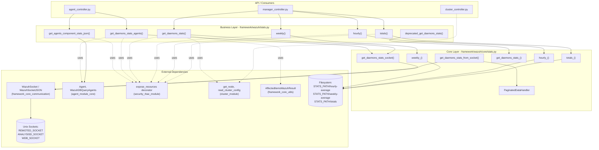
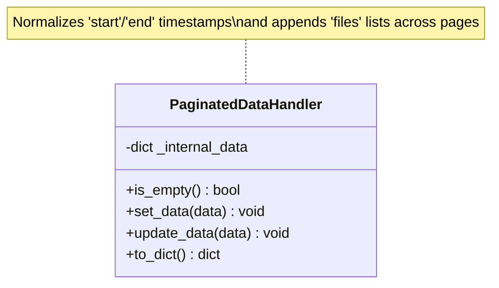
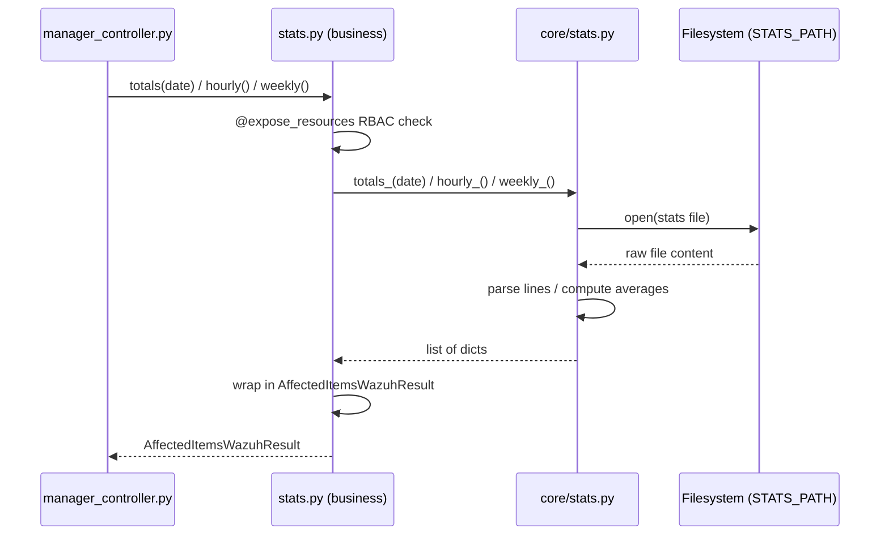
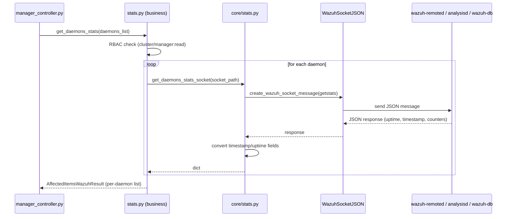
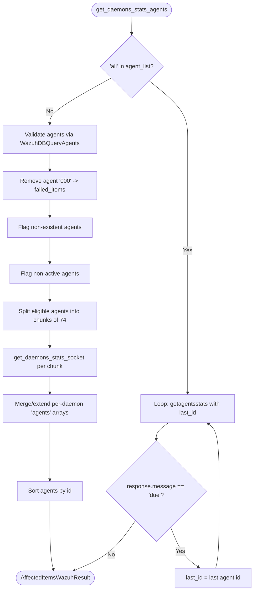
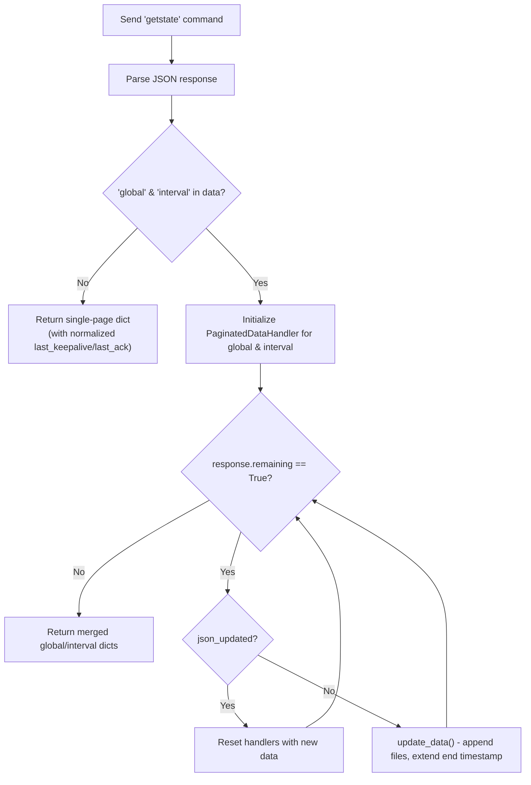
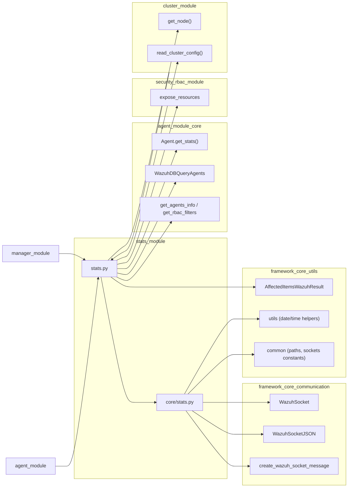
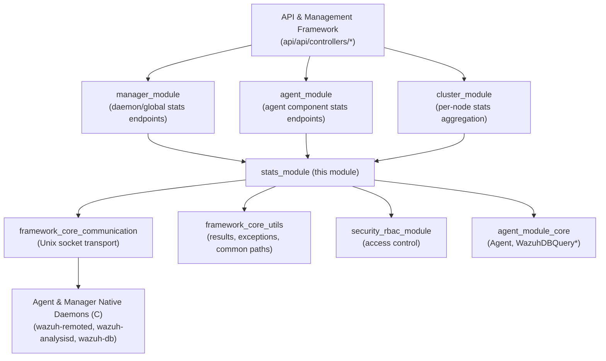

# Stats Module Details

## Introduction

The **Stats Module Details** component is the statistics subsystem of the Wazuh Python Framework. It is responsible for collecting, aggregating, and exposing operational and performance statistics generated by Wazuh's native daemons (`wazuh-remoted`, `wazuh-analysisd`, `wazuh-db`, and agent-side daemons) to the rest of the framework and, ultimately, to the Wazuh REST API.

This module is intentionally split into two layers:

| Layer | File | Responsibility |
|-------|------|-----------------|
| **Business/API layer** | `framework/wazuh/stats.py` | RBAC-protected, cluster-aware public functions consumed by the API controllers (see [manager_module.md](manager_module.md) and [agent_module.md](agent_module.md)) |
| **Core layer** | `framework/wazuh/core/stats.py` | Low-level logic: reading stats files from disk, talking to Unix sockets, parsing/pagination of daemon responses |

The module does not expose any HTTP controllers directly; instead, it is consumed by other business modules such as `manager.py` (daemon/global stats), `agent.py` (per-agent component stats), and indirectly by the `cluster_module` when computing per-node statistics.

---

## 1. Purpose & Core Functionality

The Stats Module provides:

1. **Historical/aggregated statistics** — hourly and weekly average computations, and full daily totals, read from flat files generated by `wazuh-analysisd` (`totals()`, `hourly()`, `weekly()`).
2. **Live daemon statistics** — real-time counters and internal state queried directly from daemon control sockets (`wazuh-remoted`, `wazuh-analysisd`, `wazuh-db`) via `get_daemons_stats()`.
3. **Per-agent statistics** — statistics scoped to one or many agents, including manager-agent (`000`) special-casing and chunked queries to avoid socket overload (`get_daemons_stats_agents()`).
4. **Per-component statistics** — statistics for a specific agent component (e.g., `logcollector`, `syscheck`) exposed through `get_agents_component_stats_json()`, which delegates to `Agent.get_stats()` (see [agent_module.md](agent_module.md)).
5. **Legacy/deprecated support** — reading raw daemon stats from an arbitrary key=value formatted file (`deprecated_get_daemons_stats()`).
6. **Paginated response reconstruction** — the `PaginatedDataHandler` class in the core layer reassembles multi-page daemon socket responses (`global`/`interval` state blocks) into a single coherent structure.

---

## 2. Architecture Overview

---

## 3. Component Reference

### 3.1 `framework/wazuh/stats.py` (Business Layer)

All functions in this file are decorated with `@expose_resources` from the [security_rbac_module](security_rbac_module.md), which enforces RBAC permissions before execution and performs post-processing (filtering of affected/failed items).

| Function | Description | RBAC Resource |
|----------|-------------|----------------|
| `totals(date)` | Returns daily statistical totals (alerts, events, firewall, syscheck counts) for a given date, parsed from `ossec-totals-DD.log`. | `cluster:read` or `manager:read` on the current node |
| `hourly()` | Returns hourly-averaged event/interaction counts. | Same as above |
| `weekly()` | Returns weekly-averaged counts, one block per weekday. | Same as above |
| `get_daemons_stats(daemons_list)` | Retrieves live statistics from manager daemons (`wazuh-remoted`, `wazuh-analysisd`, `wazuh-db`) via their control sockets. | Same as above |
| `get_daemons_stats_agents(daemons_list, agent_list)` | Retrieves statistics scoped to a list of agents (or `all`), chunking requests in batches of 74 agents to avoid socket overload errors. | `agent:read` on `agent_list` |
| `deprecated_get_daemons_stats(filename)` | Legacy path: parses a raw `key=value` stats file directly from disk. | Same as `totals`/`hourly`/`weekly` |
| `get_agents_component_stats_json(agent_list, component)` | Retrieves statistics for a specific agent component by delegating to `Agent.get_stats()` (see [agent_module.md](agent_module.md)). | `agent:read` on `agent_list` |

Notable design points:
- The module determines whether the environment is clustered via `read_cluster_config` and dynamically switches the RBAC resource/action between `cluster:*` and `manager:*`.
- `get_daemons_stats_agents` implements defensive logic: it removes agent `000` (the manager itself is not a valid target for these stats), flags non-existent and non-active agents as failed items, and paginates ("due" responses) when querying `all` agents.

### 3.2 `framework/wazuh/core/stats.py` (Core Layer)

| Component | Description |
|-----------|-------------|
| `hourly_()` | Reads `STATS_PATH/hourly-average/{0..24}` files; index 24 holds interaction count, 0-23 hold hourly averages. |
| `weekly_()` | Reads `STATS_PATH/weekly-average/{day}/{0..24}` files for each of the 7 weekdays. |
| `totals_(date)` | Parses `STATS_PATH/totals/{year}/{month}/ossec-totals-{day}.log`, producing per-hour alert/event/firewall/syscheck breakdowns. |
| `get_daemons_stats_socket(socket, agents_list, last_id)` | Builds a Wazuh socket JSON message (`getstats` or `getagentsstats`), sends it over `WazuhSocketJSON`, and normalizes timestamp fields in the response. |
| `get_daemons_stats_(filename)` | Parses a legacy stats file with regex `(^\w*)=(.*)` into a dict. |
| `is_agent_a_manager(agent_id)` | Helper: returns `True` if `agent_id` is `000`. |
| `get_stats_socket_path(agent_id, daemon)` | Resolves the correct socket path: local daemon socket for the manager, or `REMOTED_SOCKET` for actual agents (since remoted proxies agent daemon requests). |
| `create_stats_command(agent_id, daemon, next_page)` | Builds the raw `getstate` command string sent to the daemon socket, optionally requesting the "next" page. |
| `check_if_daemon_exists_in_agent(agent_id, daemon)` | Validates that a given daemon is applicable to the given agent type (e.g., `agent` daemon doesn't exist on agent `000`). |
| `send_command_to_socket(dest_socket, command)` | Low-level raw socket send/receive using `WazuhSocket` (see [framework_core_communication.md](framework_core_communication.md)). |
| `get_daemons_stats_from_socket(agent_id, daemon)` | High-level orchestration: sends `getstate`, detects paginated (`global`/`interval`) responses, and loops calling `create_stats_command(..., next_page=True)` until `remaining` is `False`, accumulating results via `PaginatedDataHandler`. |
| `PaginatedDataHandler` | Utility class that stores, merges, and finalizes multi-page socket responses (see below). |

#### `PaginatedDataHandler` behavior

- `set_data()` initializes internal storage and converts `start`/`end` fields to the framework's canonical date format.
- `update_data()` appends new `files` entries and updates the `end` timestamp — used when accumulating multiple socket response pages into one logical block.
- `to_dict()` returns the final, merged dictionary consumed by the API layer.

---

## 4. Data Flow

### 4.1 File-based statistics (totals / hourly / weekly)

### 4.2 Live daemon statistics via socket (get_daemons_stats)

### 4.3 Per-agent statistics with chunking and pagination

### 4.4 Paginated `global`/`interval` socket responses (`get_daemons_stats_from_socket`)

---

## 5. Component Interaction Diagram

---

## 6. Error Handling

The module relies on the shared exception hierarchy (`WazuhError`, `WazuhInternalError`, `WazuhResourceNotFound`, `WazuhException`) defined in the core utilities module (see [framework_core_utils.md](framework_core_utils.md)):

| Scenario | Exception | Code |
|----------|-----------|------|
| Stats file not found (`totals_`, `get_daemons_stats_`) | `WazuhError` | 1308 |
| Malformed totals log line | `WazuhInternalError` | 1309 |
| Cannot connect to daemon socket | `WazuhInternalError` | 1121 |
| Empty `agent_id` or `daemon` in `get_daemons_stats_from_socket` | `WazuhError` | 1307 |
| Daemon not applicable for agent type | `WazuhError` | 1310 |
| Daemon returned an error in socket response | `WazuhError` | 1117 |
| Socket returned no data | `WazuhInternalError` | 1118 |
| Requested agent does not exist | `WazuhResourceNotFound` | 1701 |
| Agent `000` requested for agent-scoped stats | `WazuhError` | 1703 |
| Agent not active | `WazuhError` | 1707 |

All per-item failures (e.g., one bad agent in a batch) are captured via `result.add_failed_item(...)` on the `AffectedItemsWazuhResult` object so that partial successes are still returned to the caller instead of failing the entire request.

---

## 7. How This Module Fits Into the Overall System

The Stats Module acts as a **cross-cutting service** consumed by multiple higher-level API modules:

- **[manager_module.md](manager_module.md)** — exposes `/manager/stats`, `/manager/stats/hourly`, `/manager/stats/weekly`, `/manager/stats/analysisd`, `/manager/stats/remoted` endpoints backed directly by `stats.py` functions.
- **[agent_module.md](agent_module.md)** — exposes `/agents/{agent_id}/daemons/stats` and `/agents/{agent_id}/component/{component}/stats` endpoints, using `get_daemons_stats_agents()` and `get_agents_component_stats_json()`.
- **[cluster_module.md](cluster_module.md)** — the cluster controller endpoints (e.g., `get_stats_node`, `get_stats_hourly_node`, `get_daemon_stats_node`) call into this same business layer per-node via the Distributed API (DAPI), relying on `read_cluster_config`/`get_node` to determine RBAC resource scoping.
- **[framework_core_communication.md](framework_core_communication.md)** — provides the `WazuhSocket`/`WazuhSocketJSON` abstractions used to talk to native daemon control sockets.
- **[framework_core_utils.md](framework_core_utils.md)** — supplies `AffectedItemsWazuhResult`, shared exception types, and path/date utilities.
- **[security_rbac_module.md](security_rbac_module.md)** — enforces per-resource access control via the `expose_resources` decorator used on every public function in `stats.py`.
- **Agent & Manager Native Daemons (C)** — the ultimate source of the live statistics data, exposed through Unix domain control sockets (`REMOTED_SOCKET`, `ANALYSISD_SOCKET`, `WDB_SOCKET`) and flat log files under `STATS_PATH`.

---

## 8. Summary

| Aspect | Detail |
|--------|--------|
| **Primary files** | `framework/wazuh/stats.py`, `framework/wazuh/core/stats.py` |
| **Consumers** | `manager_module`, `agent_module`, `cluster_module` |
| **Key abstractions** | `AffectedItemsWazuhResult`, `PaginatedDataHandler` |
| **Data sources** | Flat files (`STATS_PATH`), Unix control sockets (remoted, analysisd, wazuh-db) |
| **Cross-cutting concerns** | RBAC (`expose_resources`), cluster-awareness (`read_cluster_config`) |
| **Notable patterns** | Chunked batch queries (74-agent limit), cursor-based pagination (`last_id`, `next_page`), page-merging via `PaginatedDataHandler` |
