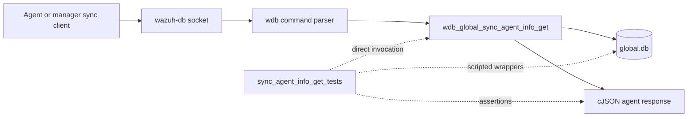
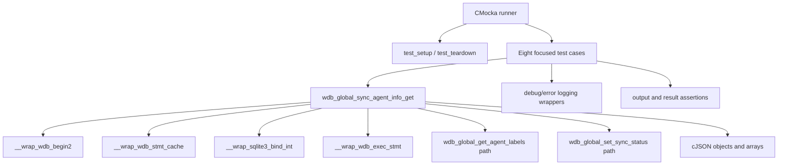
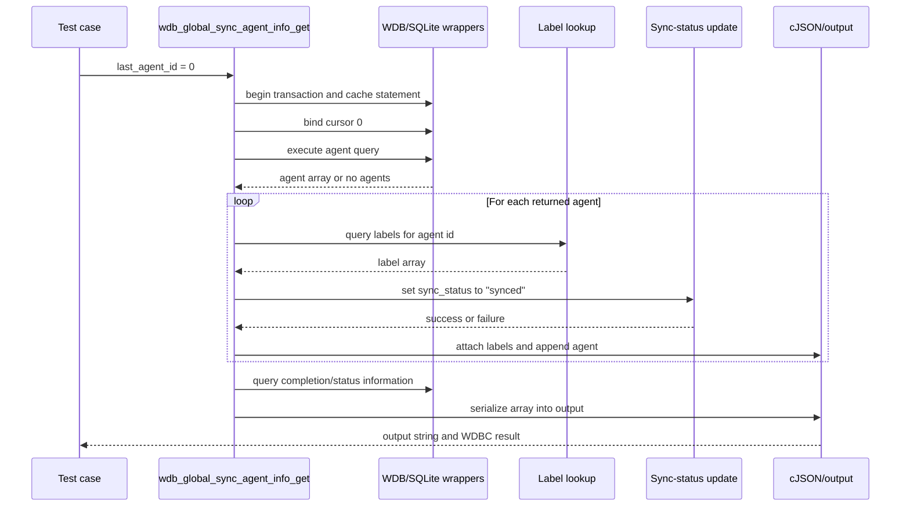
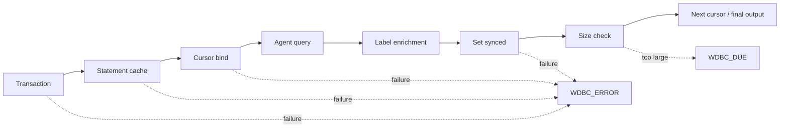

# `sync_agent_info_get_tests`

## Introduction

`sync_agent_info_get_tests` documents the focused CMocka coverage for
`wdb_global_sync_agent_info_get()`, the Wazuh DB operation that retrieves
agent information for synchronization. The operation reads agents after a
cursor, enriches each record with labels, marks successfully processed agents
as synchronized, and serializes the result into the caller-provided output
buffer.

These tests are a leaf of the larger [`test_wdb_global`](test_wdb_global.md)
suite. The common fixture, linker-wrapper conventions, and allocation
lifecycle are documented in
[`test_wdb_global_test_infrastructure`](test_wdb_global_test_infrastructure.md).
The production database engine and global-database responsibilities are
covered by [`wazuh_db_engine`](wazuh_db_engine.md) and the related global DB
documentation.

## Position in the system

At runtime, a synchronization client reaches `wazuh-db` through its command
and socket layers. The parser dispatches the request to the global database
implementation, which queries `global.db`. This test module calls the target
function directly and replaces transaction, SQLite, JSON, logging, and time
boundaries with deterministic mocks.



The module therefore validates the global synchronization business path, not
wire framing, command parsing, SQLite SQL text, or the real database schema.

## Contract under test

The tested call has the following shape:

```c
wdbc_result wdb_global_sync_agent_info_get(wdb_t *wdb,
                                           int *last_agent_id,
                                           char **output);
```

The observable workflow is:

1. Begin a transaction and obtain the cached agent-information statement.
2. Bind `*last_agent_id` as the starting cursor.
3. Query the next batch of agents.
4. For every returned agent, obtain its labels and add them under `labels`.
5. Mark the processed agent's synchronization status as `synced`.
6. Continue cursor/status queries until no further agents are available.
7. Serialize the resulting JSON array into `*output`.

The implementation uses the Wazuh DB result codes represented by the tests:

| Result | Meaning in this module |
|---|---|
| `WDBC_OK` | The response was produced, including an empty `[]` response. |
| `WDBC_ERROR` | Transaction, statement caching, parameter binding, or synchronization update failed. The output contains a diagnostic string for the early failures. |
| `WDBC_DUE` | The response cannot fit within the Wazuh DB response-size budget; the caller must continue synchronization from the cursor. |

```mermaid
flowchart TD
    Start([sync_agent_info_get]) --> Tx{Begin transaction}
    Tx -- fail --> TxErr[output = Cannot begin transaction<br/>WDBC_ERROR]
    Tx -- ok --> Cache{Cache statement}
    Cache -- fail --> CacheErr[output = Cannot cache statement<br/>WDBC_ERROR]
    Cache -- ok --> Bind[Bind last_agent_id]
    Bind -- fail --> BindErr[output = Cannot bind sql statement<br/>WDBC_ERROR]
    Bind -- ok --> Query[Query agent batch]
    Query --> More{Agent returned?}
    More -- no --> EmptyOrDone[Serialize accumulated array]
    More -- yes --> Labels[Query and attach labels]
    Labels --> Sync[Set agent sync_status = synced]
    Sync -- fail --> SyncErr[output = Cannot set sync_status...<br/>WDBC_ERROR]
    Sync -- ok --> Size{Response within limit?}
    Size -- no --> Due[output = [] / partial response<br/>WDBC_DUE]
    Size -- yes --> Query
    EmptyOrDone --> Ok[output JSON array<br/>WDBC_OK]
```

## Test architecture and dependencies

Each case uses `test_setup()` and `test_teardown()` through
`cmocka_unit_test_setup_teardown`. The fixture creates a synthetic `wdb_t`
whose identifier is `global`, allocates a placeholder SQLite handle, creates
an output buffer, and initializes Wazuh DB configuration. No real SQLite
connection or socket is opened.



| Dependency or seam | Role in these tests |
|---|---|
| `wdb.h` | Declares the global DB handle, result codes, and target contract. |
| `wdb_begin2` | Controls transaction setup for the main query and nested operations. |
| `wdb_stmt_cache` | Controls prepared-statement cache outcomes. Repeated returns model the main query and per-agent operations. |
| `sqlite3_bind_int` | Verifies the cursor and agent-ID parameters and injects bind errors. |
| `wdb_exec_stmt` | Supplies the agent array, label array, empty result, or execution failure. |
| `wdb_exec_stmt_silent` | Models the status update performed after an agent is processed. |
| cJSON wrappers | Build mock agent and label records and verify cleanup. |
| Logging wrappers | Assert exact diagnostics for transaction, cache, bind, and sync-update failures. |
| `WDB_MAX_RESPONSE_SIZE` | Defines the response-size boundary tested by the full-response case. |

## Main data flow



For the successful populated case, the expected serialized response is:

```json
[{"id":10,"test_field":"test_value","labels":[{"id":10,"key":"test_key","value":"test_value"}]}]
```

The tests use real cJSON arrays for this case, while SQLite and WDB calls are
mocked. This verifies the enrichment and serialization contract without
coupling the test to a live database.

## Test scenarios

| Test case | Injected condition | Expected behavior |
|---|---|---|
| `test_wdb_global_sync_agent_info_get_transaction_fail` | `wdb_begin2()` returns `-1`. | Writes `Cannot begin transaction`, returns `WDBC_ERROR`, and does not proceed to statement caching or binding. |
| `test_wdb_global_sync_agent_info_get_cache_fail` | Transaction succeeds; `wdb_stmt_cache()` returns `-1`. | Writes `Cannot cache statement` and returns `WDBC_ERROR`. |
| `test_wdb_global_sync_agent_info_get_bind_fail` | Binding the initial cursor at SQLite index `1` returns `SQLITE_ERROR`. | Logs the SQLite error, writes `Cannot bind sql statement`, and returns `WDBC_ERROR`. |
| `test_wdb_global_sync_agent_info_get_no_agents` | Main query, label/status-related calls, and completion queries return no agents. | Produces `[]` and returns `WDBC_OK`. |
| `test_wdb_global_sync_agent_info_get_success` | One agent is returned, its labels are returned, and status update succeeds. | Adds `labels`, serializes the enriched record, and returns `WDBC_OK`. |
| `test_wdb_global_sync_agent_info_get_sync_fail` | Agent and labels are returned, but `wdb_global_set_sync_status()` fails. | Logs `Cannot set sync_status for agent 10`, writes the same diagnostic, and returns `WDBC_ERROR`. |
| `test_wdb_global_sync_agent_info_get_full` | Mock agent content exceeds the response limit while processing the record. | Stops before returning the oversized payload, leaves output as `[]`, and returns `WDBC_DUE`. |
| `test_wdb_global_sync_agent_info_get_size_limit` | A response is constructed at the configured size boundary; a nested label lookup returns no result. | Exercises boundary-safe processing and still returns `WDBC_OK`; the test primarily protects the size calculation and continuation behavior. |

The tests intentionally distinguish two size-related outcomes. `..._full`
models an oversized record that must be deferred (`WDBC_DUE`), while
`..._size_limit` checks behavior at the configured boundary and confirms that
an auxiliary label-query failure does not incorrectly convert the overall
agent synchronization request into a fatal error when the main operation can
continue.

## Failure and continuation behavior

The suite verifies short-circuiting at the outer pipeline boundaries:



Nested operations are also observable: the success test scripts bindings for
the label lookup and the status update, while the synchronization-failure
test makes only the status update fail. This isolates the distinction between
“could not enrich the record” and “could not acknowledge the record as
synchronized.”

## Scope and maintenance guidance

This leaf should be updated when changes affect any of the following:

- the cursor parameter or its SQLite index;
- the agent query's response shape or cursor progression;
- the `labels` enrichment field;
- the status value written after successful processing;
- `WDBC_OK`, `WDBC_ERROR`, or `WDBC_DUE` classification;
- response-size handling; or
- exact diagnostic strings asserted by the tests.

Do not duplicate the implementation details of label retrieval, sync-status
mutation, or the shared fixture here. Use the related leaf pages and the
parent suite documentation for those contracts. This module should remain
focused on their composition within the agent-information synchronization
workflow.

## Source references

- Test source: [`src/unit_tests/wazuh_db/test_wdb_global.c`](../../src/unit_tests/wazuh_db/test_wdb_global.c)
- Target function: `wdb_global_sync_agent_info_get`
- Registered source section: `/* Tests wdb_global_sync_agent_info_get */`
- Parent suite: [`test_wdb_global`](test_wdb_global.md)
- Shared fixture and wrappers: [`test_wdb_global_test_infrastructure`](test_wdb_global_test_infrastructure.md)
- Related agent/group synchronization: [`sync_agent_groups_get_tests`](sync_agent_groups_get_tests.md)
