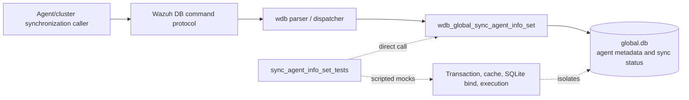
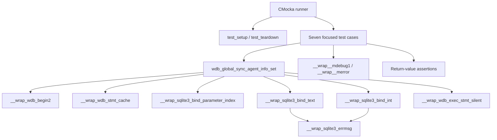
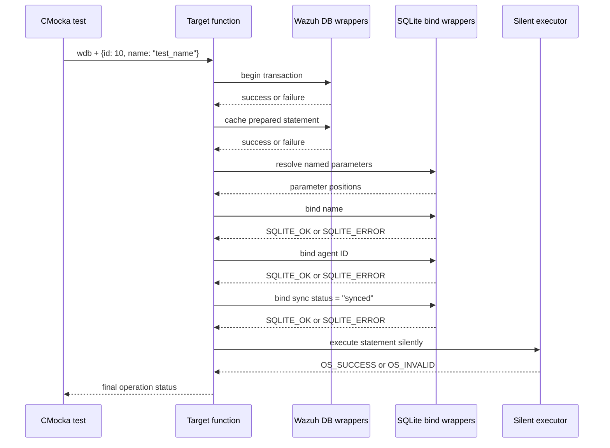
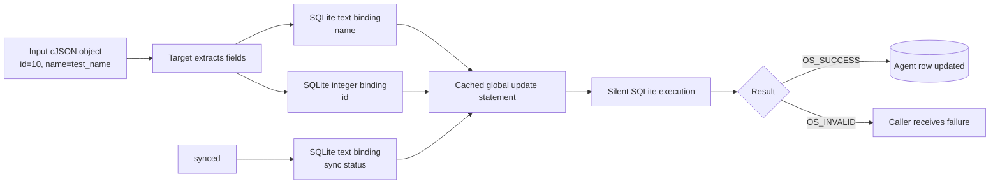

# `sync_agent_info_set_tests`

## Introduction

`sync_agent_info_set_tests` documents the focused CMocka coverage for
`wdb_global_sync_agent_info_set()`, implemented in
[`src/unit_tests/wazuh_db/test_wdb_global.c`](../../src/unit_tests/wazuh_db/test_wdb_global.c).
The function receives one agent's JSON metadata during synchronization and
persists the agent name, identifier, and synchronized state in Wazuh's global
database.

This is a leaf of the broader [`test_wdb_global`](test_wdb_global.md) suite.
The parent page covers the complete global-database test architecture; this
page describes only the seven tests named for the sync-agent-info setter.

## Purpose and system position

Agent synchronization transfers metadata between Wazuh components or cluster
nodes. The database layer is the persistence boundary: it converts the JSON
agent object into SQLite parameters and executes an update statement against
`global.db`.



The tests do not validate socket framing, command parsing, cluster transport,
JSON serialization performed by the caller, or the global synchronization
state machine. Those concerns belong to the linked parent and production
documentation.

## Contract under test

The exercised operation has the following conceptual signature:

```c
int wdb_global_sync_agent_info_set(wdb_t *wdb, cJSON *json_agent);
```

The fixture supplies a JSON object containing at least:

```json
{"id": 10, "name": "test_name"}
```

The test expectations establish this execution sequence:

1. Begin a database transaction with `wdb_begin2()`.
2. Prepare/cache the global statement with `wdb_stmt_cache()`.
3. Resolve the statement's named parameter positions through
   `sqlite3_bind_parameter_index()`.
4. Bind the agent name as SQLite text parameter 1.
5. Bind the agent ID as SQLite integer parameter 1.
6. Bind the literal synchronization state `"synced"` as SQLite text
   parameter 1.
7. Execute the statement through `wdb_exec_stmt_silent()`.
8. Return `OS_SUCCESS` only when all stages succeed; otherwise return
   `OS_INVALID`.

The wrapper records position values independently because the production SQL
uses named parameters and resolves them before binding. The important
behavioral contract is the order and values of the three logical fields:
`name`, `id`, and `synced`.

## Architecture and dependencies



| Dependency | Responsibility in this module |
|---|---|
| `wdb.h` | Supplies `wdb_t`, target declarations, and `OS_SUCCESS`/`OS_INVALID`. |
| `cJSON` | Builds the input agent object passed to the target. |
| `test_setup()` / `test_teardown()` | Creates and releases a minimal synthetic `global` database context. |
| `wdb_begin2` wrapper | Injects transaction success or failure. |
| `wdb_stmt_cache` wrapper | Injects statement-cache success or failure. |
| `sqlite3_bind_parameter_index` wrapper | Satisfies named-parameter lookup without a real prepared statement. |
| SQLite bind wrappers | Verify and inject failures for name, ID, and sync-status values. |
| `wdb_exec_stmt_silent` wrapper | Controls the final write result. |
| CMocka and logging wrappers | Verify call expectations, return codes, and diagnostics. |

The common fixture and wrapper conventions are documented by
[`test_wdb_global`](test_wdb_global.md) and
[`wazuh_db_wrappers`](wazuh_db_wrappers.md); they are intentionally not
duplicated here.

## Control flow

```mermaid
flowchart TD
    Start([sync_agent_info_set(wdb, json_agent)]) --> Tx{Begin transaction}
    Tx -- failure --> TxErr[Log "Cannot begin transaction"<br/>return OS_INVALID]
    Tx -- success --> Cache{Cache statement}
    Cache -- failure --> CacheErr[Log "Cannot cache statement"<br/>return OS_INVALID]
    Cache -- success --> Lookup[Resolve named parameters]
    Lookup --> Name{Bind name succeeds?}
    Name -- no --> NameErr[SQLite error log<br/>return OS_INVALID]
    Name -- yes --> ID{Bind agent ID succeeds?}
    ID -- no --> IDErr[SQLite error log<br/>return OS_INVALID]
    ID -- yes --> Sync{Bind "synced" succeeds?}
    Sync -- no --> SyncErr[SQLite error log<br/>return OS_INVALID]
    Sync -- yes --> Step{Execute silently}
    Step -- failure --> StepErr[return OS_INVALID]
    Step -- OS_SUCCESS --> Done([return OS_SUCCESS])
```

Every failure case stops at the first failing boundary. This verifies that a
failed bind does not cause later fields or statement execution to be called.

## Test scenarios

| Test case | Injected condition | Expected behavior |
|---|---|---|
| `test_wdb_global_sync_agent_info_set_transaction_fail` | `wdb_begin2()` returns `-1`. | Logs `Cannot begin transaction`; returns `OS_INVALID`. |
| `test_wdb_global_sync_agent_info_set_cache_fail` | Transaction succeeds, then `wdb_stmt_cache()` returns `-1`. | Logs `Cannot cache statement`; returns `OS_INVALID`. |
| `test_wdb_global_sync_agent_info_set_bind1_fail` | Name binding returns `SQLITE_ERROR`. | Logs the SQLite error; returns `OS_INVALID`; ID and status are not bound. |
| `test_wdb_global_sync_agent_info_set_bind2_fail` | Name binding succeeds; ID binding returns `SQLITE_ERROR`. | Logs the SQLite error; returns `OS_INVALID`; status is not bound. |
| `test_wdb_global_sync_agent_info_set_bind3_fail` | Name and ID bind successfully; status binding returns `SQLITE_ERROR`. | Logs the SQLite error; returns `OS_INVALID`; execution is not attempted. |
| `test_wdb_global_sync_agent_info_set_step_fail` | All three binds succeed; silent execution returns `OS_INVALID`. | Propagates `OS_INVALID`. |
| `test_wdb_global_sync_agent_info_set_success` | Transaction, cache, lookup, all binds, and execution succeed. | Returns `OS_SUCCESS`. |

The source registers all seven cases in `main()` with
`cmocka_unit_test_setup_teardown()`, so each test receives a fresh fixture.

## Component interaction flow



## Data flow



The input JSON object is owned and deleted by each test after the target
returns. The target's persistence operation is mocked, so these tests verify
field extraction and database interaction, not durable row contents.

## Error and diagnostic contract

The suite establishes the following invariants:

- transaction and statement-cache failures use debug-level diagnostics;
- SQLite bind failures include the `global` database identifier and the
  wrapper-provided SQLite error message;
- bind operations are ordered and short-circuiting;
- the synchronization value written by this operation is the literal
  `"synced"`;
- execution failure is returned as `OS_INVALID`; and
- a fully successful write returns `OS_SUCCESS`.

The tests intentionally do not assert transaction rollback behavior. If the
production implementation changes rollback/commit ownership, add explicit
wrapper expectations here or document that behavior in the parent global DB
page.

## Maintenance guidance

Update this document and its tests when any of the following changes:

- the input JSON keys or required fields change;
- the SQL statement changes from named to positional parameters, or parameter
  binding order changes;
- the persisted synchronization value changes;
- the target switches transaction, cache, or execution helpers; or
- return codes or diagnostic messages change.

Keep broader synchronization retrieval and status-transition behavior linked
instead of duplicating it. Relevant neighboring pages include
[`sync_agent_info_get_tests`](sync_agent_info_get_tests.md),
[`set_sync_status_tests`](set_sync_status_tests.md), and
[`test_wdb_global`](test_wdb_global.md).

## Source references

- Test source: [`src/unit_tests/wazuh_db/test_wdb_global.c`](../../src/unit_tests/wazuh_db/test_wdb_global.c)
- Focused functions: `test_wdb_global_sync_agent_info_set_transaction_fail`,
  `..._cache_fail`, `..._bind1_fail`, `..._bind2_fail`, `..._bind3_fail`,
  `..._step_fail`, and `..._success`
- Production implementation: [`wazuh_db_global`](wazuh_db_global.md)
- Public DB declarations: [`wazuh_db`](wazuh_db.md)
- Parent test suite: [`test_wdb_global`](test_wdb_global.md)
- Shared wrappers: [`wazuh_db_wrappers`](wazuh_db_wrappers.md)
