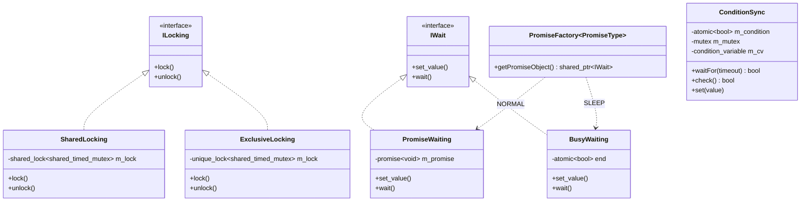
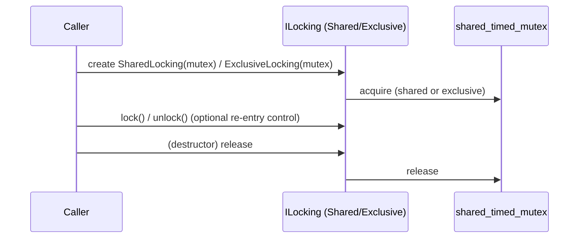
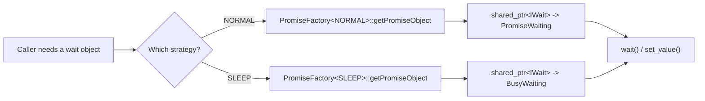
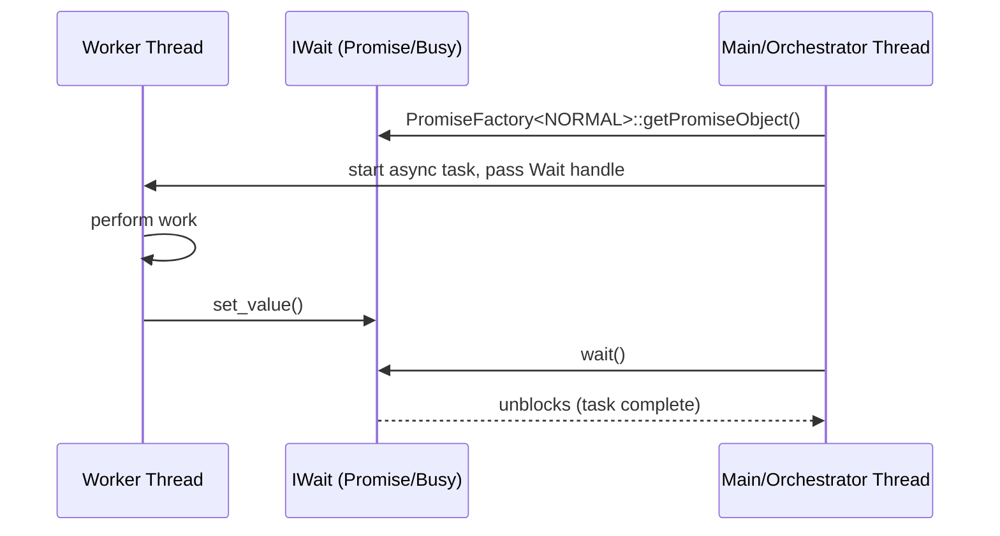

# Sync Primitives

## 1. Introduction & Purpose

The **Sync Primitives** module is a small, header-only C++ library that provides the fundamental
building blocks for thread synchronization used throughout the Wazuh **Shared Modules
Infrastructure**. It does not implement any business logic itself; instead, it offers a set of
lightweight, RAII-friendly abstractions that higher-level components (such as
`dbsync`, `rsync`, `router` and `content_manager`) use to:

- Acquire shared (read) or exclusive (write) access to protected resources.
- Block a thread until an asynchronous operation completes (via a "wait" abstraction that can be
  backed either by a real OS-level promise/future or by a busy-polling loop).
- Coordinate producer/consumer style signaling through a simple boolean condition variable wrapper.
- Create the correct "wait" implementation for a given use case through a factory, without the
  caller needing to know the concrete class involved.

Because these primitives are extremely small and dependency-free (only using the C++ standard
library), they are compiled directly into every consumer module rather than being distributed as a
separate shared library. This documentation module covers all four header files that make up the
primitive set. As this is a small, cohesive, single-file-group module, no sub-module documentation
was generated — everything is covered here.

## 2. Architecture Overview

The module is organized around two independent abstraction hierarchies — **locking** and
**waiting** — plus one concrete synchronization helper (`ConditionSync`) and one factory
(`PromiseFactory`) that ties the waiting hierarchy together for convenient instantiation.

### File-to-component map

| File | Components | Responsibility |
|------|------------|-----------------|
| `abstractLocking.hpp` | `ILocking`, `SharedLocking`, `ExclusiveLocking` | RAII wrappers around `std::shared_timed_mutex` for shared/exclusive access |
| `abstractWait.h` | `IWait`, `PromiseWaiting`, `BusyWaiting` | Abstraction for "block until signaled" semantics, with two strategies |
| `conditionSync.hpp` | `ConditionSync` | Boolean condition variable with timeout-based waiting, used for thread hand-off |
| `promiseFactory.h` | `PromiseFactory`, `getPromiseObject` | Compile-time selection (via template specialization) of the correct `IWait` implementation |

## 3. Component Details

### 3.1 Locking Primitives — `abstractLocking.hpp`

Defines the `ILocking` interface and two concrete RAII implementations built on top of
`std::shared_timed_mutex`:

- **`SharedLocking`**: wraps a `std::shared_lock`, allowing multiple readers to hold the lock
  concurrently. Used when a component needs to read shared state (e.g., a cache or in-memory index)
  without blocking other readers.
- **`ExclusiveLocking`**: wraps a `std::unique_lock`, granting exclusive access. Used for write
  operations that must not overlap with any other read or write.

Both classes implement the common `ILocking` interface (`lock()` / `unlock()`), allowing calling
code to work polymorphically with either lock type — for example, a component can decide at
runtime whether a given operation requires shared or exclusive access and instantiate the
appropriate object behind a `std::unique_ptr<ILocking>` or `std::shared_ptr<ILocking>`.

### 3.2 Waiting Primitives — `abstractWait.h`

Defines the `IWait` interface, representing a one-shot "signal and wait" contract with two
methods: `set_value()` (signal completion) and `wait()` (block until signaled).

- **`PromiseWaiting`**: backed by `std::promise<void>` / `std::future<void>`. This is the standard,
  OS-efficient implementation — the waiting thread is put to sleep by the OS scheduler until the
  promise is fulfilled.
- **`BusyWaiting`**: backed by an `std::atomic<bool>` flag, polled in a loop with a 1-second sleep
  between checks. This strategy avoids relying on `std::promise`/`std::future`, which is useful in
  contexts where a lightweight polling mechanism is preferred (e.g., simple periodic checks without
  future/promise overhead), at the cost of coarser wake-up latency.

Both are used in scenarios where one thread must wait for another to complete an asynchronous task
(e.g., a background download, decompression job, or module shutdown handshake).

### 3.3 Promise Factory — `promiseFactory.h`

`PromiseFactory<PromiseType>` is a template class specialized for two tags:

- `PromiseType::NORMAL` → returns a `std::shared_ptr<IWait>` pointing to a `PromiseWaiting`
  instance.
- `PromiseType::SLEEP` → returns a `std::shared_ptr<IWait>` pointing to a `BusyWaiting` instance.

This factory decouples callers from the concrete `IWait` implementation: code that needs a wait
object simply calls `PromiseFactory<PromiseType::NORMAL>::getPromiseObject()` (or `SLEEP`) and
receives a polymorphic handle, enabling the wait strategy to be swapped without changing consumer
code.

### 3.4 Condition Synchronization — `conditionSync.hpp`

`ConditionSync` wraps a `std::atomic<bool>` condition together with a `std::mutex` and
`std::condition_variable` to provide:

- `waitFor(timeout)`: blocks the calling thread until either the condition becomes `true` or the
  timeout elapses, returning whether the condition was met.
- `check()`: a non-blocking read of the current condition value.
- `set(value)`: atomically updates the condition and notifies all waiting threads.

This is a higher-level, timeout-aware alternative to the simple `IWait` abstraction, useful for
scenarios where a component must periodically re-evaluate a stop/continue flag (e.g., a module's
main loop waiting for either a shutdown signal or a scheduled interval to elapse).

## 4. Typical Usage Pattern

Consumers across the codebase (e.g., content download orchestration, DB synchronization
transactions, router provider lifecycle) hold an `IWait` instance to know when a background
operation has finished, and use `ILocking` implementations to guard shared containers (caches,
queues, registries) that are accessed concurrently by multiple threads. `ConditionSync` is commonly
used for daemon-style loops that need to sleep for an interval but wake up immediately on a stop
request.

## 5. Relationship to Other Modules

`sync_primitives` is one of several utility sub-modules under the broader
**Shared Modules Infrastructure (C++)** umbrella (parent module `shared_utils`), alongside sibling
sub-modules such as `design_patterns` (Builder, Chain-of-Responsibility, Observer/Subscriber
patterns that often compose with these synchronization primitives), `threading_dispatch_queues`
(thread-safe queues and dispatchers that internally rely on similar locking/waiting semantics),
`smart_pointers_raii` (RAII deleters that complement the RAII locking style used here), and
`common_helpers` (general-purpose helpers used alongside synchronization code).

Higher-level consumers documented elsewhere in this wiki include the `content_manager` module
(orchestrating downloads and updates asynchronously), the `dbsync` and `rsync` modules (managing
transactional access to synchronized databases), and the `router` module (coordinating
provider/subscriber lifecycles). These modules are documented separately under the
**Shared Modules Infrastructure (C++)** section of the wiki; refer to their respective pages for
details on how they leverage the primitives described here.

## 6. Summary

| Aspect | Details |
|--------|---------|
| Language | C++ (header-only) |
| Dependencies | C++ Standard Library only (`<mutex>`, `<shared_mutex>`, `<future>`, `<thread>`, `<atomic>`, `<condition_variable>`, `<chrono>`) |
| Files | `abstractLocking.hpp`, `abstractWait.h`, `conditionSync.hpp`, `promiseFactory.h` |
| Pattern | Strategy (locking/waiting strategies selected via interface + factory) |
| Thread-safety | Yes — this is the module whose sole purpose is to provide thread-safety primitives |
| Sub-modules | None — the module is small and cohesive enough to be documented as a single unit |
