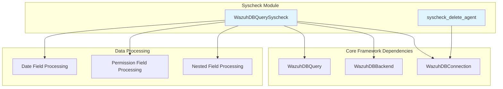
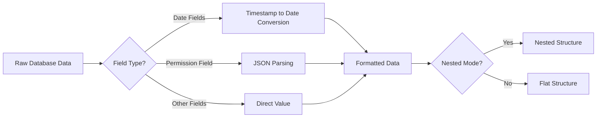
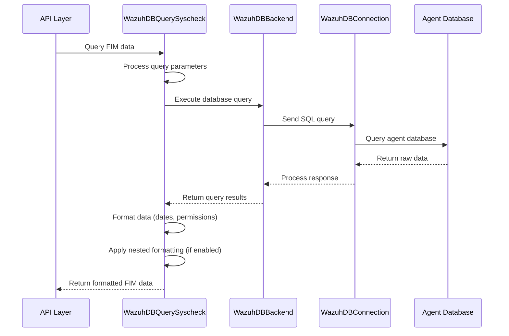
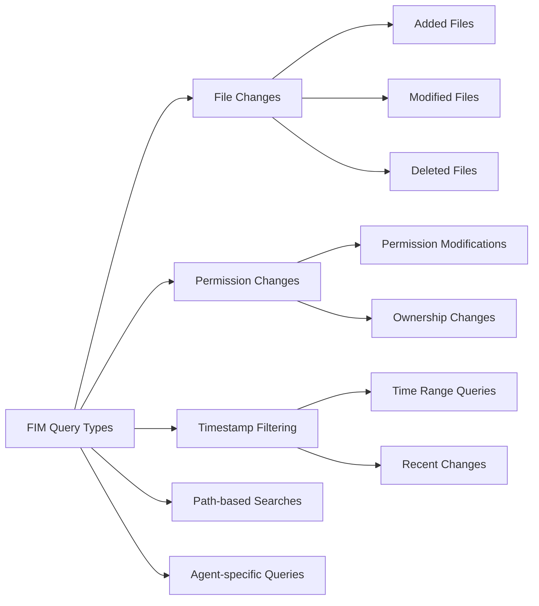

# Syscheck Module Documentation

## Overview

The Syscheck module is a critical component of Wazuh's File Integrity Monitoring (FIM) system, responsible for querying and managing file integrity monitoring data stored in the Wazuh database. This module provides specialized database query capabilities for retrieving FIM events, file changes, and system integrity information from monitored agents.

## Architecture

The syscheck module is built on top of Wazuh's core database query framework and provides specialized functionality for handling file integrity monitoring data. It extends the base `WazuhDBQuery` class to implement FIM-specific data processing and formatting.



## Core Components

### WazuhDBQuerySyscheck

The primary class responsible for querying file integrity monitoring data from the Wazuh database.

#### Key Features

- **Specialized FIM Queries**: Optimized for retrieving file integrity monitoring events
- **Date Field Processing**: Automatic conversion of timestamp fields to human-readable dates
- **Permission Handling**: JSON parsing of file permission data
- **Nested Data Support**: Optional nested field formatting for complex data structures
- **Agent-Specific Queries**: Targets specific agent databases for FIM data

#### Field Processing



#### Configuration

- **nested_fields**: `['value']` - Fields that support nested formatting
- **date_fields**: `{'start', 'end', 'mtime', 'date'}` - Fields containing timestamp data
- **default_sort_field**: `'mtime'` - Default sorting by modification time

### syscheck_delete_agent Function

A utility function for removing all FIM entries for a specific agent from the database.

#### Functionality

- **Agent Cleanup**: Removes all file integrity monitoring data for a specified agent
- **Database Integrity**: Ensures clean removal of agent-specific FIM data
- **Connection Management**: Uses existing database connections for efficient operations

## Data Flow



## Integration Points

### Database Layer Integration

The syscheck module integrates with Wazuh's database infrastructure:

- **[Core Framework](core_framework.md)**: Extends `WazuhDBQuery` for specialized FIM queries
- **[Database Connectivity](database_connectivity.md)**: Uses `WazuhDBConnection` for agent database access
- **[Agent Management](agent_management.md)**: Queries agent-specific databases for FIM data

### Security Modules Integration

As part of the Security Modules family:

- **[Rootcheck](rootcheck.md)**: Complementary security monitoring for system integrity
- **[SCA](sca.md)**: Security Configuration Assessment integration
- **[Syscollector](syscollector.md)**: System inventory data correlation

## Query Capabilities

### Supported Query Operations



### Query Parameters

- **Agent ID**: Target specific agent for FIM data
- **Time Filters**: Filter by modification time, start/end dates
- **File Paths**: Search specific directories or files
- **Change Types**: Filter by type of file system change
- **Permissions**: Query permission-related changes

## Data Processing Pipeline

### Field Transformation

1. **Date Processing**: Converts Unix timestamps to ISO format dates
2. **Permission Parsing**: Attempts JSON parsing of permission fields
3. **Nested Formatting**: Optionally restructures flat data into nested objects
4. **Field Validation**: Ensures data integrity and type consistency

### Error Handling

- **JSON Decode Errors**: Graceful fallback for malformed permission data
- **Database Connection Issues**: Proper error propagation and cleanup
- **Invalid Agent IDs**: Clear error messages for non-existent agents

## Performance Considerations

### Query Optimization

- **Agent-Specific Databases**: Direct queries to individual agent databases
- **Index Utilization**: Leverages database indexes for timestamp and path queries
- **Pagination Support**: Efficient handling of large result sets
- **Field Selection**: Minimizes data transfer with selective field queries

### Memory Management

- **Streaming Results**: Processes large datasets without memory overflow
- **Connection Pooling**: Efficient database connection reuse
- **Data Formatting**: On-demand processing to reduce memory footprint

## Configuration

### Default Settings

```python
# Default configuration for syscheck queries
nested_fields = ['value']
date_fields = {'start', 'end', 'mtime', 'date'}
default_sort_field = 'mtime'
min_select_fields = set()  # Configurable minimum fields
```

### Customization Options

- **Nested Mode**: Enable/disable nested field formatting
- **Sort Configuration**: Customize default sorting behavior
- **Field Selection**: Configure minimum required fields
- **Date Handling**: Customize date field processing

## Usage Examples

### Basic FIM Query

```python
# Query recent file changes for an agent
query = WazuhDBQuerySyscheck(
    agent_id='001',
    nested=True,
    limit=100,
    sort={'fields': ['mtime'], 'order': 'desc'}
)
results = query.run()
```

### Agent Cleanup

```python
# Remove all FIM data for an agent
with WazuhDBConnection() as conn:
    syscheck_delete_agent('001', conn)
```

## Security Considerations

### Data Access Control

- **Agent Isolation**: Queries are restricted to specific agent databases
- **Permission Validation**: Ensures proper access controls for FIM data
- **Data Sanitization**: Prevents SQL injection through parameterized queries

### Audit Trail

- **Query Logging**: All database operations are logged for audit purposes
- **Change Tracking**: Maintains integrity of FIM data modifications
- **Access Monitoring**: Tracks access to sensitive file integrity data

## Troubleshooting

### Common Issues

1. **Agent Database Not Found**: Verify agent connectivity and database creation
2. **Permission Parsing Errors**: Check for malformed JSON in permission fields
3. **Query Timeouts**: Optimize queries for large datasets or increase timeout values
4. **Memory Issues**: Use pagination for large result sets

### Diagnostic Tools

- **Database Connection Testing**: Verify agent database accessibility
- **Query Performance Analysis**: Monitor query execution times
- **Data Integrity Checks**: Validate FIM data consistency

## Future Enhancements

### Planned Features

- **Real-time FIM Streaming**: Live file change notifications
- **Advanced Analytics**: Statistical analysis of file changes
- **Machine Learning Integration**: Anomaly detection in file modifications
- **Enhanced Visualization**: Improved data presentation formats

### Performance Improvements

- **Query Caching**: Cache frequently accessed FIM data
- **Parallel Processing**: Concurrent queries across multiple agents
- **Data Compression**: Reduce storage and transfer overhead
- **Index Optimization**: Enhanced database indexing strategies