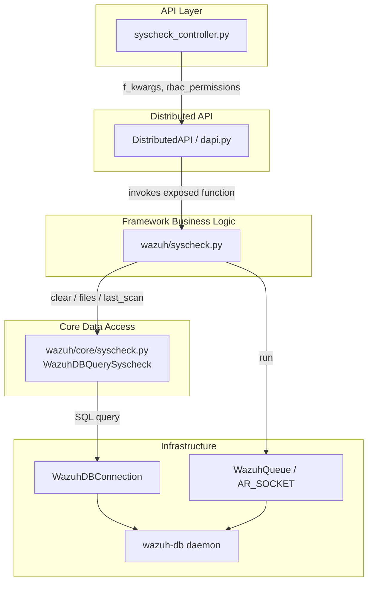
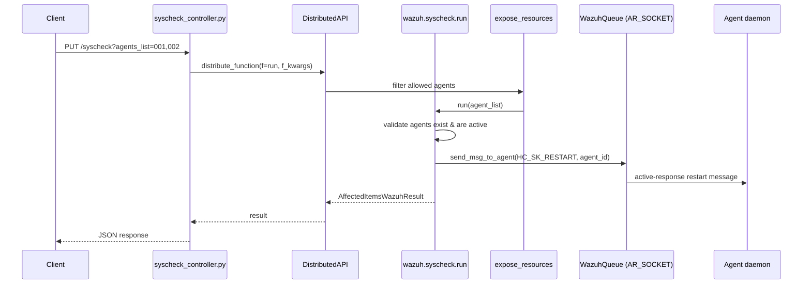
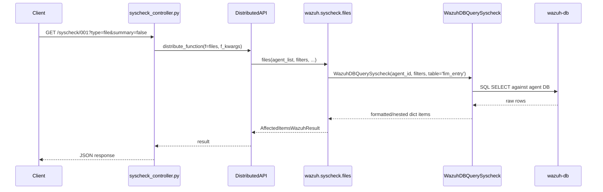

# Syscheck Module

## 1. Introduction and Purpose

The **Syscheck Module** implements the Wazuh Server-side API and framework logic for the **File Integrity Monitoring (FIM)** subsystem, commonly referred to as *Syscheck*. It does **not** perform the actual file scanning itself — that responsibility belongs to the `syscheckd` daemon running on each agent/manager. Instead, this module exposes the **management interface** that allows the Wazuh API, CLI tools, and other internal actors to:

- Trigger ("run") an on-demand integrity scan on one or more agents.
- Query FIM scan results (file/registry findings) collected and stored by `wazuh-db`.
- Retrieve the timestamps of the last completed scan for an agent.
- Clear (reset) the stored FIM database for legacy agents.

In essence, the module acts as a thin, well-defined bridge between the **REST API layer** and the **Wazuh core data/query layer**, translating HTTP requests into internal distributed function calls and SQL-like queries against the per-agent `wazuh-db` database.

## 2. Architecture Overview

The module follows the classic three-layer pattern used across most Wazuh API-managed subsystems:

1. **API Controller Layer** – parses/validates HTTP request parameters and dispatches them through the Distributed API (DAPI).
2. **Framework Business Logic Layer** – applies RBAC-aware processing, aggregates results across agents, and orchestrates side effects (e.g., sending socket messages to trigger scans).
3. **Core Data Access Layer** – encapsulates the low-level `wazuh-db` query construction and result formatting.

### Request Flow Example: `PUT /syscheck` (run a scan)

### Request Flow Example: `GET /syscheck/{agent_id}` (query FIM findings)

## 3. Core Components

Since this module is small and tightly layered (3 files), it is documented as a single, cohesive unit rather than split into sub-modules. The table below summarizes each file's responsibility.

| Layer | File | Key Components | Responsibility |
|---|---|---|---|
| API Controller | `api/api/controllers/syscheck_controller.py` | `put_syscheck`, `get_syscheck_agent`, `delete_syscheck_agent`, `get_last_scan_agent` | Exposes the REST endpoints (`PUT/GET/DELETE /syscheck`) and forwards requests to the Distributed API. |
| Business Logic | `framework/wazuh/syscheck.py` | `run`, `clear`, `last_scan`, `files` | RBAC-decorated functions that implement the actual behavior: triggering scans, clearing legacy DBs, computing last scan window, and retrieving/filtering FIM findings. |
| Core Data Access | `framework/wazuh/core/syscheck.py` | `WazuhDBQuerySyscheck`, `syscheck_delete_agent` | Builds and executes `wazuh-db` queries against the `fim_entry`/`scan_info` tables, formats dates and JSON `perm` fields, and supports nested field reconstruction. |

### 3.1 API Controller (`syscheck_controller.py`)

Defines four asynchronous endpoint handlers, all of which:
- Build an `f_kwargs` dictionary from request parameters.
- Instantiate a `DistributedAPI` (see [cluster_dapi.md](cluster_dapi.md) for the DAPI/distributed execution model) with `request_type='distributed_master'`.
- Propagate the caller's RBAC policies from `request.context['token_info']['rbac_policies']` (see [security_rbac_module.md](security_rbac_module.md)).
- Await `dapi.distribute_function()` and wrap the result in a `ConnexionResponse` via `json_response`.

| Endpoint Handler | HTTP Verb | Purpose |
|---|---|---|
| `put_syscheck` | `PUT /syscheck` | Starts a syscheck scan on the specified agents (or all, via `*`). |
| `get_syscheck_agent` | `GET /syscheck/{agent_id}` | Retrieves FIM scan results for a single agent, with rich filtering (type, hash, file, checksum fields, summary mode). |
| `delete_syscheck_agent` | `DELETE /syscheck/{agent_id}` | Clears the FIM database entries for an agent (legacy agents only). |
| `get_last_scan_agent` | `GET /syscheck/{agent_id}/last_scan` | Returns the start/end timestamps of the agent's most recent scan. |

This controller relies on shared API infrastructure (parameter parsing, JSON encoding, authentication middleware) described in [api_core_infrastructure.md](api_core_infrastructure.md).

### 3.2 Business Logic (`framework/wazuh/syscheck.py`)

All public functions are decorated with `@expose_resources`, which enforces RBAC filtering on the `agent:id:{agent_list}` resource before the function body executes (see [security_rbac_module.md](security_rbac_module.md) for the decorator implementation).

- **`run(agent_list)`**
  - Validates that requested agents exist (`get_agents_info`) and are in `active` status (via `WazuhDBQueryAgents`, see [agent_module.md](agent_module.md)).
  - Sends an `HC_SK_RESTART` active-response message to each eligible agent through a `WazuhQueue` bound to the `AR_SOCKET` (see [framework_core_communication.md](framework_core_communication.md) and [active_response_module.md](active_response_module.md) for the underlying queue/socket abstractions).
  - Returns an `AffectedItemsWazuhResult` (see [framework_core_utils.md](framework_core_utils.md)) summarizing successes/failures.

- **`clear(agent_list)`**
  - Only applicable to agents with version **older than v3.12.0** (`WazuhVersion` comparison, from `framework_core_utils`).
  - Deletes rows from the `fim_entry` table via `syscheck_delete_agent`, using a raw `WazuhDBConnection` (see [framework_core_communication.md](framework_core_communication.md)).

- **`last_scan(agent_list)`**
  - Reads the agent's `version` via `Agent.get_basic_information`; agents that have never connected have no scan data and return `{'start': None, 'end': None}`.
  - Otherwise queries the `scan_info` table (`module=fim`) through `WazuhDBQuerySyscheck` to obtain `start_scan`/`end_scan`, applying logic to null-out an `end` value that precedes `start` (indicating a scan still in progress).

- **`files(agent_list, filters, ...)`**
  - The core FIM-findings retrieval function backing `get_syscheck_agent`.
  - Supports filtering by type, hash (a combined `md5`/`sha1`/`sha256` OR-query), checksum fields, registry value name/type, and free-text search.
  - Delegates to `WazuhDBQuerySyscheck` against the `fim_entry` table, optionally reducing to `summary_parameters` (`date`, `mtime`, `file`) when `summary=True`.

### 3.3 Core Data Access (`framework/wazuh/core/syscheck.py`)

- **`WazuhDBQuerySyscheck`** extends the generic `WazuhDBQuery` (from [framework_core_utils.md](framework_core_utils.md)) with:
  - `nested_fields = ['value']` — supports dot-notation reconstruction (e.g., `value.name`, `value.type`) for registry-related fields.
  - `date_fields = {'start', 'end', 'mtime', 'date'}` — automatically converts raw epoch/timestamp values into human-readable dates via `get_date_from_timestamp`.
  - Special handling of the `perm` field, which is stored as a JSON string and is transparently decoded (`json.loads`) when possible.
  - Uses `WazuhDBBackend(agent_id)` to route queries to the correct **per-agent** `wazuh-db` database instance (see [framework_core_communication.md](framework_core_communication.md) for `WazuhDBConnection`/backend internals).

- **`syscheck_delete_agent(agent, wdb_conn)`** — issues a raw `DELETE FROM fim_entry` command via the low-level `WazuhDBConnection.execute()` API, used exclusively by the legacy `clear()` flow.

## 4. Data Model Notes

FIM results are stored per-agent in the `fim_entry` table (individual file/registry findings) and the `scan_info` table (scan start/end bookkeeping, filtered by `module=fim`). This mirrors the on-agent database schema populated by the `syscheckd` daemon and `wazuh-db`.

## 5. Relationship to Other Modules

| Related Module | Relationship |
|---|---|
| [agent_module.md](agent_module.md) | Provides agent existence/status lookups (`get_agents_info`, `WazuhDBQueryAgents`) used to validate scan targets. |
| [security_rbac_module.md](security_rbac_module.md) | Supplies the `@expose_resources` decorator that enforces per-agent RBAC authorization on all syscheck operations. |
| [cluster_dapi.md](cluster_dapi.md) | The `DistributedAPI` class used by the controller to broadcast/route requests across master/worker nodes. |
| [framework_core_utils.md](framework_core_utils.md) | Supplies `AffectedItemsWazuhResult`, `WazuhDBQuery`, `WazuhVersion`, and other shared utilities. |
| [framework_core_communication.md](framework_core_communication.md) | Supplies `WazuhQueue` (active-response socket) and `WazuhDBConnection`/`WazuhDBBackend` for `wazuh-db` communication. |
| [active_response_module.md](active_response_module.md) | The scan-trigger mechanism (`run`) is itself a specialized active-response message. |
| [rootcheck_module.md](rootcheck_module.md) | A closely analogous module (same architecture pattern: controller → framework → `WazuhDBQueryRootcheck`) for the Rootcheck subsystem. |
| [syscollector_module.md](syscollector_module.md) | Sibling module querying different `wazuh-db` tables for hardware/OS inventory, following the same layered design. |
| Syscheck/FIM Daemon (C/C++) | The actual on-agent scanning engine that populates the data this module reads and clears. |
| [wazuh_db.md](wazuh_db.md) | The daemon and protocol that backs all `WazuhDBQuerySyscheck` operations. |
| [api_core_infrastructure.md](api_core_infrastructure.md) | Shared API framework (authentication, middleware, request parsing) used by `syscheck_controller.py`. |

## 6. Summary

The Syscheck Module is a compact but essential integration point that turns the low-level FIM data collected by agents into actionable, RBAC-secured API operations: initiating scans, inspecting results, checking scan status, and (for legacy agents) resetting stored data. Its three-layer design—API controller, framework logic, and DB query class—mirrors the pattern used throughout the Wazuh Python framework, making it a useful reference for understanding sibling modules such as Rootcheck and Syscollector.
