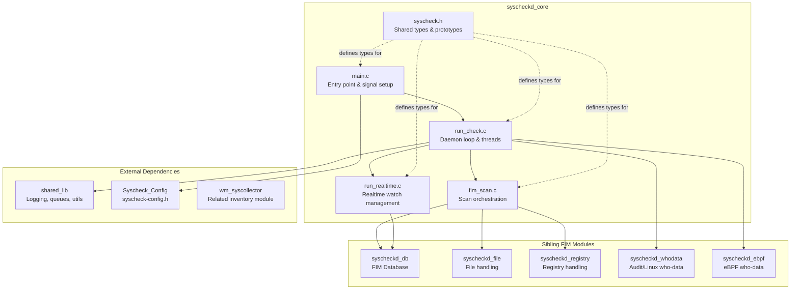

# Syscheckd Core Module

## Introduction

`syscheckd_core` is the heart of Wazuh's **File Integrity Monitoring (FIM)** daemon (`syscheckd`). It is responsible
for the daemon's lifecycle (startup, shutdown, signal handling), for orchestrating scheduled and real-time
filesystem scans, and for managing the real-time notification subsystem (inotify on Linux, `ReadDirectoryChangesW`
on Windows). This module glues together the lower-level FIM subsystems — the FIM database, the file/registry
handlers, and the whodata (audit/eBPF) engines — into a coherent, long-running monitoring service.

The module is composed of five files:

| File | Responsibility |
|---|---|
| `include/syscheck.h` | Central header: global config, shared data types (`event_data_t`, `fim_tmp_file`, `diff_data`), and the full FIM function-prototype surface used across the daemon |
| `src/main.c` | Process entry point: argument parsing, privilege separation, configuration loading, signal handlers, daemonization |
| `src/run_check.c` | Daemon main loop, thread orchestration (realtime/integrity/whodata threads), symlink monitoring, message sending helpers |
| `src/fim_scan.c` | Implements the actual file/registry scan pass, DB-fill-state alerting, and dynamic wildcard directory expansion |
| `src/run_realtime.c` | Platform-specific real-time watch management (inotify hash table on Linux, directory change handles on Windows) |

## Architecture Overview



## High-Level Functionality

### 1. Daemon Lifecycle & Threading
Covers process bootstrap (`main.c`) and the perpetual daemon loop with all its worker threads
(`run_check.c`): the scheduled-scan loop, the real-time reader thread, the inventory-synchronization
thread, the symlink-checker thread and whodata initialization. It also owns message-sending helpers
(`send_syscheck_msg`, `persist_syscheck_msg`, `send_log_msg`) and throughput throttling (`check_max_fps`).

📄 See detailed documentation: [Syscheckd_Core_Lifecycle](syscheckd_core_lifecycle.md)

### 2. Scan Engine
Covers the actual execution of a File Integrity Monitoring pass (`fim_scan.c`): triggering file and
registry scans, tracking database fill-state and emitting capacity alerts, computing the size of the
`diff` folder for quota enforcement, and dynamically expanding/collapsing wildcard directory entries
between scans.

📄 See detailed documentation: [Syscheckd_Core_Scan_Engine](syscheckd_core_scan_engine.md)

### 3. Real-Time Monitoring
Covers the platform-specific mechanisms used to receive live filesystem change notifications
(`run_realtime.c`): the inotify watch-descriptor hash table and event-processing loop on Linux, and the
`ReadDirectoryChangesW`-based asynchronous I/O callback mechanism on Windows, including watch map
sanitization and subdirectory watch cleanup.

📄 See detailed documentation: [Syscheckd_Core_Realtime](syscheckd_core_realtime.md)

## Data Flow: A Typical Scan Cycle

```mermaid
sequenceDiagram
    participant Main as main.c
    participant Loop as run_check.c (start_daemon)
    participant Scan as fim_scan.c (fim_scan)
    participant RT as run_realtime.c
    participant DB as syscheckd_db
    participant Queue as shared_lib (SendMSGPredicated)

    Main->>Loop: start_daemon()
    Loop->>Scan: fim_scan() [baseline]
    Scan->>DB: fim_db_get_count_file_entry()
    Scan-->>Loop: end_of_scan timestamp
    Loop->>RT: realtime_start() (spawn thread)
    loop Runtime
        RT->>RT: read inotify events / RTCallBack
        RT->>Loop: fim_realtime_event(path)
        Loop->>DB: fim_checker() / fim_process_missing_entry()
        Loop->>Queue: send_syscheck_msg(json_event)
    end
    loop Every syscheck.time seconds
        Loop->>Scan: fim_scan() [rescan]
    end
```

## Key Cross-Cutting Concerns

- **Configuration**: All modules in this group consume the global `syscheck_config` structure defined in
  [Syscheck_Config](Syscheck_Config.md) (`src/config/syscheck-config.h`).
- **Database**: Persistence and querying of monitored files/registries is delegated to
  [syscheckd_db](syscheckd_db.md) (`fim_db_*` functions).
- **File & Registry specific logic**: Detailed comparison/checksum logic lives in
  [syscheckd_file](syscheckd_file.md) and [syscheckd_registry](syscheckd_registry.md).
- **Who-data**: Advanced "who made the change" auditing is implemented in
  [syscheckd_whodata](syscheckd_whodata.md) (Linux audit) and [syscheckd_ebpf](syscheckd_ebpf.md) (eBPF provider).
- **Shared Utilities**: Logging, queues, hash tables, and OS abstraction come from the broader
  [shared_lib](shared_lib.md) collection used throughout the native Wazuh agent/manager daemons.

## Related Modules

| Module | Relationship |
|---|---|
| [syscheckd_db](syscheckd_db.md) | Provides the FIM database (`FIMDB`) used by the scan engine to persist/query file & registry state |
| [syscheckd_file](syscheckd_file.md) | Implements file-level checksum/diff computation invoked during scans |
| [syscheckd_registry](syscheckd_registry.md) | Implements Windows registry monitoring invoked during scans |
| [syscheckd_whodata](syscheckd_whodata.md) | Linux Audit-based who-data provider started by the lifecycle threads |
| [syscheckd_ebpf](syscheckd_ebpf.md) | eBPF-based who-data provider, an alternative to the Audit provider |
| [Syscheck_Config](Syscheck_Config.md) | Defines the `syscheck_config` structure and directory/registry configuration types consumed throughout this module |
| [shared_lib](shared_lib.md) | Provides logging, queue, hash-table and OS utility primitives used pervasively |
