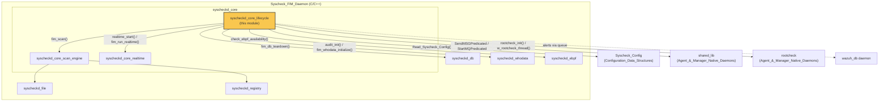
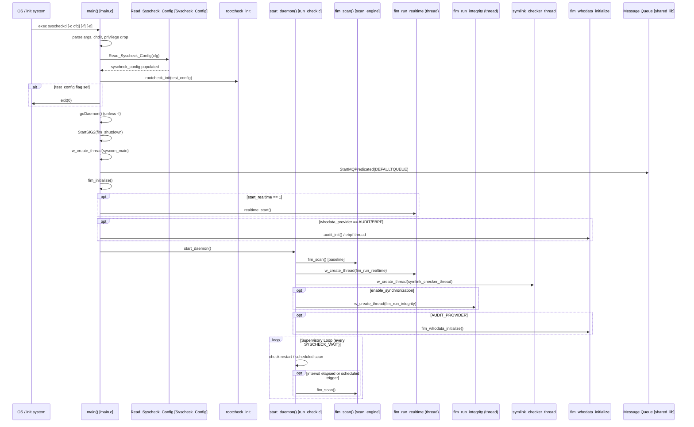
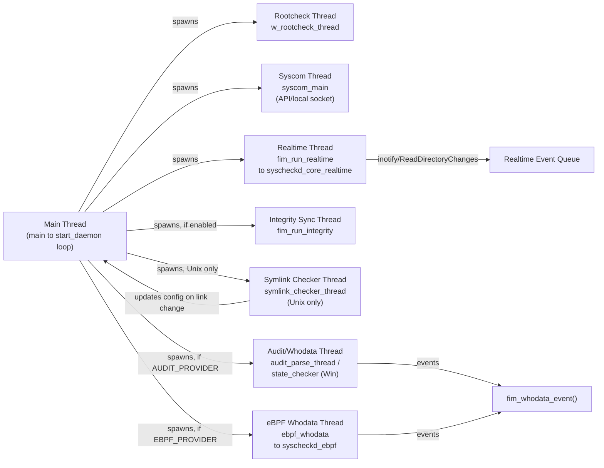
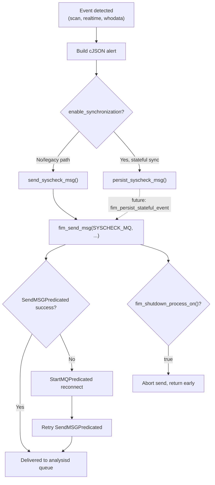
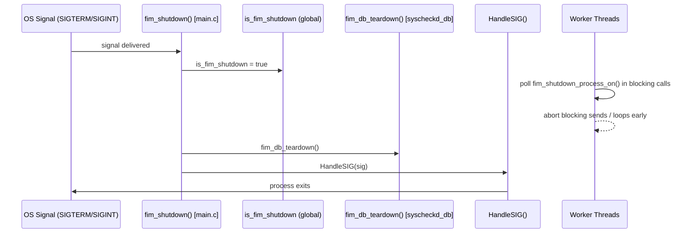
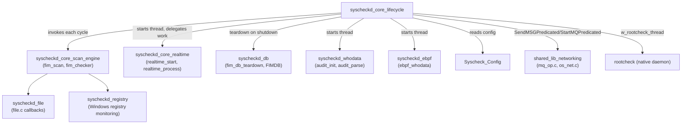

# Syscheckd Core Lifecycle

## Introduction

The **`syscheckd_core_lifecycle`** module is the entry point and process-control backbone of **Syscheck**, Wazuh's File Integrity Monitoring (FIM) daemon. It is responsible for:

- Parsing command-line arguments and bootstrapping the daemon (privilege drop, PID file creation, signal handling).
- Reading and validating the FIM configuration and delegating to the appropriate scan/monitoring engines.
- Orchestrating the daemon's main loop, which schedules periodic full scans and manages long-lived worker threads (real-time monitoring, whodata/audit, inventory synchronization, symlink checking, rootcheck).
- Providing the messaging primitives (`send_syscheck_msg`, `persist_syscheck_msg`, `send_log_msg`) used by every other Syscheck subsystem to emit alerts to the Wazuh analysis pipeline.
- Handling graceful shutdown, ensuring the FIM database and worker threads are stopped cleanly.

This module sits at the top of the `syscheckd_core` hierarchy and is a **sibling** of [syscheckd_core_scan_engine](syscheckd_core_scan_engine.md) (the actual file-scanning logic invoked from the main loop) and [syscheckd_core_realtime](syscheckd_core_realtime.md) (the inotify/ReadDirectoryChanges-based real-time engine started by this module). It also coordinates with [syscheckd_db](syscheckd_db.md) (FIM database teardown on shutdown), [syscheckd_whodata](syscheckd_whodata.md) and [syscheckd_ebpf](syscheckd_ebpf.md) (audit/whodata thread startup), and relies on lower-level primitives from [shared_lib_networking](shared_lib_networking.md) (message queue I/O) and [Syscheck_Config](Syscheck_Config.md) (configuration data structures).

---

## Module Position in the System



---

## Core Components

| File | Component | Responsibility |
|---|---|---|
| `src/syscheckd/src/main.c` | `main()` | Process entry point: CLI parsing, privilege separation, config loading, thread/daemon startup |
| `src/syscheckd/src/main.c` | `fim_shutdown()` | Signal handler that flags shutdown, tears down the FIM DB, and forwards to the generic `HandleSIG` |
| `src/syscheckd/src/run_check.c` | `start_daemon()` | The main supervisory loop: scheduled scan triggers, thread spawning |
| `src/syscheckd/src/run_check.c` | `fim_run_realtime()` | Thread entry point bridging to the platform-specific realtime engine |
| `src/syscheckd/src/run_check.c` | `fim_run_integrity()` | Thread entry point for periodic inventory synchronization |
| `src/syscheckd/src/run_check.c` | `fim_whodata_initialize()` | Platform-specific whodata/audit engine bootstrap (Windows SACL / Linux Audit) |
| `src/syscheckd/src/run_check.c` | `send_syscheck_msg()` / `persist_syscheck_msg()` / `send_log_msg()` | Messaging primitives used across all Syscheck subsystems |
| `src/syscheckd/src/run_check.c` | `check_max_fps()` | Throttles file-scan throughput according to `max_files_per_second` |
| `src/syscheckd/src/run_check.c` | `symlink_checker_thread()` / `fim_link_update()` / `fim_link_check_delete()` / `fim_link_silent_scan()` / `fim_link_reload_broken_link()` | Symbolic-link monitoring/reload logic (Unix only) |
| `src/syscheckd/include/syscheck.h` | `event_data_t` (`_event_data_s`) | Shared event context struct passed through the scan/event pipeline |
| `src/syscheckd/include/syscheck.h` | Function prototypes | Declares the public API surface shared by all `syscheckd_core*` and sibling modules |

---

## Architecture & Responsibilities

### 1. Process Bootstrap (`main.c::main`)

The daemon entry point performs a strict, ordered bootstrap sequence:

1. **Argument parsing** (`-V`, `-h`, `-d`, `-f`, `-c`, `-t`) — supports debug level increments, foreground execution, custom config path, and config-only validation (`-t`).
2. **Working directory & privilege separation** — `chdir()` to the Wazuh home directory, resolve the `ossec` group via `Privsep_GetGroup`/`Privsep_SetGroup`.
3. **dbsync logging bridge initialization** (`dbsync_initialize`) so the C++ DBSync library used by [syscheckd_db](syscheckd_db.md) can log through the shared Wazuh logger.
4. **Internal options & XML configuration loading** — `read_internal()` then `Read_Syscheck_Config()` (see [Syscheck_Config](Syscheck_Config.md)). Failures degrade gracefully by disabling Syscheck rather than crashing.
5. **Rootcheck initialization** — enables the legacy rootcheck subsystem if configured.
6. **Config-test short-circuit** (`-t` flag exits immediately after validation — used by `wazuh-control` before restarts).
7. **Daemonization** — `goDaemon()` unless `-f` (foreground) was passed.
8. **Signal handling installation** — `StartSIG2(ARGV0, fim_shutdown)` registers `fim_shutdown` as the handler for termination signals.
9. **API/control thread startup** — spawns `syscom_main` for local socket-based `syscheck_control` requests.
10. **PID file creation** and **message queue connection** (`StartMQPredicated`) to the analysis pipeline.
11. **Directory/monitoring summary logging** — enumerates configured directories, wildcards, ignore lists, no-diff patterns, and determines whether realtime monitoring must be started.
12. **Engine initialization** — `fim_initialize()` (baseline setup delegated to [syscheckd_core_scan_engine](syscheckd_core_scan_engine.md) / [syscheckd_db](syscheckd_db.md)), optional `realtime_start()`, optional eBPF/Audit whodata thread startup.
13. **Enter supervisory loop** — calls `start_daemon()` (see below), which never returns under normal operation.

### 2. Supervisory Loop (`run_check.c::start_daemon`)

`start_daemon()` is the long-running heart of the module:

- Sets process/thread scheduling priority (`nice()` on Unix, `SetThreadPriority` via `set_priority_windows_thread()` on Windows).
- Spawns the **rootcheck** worker thread (`w_rootcheck_thread`).
- Clears any leftover `report_changes` diff directories left from a previous run (files, registries, and legacy "local" directory).
- Performs the **initial baseline scan** by calling `fim_scan()` (delegated to [syscheckd_core_scan_engine](syscheckd_core_scan_engine.md)).
- Spawns the **real-time monitoring thread** (`fim_run_realtime`) and, on Unix, the **symlink checker thread**.
- Conditionally spawns the **inventory synchronization thread** (`fim_run_integrity`) if `enable_synchronization` is set.
- Conditionally starts the **whodata/audit** engine (`fim_whodata_initialize`) or the **eBPF** whodata thread depending on `whodata_provider`.
- Enters an infinite loop that:
  - Checks for a requested restart (`os_check_restart_syscheck`).
  - Evaluates scheduled scan-time/scan-day conditions.
  - Re-triggers `fim_scan()` when the configured interval (`syscheck.time`) elapses or a scheduled trigger fires.
  - Sleeps for `SYSCHECK_WAIT` between iterations.

### 3. Messaging Primitives

All alert/event emission in Syscheck funnels through this module:

- **`send_syscheck_msg`** — serializes a `cJSON` object and forwards it via `fim_send_msg` to the `SYSCHECK_MQ` queue, with built-in EPS throttling (`max_eps`).
- **`persist_syscheck_msg`** — reserved for stateful/synchronization event persistence (only active when `enable_synchronization` is set).
- **`send_log_msg`** — sends a raw log line to the `LOCALFILE_MQ` queue.
- **`fim_send_msg`** (static) — the common transport function; it auto-reconnects to the message queue (`StartMQPredicated`) if the initial send fails, respecting the `fim_shutdown_process_on()` predicate so blocked sends can be aborted during shutdown.

### 4. Graceful Shutdown

`fim_shutdown()` (registered as the SIGTERM/SIGINT handler via `StartSIG2`) sets the global `is_fim_shutdown` flag, tears down the FIM database (`fim_db_teardown`, see [syscheckd_db](syscheckd_db.md)), and defers to the generic `HandleSIG` for final process termination. The `is_fim_shutdown` flag is polled by `fim_shutdown_process_on()`, which is passed as a predicate into blocking operations (`SendMSGPredicated`, `StartMQPredicated`) throughout the codebase so they can be interrupted cleanly instead of hanging during shutdown.

### 5. Symbolic Link Reload (Unix)

A dedicated thread (`symlink_checker_thread`) periodically (`sym_checker_interval`) re-resolves `realpath()` for any configured directory with the `CHECK_FOLLOW` option:

- If the link target changed → `fim_link_update()` removes stale DB entries/audit rules for the old target and silently re-scans the new target.
- If the link is now broken (`realpath` fails) → `fim_link_check_delete()` purges DB entries, realtime watches, and audit rules.
- If a previously-broken link is restored → `fim_link_reload_broken_link()` re-establishes monitoring.

### 6. Windows Whodata Bootstrap

`fim_whodata_initialize()` (Windows variant) adds real-time watches for whodata-configured directories, starts the audit backend if needed (`whodata_audit_start`), and launches the `state_checker` thread (via `CreateThread`) that periodically verifies SACL configuration and directory availability. On failure, it falls back to real-time monitoring and calls `audit_restore()` to undo any SACL/policy changes.

---

## Startup Sequence Diagram



---

## Threading Model



All worker threads ultimately funnel detected changes through the event pipeline (`fim_checker`, `fim_whodata_event`, `fim_realtime_event` — implemented in [syscheckd_core_scan_engine](syscheckd_core_scan_engine.md) and [syscheckd_core_realtime](syscheckd_core_realtime.md)), which in turn calls back into this module's `send_syscheck_msg()` to emit the final alert.

---

## Message Emission Flow



---

## Shutdown Sequence



---

## Key Data Structures

### `event_data_t` (`_event_data_s`)

Defined in `syscheck.h`, this structure is the shared context object passed through the entire event-processing pipeline (scan engine, realtime engine, whodata engine):

```c
typedef struct _event_data_s {
    int report_event;        // Whether this event should generate an alert
    fim_event_mode mode;     // FIM_SCHEDULED, FIM_REALTIME, FIM_WHODATA
    fim_event_type type;     // FIM_ADD, FIM_DELETE, FIM_MODIFICATION
    struct stat statbuf;     // File metadata snapshot
    whodata_evt* w_evt;      // Optional who-data context (user/process info)
} event_data_t;
```

This struct decouples the *lifecycle* module's orchestration role from the *scan engine's* per-file processing logic — `fim_link_silent_scan()` in this module constructs a minimal `event_data_t` (scheduled mode, no alert) when silently re-scanning a relocated symlink target.

### Related External Structures

- **`syscheck_config`** — the global configuration singleton (`extern syscheck_config syscheck`) populated by `Read_Syscheck_Config`; see [Syscheck_Config](Syscheck_Config.md) for the full structure (`directory_t`, `whodata`, `rtfim`, etc.).
- **`directory_t`** — per-directory monitoring configuration, iterated extensively in `main.c` and `run_check.c` to determine realtime/whodata eligibility per path.

---

## Configuration Dependencies

This module reads (but does not define) the FIM configuration schema. Key fields consumed here include:

| Field | Used For |
|---|---|
| `syscheck.disabled` | Skip scan/monitoring initialization entirely |
| `syscheck.time` / `scan_time` / `scan_day` | Supervisory loop scheduling logic |
| `syscheck.max_files_per_second` | `check_max_fps()` throttling |
| `syscheck.max_eps` | `send_syscheck_msg()` throttling |
| `syscheck.enable_whodata` / `whodata_provider` | Selects Audit vs eBPF vs disabled whodata path |
| `syscheck.enable_synchronization` / `sync_interval` | Enables `fim_run_integrity` thread |
| `syscheck.sym_checker_interval` | Symlink checker thread cadence |
| `syscheck.process_priority` | OS thread/process scheduling priority |
| `syscheck.directories` / `syscheck.wildcards` | Iterated to decide realtime/whodata thread startup and print monitoring summary |

See [Syscheck_Config](Syscheck_Config.md) for the full definition of `syscheck_config` and `directory_t`.

---

## Relationship to Sibling & Dependent Modules



- **[syscheckd_core_scan_engine](syscheckd_core_scan_engine.md)**: Owns `fim_scan()`, `fim_checker()`, and the diff/DB-state management functions declared in `syscheck.h` but implemented in `fim_scan.c`. This module's supervisory loop is the sole driver of scheduled scans.
- **[syscheckd_core_realtime](syscheckd_core_realtime.md)**: Owns the platform-specific inotify/ReadDirectoryChanges implementation. This module only provides the thread entry point (`fim_run_realtime`) and startup trigger logic.
- **[syscheckd_db](syscheckd_db.md)**: Receives the `fim_db_teardown()` call during shutdown; also initialized indirectly via `fim_initialize()`.
- **[syscheckd_whodata](syscheckd_whodata.md)** / **[syscheckd_ebpf](syscheckd_ebpf.md)**: Whodata/audit backends started conditionally by this module based on `whodata_provider`.
- **[Syscheck_Config](Syscheck_Config.md)**: Supplies the `syscheck_config` struct and `Read_Syscheck_Config()` function consumed at startup.
- **[shared_lib_networking](shared_lib_networking.md)** (from `Agent_&_Manager_Native_Daemons`): Provides `StartMQPredicated`/`SendMSGPredicated` used for all outbound alert traffic.
- **rootcheck** (native daemon, sibling top-level module): The lifecycle module launches and connects to rootcheck as an embedded worker.

---

## Design Notes & Operational Considerations

- **Predicate-based cancellation**: Rather than using thread cancellation APIs, blocking operations accept a predicate function (`fim_shutdown_process_on`) that is polled to short-circuit sends/waits during shutdown — a pattern that avoids corrupting shared state mid-write.
- **Graceful degradation on config errors**: A malformed or missing configuration does not crash the daemon; it disables Syscheck (`syscheck.disabled = 1`) and logs a warning, allowing the rest of the agent to continue operating.
- **Platform divergence**: Significant `#ifdef WIN32` / `#ifdef INOTIFY_ENABLED` / `#elif ENABLE_AUDIT` branching exists throughout both `main.c` and `run_check.c` to accommodate Windows (SACL/whodata via Windows Event Log), Linux (inotify + Audit/eBPF), and other Unix variants (polling-only, with a warning if realtime is requested).
- **EPS/FPS throttling**: Two independent throttles exist — `check_max_fps()` (files scanned per second, gates the scan engine) and the `max_eps` counter inside `send_syscheck_msg()` (events emitted per second, gates the messaging layer) — protecting both local I/O and the downstream analysis pipeline from bursts.
