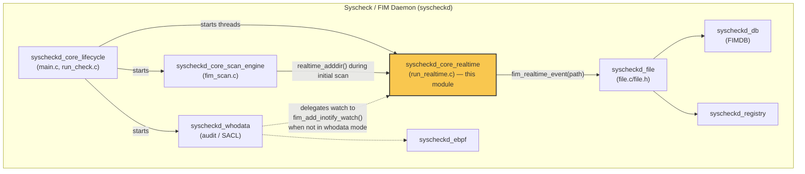
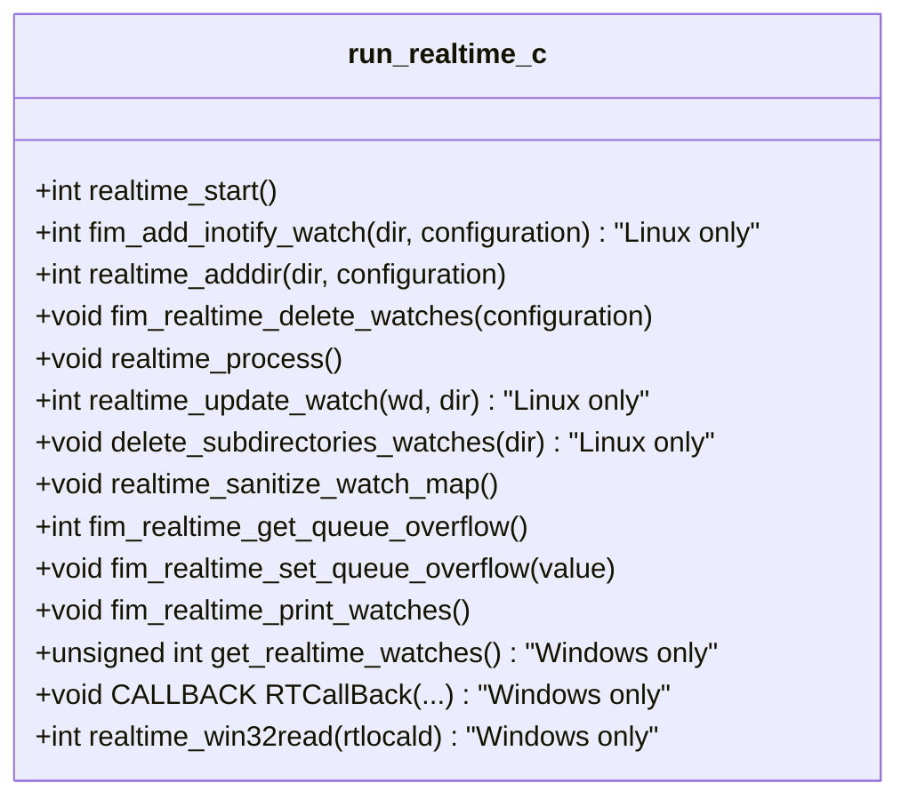
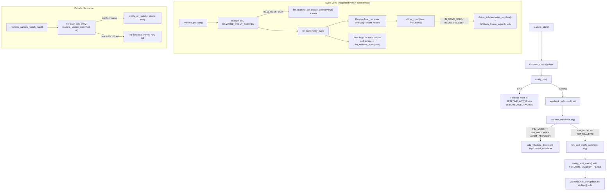
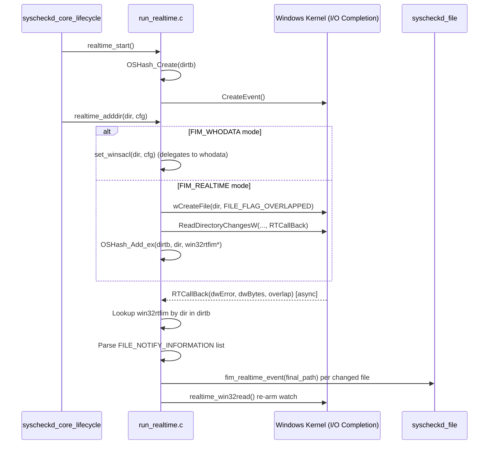
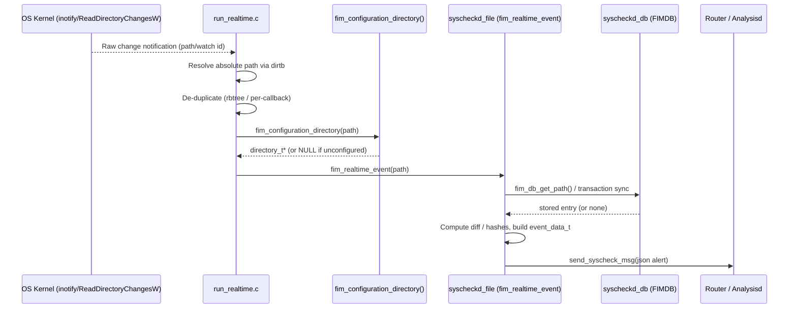
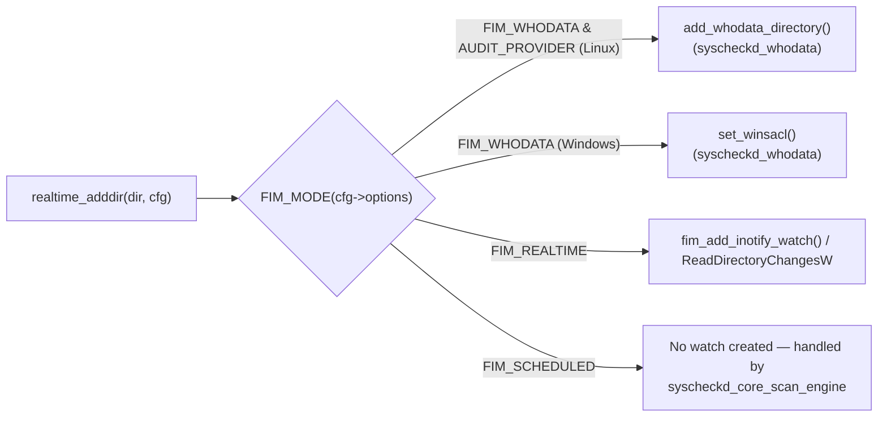
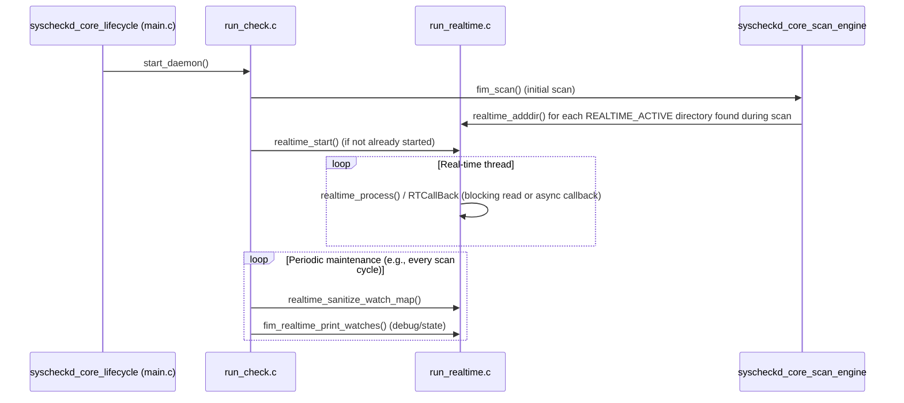

# Syscheckd Core – Real-Time Monitoring (`syscheckd_core_realtime`)

## Introduction

The **`syscheckd_core_realtime`** module implements the *real-time* (event-driven) file-monitoring engine of the Wazuh **Syscheck / File Integrity Monitoring (FIM)** daemon. Instead of relying exclusively on periodic (scheduled) scans, this module lets Syscheck react immediately to filesystem changes by subscribing to OS-level change-notification facilities:

- **Linux**: the `inotify` kernel API (`inotify_init`, `inotify_add_watch`, `inotify_rm_watch`).
- **Windows**: the `ReadDirectoryChangesW` asynchronous I/O API with an I/O completion callback (`RTCallBack`).
- **Other platforms** (macOS, BSD, Solaris, HP-UX, AIX): real-time monitoring is not available; the module compiles to no-op stub functions so that the rest of Syscheck can call the same API uniformly.

This module is one of three sibling engines inside `syscheckd_core` (the others being the daemon **lifecycle** engine and the **scheduled-scan** engine — see [syscheckd_core_lifecycle](syscheckd_core_lifecycle.md) and [syscheckd_core_scan_engine](syscheckd_core_scan_engine.md)). It cooperates closely with the **whodata** subsystem (audit-based monitoring on Linux, SACL-based monitoring on Windows — see [syscheckd_whodata](syscheckd_whodata.md)) and dispatches all detected changes into the common FIM event pipeline implemented in [syscheckd_file](syscheckd_file.md) and the FIM database ([syscheckd_db](syscheckd_db.md)).

---

## Purpose & Responsibilities

| Responsibility | Description |
|---|---|
| **Watch management** | Create, update, and delete OS-level watches (`inotify` watch descriptors on Linux, directory handles on Windows) for every directory configured with `<realtime>yes</realtime>` (or, on Windows, `whodata` when audit is unavailable). |
| **Watch-to-path mapping** | Maintain the `syscheck.realtime->dirtb` hash table that maps watch descriptors (Linux) or directory paths (Windows) to the monitored directory string, allowing O(1) lookup when an event arrives. |
| **Event draining & de-duplication** | Read the raw event buffer from the kernel, resolve the affected absolute path, and de-duplicate multiple events referring to the same path within a single read cycle using a red-black tree (`rbtree`). |
| **Change dispatch** | For every unique changed path, invoke `fim_realtime_event()` (implemented in the `syscheckd_file` module) which decides whether the change is an addition, modification or deletion and triggers the corresponding FIM database update and alert generation. |
| **Watch table sanitation** | Periodically re-validate the watch table (`realtime_sanitize_watch_map`) to detect and repair stale/renamed watches, an operation especially important on Linux where inotify silently keeps watching an inode even after the directory has been moved or removed. |
| **Overflow handling** | Detect `IN_Q_OVERFLOW` conditions (Linux) when the kernel event queue is exhausted, mark the state so that the next scheduled scan can recover any lost events, and emit a warning log/alert. |
| **Resource bookkeeping** | Track and expose the number of active real-time watches (`fim_realtime_print_watches`, `get_realtime_watches` on Windows) for diagnostics via `syscheck_op`/state reporting. |

---

## Architectural Position

The module lives entirely inside `src/syscheckd/src/run_realtime.c` and shares its public interface (`realtime_start`, `realtime_adddir`, `realtime_process`, etc.) via `src/syscheckd/include/syscheck.h`, the same umbrella header used by all Syscheck sub-modules. This tight coupling to the shared header is why `syscheck.h` core structures (`event_data_t`, `stat`, `timespec`) are also considered part of this module's public contract.

---

## Core Data Structures

| Structure | Defined in | Purpose |
|---|---|---|
| `rtfim` (accessed as `syscheck.realtime`) | `syscheck-config.h` (Configuration_Data_Structures module) | Holds the real-time engine state: the inotify file descriptor (`fd`) or Windows completion `evt`, and the `dirtb` hash table of active watches. |
| `syscheck.realtime->dirtb` (`OSHash`) | `hash_op.h` | Maps `wd` (Linux watch descriptor, stringified) → monitored directory path, or (Windows) directory path → `win32rtfim*`. |
| `win32rtfim` | `syscheck-config.h` | Windows-specific per-watch context: file handle, `OVERLAPPED` structure, notification buffer, and directory path. |
| `event_data_t` | `syscheck.h` (documented above) | Carries the event context (`report_event`, `mode`, `type`, `stat`, `whodata_evt*`) passed down to the generic FIM event pipeline once a real-time change is confirmed. |
| `directory_t` | `syscheck-config.h` | Per-directory FIM configuration (options bitmask, recursion level, whodata/realtime mode) consulted by `fim_configuration_directory()` to validate that a detected path still belongs to a monitored configuration. |
| `rb_tree` | `shared/rbtree_op.h` | Used inside `realtime_process()` to de-duplicate paths that received multiple raw kernel events in the same read cycle. |

---

## Public API Surface

Every function is compiled conditionally based on the target platform (`INOTIFY_ENABLED`, `WIN32`, or neither), but the **signatures are identical** across builds so that callers in `syscheckd_core_lifecycle` and `syscheckd_core_scan_engine` can be platform-agnostic.

---

## Platform-Specific Implementations

### 1. Linux (`inotify`)

Key implementation notes:

- **Flags**: `REALTIME_MONITOR_FLAGS = IN_MODIFY|IN_ATTRIB|IN_MOVED_FROM|IN_MOVED_TO|IN_CREATE|IN_DELETE|IN_DELETE_SELF|IN_MOVE_SELF`.
- **Buffer size**: `REALTIME_EVENT_BUFFER = 2048 * (sizeof(struct inotify_event) + 16)`, sized to absorb bursts of file names.
- **De-duplication**: events are collected into an `rb_tree` keyed by resolved absolute path before calling `fim_realtime_event()`, preventing the same file from being processed multiple times per read cycle (e.g., `IN_MODIFY` followed by `IN_ATTRIB`).
- **Directory renames** (`IN_MOVE_SELF`) trigger `delete_subdirectories_watches()` to recursively drop stale watches for any subdirectory whose path started with the renamed directory prefix.
- **Watch exhaustion** (`ENOSPC`, `errno == 28`) is logged via `FIM_ERROR_INOTIFY_ADD_MAX_REACHED`; administrators are expected to raise `fs.inotify.max_user_watches`.

### 2. Windows (`ReadDirectoryChangesW`)

Key implementation notes:

- Each monitored directory owns a `win32rtfim` context containing an `OVERLAPPED` structure and a notification buffer; `RTCallBack` is invoked by the OS whenever changes occur and re-arms the watch by calling `realtime_win32read()` again (self-perpetuating asynchronous loop).
- `watch_status` (`FIM_RT_HANDLE_OPEN` / `FIM_RT_HANDLE_CLOSED`) prevents use-after-close races when a handle is closed by `realtime_sanitize_watch_map` counterparts while a callback is in flight.
- A hard limit `syscheck.max_fd_win_rt` bounds the number of concurrent watches to protect system resources.
- If Whodata (`FIM_WHODATA`) is configured and available, the module defers entirely to the whodata subsystem (`set_winsacl`), which is documented in [syscheckd_whodata](syscheckd_whodata.md).

### 3. Unsupported platforms

For platforms without inotify or `ReadDirectoryChangesW` (macOS, BSD, Solaris…), the same functions are compiled as no-ops (`realtime_start` logs `FIM_ERROR_REALTIME_INITIALIZE`, `realtime_adddir`/`realtime_process` return immediately). This keeps `syscheckd_core_scan_engine` and `syscheckd_core_lifecycle` free of `#ifdef` branching.

---

## Data Flow: From Kernel Event to FIM Alert

The realtime module never talks to the database or the alerting pipeline directly — it is a pure **event source**. All interpretation (is this a new file? a modification? a deletion? does it match ignore/restrict rules?) is delegated to `fim_realtime_event()` in the `syscheckd_file` module, keeping the platform-specific polling code decoupled from FIM business logic. The referenced helper `fim_db_remove_validated_path()` / `callback_ctx` (in `syscheckd_file`) illustrates how a validated path — one whose configuration still matches — triggers a delete event through `fim_generate_delete_event()`.

---

## Interaction with the Whodata Subsystem

On Linux, when a directory is configured with `whodata="yes"` and the Audit provider is active, `realtime_adddir()` **does not** create an inotify watch; instead it calls `add_whodata_directory()` (part of [syscheckd_whodata](syscheckd_whodata.md)). Real-time (`inotify`) is used as a **fallback** and for directories not configured for whodata. On Windows, the equivalent decision is made based on `FIM_MODE(configuration->options)`, delegating to `set_winsacl()` for whodata-monitored directories.

---

## Lifecycle & Scheduling Integration

`realtime_start()` is invoked once during daemon initialization (see `fim_whodata_initialize`/`start_daemon` in `syscheckd_core_lifecycle`). Individual watches are then added incrementally as `syscheckd_core_scan_engine` walks the configured directory tree, and are removed/updated whenever the configuration changes (e.g., directory deleted, renamed, or its FIM mode switched) or when `realtime_sanitize_watch_map()` detects staleness.

---

## Error Handling & Resilience

| Condition | Handling |
|---|---|
| `inotify_init()` fails | All directories configured with `REALTIME_ACTIVE` are demoted to `SCHEDULED_ACTIVE`, guaranteeing they are still covered by the periodic scan engine. |
| `inotify_add_watch()` fails with `ENOSPC`/errno 28 | Logs `FIM_ERROR_INOTIFY_ADD_MAX_REACHED`; the directory remains unmonitored in real time until watches free up or the limit is raised. |
| `IN_Q_OVERFLOW` event received | Sets a global overflow flag (`fim_realtime_set_queue_overflow`), emits a warning alert via `send_log_msg()`, relies on the next scheduled scan to reconcile any missed changes. |
| Directory renamed/moved (`IN_MOVE_SELF`) | Cascades deletion of all subdirectory watches via `delete_subdirectories_watches()` to avoid watching orphaned inodes. |
| Watch descriptor invalidated externally | `realtime_update_watch()` detects mismatches during `realtime_sanitize_watch_map()` and transparently re-adds/removes the watch. |
| Windows handle closed mid-callback | `watch_status == FIM_RT_HANDLE_CLOSED` short-circuits `RTCallBack` and frees the `win32rtfim` structure safely. |

---

## Related Modules

- [syscheckd_core_lifecycle](syscheckd_core_lifecycle.md) — daemon startup/shutdown that initializes and tears down the real-time engine.
- [syscheckd_core_scan_engine](syscheckd_core_scan_engine.md) — scheduled/full scans that populate initial real-time watches and act as a fallback when real-time is unavailable or overflows.
- [syscheckd_whodata](syscheckd_whodata.md) — Audit (Linux) / SACL (Windows) based monitoring, an alternative and complementary event source to plain real-time watches.
- [syscheckd_file](syscheckd_file.md) — receives resolved paths from this module via `fim_realtime_event()` and performs the actual FIM comparison/alerting logic.
- [syscheckd_db](syscheckd_db.md) — FIM database consulted/updated as a consequence of real-time events.
- [syscheckd_ebpf](syscheckd_ebpf.md) — alternative modern kernel-level monitoring approach (eBPF) used as part of the broader whodata strategy on Linux.
- [Configuration_Data_Structures_(C_Headers)](Configuration_Data_Structures_(C_Headers).md) — defines `syscheck_config`, `directory_t`, `rtfim`, and related structures consumed throughout this module.
