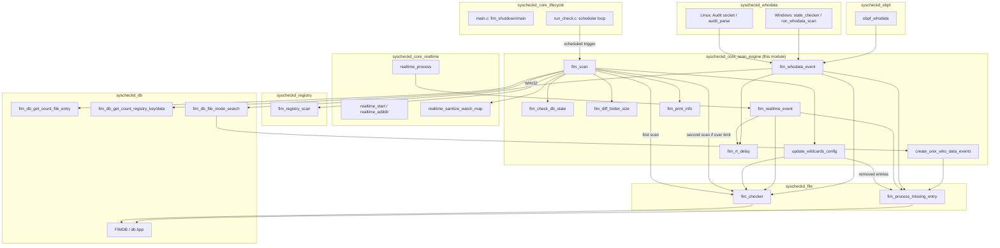
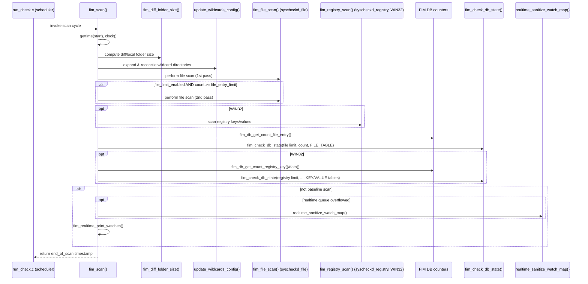
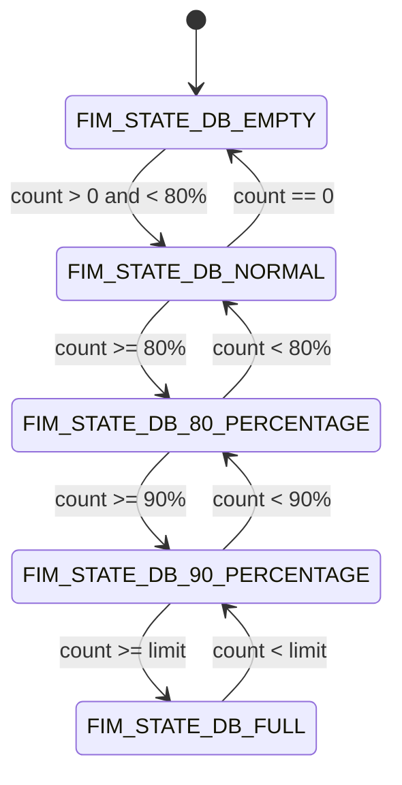
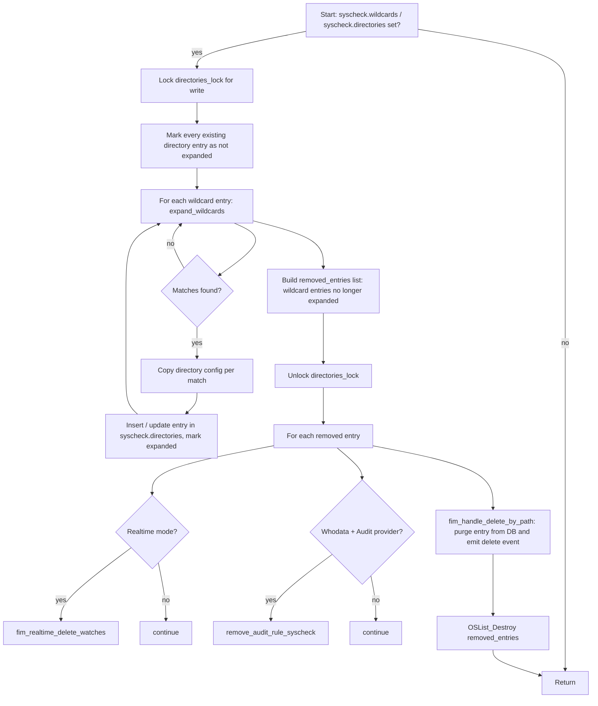
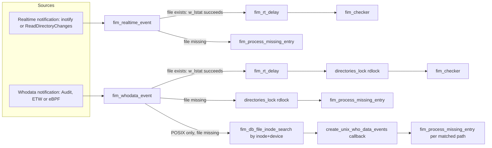
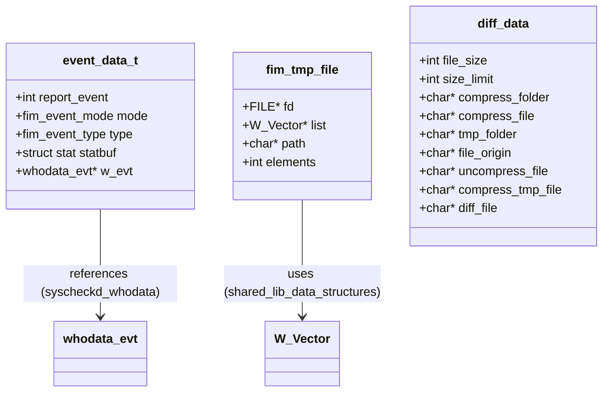

# Syscheckd Core Scan Engine

## Introduction

The **Syscheckd Core Scan Engine** is the heart of Wazuh's File Integrity Monitoring (FIM) daemon (`syscheckd`). It is responsible for orchestrating full filesystem/registry scans, tracking the health of the FIM database, sizing and pruning the disk-based diff storage, expanding wildcard directory configurations at runtime, and dispatching individual file/registry events (add, modify, delete) discovered either during a scheduled scan or through the real-time/whodata subsystems.

This module implements the top-level `fim_scan()` scan loop and the supporting utility routines that the rest of the FIM daemon (lifecycle management, real-time watches, whodata/audit providers, and the FIM database) rely on to perform a consistent, resource-aware integrity scan.

It is a child module of `syscheckd_core` (part of the broader [Syscheck___FIM_Daemon_(C_C++)](Syscheck___FIM_Daemon_(C_C++).md) subsystem) and works closely with its sibling modules `syscheckd_core_lifecycle` and `syscheckd_core_realtime`.

---

## 1. Purpose and Core Functionality

The scan engine provides the following responsibilities:

| Responsibility | Key Function(s) |
|---|---|
| Drive a full scan cycle (files, and on Windows, registries) | `fim_scan()` |
| Track FIM database occupancy and raise threshold alerts (80%/90%/full) | `fim_check_db_state()` |
| Calculate and cache the on-disk size of the FIM diff/local storage | `fim_diff_folder_size()` |
| Re-evaluate wildcard directory configuration entries between scans | `update_wildcards_config()` |
| Convert a real-time filesystem notification into a FIM event | `fim_realtime_event()` |
| Convert a whodata (Audit/eBPF/ETW) notification into a FIM event | `fim_whodata_event()`, `create_unix_who_data_events()` |
| Throttle real-time event processing | `fim_rt_delay()` |
| Emit scan performance/debug telemetry | `fim_print_info()` |

The engine defines two core data structures (declared in `syscheck.h`) that are used pervasively across the FIM daemon:

* **`event_data_t`** (`_event_data_s`) — carries the context of a single file event (mode, event type, `stat` buffer, whodata event pointer) as it flows through `fim_checker()` and the DB layer.
* **`fim_tmp_file`** — an abstraction over a temporary on-disk (`FILE*`) or in-memory (`W_Vector*`) list of paths, used when the FIM DB needs to spool large result sets (e.g., during transaction callbacks or a full/second scan).
* **`diff_data`** — carries the paths and size limits needed by the file/registry diff-generation subsystem (`fim_file_diff`, `fim_registry_value_diff`) when `report_changes` is enabled.

---

## 2. Architecture

The scan engine sits between the daemon lifecycle (startup/shutdown, scheduling) and the specialized subsystems that know how to read files, registries, and OS-level change-notification channels.

---

## 3. Scan Lifecycle: `fim_scan()`

`fim_scan()` is invoked periodically by the scheduler in `syscheckd_core_lifecycle` (`run_check.c`). It performs a deterministic sequence of steps every cycle:

### Key behaviors

1. **Baseline detection**: the static `_base_line` flag distinguishes the very first scan (used to seed the DB) from subsequent scans, which additionally perform real-time watch maintenance.
2. **Two-pass file scanning**: if `file_limit_enabled` is set and the first pass leaves the DB at/above `file_entry_limit`, a second pass is triggered to catch any files that were skipped due to the limit being hit mid-scan.
3. **Windows registry scanning**: `fim_registry_scan()` (from `syscheckd_registry`) is only invoked on `WIN32` builds, immediately after the file scan(s).
4. **Telemetry reset**: `audit_queue_full_reported` and (on Linux with eBPF) `ebpf_kernel_queue_full_reported` are reset at the end of every cycle so that queue-full warnings can be re-emitted in the next cycle if the condition recurs.
5. **Debug reporting**: `fim_print_info()` logs scan duration, CPU time, and entry counts when debug logging is enabled.

---

## 4. FIM Database State Machine: `fim_check_db_state()`

This function implements a hysteresis state machine that prevents alert flooding while still notifying operators as the FIM database (file entries, or on Windows, registry keys/values) approaches its configured limits.

Each state transition that is *not* a no-op emits a `cJSON` alert (`wazuh: FIM DB: {...}`) via `send_log_msg()`, containing:
* `fim_db_table` — `FIMDB_FILE_TABLE_NAME` or, on Windows, the registry key/value table name.
* `file_limit`/`file_count` (files) or `registry_limit`/`values_count`/`keys_count` (registries).
* `alert_type` — one of `full`, `90_percentage`, `80_percentage`, `normal`.

This function is called once per file-entry table and, on Windows, once each for the registry key and registry value tables, using the counters exposed by `syscheckd_db` (`fim_db_get_count_file_entry`, `fim_db_get_count_registry_key`, `fim_db_get_count_registry_data`).

---

## 5. Wildcard Directory Reconciliation: `update_wildcards_config()`

Wazuh allows configuring monitored directories using wildcard glob patterns (e.g., `/home/*/Downloads`). Because the set of matching directories can change between scans, `update_wildcards_config()` re-evaluates every wildcard entry at the start of each `fim_scan()` cycle.

This routine coordinates with:
* `syscheckd_core_realtime` — to tear down inotify/ReadDirectoryChanges watches for directories that no longer match a wildcard.
* `syscheckd_whodata` — to remove Audit rules for directories being dropped.
* `syscheckd_db` — via `fim_handle_delete_by_path`, to purge stale entries and emit deletion events.

---

## 6. Event Ingestion: Real-time and Whodata Paths

Although the *detection* of file-system changes is implemented in the sibling modules `syscheckd_core_realtime` and `syscheckd_whodata` (and, on modern Linux kernels, `syscheckd_ebpf`), the scan engine provides the **conversion functions** that turn a raw notification into a fully-formed FIM event and route it into `syscheckd_file`'s `fim_checker()` pipeline.

### `fim_realtime_event(char *file)`
* Performs `w_lstat()` on the reported path.
* **File exists** → builds an `event_data_t` with `mode = FIM_REALTIME`, applies `fim_rt_delay()` (to avoid races with editors that delete-then-recreate files, e.g. vim), and calls `fim_checker()`.
* **File missing** → treats it as a deletion or a rename/move of a directory, delegating to `fim_process_missing_entry()` with `FIM_REALTIME` mode.

### `fim_whodata_event(whodata_evt *w_evt)`
* Same existence check as above, but tagged with `mode = FIM_WHODATA` and carries the `whodata_evt` (who performed the change, process info, etc.).
* Access to `syscheck.directories` is protected with `directories_lock` (read lock) since whodata callbacks can run concurrently with configuration reloads.
* On **POSIX systems**, if the path no longer exists, the engine additionally performs an **inode+device reverse lookup** (`fim_db_file_inode_search`) to discover all paths that shared that inode (hardlinks) and generates a missing-entry event for each of them via the `create_unix_who_data_events()` callback — this correctly handles renames/hardlink removals that whodata reports by inode rather than by path.

### `create_unix_who_data_events(void *data, void *ctx)`
A small adapter/callback used only on POSIX systems: it receives a `path` (from the inode search) and a `whodata_evt*` context and forwards them to `fim_process_missing_entry()`.

### `fim_rt_delay()`
A short, configurable sleep (`syscheck.rt_delay` milliseconds) executed before checking a realtime/whodata-notified path, implemented with `Sleep()` on Windows or a `select()`-based timeout on POSIX. This mitigates race conditions where a file is momentarily absent during a save operation.

---

## 7. Diff Storage Sizing: `fim_diff_folder_size()`

When `report_changes` (content diffing) is enabled for any monitored directory, Wazuh stores per-file diff snapshots under `queue/diff/local`. This function computes the current on-disk size of that folder (in KB) and caches it in `syscheck.diff_folder_size`, which is later consulted by the diff-quota logic (`fim_file_diff`, part of `syscheckd_file`) to enforce `disk_quota` limits. It is invoked once at the very start of every `fim_scan()` cycle, and `syscheck.disk_quota_full_msg` is reset to `true` so the quota-exceeded warning can be logged again if the condition persists.

---

## 8. Data Structures Reference (from `syscheck.h`)

* **`event_data_t`** is the primary payload passed to `fim_checker()` and onward into the FIM DB transaction callbacks. `mode` distinguishes `FIM_SCHEDULED`, `FIM_REALTIME`, and `FIM_WHODATA` sources; `type` distinguishes `FIM_ADD`, `FIM_DELETE`, `FIM_MODIFICATION`.
* **`fim_tmp_file`** is a dual-mode container (file-backed for large result sets, vector-backed for small ones) used when spooling paths that must be revisited after a DB transaction (e.g., computing which files were removed since the last scan).
* **`diff_data`** models the working set of paths/limits required to build a compressed diff artifact for a single file or registry value.

---

## 9. Interaction with Other Modules

| Module | Relationship |
|---|---|
| `syscheckd_core_lifecycle` | Owns the scheduler (`run_check.c`) that periodically invokes `fim_scan()`; also owns daemon startup/shutdown (`main.c`) and defines `fim_shutdown()` / `fim_initialize()`. |
| `syscheckd_core_realtime` | Supplies raw filesystem change notifications consumed by `fim_realtime_event()`; the scan engine calls back into it (`realtime_sanitize_watch_map`, `fim_realtime_delete_watches`) to maintain watch consistency. |
| `syscheckd_whodata` | Supplies Audit (Linux)/ETW (Windows) notifications consumed by `fim_whodata_event()`; scan engine calls `remove_audit_rule_syscheck()` when wildcard directories are dropped. |
| `syscheckd_ebpf` | Alternative Linux whodata provider; the engine resets `ebpf_kernel_queue_full_reported` each scan cycle. |
| `syscheckd_file` | Implements `fim_checker()` (per-path evaluation), `fim_process_missing_entry()` (deletion handling), and the actual first/second-pass file scan routines invoked by `fim_scan()`. |
| `syscheckd_registry` | Implements `fim_registry_scan()`, invoked from `fim_scan()` on Windows builds only. |
| `syscheckd_db` | Provides the FIM SQLite-backed database (`FIMDB`) and the counters (`fim_db_get_count_file_entry`, `fim_db_get_count_registry_key/data`, `fim_db_file_inode_search`) that the scan engine and state-machine logic depend on. |
| [Configuration_Data_Structures_(C_Headers)](Configuration_Data_Structures_(C_Headers).md) — `Syscheck_Config` | Defines `syscheck_config`, `directory_t`, and related structures (`_config`, `_directory_s`, etc.) that back the global `syscheck` configuration object read throughout this module. |
| [wazuh_db](wazuh_db.md) | The FIM database is ultimately persisted/synced through the Wazuh DB daemon infrastructure for querying via the framework/API layer. |
| [API_&_Management_Framework_(Python)](API_&_Management_Framework_(Python).md) — `syscheck_module` | Exposes scan status/results (`framework/wazuh/syscheck.py`, `WazuhDBQuerySyscheck`) to the REST API, reading data ultimately produced by this scan engine. |
| [Advanced_Security_Modules_(C++_Inventory_&_Vulnerability)](Advanced_Security_Modules_(C++_Inventory_&_Vulnerability).md) — `inventory_harvester_module` | Consumes FIM file/registry events (via the router/indexer pipeline) to populate the FIM inventory index (`fimFileHarvester`, `fimRegistryHarvester`). |

---

## 10. Design Notes and Considerations

* **Concurrency safety**: All mutation of `syscheck.directories` (the in-memory directory configuration list) is guarded by `syscheck.directories_lock` (a read-write lock). `update_wildcards_config()` takes the write lock only while mutating the list, then releases it before performing potentially slow operations (watch removal, audit rule removal, DB deletion) on the snapshot of removed entries — minimizing lock contention with concurrent real-time/whodata event processing, which takes read locks.
* **Two-phase file scanning** trades a small amount of extra CPU/I-O for correctness: it ensures that once a scan starts, expansions of the FIM database that happen mid-scan due to newly discovered files don't cause any configured, size-limited directory to be silently skipped.
* **Platform conditionals**: heavy use of `#ifdef WIN32` / `#ifdef __linux__` / `#ifdef ENABLE_AUDIT` reflects that the scan engine must adapt its registry-scanning and whodata-provider integration per platform, while keeping the top-level `fim_scan()` control flow uniform.
* **Testability**: the file is compiled with `static` stripped and `assert()` replaced by `mock_assert()` under `WAZUH_UNIT_TESTING`, enabling white-box unit testing of internal (otherwise `static`) functions — see the corresponding test suite in [Unit_Tests_-_Syscheck_FIM](Unit_Tests_-_Syscheck_FIM.md).

---

## 11. Related Test Coverage

The behavior described in this document is covered by the `test_fim_scan` unit test suite (module `test_fim_scan` under [Unit_Tests_-_Syscheck_FIM](Unit_Tests_-_Syscheck_FIM.md)), including dedicated sub-groups for:
* `fim_check_db_state_tests` — every state-machine transition described in Section 4.
* `fim_checker_tests` / `fim_directory_tests` — first/second pass scanning and directory traversal.
* `fim_realtime_whodata_tests` — `fim_realtime_event`, `fim_whodata_event`, and `create_unix_who_data_events` (via `test_create_unix_who_data_events`).
* `wildcards_config_tests` — `update_wildcards_config` add/remove scenarios.
* `fim_diff_and_init_tests` — `fim_diff_folder_size` and initialization helpers.
