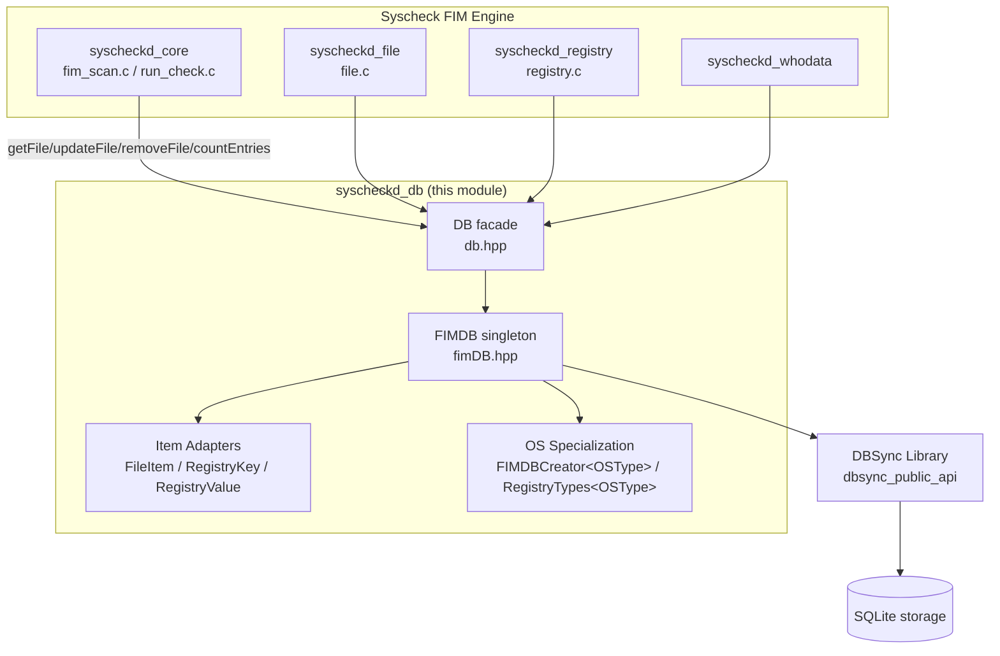
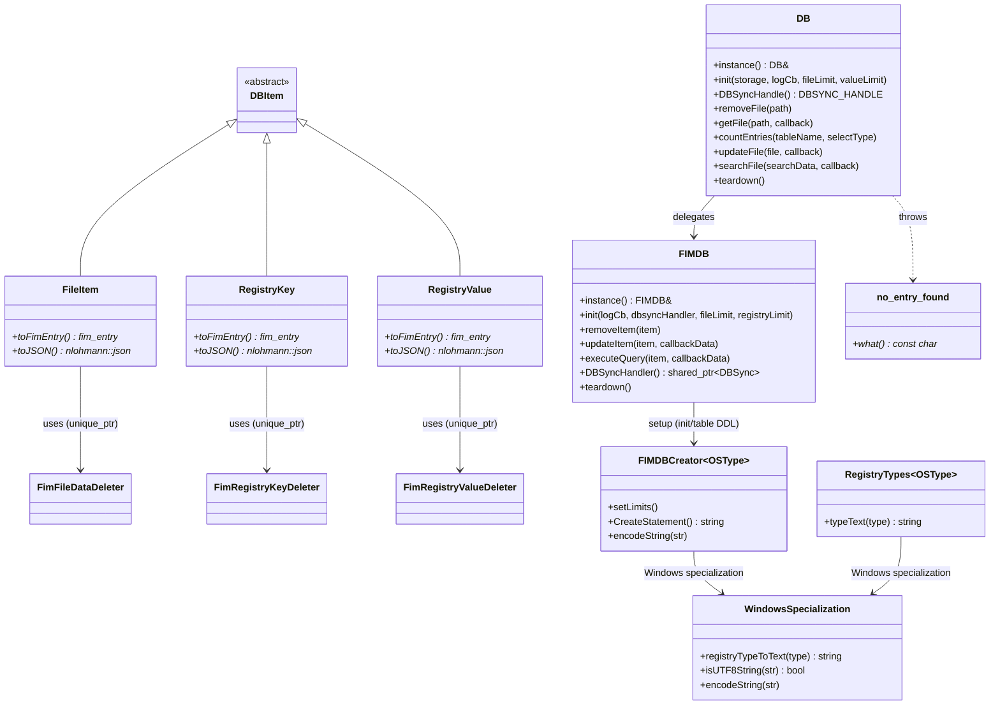
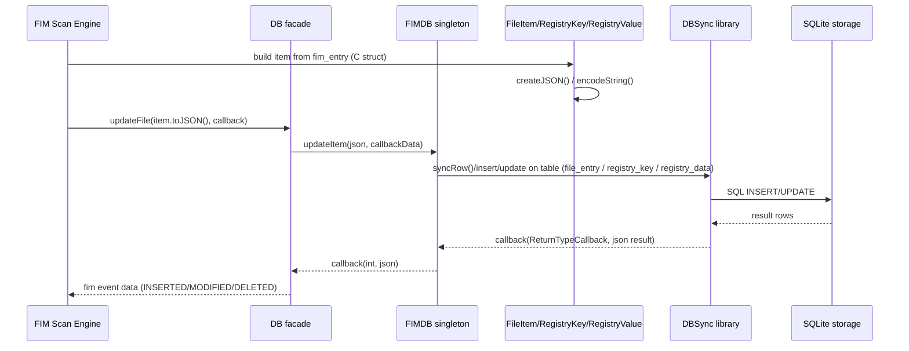

# syscheckd_db — Syscheck/FIM Database Layer

## 1. Purpose

`syscheckd_db` is the persistence layer of the **Syscheck (FIM — File Integrity
Monitoring) daemon**. It is a small but critical C++ module that sits between
the FIM scanning/whodata engine (`syscheckd_core`, `syscheckd_file`,
`syscheckd_registry`, `syscheckd_whodata`, `syscheckd_ebpf`) and the low-level
**DBSync** synchronization library (see
[dbsync_public_api](dbsync_public_api.md)).

Its responsibilities are:

* Maintain a local SQLite-backed inventory (through DBSync) of monitored
  **files** and, on Windows, **registry keys/values**.
* Convert between the C structures used throughout the FIM engine
  (`fim_entry`, `fim_file_data`, `fim_registry_key`, `fim_registry_value_data`
  — declared in [Syscheck_Config](Syscheck_Config.md)) and the JSON
  representation required by DBSync.
* Provide a simple, thread-safe, singleton-based facade (`DB` / `FIMDB`) that
  the rest of the FIM engine uses to insert, update, remove, count and query
  inventory entries, without needing to know anything about DBSync, SQLite,
  or platform differences.
* Abstract away Windows-vs-non-Windows differences (extra registry tables,
  UTF-8/ANSI string encoding, row-limit configuration) behind a single
  compile-time specialization mechanism.

This module has no externally visible sub-daemons or network endpoints — it
is a library consumed in-process by the syscheckd binary
(see [syscheckd_core](syscheckd_core.md)).

## 2. Architecture Overview

### 2.1 Component Map

### 2.2 Class Relationships

### 2.3 Typical Update Flow

## 3. Sub-modules

The module is organized into three tightly related but conceptually distinct
areas. Each is documented in its own file:

| Sub-module | File | Description |
|---|---|---|
| **Core Facade & Engine** | [syscheckd_db_core.md](syscheckd_db_core.md) | The public `DB` facade and the `FIMDB` singleton that owns the DBSync handle, table DDL constants, and generic CRUD/query operations. |
| **Item Adapters** | [syscheckd_db_items.md](syscheckd_db_items.md) | `FileItem`, `RegistryKey`, `RegistryValue` classes that convert between C `fim_entry` structures and the JSON documents stored/queried via DBSync, plus their RAII deleters. |
| **OS Specialization** | [syscheckd_db_os_specialization.md](syscheckd_db_os_specialization.md) | Compile-time template specializations (`FIMDBCreator<OSType>`, `RegistryTypes<OSType>`) that adapt table creation, row limits, and string encoding to Windows vs. other operating systems. |

## 4. How This Module Fits in the System

* **Upstream consumers**: The FIM scanning engine
  ([syscheckd_core](syscheckd_core.md)), the on-demand file scanner
  ([syscheckd_file](syscheckd_file.md)), the Windows registry scanner
  ([syscheckd_registry](syscheckd_registry.md)), and the Whodata/audit
  subsystem ([syscheckd_whodata](syscheckd_whodata.md)) all call into the `DB`
  facade to persist and query FIM inventory state, generate change events, and
  support the FIM database synchronization protocol used by Wazuh
  clusters/managers.
* **Downstream dependency**: All actual storage operations are delegated to
  the shared **DBSync** library ([dbsync_public_api](dbsync_public_api.md),
  [dbsync_core_implementation](dbsync_core_implementation.md),
  [dbsync_sqlite_backend](dbsync_sqlite_backend.md)), which in turn uses
  SQLite as the physical storage engine.
* **Configuration types**: The C structures consumed/produced by this module
  (`fim_entry`, `fim_file_data`, `fim_registry_key`,
  `fim_registry_value_data`) are defined in
  [Syscheck_Config](Syscheck_Config.md).
* **Manager-side counterpart**: On the manager, the equivalent persisted FIM
  data is queried and stored through `wazuh-db`
  (see `framework/wazuh/core/syscheck.py` in
  [syscheck_module](syscheck_module.md)) — `syscheckd_db` is the *agent-side*
  (or manager-local) FIM inventory store, distinct from the global
  `wazuh_db` daemon database.

## 5. Key Design Notes

* **Singleton pattern**: Both `DB` and `FIMDB` are classic Meyers singletons
  (`instance()` static method), ensuring a single database/DBSync connection
  per process.
* **Facade pattern**: `DB` intentionally exposes a narrow, semantic API
  (`getFile`, `updateFile`, `removeFile`, `searchFile`, `countEntries`) while
  `FIMDB` exposes lower-level, table-agnostic operations
  (`updateItem`, `removeItem`, `executeQuery`) reusable for both files and
  Windows registry entries.
* **RAII for C interop**: Because `fim_entry` and its nested structures are
  plain C structs allocated with `malloc`/`strdup`, each item adapter defines
  a custom deleter (`FimFileDataDeleter`, `FimRegistryKeyDeleter`,
  `FimRegistryValueDeleter`) used with `std::unique_ptr` to guarantee no
  memory leaks when converting to/from the C API.
* **Template-based OS specialization**: Rather than `#ifdef`-laden branching
  scattered through the code, platform differences are isolated into
  `FIMDBCreator<OSType::WINDOWS>` vs `FIMDBCreator<OSType::OTHERS>` (and
  similarly for `RegistryTypes`), selected at compile time via the `OS_TYPE`
  macro.
* **Error handling**: The module defines a dedicated exception type,
  `no_entry_found`, thrown when a lookup (e.g. `getFile`) does not find a
  matching row.
