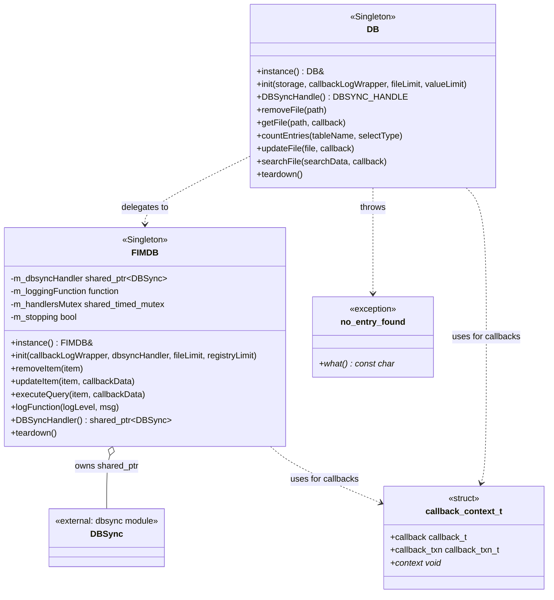
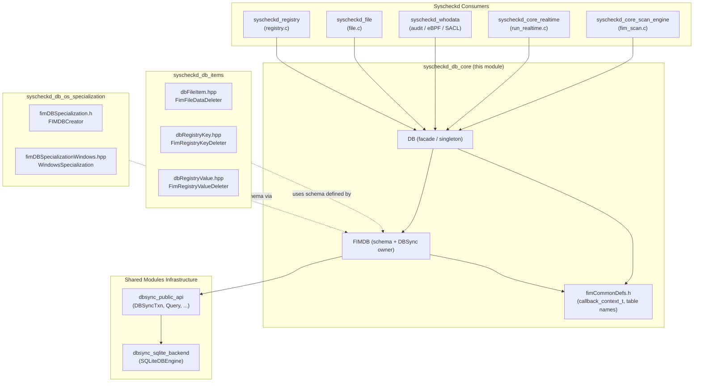
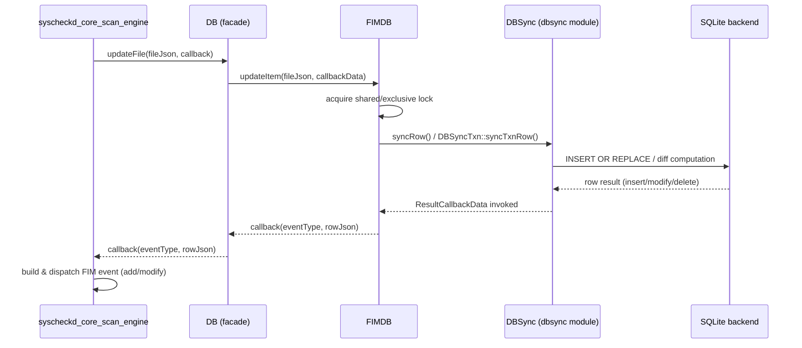
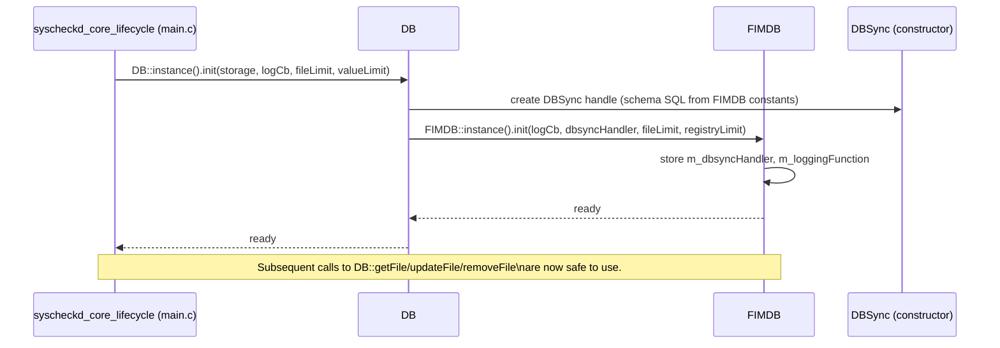
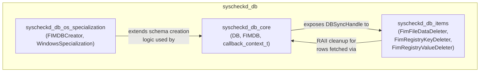
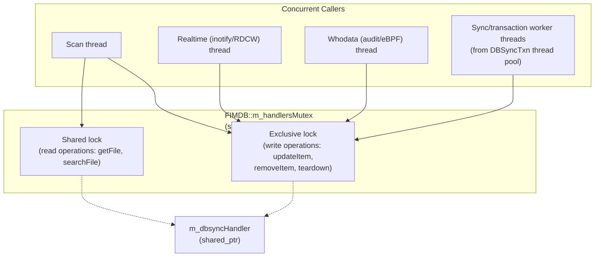

# Syscheckd DB Core

## Introduction

The **`syscheckd_db_core`** module is the central database abstraction layer for Wazuh's File Integrity Monitoring (FIM) subsystem (`syscheckd`). It provides a thread-safe, singleton-based interface that manages the lifecycle of the FIM database — including its schema definition, CRUD operations for files and Windows registry entities, transactional synchronization, and integration with the underlying `DBSync` engine.

This module acts as the **single point of entry** for all database-related operations performed by syscheckd's scan engine, real-time monitoring, and whodata subsystems. It hides the complexity of the low-level `DBSync`/SQLite engine behind two cooperating classes:

- **`DB`** — the public-facing façade (singleton) exposed to the rest of syscheckd, offering high-level operations (`getFile`, `updateFile`, `removeFile`, `searchFile`, `countEntries`).
- **`FIMDB`** — the internal singleton that owns the actual `DBSync` handle, defines the SQL schema (files, registry keys, registry values), and provides lower-level primitives (`updateItem`, `removeItem`, `executeQuery`) used by `DB` and other FIM components.

Together with the supporting header `fimCommonDefs.h` (shared type definitions and table name constants), these components form the backbone that every other syscheckd subsystem — scanning, real-time (inotify/ReadDirectoryChangesW), and whodata (audit/eBPF/Windows SACL) — relies on to persist and query file/registry state.

---

## 1. Purpose and Core Functionality

| Responsibility | Component |
|---|---|
| Public API for file entry CRUD operations | `DB` |
| Singleton lifecycle management (init/teardown) | `DB`, `FIMDB` |
| SQL schema definition for `file_entry`, `registry_key`, `registry_data` | `FIMDB` |
| Ownership and access to the `DBSync` handle | `FIMDB` |
| Thread-safety via shared/exclusive locking | `FIMDB` (`std::shared_timed_mutex`) |
| Structured logging callback propagation | `FIMDB::logFunction`, `DB::init` |
| Common enums/typedefs shared with C code (callback contexts, error codes) | `fimCommonDefs.h` |
| Custom exception for "no entry found" conditions | `no_entry_found` |

The module supports both **Linux/macOS (file-only)** and **Windows (file + registry)** deployments, dynamically sizing the registry-related schema and limits only when needed.

---

## 2. Architecture Overview

### 2.1 Component Relationship Diagram



### 2.2 Layered Architecture



> For details on the `DBSync` engine referenced above, see [dbsync_public_api.md](dbsync_public_api.md) and [dbsync_sqlite_backend.md](dbsync_sqlite_backend.md) (module: `Shared_Modules_Infrastructure_(C++)`).

---

## 3. Core Components

### 3.1 `DB` (src/syscheckd/src/db/include/db.hpp)

The `DB` class is a **Meyer's singleton** (`DB::instance()`) that exposes the FIM database API consumed by the rest of syscheckd. It is compiled as an exported symbol (`EXPORTED`) so it can be used across shared-library boundaries (relevant on Windows DLL builds).

Key responsibilities:
- **Initialization** (`init`): Configures storage type (in-memory or disk), the file/registry-value limits, and the logging callback used to route DB-related log lines back into syscheckd's logging pipeline.
- **DBSync handle access** (`DBSyncHandle`): Returns the raw `DBSYNC_HANDLE` for callers that need direct interaction with the sync engine (e.g., transaction creation in `syscheckd_db_items`).
- **File operations**:
  - `getFile` — asynchronous read via callback.
  - `updateFile` — upsert semantics; the callback receives an event-type code plus the resulting JSON row, enabling callers to generate FIM add/modify events.
  - `removeFile` — deletes a file entry by path.
  - `countEntries` — counts rows using either `COUNT_ALL` or `COUNT_INODE` (`COUNT_SELECT_TYPE` enum), used for enforcing `file_limit` and detecting duplicate inodes.
  - `searchFile` — generic search supporting `SEARCH_TYPE_PATH` or `SEARCH_TYPE_INODE` (`FILE_SEARCH_TYPE` enum) via the `SearchData` tuple (`{searchType, path, name, tail}`).
- **Teardown**: Cleanly shuts down the underlying `FIMDB` instance (and thereby the `DBSync` handle).

### 3.2 `no_entry_found` (src/syscheckd/src/db/include/db.hpp)

A lightweight custom exception (wrapping `std::runtime_error`) thrown by `DB`/`FIMDB` operations when a requested file or registry entry does not exist. Callers (e.g., `syscheckd_file`, `syscheckd_registry`) catch this exception to distinguish "not found" from other database errors.

### 3.3 `FIMDB` (src/syscheckd/src/db/src/fimDB.hpp)

`FIMDB` is the **internal singleton** that owns the actual database schema and the `std::shared_ptr<DBSync>` handle. It is not directly exposed outside the `syscheckd_db_*` family of modules — `DB` wraps and delegates to it.

Key responsibilities:
- **Schema ownership**: Defines the SQL `CREATE TABLE` statements as `constexpr` strings:
  - `CREATE_FILE_DB_STATEMENT` → `file_entry` table (path, checksum, device/inode, size, permissions, attributes, uid/gid/owner/group, hash_md5/sha1/sha256, mtime), with indexes on `path` and `(device, inode)`.
  - `CREATE_REGISTRY_KEY_DB_STATEMENT` → `registry_key` table (path + architecture as composite primary key, permissions, ownership, mtime, checksum).
  - `CREATE_REGISTRY_VALUE_DB_STATEMENT` → `registry_data` table (path/architecture/value as composite key, type, size, hashes, checksum), with a foreign key relationship back to `registry_key`.
- **Initialization** (`init`): Accepts the logging callback, a pre-constructed `DBSync` handler, and configurable limits (`fileLimit`, `registryLimit` — the latter only meaningful on Windows).
- **Item-level operations**:
  - `removeItem` — deletes a single JSON-represented entity.
  - `updateItem` — upsert with a `ResultCallbackData` callback (from the `DBSync` API) so callers receive per-row synchronization results (insert/modify/delete).
  - `executeQuery` — generic query execution against the underlying `DBSync` engine.
- **Thread-safety**: Uses a `std::shared_timed_mutex` (`m_handlersMutex`) to allow concurrent readers while serializing writers/teardown — critical since FIM scanning, real-time events, and whodata callbacks can all touch the database concurrently from different threads.
- **Logging bridge** (`logFunction`): Forwards log messages to the registered `m_loggingFunction`, decoupling `FIMDB` from any specific logging implementation.
- **DBSync accessor** (`DBSyncHandler`): Throws `std::runtime_error` if called before `init()`, preventing null-pointer misuse.
- **Teardown**: Signals `m_stopping` and releases the `DBSync` handler.

### 3.4 `callback_context_t` (src/syscheckd/src/db/include/fimCommonDefs.h)

A C-compatible struct (usable from both `.c` and `.cpp` translation units) representing a **tagged union of callback types** plus an opaque `context` pointer:

```c
typedef struct {
    union {
        callback_t callback;         // Simple result callback
        callback_txn_t callback_txn; // Transaction-aware callback (used with cJSON results)
    };
    void* context;
} callback_context_t;
```

This structure is the common currency used when passing callbacks across the C/C++ boundary — for example, from `file.c`/`registry.c` (which are largely C) into the C++ `DB`/`FIMDB` APIs. The header also defines:
- `FIMDBErrorCode` (`FIMDB_OK`, `FIMDB_ERR`, `FIMDB_FULL`) — standard return codes used throughout syscheckd's DB-related C code.
- `OSType` enum (`OTHERS`, `WINDOWS`) — used to branch schema/behavior for Windows-specific registry support.
- Table name / transaction JSON constants (`FIMDB_FILE_TABLE_NAME`, `FIMDB_FILE_TXN_TABLE`, `FIMDB_REGISTRY_KEY_TABLENAME`, `FIMDB_REGISTRY_KEY_TXN_TABLE`, `FIMDB_REGISTRY_VALUE_TABLENAME`, `FIMDB_REGISTRY_VALUE_TXN_TABLE`, `FILE_PRIMARY_KEY`).

---

## 4. Data Flow

### 4.1 File Update / FIM Event Generation



### 4.2 Initialization Sequence



### 4.3 Query / Search Flow


---

## 5. Relationship to Sibling Modules

The `syscheckd_db_core` module is one of three siblings under `syscheckd_db` (parent of `syscheckd_module`, under the `Syscheck_-_FIM_Daemon_(C/C++)` domain):



- **[syscheckd_db_items.md](syscheckd_db_items.md)** — Provides RAII deleters (`FimFileDataDeleter`, `FimRegistryKeyDeleter`, `FimRegistryValueDeleter`) for the C-style structs (`fim_file_data`, `fim_registry_key`, `fim_registry_value_data`) that wrap rows retrieved through `DB`/`FIMDB`.
- **[syscheckd_db_os_specialization.md](syscheckd_db_os_specialization.md)** — Contains `FIMDBCreator` and platform-specific table-creation logic (`WindowsSpecialization`) that customizes the schema/limits defined in `FIMDB` for Windows registry monitoring.

### Upstream Consumers

- **[syscheckd_core.md](syscheckd_core.md)** (scan engine, lifecycle, realtime) — calls into `DB` during full/scheduled scans and during realtime file-change processing.
- **[syscheckd_file.md](syscheckd_file.md)** and **[syscheckd_registry.md](syscheckd_registry.md)** — the primary C-language callers that translate OS-level file/registry metadata into JSON and invoke `DB` operations.
- **[syscheckd_whodata.md](syscheckd_whodata.md)** — uses `DB`/`FIMDB` indirectly through the file/registry modules when processing audit/eBPF/SACL events.

### Downstream Dependency

- **[dbsync_public_api.md](dbsync_public_api.md)** (module `Shared_Modules_Infrastructure_(C++)` → `dbsync`) — supplies `DBSync`, `DBSyncTxn`, and the `Query`/`InsertQuery`/`SelectQuery`/`DeleteQuery` builder classes that `FIMDB` uses internally for all schema creation and row synchronization. See also **[dbsync_sqlite_backend.md](dbsync_sqlite_backend.md)** for the SQLite engine implementation details (`SQLiteDBEngine`), and **[dbsync_engine_abstraction.md](dbsync_engine_abstraction.md)** for the `IDbEngine`/`FactoryDbEngine` abstraction that decouples `DBSync` from a specific storage engine.

---

## 6. Threading and Concurrency Model



Because syscheckd is heavily multi-threaded (input/output threads for logcollector-like flows, realtime watchers, and whodata event handlers all funnel into the same database), `FIMDB` centralizes locking around the `DBSync` handle rather than requiring each caller to manage synchronization independently. The `m_stopping` flag additionally guards against operations being issued after `teardown()` has been invoked (e.g., during daemon shutdown, see `fim_shutdown` in `syscheckd_core_lifecycle`).

---

## 7. Key Design Patterns

| Pattern | Where Applied | Purpose |
|---|---|---|
| **Singleton** | `DB::instance()`, `FIMDB::instance()` | Ensures a single, globally-accessible database context per syscheckd process |
| **Facade** | `DB` wrapping `FIMDB` | Simplifies the public API surface and isolates internal schema/DBSync details |
| **Callback-based async API** | `getFile`, `updateFile`, `searchFile`, `updateItem`, `executeQuery` | Decouples database I/O completion from event generation, matching the `DBSync` engine's callback-driven design |
| **RAII / Custom exceptions** | `no_entry_found` | Provides structured error signaling for "not found" conditions distinct from generic failures |
| **Reader-Writer Lock** | `FIMDB::m_handlersMutex` (`shared_timed_mutex`) | Maximizes concurrency for read-heavy workloads (queries) while ensuring safe mutation |
| **Tagged Union (C interop)** | `callback_context_t` | Bridges C-style callback registration with C++ `std::function`-based `ResultCallbackData` used by `DBSync` |

---

## 8. Summary

`syscheckd_db_core` is the foundational persistence layer of Wazuh's FIM subsystem. By centralizing schema definition (`FIMDB`), exposing a stable and thread-safe public API (`DB`), and defining shared C/C++ interop types (`fimCommonDefs.h`), it enables the rest of syscheckd — scanning, real-time monitoring, and whodata — to remain decoupled from the specifics of the underlying `DBSync`/SQLite storage engine. Its sibling modules (`syscheckd_db_items`, `syscheckd_db_os_specialization`) extend it with RAII helpers and OS-specific schema customization, while it in turn depends on the generic `dbsync` shared module for actual data synchronization and storage.
