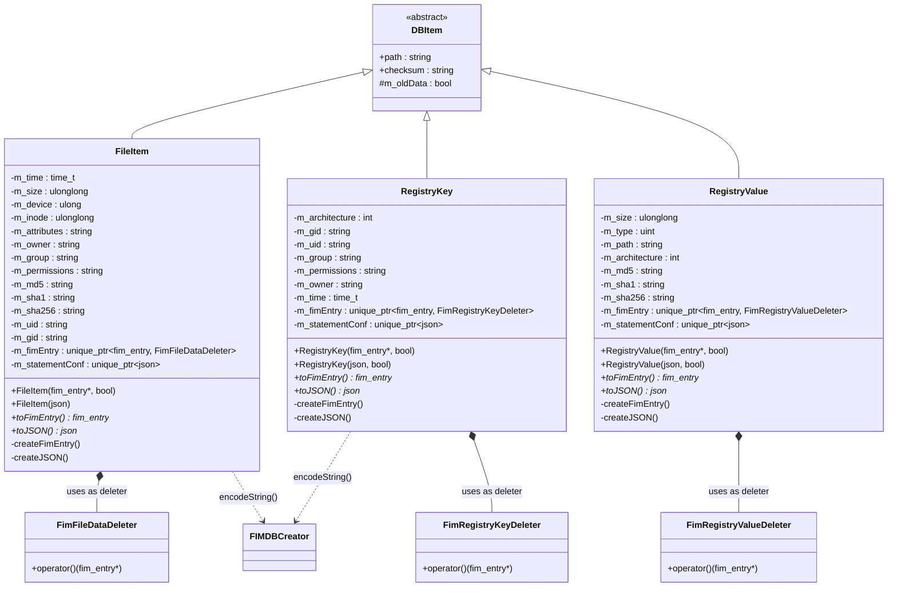
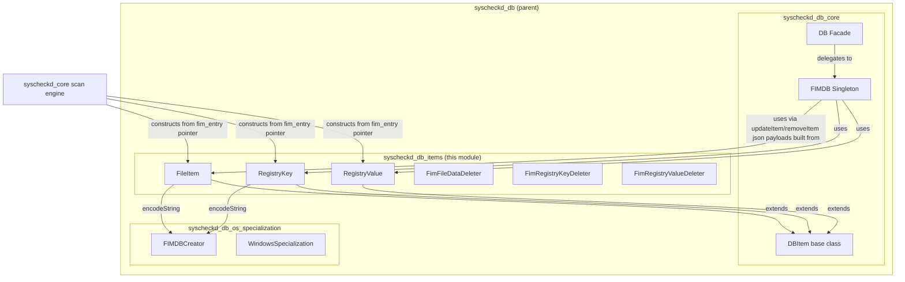
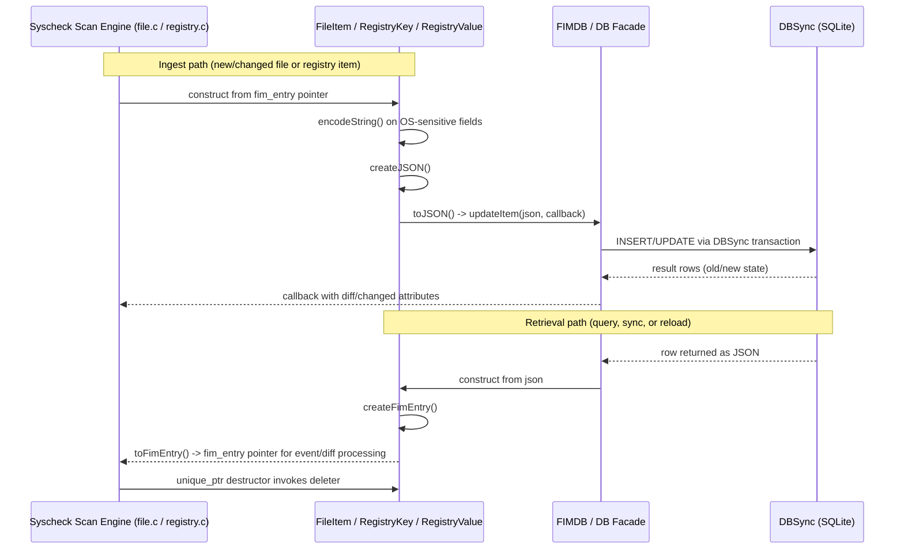
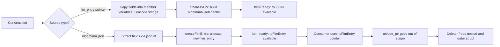
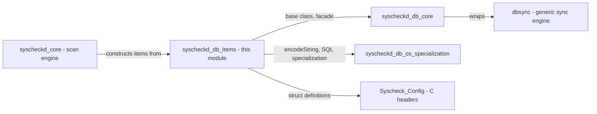

# Syscheckd DB Items

## Introduction

The **syscheckd_db_items** module is a small but critical set of C++ data-model classes that represent the individual rows/entities persisted by the Syscheck (File Integrity Monitoring, FIM) database engine. It provides three concrete item types — `FileItem`, `RegistryKey`, and `RegistryValue` — each paired with a custom RAII deleter (`FimFileDataDeleter`, `FimRegistryKeyDeleter`, `FimRegistryValueDeleter`) that safely releases the underlying C-style `fim_entry` structures used throughout the legacy Syscheck codebase.

These classes act as the bridge between:
- The C-based `fim_entry` / `fim_file_data` / `fim_registry_key` / `fim_registry_value_data` structures (defined in [Syscheck_Config](Syscheck_Config.md)) used by the native Syscheck scanning engine, and
- The JSON-based representation (`nlohmann::json`) consumed by the FIM database layer (`FIMDB`/`DB`) and higher-level synchronization/reporting code.

This module belongs to the broader **Syscheck / FIM Daemon (C/C++)** subsystem, specifically nested under `syscheckd_db` (database layer), as a sibling to `syscheckd_db_core` (the `DB`/`FIMDB` facade) and `syscheckd_db_os_specialization` (platform-specific SQL/encoding logic). See [syscheckd_db_core](syscheckd_db_core.md) and [syscheckd_db_os_specialization](syscheckd_db_os_specialization.md) for related documentation.

---

## Purpose and Core Functionality

Each class in this module wraps a single "item" that can exist in the FIM database:

| Class | Represents | Underlying C struct |
|-------|------------|----------------------|
| `FileItem` | A monitored file and its metadata (size, permissions, hashes, timestamps, owner/group, etc.) | `fim_entry` (`file_entry` variant) containing `fim_file_data` |
| `RegistryKey` | A Windows registry key and its metadata (permissions, owner, mtime, architecture) | `fim_entry` (`registry_entry.key` variant) containing `fim_registry_key` |
| `RegistryValue` | A Windows registry value and its metadata (type, size, hashes) | `fim_entry` (`registry_entry.value` variant) containing `fim_registry_value_data` |

All three classes derive from a common base, `DBItem` (defined in `dbItem.hpp`, part of the `syscheckd_db_core` neighboring component), which provides the shared `path`/`checksum` identity contract used by the database synchronization engine (DBSync, see [dbsync](dbsync.md)).

### Key Responsibilities

1. **Dual-direction construction**
   Each item class can be constructed from either:
   - A native `fim_entry*` (produced by the scanning engine, e.g. `file.c`, `registry.c`), or
   - A `nlohmann::json` object (produced when reading a row back from the SQLite-backed DBSync engine, or received over the wire during synchronization).

2. **Bidirectional conversion**
   - `toFimEntry()` — materializes (or returns a cached) native `fim_entry*` structure for consumption by legacy C code (event generation, whodata processing, diff calculation).
   - `toJSON()` — materializes (or returns a cached) `nlohmann::json*` representation for consumption by `FIMDB`/`DB` (SQL statement generation, event serialization sent to `wazuh-analysisd`/the Wazuh Indexer pipeline).

3. **Safe memory management**
   Because `fim_entry` and its nested pointers are allocated with C-style `malloc`/`strdup` semantics, each item type owns its native structure inside a `std::unique_ptr` configured with a **custom deleter**:
   - `FimFileDataDeleter` frees `file_entry.data` and the outer `fim_entry`.
   - `FimRegistryKeyDeleter` frees `registry_entry.key` and the outer `fim_entry`.
   - `FimRegistryValueDeleter` frees `registry_entry.value` and the outer `fim_entry`.

   This guarantees no memory leaks or double-frees occur as items are passed between the legacy C FIM engine and the modern C++ database layer.

4. **Platform-aware string encoding**
   String fields that may contain non-UTF8 or platform-specific encodings (attributes, owner, group, permissions) are normalized via `FIMDBCreator<OS_TYPE>::encodeString(...)`, a template specialized per-OS in the sibling `syscheckd_db_os_specialization` component (see [syscheckd_db_os_specialization](syscheckd_db_os_specialization.md)).

---

## Architecture

### Component Relationships

### Position within the Syscheck DB Layer

---

## Data Flow

The item classes sit at the conversion boundary between the native scanning engine and the SQL/JSON database layer. Two primary flows exist: **ingest** (native → JSON, for persistence) and **retrieval** (JSON → native, for event generation).

### Lifecycle of the underlying `fim_entry`

---

## Component Details

### `FimFileDataDeleter` / `FimRegistryKeyDeleter` / `FimRegistryValueDeleter`

These are lightweight functor structs used exclusively as the deleter type parameter of a `std::unique_ptr<fim_entry, Deleter>`. Each one:
1. Checks the outer `fim_entry*` is non-null.
2. Frees the nested, dynamically-allocated union member specific to its item type (`file_entry.data`, `registry_entry.key`, or `registry_entry.value`).
3. Frees the outer `fim_entry` struct itself via `std::free`.

This pattern avoids manual cleanup code scattered across the codebase and ensures exception-safe resource management, since the `unique_ptr` destructor will always invoke the deleter, whether the item goes out of scope normally or due to an exception during class construction.

### `FileItem`

Wraps a monitored file's metadata row. Notable fields include size, device/inode, mtime, attributes (Windows file attributes), owner/group/permissions strings, and MD5/SHA1/SHA256 hash strings. It supports two constructors:
- `FileItem(const fim_entry* const fim, bool oldData = false)` — used when the scan engine has just computed fresh file data.
- `FileItem(const nlohmann::json& fim)` — used when reconstructing an item from a database row or synchronization payload.

Internally it delegates encoding of `attributes`, `owner`, `group`, and `permissions` to `FIMDBCreator<OS_TYPE>::encodeString()` (OS-specific specialization — see [syscheckd_db_os_specialization](syscheckd_db_os_specialization.md)) to normalize platform-dependent string encodings (e.g., Windows ANSI/UTF-16 vs Linux UTF-8) before they are persisted.

### `RegistryKey`

Wraps a Windows registry key row (path, architecture bitness, owner/group/permissions, mtime). Like `FileItem`, it has dual constructors (from `fim_entry*` or `nlohmann::json`) and encodes OS-sensitive string fields.

### `RegistryValue`

Wraps a Windows registry value row (value name, path of the owning key, architecture, size, type, and hash triplet). Notably, the "path" here is the identity key stored via the base `DBItem` constructor using the **value name**, while the owning registry key path is stored separately in `m_path`.

---

## Interaction with Other Modules

- **[syscheckd_db_core](syscheckd_db_core.md)** — Defines `DB` (public facade) and `FIMDB` (internal singleton) which consume the `toJSON()` output of these item classes to perform `updateItem`, `removeItem`, and `executeQuery` operations against the DBSync-backed SQLite database. It also defines the shared `DBItem` base class.
- **[syscheckd_db_os_specialization](syscheckd_db_os_specialization.md)** — Supplies the `FIMDBCreator<OS_TYPE>` template specialization used for `encodeString()`, along with the SQL table creation statements (`CreateStatement()`) and row/column limit enforcement (`setLimits()`) that govern how these items are stored.
- **[syscheckd_core](syscheckd_core.md)** (via `syscheckd_core_scan_engine`, `file.c`, `registry.c`) — The native scanning engine constructs `FileItem`/`RegistryKey`/`RegistryValue` instances directly from freshly-collected `fim_entry` data during a scan or real-time/whodata event, then hands off the JSON representation to the database layer.
- **[dbsync](dbsync.md)** — The underlying generic synchronization engine (`DBSyncTxn`, `InsertQuery`, `SelectQuery`, etc.) that `FIMDB` wraps; item JSON payloads produced here ultimately become rows managed by DBSync's SQLite engine.
- **Configuration structures** — The native `fim_entry`, `fim_file_data`, `fim_registry_key`, and `fim_registry_value_data` C structs consumed/produced by these classes are defined in [Syscheck_Config](Syscheck_Config.md) (`src/config/syscheck-config.h`).

---

## Design Notes & Rationale

- **Why separate item classes per entity type?** Files, registry keys, and registry values have structurally different native representations (different unions of `fim_entry`) and different JSON schemas/columns. Separating them keeps each class's construction/serialization logic simple and avoids large conditional branches.
- **Why custom deleters instead of a generic free function?** Each `fim_entry` variant owns a different nested pointer that must be freed before the outer struct. Encapsulating this in a deleter functor makes the `unique_ptr` self-contained and reusable everywhere the entry type is passed around (event generation, diff calculation, whodata processing).
- **Why cache both `fim_entry*` and `nlohmann::json`?** Different consumers need different formats: the legacy C-based event/diff subsystem needs `fim_entry*`, while the DBSync/JSON-based persistence and synchronization layer needs `nlohmann::json`. Caching both in the object (built once in the constructor via `createFimEntry()`/`createJSON()`) avoids repeated, costly re-serialization when an item is passed through multiple stages of the pipeline.
- **Platform abstraction is delegated, not duplicated.** By delegating `encodeString()` to `FIMDBCreator<OS_TYPE>`, this module remains platform-agnostic; the platform-specific logic lives entirely in `syscheckd_db_os_specialization`, keeping item classes portable and testable in isolation.

---

## Summary

The `syscheckd_db_items` module provides the foundational data-transfer objects for Wazuh's File Integrity Monitoring database subsystem. By encapsulating conversion logic and safe memory ownership for files, registry keys, and registry values, it decouples the legacy C scanning engine from the modern C++/JSON-based FIM database layer, enabling reliable and leak-free synchronization of file/registry state between the agent's local scan results and the persisted FIM database.
