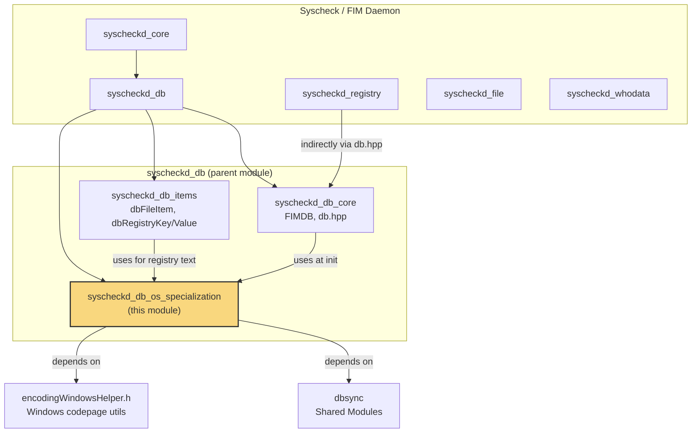
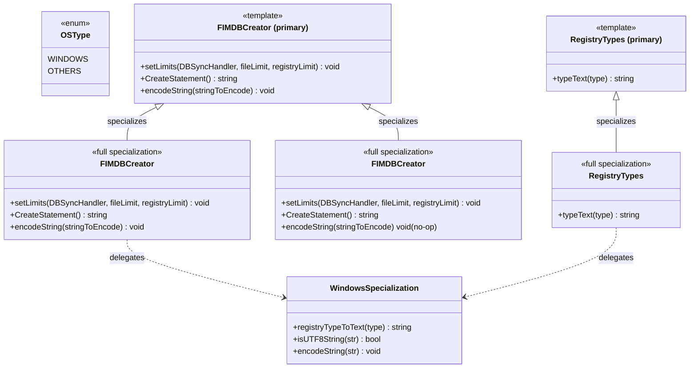
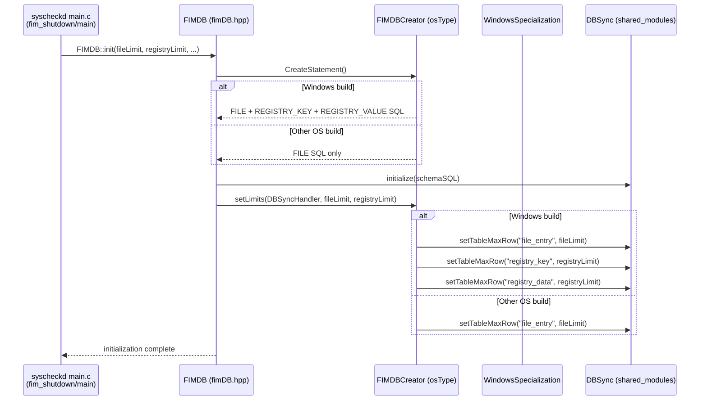
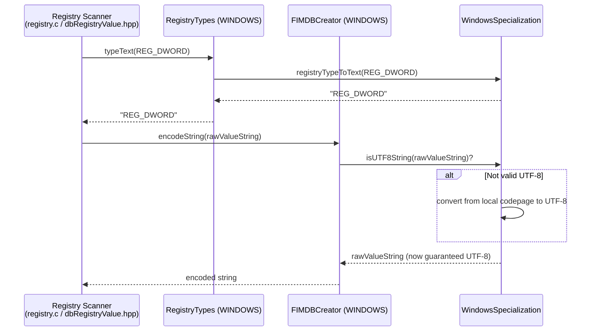
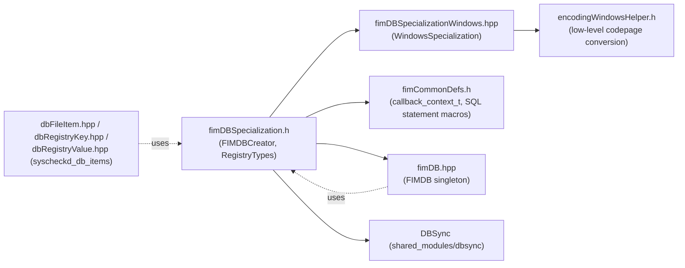

# Syscheckd DB OS Specialization

## Introduction

The **Syscheckd DB OS Specialization** module is a small but critical piece of the Wazuh File Integrity Monitoring (FIM) daemon (`syscheckd`). It provides **compile-time, OS-specific behavior** for the FIM database layer (`FIMDB`), allowing the same generic database code to behave differently depending on the target operating system — most notably **Windows** (which has a registry to monitor, in addition to files) versus **other operating systems** (Linux, macOS, BSD, Solaris, etc., which only monitor the filesystem).

This module solves three OS-dependent problems for the FIM database:

1. **Schema creation** — which SQL `CREATE TABLE` statements must be executed to initialize the internal FIM database (files only, or files + Windows registry).
2. **Row-limit configuration** — which tables need row-count limits enforced (`file_entry`, and on Windows also `registry_key` / `registry_data`).
3. **Registry-specific data handling** — translating numeric Windows registry value types (`REG_SZ`, `REG_DWORD`, etc.) into human-readable text, and encoding strings to valid UTF-8 for storage/transmission (Windows codepages can produce non-UTF-8 byte sequences).

It achieves this using C++ **template specialization** keyed on an `OSType` enum, so the correct implementation is selected **at compile time** with zero runtime branching overhead, and any attempt to use a Windows-only operation (e.g., `RegistryTypes::typeText`) on a generic/unspecialized build fails fast with a `std::runtime_error`.

## Position in the Overall System

This module is a leaf-level, internal implementation detail of the [`syscheckd_db_core`](syscheckd_db_core.md) component, which itself is part of the broader [Syscheck / FIM daemon](syscheckd_core.md). It has no public API of its own; it is consumed exclusively by `FIMDB` (`fimDB.hpp`) during database initialization and by registry-processing code (see [`syscheckd_db_items`](syscheckd_db_items.md)) when formatting registry value data.

See also: [dbsync module documentation](dbsync.md) for the `DBSync` class used by `setLimits`.

## Core Responsibilities

| Responsibility | Component | Windows Behavior | Non-Windows Behavior |
|---|---|---|---|
| Configure max row counts per table | `FIMDBCreator<osType>::setLimits` | Sets limits on `file_entry`, `registry_key`, `registry_data` | Sets limit only on `file_entry` |
| Build the DB schema creation SQL | `FIMDBCreator<osType>::CreateStatement` | Concatenates file + registry key + registry value `CREATE` statements | Returns only the file `CREATE` statement |
| Encode strings for safe storage | `FIMDBCreator<osType>::encodeString` | Delegates to `WindowsSpecialization::encodeString` (codepage → UTF-8 conversion) | No-op |
| Convert numeric registry type to text | `RegistryTypes<osType>::typeText` | Delegates to `WindowsSpecialization::registryTypeToText` | Throws `std::runtime_error` (unsupported) |

## Architecture

The module is built around two cooperating template classes, each specialized per `OSType`:

### Key Design Notes

- **`FIMDBCreator<osType>`** (primary/unspecialized template) acts as a *safety net*: if the build ever instantiates the template with an `OSType` value that has no explicit specialization, all methods throw `std::runtime_error`, surfacing a build/configuration bug immediately rather than silently misbehaving.
- **`FIMDBCreator<OSType::WINDOWS>`** is the full specialization used only when compiling the Windows agent. It knows about three tables (`file_entry`, `registry_key`, `registry_data`) and three `CREATE TABLE` statement fragments (`CREATE_FILE_DB_STATEMENT`, `CREATE_REGISTRY_KEY_DB_STATEMENT`, `CREATE_REGISTRY_VALUE_DB_STATEMENT`, all from `fimCommonDefs.h`).
- **`FIMDBCreator<OSType::OTHERS>`** is the specialization for every non-Windows platform (Linux, macOS, FreeBSD, Solaris, etc.). It only touches the `file_entry` table and its `encodeString` is a no-op because non-Windows platforms already work natively in UTF-8/locale-safe encodings.
- **`RegistryTypes<osType>`** is a separate, narrower template (no `setLimits`/`CreateStatement`) whose only concern is converting a numeric registry value type (an `int32_t`, e.g. `REG_SZ = 1`, `REG_DWORD = 4`) into a human-readable string (`"REG_SZ"`, `"REG_DWORD"`, ...). Since registries only exist on Windows, only `RegistryTypes<OSType::WINDOWS>` is implemented; any other instantiation throws.
- **`WindowsSpecialization`** (declared in `fimDBSpecializationWindows.hpp`) is the actual implementation class containing the Windows-only logic. It is intentionally kept separate from the template classes so that:
  - The header can be included and its declarations referenced on all platforms (as a forward declaration/opaque class), while its `.cpp` implementation is only compiled/linked on Windows builds.
  - `FIMDBCreator<WINDOWS>` and `RegistryTypes<WINDOWS>` stay thin — they are simple delegation shims over `WindowsSpecialization`.

## How This Module Is Used

`FIMDB` (in `syscheckd_db_core`, see [syscheckd_db_core.md](syscheckd_db_core.md)) is a singleton responsible for initializing and managing the SQLite-backed FIM database via `DBSync`. During its initialization sequence, it needs to know:
1. What SQL to run to create the schema.
2. What row limits to enforce per table (based on `syscheck.max_files` / registry limits from `syscheck_config`, see [Syscheck_Config](Syscheck_Config.md)).

Both decisions are OS-dependent, so `FIMDB` delegates them to `FIMDBCreator<osType>`, where `osType` is resolved at compile time (typically via a preprocessor/CMake toggle selecting `OSType::WINDOWS` or `OSType::OTHERS` for the build target).

### Registry Value Formatting Flow (Windows only)

When the registry scanner (part of `syscheckd_registry`) processes a registry value, it needs to store/report the value's *type* as text and ensure any string content is valid UTF-8 before it is serialized into a DB row / sync event.

## Dependency Overview

- **Upstream dependency**: [`dbsync`](dbsync.md) (`DBSync` class), used by `setLimits` to enforce row caps per table.
- **Sibling dependency**: `fimCommonDefs.h` (part of [`syscheckd_db_core`](syscheckd_db_core.md)) for the `CREATE_*_DB_STATEMENT` SQL macros.
- **Platform dependency**: `encodingWindowsHelper.h`, a low-level Windows-only helper for codepage-to-UTF-8 conversion, wrapped by `WindowsSpecialization`.
- **Consumers**: [`syscheckd_db_core`](syscheckd_db_core.md) (`FIMDB`) at initialization time, and [`syscheckd_db_items`](syscheckd_db_items.md) when serializing registry data.

## Component Reference

### `FIMDBCreator<osType>` (primary template)
Defined generically to fail loudly (`std::runtime_error`) if instantiated for an unsupported/unspecialized `OSType`. Acts purely as a compile-time contract enforcer; it is never meant to execute in production.

### `FIMDBCreator<OSType::WINDOWS>`
- `setLimits(DBSyncHandler, fileLimit, registryLimit)`: configures max-row limits for `file_entry`, `registry_key`, and `registry_data` tables via `DBSync::setTableMaxRow`.
- `CreateStatement()`: returns the concatenation of `CREATE_FILE_DB_STATEMENT`, `CREATE_REGISTRY_KEY_DB_STATEMENT`, and `CREATE_REGISTRY_VALUE_DB_STATEMENT`.
- `encodeString(stringToEncode)`: delegates to `WindowsSpecialization::encodeString` to normalize a string to valid UTF-8.

### `FIMDBCreator<OSType::OTHERS>`
- `setLimits(DBSyncHandler, fileLimit, registryLimit)`: configures max-row limit only for `file_entry` (registry parameter is ignored, since non-Windows platforms have no registry).
- `CreateStatement()`: returns only `CREATE_FILE_DB_STATEMENT`.
- `encodeString(stringToEncode)`: no-op.

### `RegistryTypes<osType>` (primary template)
Generic template that throws `std::runtime_error` for any platform that does not specialize it — enforcing that registry-type textualization is only ever attempted on Windows builds.

### `RegistryTypes<OSType::WINDOWS>`
- `typeText(type)`: delegates to `WindowsSpecialization::registryTypeToText(type)` to convert a numeric Windows registry type constant into its canonical string name (e.g., `REG_SZ`, `REG_EXPAND_SZ`, `REG_BINARY`, `REG_DWORD`, `REG_MULTI_SZ`, `REG_QWORD`).

### `WindowsSpecialization`
Declared in `fimDBSpecializationWindows.hpp`, this static-method utility class (implementation compiled only on Windows) provides:
- `registryTypeToText(type)`: numeric-to-text mapping for registry value types.
- `isUTF8String(str)`: validates whether a byte string is already well-formed UTF-8.
- `encodeString(str)`: in-place conversion of a string from the local Windows codepage to UTF-8 when it is not already valid UTF-8 (mutates `str` by reference).

## Related Modules

- [`syscheckd_db_core`](syscheckd_db_core.md) — the `FIMDB` singleton and DB abstraction that consumes this module.
- [`syscheckd_db_items`](syscheckd_db_items.md) — file/registry item representations (`FimFileDataDeleter`, `FimRegistryKeyDeleter`, `FimRegistryValueDeleter`) that rely on registry type text and encoded strings produced here.
- [`syscheckd_core`](syscheckd_core.md) — overall FIM daemon lifecycle, scan engine, and realtime monitoring that owns the `FIMDB` initialization sequence.
- [`dbsync`](dbsync.md) — the underlying synchronization/database engine (`DBSync`) whose table row-limit API (`setTableMaxRow`) is invoked by `setLimits`.
- [`Syscheck_Config`](Syscheck_Config.md) — defines `syscheck_config`, the source of `fileLimit`/`registryLimit` values passed down to this module.

## Summary

This module exemplifies a common Wazuh pattern: **isolating platform-specific logic behind a narrow, compile-time-selected interface** so that the bulk of the FIM database engine (`FIMDB`, `DBSync`) remains platform-agnostic. By using C++ template specialization rather than runtime `#ifdef`/branching, the codebase gets:
- **Type-safety and compile-time verification** — unsupported combinations fail to compile or throw immediately rather than causing subtle runtime bugs.
- **Clear separation of concerns** — Windows registry/encoding quirks are fully contained in `WindowsSpecialization`, never leaking into the generic `FIMDB` code path.
- **Extensibility** — supporting a new OS-specific behavior in the future only requires adding a new template specialization, without touching consumer code in `FIMDB` or the registry scanner.
