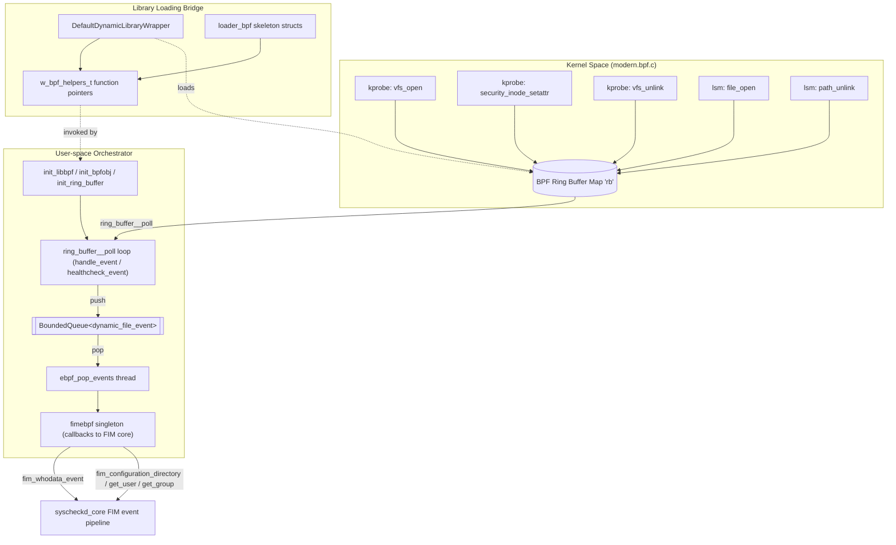
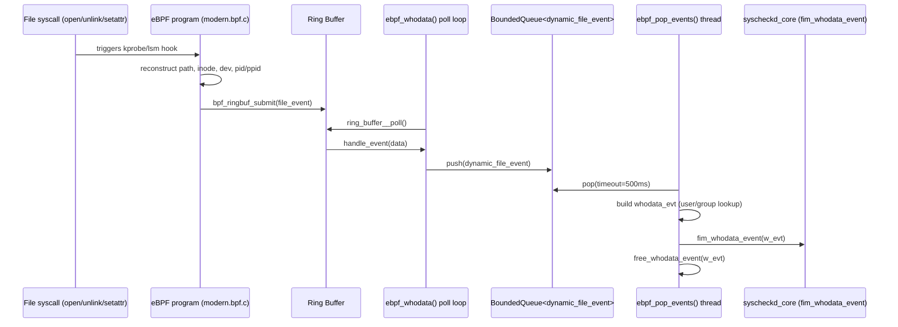
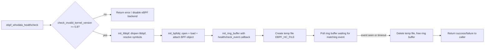

# Syscheckd eBPF Module

## 1. Purpose and Overview

The `syscheckd_ebpf` module is the **eBPF-based "whodata" provider** for the Wazuh File Integrity Monitoring (FIM) daemon (`syscheckd`). It is a Linux-only, kernel-assisted alternative to the classic Audit-based whodata engine (see [syscheckd_whodata.md](syscheckd_whodata.md)) that captures **file creation, attribute-change and deletion events together with the identity of the process that caused them** (PID, PPID, UID, GID, command name, working directory, inode and device), without depending on the `auditd` daemon.

It achieves this by:

1. Loading a pre-compiled eBPF object (`modern.bpf.o`) that attaches **kprobes** (`vfs_open`, `security_inode_setattr`, `vfs_unlink`) and, on newer kernels, **LSM hooks** (`file_open`, `path_unlink`) to the Linux kernel.
2. Reconstructing full file paths and metadata **inside the kernel** and publishing compact `file_event` records through a **BPF ring buffer**.
3. Consuming those records in **user space**, converting them into the same `whodata_evt` structure used by the Audit-based engine, and feeding them into the FIM core (`fim_whodata_event`) so the rest of `syscheckd` is agnostic to which whodata backend produced the event.

Because `libbpf` may not be present/loadable on every system, the module dynamically loads the library at runtime (`dlopen`/`dlsym`) rather than linking against it directly, and gracefully disables itself (falling back to realtime/scheduled scanning) if eBPF is unavailable or the kernel version is unsupported.

## 2. Role in the System

`syscheckd_ebpf` is one of three whodata-capable backends inside the Syscheck/FIM daemon:

| Backend | Module | Mechanism |
|---|---|---|
| Linux Audit | [syscheckd_whodata.md](syscheckd_whodata.md) | `auditd` netlink socket, audit rules |
| **eBPF (this module)** | `syscheckd_ebpf` | kprobes/LSM hooks + ring buffer |
| Windows | [syscheckd_whodata.md](syscheckd_whodata.md) | SACL / Windows Event Log |

Both Linux backends ultimately call the same core FIM callback (`fim_whodata_event`, `fim_configuration_directory`, `get_user`, `get_group`) declared in [syscheckd_core.md](syscheckd_core.md), so the rest of the daemon (scan engine, database layer — see [syscheckd_db.md](syscheckd_db.md) — and file/registry handlers) treats events produced by this module identically to Audit-based whodata events.

The module also depends on general-purpose Wazuh infrastructure:
* Logging primitives (`loggingFunction`, `modules_log_level_t`) from the native shared library — see [shared_lib_logging.md](shared_lib_logging.md).
* Dynamic symbol loading (`so_get_module_handle`, `so_get_function_sym`, `so_free_library`) from `sym_load.h`, part of the native shared library utilities documented in [shared_lib_file_io.md](shared_lib_file_io.md).

## 3. Architecture

The module is split into three cooperating layers, documented in detail in their own pages:

| Layer | Sub-module | Responsibility |
|---|---|---|
| Kernel-space program | [syscheckd_ebpf_kernel_program.md](syscheckd_ebpf_kernel_program.md) | eBPF C code (`modern.bpf.c`) that instruments kernel file-system entry points and emits `file_event` records into a ring buffer map. |
| Dynamic library / skeleton bridge | [syscheckd_ebpf_library_loading.md](syscheckd_ebpf_library_loading.md) | Runtime discovery and binding of `libbpf` symbols (`bpf_helpers.h`, `wrapper_bpf.h`) and the OS-level dynamic-loading abstraction (`dynamic_library_wrapper.h`). |
| User-space orchestrator | [syscheckd_ebpf_orchestrator.md](syscheckd_ebpf_orchestrator.md) | Health-check and main event loop (`ebpf_whodata.cpp`), the `fimebpf` singleton bridging C callbacks into C++ (`ebpf_whodata.hpp`), and the thread-safe `BoundedQueue` used to decouple the ring-buffer poller from the event-processing thread. |

### 3.1 High-Level Component Diagram

### 3.2 Event Flow (Sequence)

### 3.3 Startup / Health-Check Flow

Before the continuous monitoring loop (`ebpf_whodata()`) is started, `syscheckd` invokes `ebpf_whodata_healthcheck()` to validate that the running kernel supports the required eBPF features and that events can actually be received end-to-end:

## 4. Key Design Points

* **No hard link-time dependency on libbpf.** All `libbpf` entry points (`bpf_object__open_file`, `bpf_object__load`, `ring_buffer__new`, skeleton `open/load/attach/detach`, etc.) are resolved at runtime through `DynamicLibraryWrapper`, stored in the `w_bpf_helpers_t` struct. This allows `syscheckd` to run on systems without eBPF/`libbpf` support by simply failing the health check.
* **Kernel-version gating.** `check_invalid_kernel_version()` parses `/proc/sys/kernel/osrelease` and refuses to activate eBPF whodata on kernels older than 5.8 (minimum for BPF ring buffers).
* **Decoupled ingestion vs. processing.** The ring-buffer poller thread only copies raw kernel data into a `fim::BoundedQueue<std::unique_ptr<dynamic_file_event>>`; a separate worker thread (`ebpf_pop_events`) performs the (potentially blocking) user/group name resolution and invokes the FIM callback, minimizing the time spent inside the poll loop and reducing the risk of ring-buffer overruns.
* **Bounded backpressure.** The queue has a configurable maximum size (`syscheckQueueSize`, wired from Syscheck configuration through `fimebpf::instance().m_queue_size`); when full, new events are dropped and a single warning is logged (`FIM_FULL_EBPF_KERNEL_QUEUE`) to avoid unbounded memory growth or log flooding.
* **Kernel/user protocol symmetry.** The `file_event` struct is defined twice — once for the BPF program (`modern.bpf.c`, fixed-size C struct compatible with `bpf_probe_read_kernel`) and once for user space (`bpf_helpers.h`, same layout) — and immediately converted into a heap-friendly `dynamic_file_event` (using `std::string`) for internal queueing.
* **Graceful cleanup.** `w_bpf_deinit()` nulls every function pointer and calls `dlclose()` on the loaded module, ensuring no dangling pointers survive a disable/re-enable cycle.

## 5. Related Documentation

* [syscheckd_whodata.md](syscheckd_whodata.md) — Linux Audit and Windows SACL-based whodata engines that provide the same `whodata_evt` abstraction to the FIM core.
* [syscheckd_core.md](syscheckd_core.md) — FIM scan engine and lifecycle that consumes whodata events (`fim_whodata_event`) regardless of backend.
* [syscheckd_db.md](syscheckd_db.md) — FIM database layer that persists the file/registry state updated as a consequence of whodata events.
* [shared_lib_logging.md](shared_lib_logging.md) — Native logging primitives (`loggingFunction`, log levels) used throughout this module.
* [shared_lib_file_io.md](shared_lib_file_io.md) — Dynamic symbol loading utilities (`sym_load.h`) wrapped by `DynamicLibraryWrapper`.

### Sub-module Documentation

* [syscheckd_ebpf_kernel_program.md](syscheckd_ebpf_kernel_program.md) — The eBPF kernel program (`modern.bpf.c`).
* [syscheckd_ebpf_library_loading.md](syscheckd_ebpf_library_loading.md) — Dynamic `libbpf` loading and skeleton bridging (`bpf_helpers.h`, `wrapper_bpf.h`, `dynamic_library_wrapper.h`).
* [syscheckd_ebpf_orchestrator.md](syscheckd_ebpf_orchestrator.md) — User-space orchestration, singleton bridge and bounded queue (`ebpf_whodata.cpp`, `ebpf_whodata.hpp`, `bounded_queue.hpp`).
