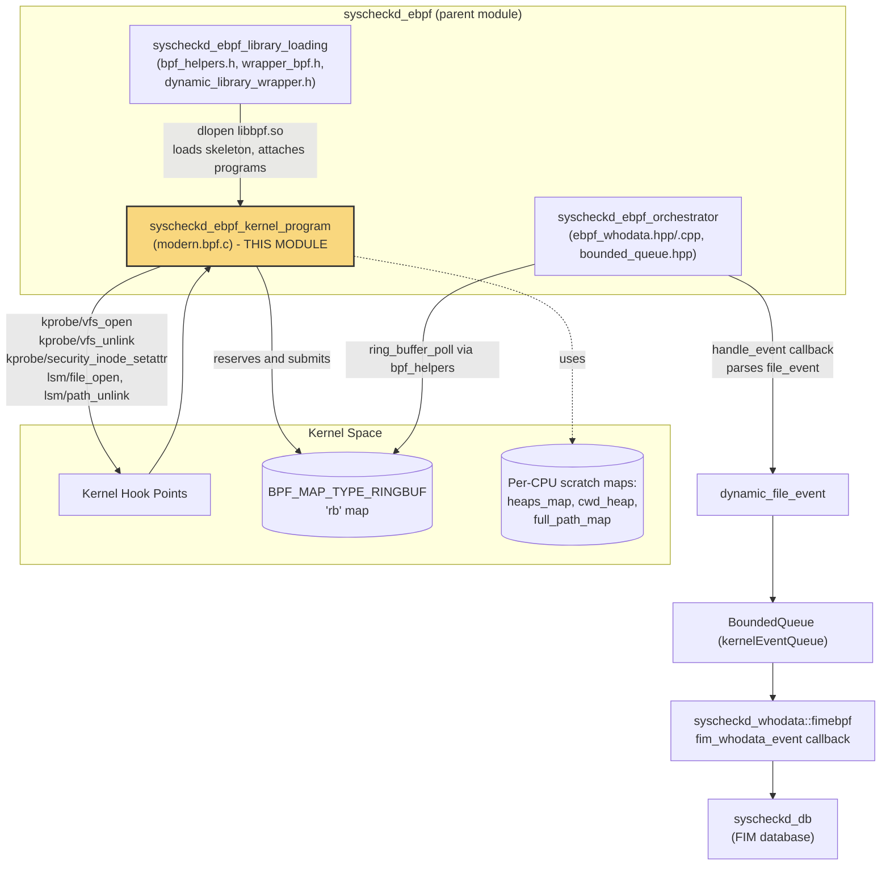
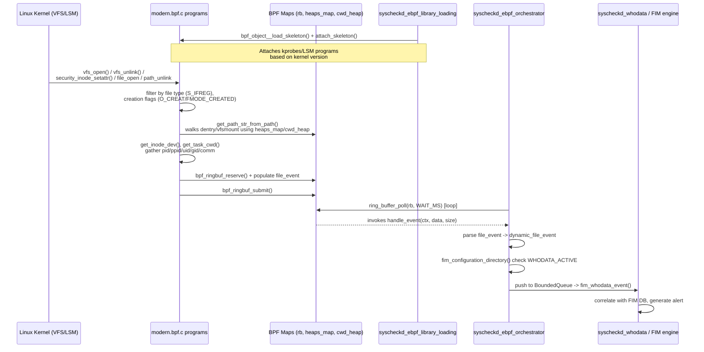
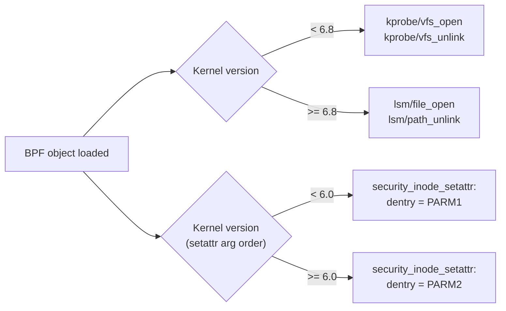

# Syscheckd eBPF Kernel Program

## Introduction

The **Syscheckd eBPF Kernel Program** module (`src/syscheckd/src/ebpf/src/modern.bpf.c`) is the in-kernel component of Wazuh's eBPF-based File Integrity Monitoring (FIM) "whodata" implementation for Linux. It is a small, self-contained eBPF program compiled with a BPF-target Clang/LLVM toolchain and loaded into the Linux kernel through `libbpf`'s CO-RE (Compile Once – Run Everywhere) mechanism. Its sole responsibility is to observe low-level filesystem operations — file creation/open, attribute changes, and unlink (delete) — directly from kernel probes and kprobes/LSM hooks, and to emit lightweight, structured `file_event` records into a BPF ring buffer for consumption by the Wazuh user-space eBPF orchestrator.

This program is the kernel-resident counterpart of the `syscheckd_ebpf_orchestrator` and `syscheckd_ebpf_library_loading` sibling components: those C++ components load, attach, and poll the ring buffer that this program populates. This module does not perform any user-space processing, queueing, or FIM database work itself — it is strictly the eBPF bytecode that runs inside the kernel context.

## Purpose and Core Functionality

The eBPF kernel program provides low-overhead, kernel-level "whodata" auditing (who created/modified/deleted a file, and from which process) without depending on the Linux Audit subsystem (`auditd`), which is the traditional mechanism used by `syscheckd_whodata` on non-eBPF-capable systems. It complements the auditd-based whodata implementation as an alternative, modern data source, selected at runtime based on kernel capabilities and configuration (see `syscheckd_ebpf_orchestrator`).

Key responsibilities implemented directly in kernel space by this file:

1. **Kernel probe attachment points** — hooks into strategic kernel functions to observe file lifecycle events:
   - `kprobe__vfs_open` — detects file creation via `vfs_open()` (older kernels, < 6.8).
   - `kprobe__security_inode_setattr` — detects attribute/metadata changes (chmod, chown, truncate, etc.) via the LSM `security_inode_setattr` hook.
   - `kprobe__vfs_unlink` — detects file deletion via `vfs_unlink()` (older kernels, < 6.8).
   - `BPF_PROG(file_open, ...)` — LSM `file_open` hook, used on newer kernels (≥ 6.8) instead of the `vfs_open` kprobe.
   - `BPF_PROG(path_unlink, ...)` — LSM `path_unlink` hook, used on newer kernels (≥ 6.8) instead of the `vfs_unlink` kprobe.

2. **Kernel-side path reconstruction** — since the kernel represents paths as a chain of `dentry`/`vfsmount` structures rather than strings, the program manually walks these structures (`get_path_str_from_path`) to reconstruct absolute file paths entirely in-kernel, handling mount-point traversal and per-CPU scratch buffers to respect eBPF's strict stack and instruction-count limits.

3. **Metadata extraction** — collects the acting process's PID/PPID, UID/GID, command name (`comm`), current working directory, and equivalent information about the parent process, in addition to the file's `inode` and `dev` (device) identifiers, which are used downstream to correlate events precisely with FIM database entries.

4. **Event submission** — packages all gathered data into a `struct file_event` and reserves/commits it onto a `BPF_MAP_TYPE_RINGBUF` map (`rb`), which is the sole communication channel to user space.

5. **Kernel-version–aware branching** — uses `LINUX_KERNEL_VERSION` CO-RE relocations to select between kprobe-based and LSM-based instrumentation depending on the running kernel, allowing a single compiled BPF object to work correctly across a range of kernel versions.

Because this code executes in a highly restricted context (the eBPF verifier), it avoids dynamic memory allocation, unbounded loops (loops are `#pragma unroll`ed with fixed iteration caps such as `MAX_PATH_COMPONENTS`), and relies exclusively on `bpf_probe_read_kernel*()` helpers for safe memory access, plus BPF maps for any state that must persist or be shared (per-CPU heaps, ring buffer).

## Architecture and Component Relationships

### Position within the Syscheck/FIM eBPF subsystem

- **`syscheckd_ebpf_library_loading`** (see [syscheckd_ebpf.md](syscheckd_ebpf.md)) is responsible for dynamically loading `libbpf` at runtime (`DefaultDynamicLibraryWrapper`), opening/loading/attaching the compiled BPF object skeleton produced from this file, and exposing thin C wrappers (`wrapper_bpf.h`, `bpf_helpers.h`) around `libbpf` primitives such as `bpf_object__open_skeleton`, `bpf_object__load_skeleton`, `bpf_object__attach_skeleton`, and ring-buffer helpers.
- **`syscheckd_ebpf_orchestrator`** (see [syscheckd_ebpf.md](syscheckd_ebpf.md)) — implemented in `ebpf_whodata.cpp`/`.hpp` — owns the runtime lifecycle: it initializes the `fimebpf` singleton with callbacks provided by the FIM engine, calls into the library-loading layer to attach this kernel program, spins up the ring-buffer polling loop (`ebpf_whodata()`), and processes each `file_event` (`handle_event()`) by consulting FIM directory configuration and pushing normalized `dynamic_file_event` objects onto a `BoundedQueue` for consumption by the main FIM whodata pipeline (`syscheckd_whodata`).
- **`syscheckd_whodata`** (see [syscheckd_whodata.md](syscheckd_whodata.md)) consumes events from the queue and correlates them with the `syscheckd_db` FIM database to generate final file-change alerts, mirroring the same conceptual pipeline used by the audit-based whodata implementation (`syscheck_audit.c`) but sourced from eBPF instead of `auditd`.
- **`syscheckd_db`** (see [syscheckd_db.md](syscheckd_db.md)) stores the FIM baseline that whodata-generated events are compared against.

### Data Flow

## Component Breakdown

### BPF Maps

| Map | Type | Purpose |
|---|---|---|
| `rb` | `BPF_MAP_TYPE_RINGBUF` (8 MiB) | Primary kernel-to-user-space transport for `file_event` records. Polled by the orchestrator via `ring_buffer_poll()`. |
| `heaps_map` | `BPF_MAP_TYPE_PERCPU_ARRAY` of `struct buffer` | Per-CPU scratch space used by `get_path_str_from_path()` and `concat_strings_bpf()` to build path strings without stack overflow. |
| `cwd_heap` | `BPF_MAP_TYPE_PERCPU_ARRAY` of `struct buffer` | Dedicated per-CPU scratch buffer for reconstructing current-working-directory paths (`get_task_cwd()`), kept separate from `heaps_map` to avoid clobbering in-flight path data. |
| `full_path_map` | `BPF_MAP_TYPE_PERCPU_ARRAY` of `char[MAX_PATH_LEN]` | Used on newer kernels (≥ 6.8) with `bpf_d_path()` in the LSM-based `file_open`/`path_unlink` programs, which can resolve a path directly via helper instead of manual dentry walking. |

### Data Structures

- **`struct file_event`** — the wire format emitted to user space. Contains `pid`, `ppid`, `uid`, `gid`, `inode`, `dev`, `comm[TASK_COMM_LEN]`, `filename[MAX_PATH_LEN]`, `cwd[MAX_PATH_LEN]`, `parent_cwd[MAX_PATH_LEN]`, `parent_name[TASK_COMM_LEN]`. This struct's layout must remain in sync with the corresponding `struct file_event` mirror declared in `bpf_helpers.h` (used by the user-space loader to interpret ring-buffer bytes without linking against BPF skeleton headers).
- **`struct buffer`** — a flat `u8 data[MAX_PERCPU_ARRAY_SIZE]` (32 KiB) array used as generic per-CPU scratch memory for string building.

### Core Functions (kernel-side helpers)

| Function | Role |
|---|---|
| `concat_strings_bpf` | Safely concatenates a directory path and filename into one string within a bounded buffer; used by the LSM `path_unlink` program when only directory path + dentry name are available. |
| `get_path_str_from_path` | Walks up the `dentry`/`vfsmount`/`mount` chain from a `struct path` to reconstruct an absolute path, handling mount-point crossings, bounded by `MAX_PATH_COMPONENTS`. |
| `get_inode_dev` | Extracts `i_ino` and the device ID (`s_dev`) from an `inode`'s superblock, used to give downstream consumers a stable identity for the file, robust to renames. |
| `get_task_cwd` | Resolves a `task_struct`'s current working directory by reading `fs->pwd` and reusing `get_path_str_from_path` with the `cwd_heap` buffer. |
| `submit_event` | Central event-emission routine: reserves ring-buffer space, populates PID/UID/GID/comm and parent-process fields, then commits the event. Called by every probe/LSM entry point after passing its filters. |

### Attach Points and Kernel Version Compatibility

The program supports two instrumentation strategies gated by `LINUX_KERNEL_VERSION` (a CO-RE-provided kconfig value), because kernel LSM hook availability and kprobe signatures changed around Linux 6.8 (and 5.12/6.0 for argument ordering):

All four/five entry points converge on the same filtering logic: only regular files (`S_IFREG`, mask `0170000` == `0100000`) are reported, and creation-related probes additionally check `FMODE_CREATED`/`O_CREAT` flags to avoid flooding events for ordinary file opens.

## How This Fits Into the Broader System

- **Build & Deployment**: This `.bpf.c` file is compiled separately from the rest of the Wazuh C/C++ codebase using a BPF-target compiler (Clang with `-target bpf`) and `bpftool`-generated skeleton headers, then embedded/loaded by `syscheckd_ebpf_library_loading` at agent startup — it is not compiled as part of the main `syscheckd` binary.
- **Alternative to auditd-based whodata**: See [syscheckd_whodata.md](syscheckd_whodata.md) for the `auditd`-based whodata mechanism (`syscheck_audit.c`, `audit_healthcheck.c`) that this eBPF path supersedes/complements on modern Linux kernels supporting BPF ring buffers and BTF/CO-RE.
- **FIM Core Integration**: Ultimately, events produced here feed into the same FIM scan/event pipeline documented in [syscheckd_core.md](syscheckd_core.md) and are persisted/compared via [syscheckd_db.md](syscheckd_db.md).
- **Shared Utilities**: The `BoundedQueue` used by the orchestrator to buffer events pulled off the ring buffer is a general-purpose primitive; see [Shared_Modules_Infrastructure_(C++)](shared_utils.md) for related thread-safe queue implementations used elsewhere in Wazuh.

## Security and Reliability Considerations

- **eBPF Verifier Constraints**: All loops are bounded and unrolled (`#pragma unroll`), all memory reads use `bpf_probe_read_kernel*()` to satisfy the verifier's safety guarantees, and buffer indices are explicitly masked (`LIMIT_PATH_SIZE`, `LIMIT_PERCPU_ARRAY_SIZE`, `LIMIT_HALF_PERCPU_ARRAY_SIZE`) to prove bounds statically to the verifier.
- **Backpressure**: The ring buffer (`rb`) has a fixed capacity (8 MiB); if user space cannot keep up with `ring_buffer_poll()`, events may be dropped at the kernel level before ever reaching `handle_event()`. The orchestrator further guards against downstream overload with a `BoundedQueue` and logs a one-time warning (`FIM_FULL_EBPF_KERNEL_QUEUE`) when that queue fills.
- **Filtering at the Source**: By restricting reporting to regular files and creation/attribute-change events at the earliest possible point (in-kernel), the design minimizes the volume of data crossing the kernel/user-space boundary, which is critical for performance on busy filesystems.
- **License**: The BPF program declares an explicit `SEC("license") = "GPL"`, which is required by the kernel to permit use of certain restricted BPF helper functions (e.g., `bpf_probe_read_kernel`, `bpf_d_path`).
