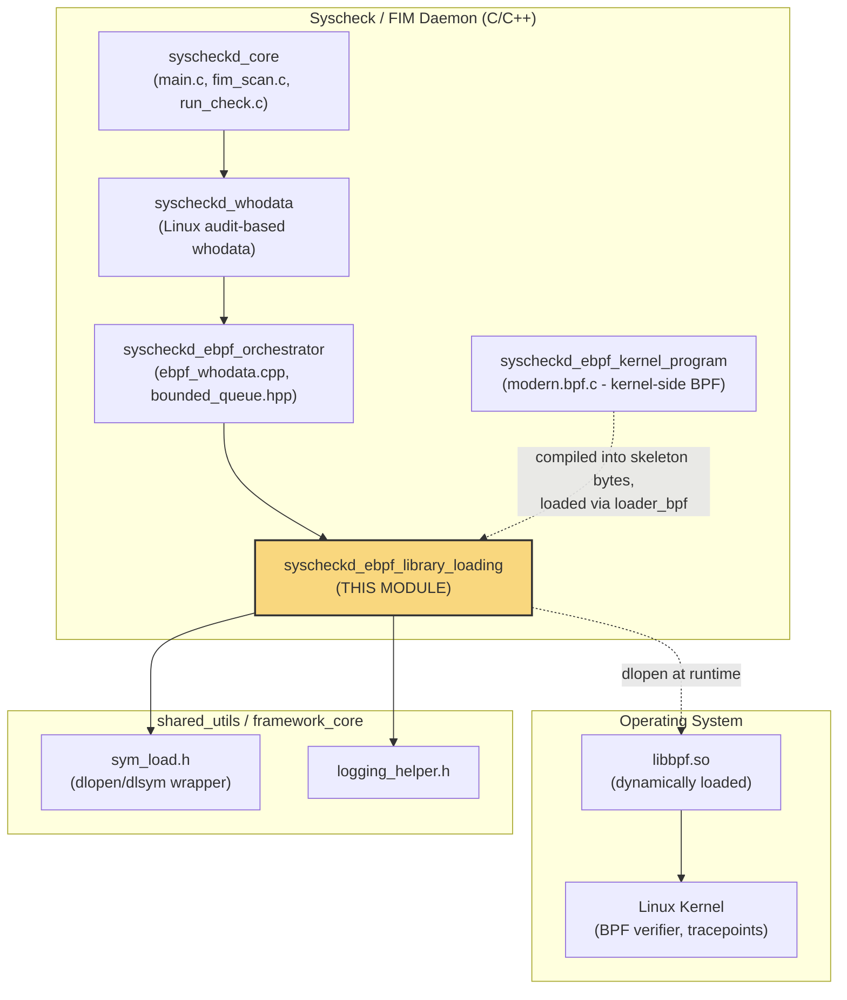
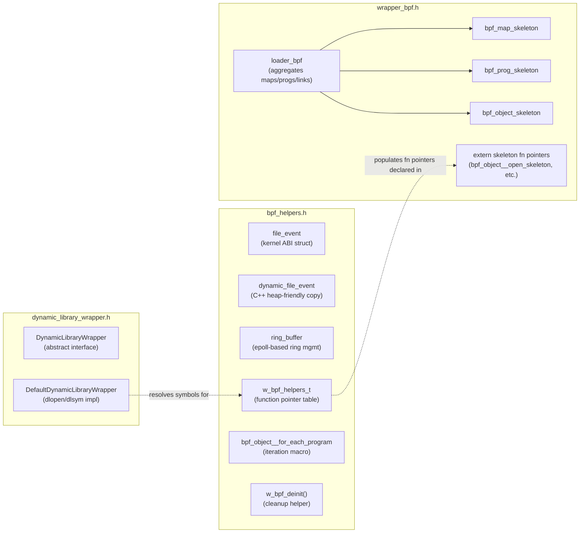
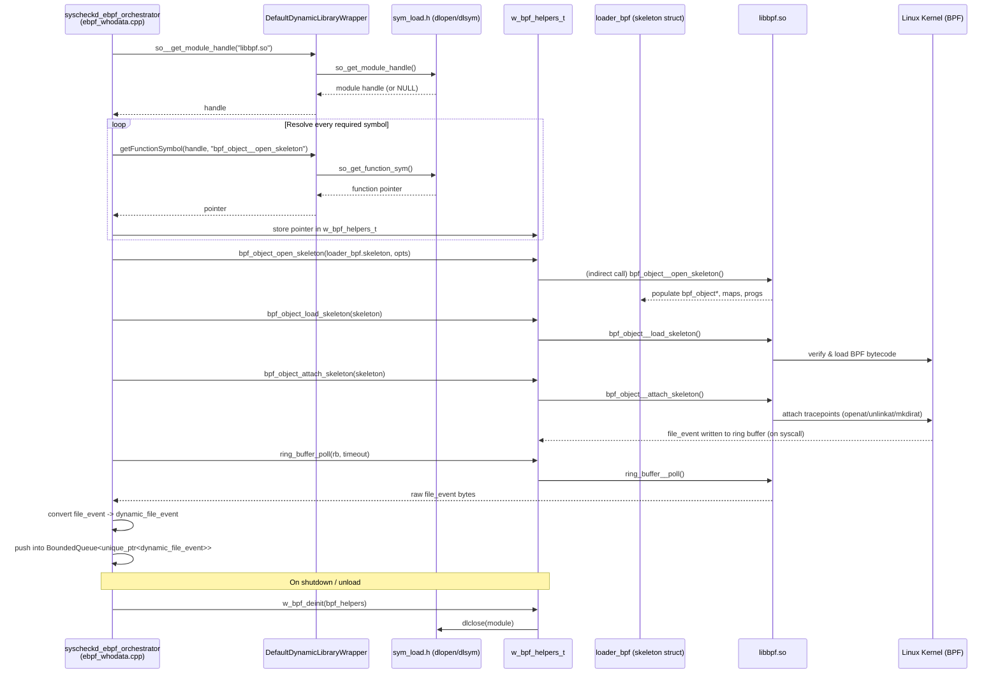
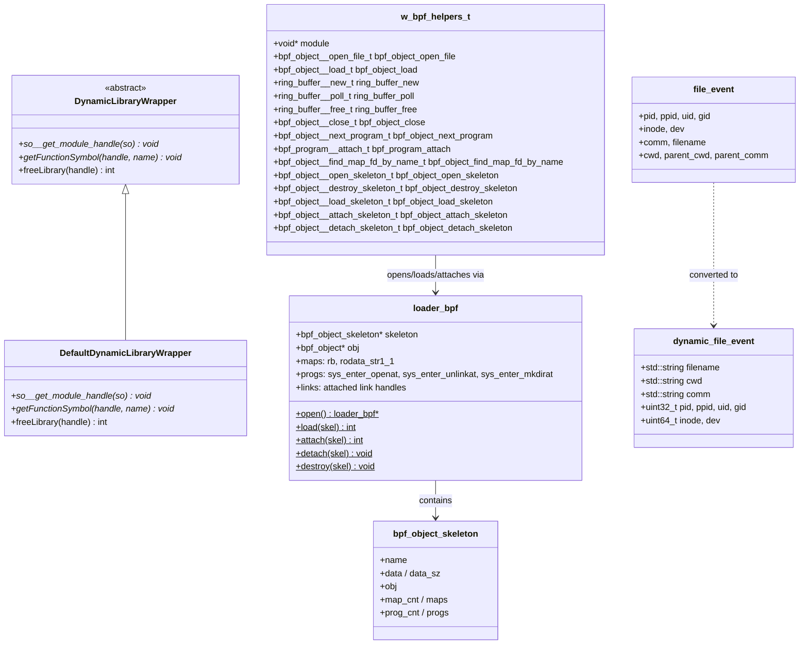
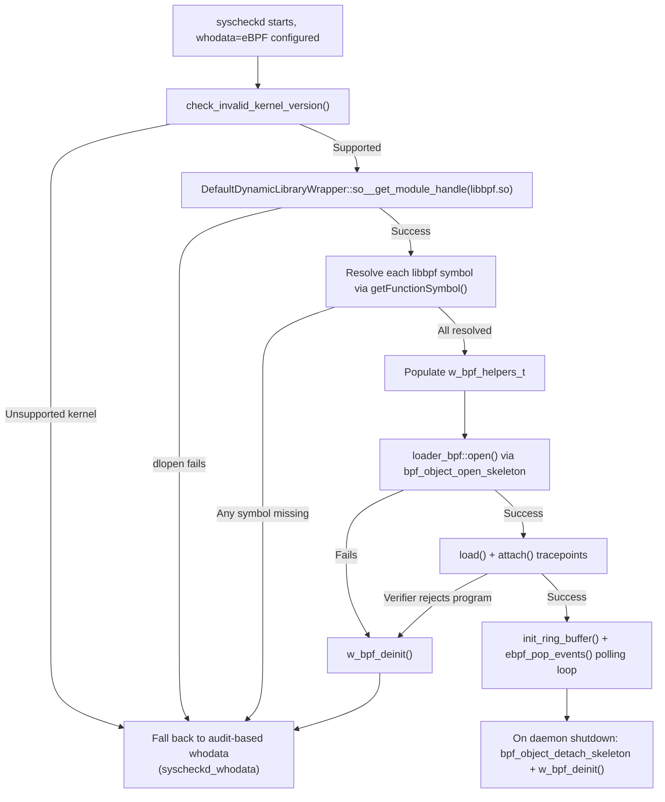

# Syscheckd eBPF Library Loading

## Introduction

The **`syscheckd_ebpf_library_loading`** module provides the low-level infrastructure that allows the Wazuh File Integrity Monitoring (FIM) daemon (`syscheckd`) to use Linux **eBPF** (extended Berkeley Packet Filter) capabilities **without requiring `libbpf` as a hard, build-time (or even run-time) dependency**.

Because eBPF support depends on kernel version, kernel configuration (`CONFIG_BPF`), and the availability of `libbpf.so` on the target system, Wazuh cannot statically link against `libbpf`. Instead, this module implements a **dynamic library loading layer**: it declares the C structures, function-pointer typedefs, and a small abstraction over `dlopen`/`dlsym` that let the higher-level eBPF orchestrator (`syscheckd_ebpf_orchestrator`) resolve `libbpf` symbols at runtime, gracefully falling back (or disabling the eBPF `whodata` backend) when the library or the required kernel features are not present.

In short, this module is the **"glue" layer between the compiled BPF program skeleton and the real `libbpf` shared library**, exposing a uniform, testable interface (`w_bpf_helpers_t`, `DynamicLibraryWrapper`) that the rest of `syscheckd` uses instead of calling `libbpf` functions directly.

---

## 1. Purpose and Core Functionality

| Responsibility | Description |
|---|---|
| **Dynamic symbol resolution** | Wraps `dlopen`/`dlsym`/`dlclose` (via `sym_load.h`) behind a mockable C++ interface (`DynamicLibraryWrapper`), enabling both real runtime loading and unit-test injection of fake libraries. |
| **libbpf ABI mirroring** | Declares C structures (`bpf_object_skeleton`, `bpf_map_skeleton`, `bpf_prog_skeleton`, `loader_bpf`) that mirror the structures auto-generated by `bpftool gen skeleton` for the compiled BPF program, so the loader can interact with libbpf's skeleton API without including the real `libbpf.h` at compile time. |
| **Function-pointer table** | Defines `w_bpf_helpers_t`, a struct of function pointers for every `libbpf` call needed (open/load/attach a BPF object, manage ring buffers, iterate BPF programs, look up map file descriptors, and skeleton-specific open/load/attach/detach/destroy calls). |
| **Event data structures** | Declares the plain-C `file_event` struct that matches the memory layout produced by the kernel-side BPF program (`syscheckd_ebpf_kernel_program`), plus a heap-friendly C++ `dynamic_file_event` (using `std::string`) used once data crosses from the kernel ring buffer into user space. |
| **Lifecycle helpers** | Provides `w_bpf_deinit()` to safely null out all function pointers and `dlclose()` the loaded module, preventing dangling function pointers after unload. |

This module does **not** itself perform eBPF program attachment/polling logic — that orchestration lives in `syscheckd_ebpf_orchestrator` (see `ebpf_whodata.cpp`). Instead, it supplies the **types and dynamic-loading primitives** that the orchestrator depends on.

---

## 2. Position in the Overall System

Related documentation:
- Sibling kernel-side program: see `syscheckd_ebpf_kernel_program.md`
- Consumer / orchestrator: see `syscheckd_ebpf_orchestrator.md`
- Parent daemon: see `syscheckd_core.md`
- Whodata (non-eBPF, audit-based alternative): see `syscheckd_whodata.md`
- Generic dynamic dispatch/queue patterns reused here: see `threading_dispatch_queues.md` and `design_patterns.md` (Shared Modules Infrastructure)

---

## 3. Architecture

The module is composed of three headers, each with a distinct responsibility:

### 3.1 `bpf_helpers.h`
- Defines the raw kernel-emitted event struct `file_event` (fixed-size C struct: PIDs, UIDs, inode, device, comm, filename, cwd, parent info) that **must match** the struct written by the BPF program in `syscheckd_ebpf_kernel_program`.
- Defines `dynamic_file_event`, the heap-allocated equivalent used once the event is copied out of the fixed-size ring buffer record into a `std::string`-based structure for safe queuing (works with `BoundedQueue<std::unique_ptr<dynamic_file_event>>` from `syscheckd_ebpf_orchestrator`).
- Declares `ring_buffer`, a struct tracking `epoll_event*` and internal libbpf `ring*` pointers used to multiplex multiple BPF ring buffers via a single `epoll` file descriptor.
- Declares numerous `typedef`s mirroring the exact signatures of `libbpf` functions (`bpf_object__open_file`, `bpf_object__load`, `ring_buffer__new`, `ring_buffer__poll`, `ring_buffer__free`, `bpf_object__close`, `bpf_object__next_program`, `bpf_program__attach`, `bpf_object__find_map_fd_by_name`) plus skeleton-lifecycle typedefs (`bpf_object__open_skeleton_t`, `..._load_skeleton_t`, `..._attach_skeleton_t`, `..._detach_skeleton_t`, `..._destroy_skeleton_t`).
- Aggregates all these function pointers into a single struct, `w_bpf_helpers_t`, plus a `void *module` handle (the result of `dlopen`). This struct is the **single source of truth** that the orchestrator uses to call into `libbpf` indirectly.
- Provides the `bpf_object__for_each_program` macro — a drop-in replacement for libbpf's native macro, but rewritten to invoke the function pointer stored in `w_bpf_helpers_t` instead of the statically-linked symbol.
- Implements `w_bpf_deinit()`, an inline cleanup routine that nulls every function pointer in `w_bpf_helpers_t` and calls `dlclose()` on the loaded module, avoiding use-after-free/dangling pointer issues if the module is unloaded mid-run.
- Declares four additional wrapper functions used by the FIM-specific eBPF integration layer: `init_ring_buffer`, `ebpf_pop_events`, `check_invalid_kernel_version`, `init_libbpf`, `init_bpfobj` (their implementations live in the orchestrator's `.cpp` file, but are declared here as part of the shared library-loading contract).

### 3.2 `dynamic_library_wrapper.h`
- Declares the abstract C++ interface `DynamicLibraryWrapper`, with three pure-virtual methods:
  - `so__get_module_handle(const char* so)` — obtains a handle to a shared object.
  - `getFunctionSymbol(void* handle, const char* function_name)` — resolves a symbol.
  - `freeLibrary(void* handle)` — releases the handle.
- Provides `DefaultDynamicLibraryWrapper`, the production implementation that simply forwards these calls to the C-level helpers `so_get_module_handle`, `so_get_function_sym`, and `so_free_library` defined in `sym_load.h` (part of the native daemon's shared library, see `shared_lib_file_io.md`).
- This indirection exists purely for **testability**: unit tests (`syscheckd_ebpf_orchestrator` test suites) can inject a mock `DynamicLibraryWrapper` to simulate missing libraries, symbol resolution failures, or specific `libbpf` versions without touching the real filesystem or kernel.

### 3.3 `wrapper_bpf.h`
- Mirrors the structures that `bpftool gen skeleton` normally auto-generates for a compiled BPF object file (the "skeleton" pattern used by modern `libbpf` workflows).
- `bpf_map_skeleton` / `bpf_prog_skeleton` describe individual BPF maps and programs embedded in the skeleton (name, pointer-to-pointer references for lazy binding).
- `bpf_object_skeleton` aggregates the embedded ELF bytes (`data`, `data_sz`), the map/program counts, and pointers to arrays of the above skeleton structs — this is the structure `libbpf`'s `bpf_object__open_skeleton()` consumes.
- `loader_bpf` is the **concrete skeleton instance** for the Wazuh FIM BPF program (`syscheckd_ebpf_kernel_program`). It exposes:
  - `maps`: `rb` (the ring buffer map) and `rodata_str1_1` (read-only data section).
  - `progs`: three tracepoint programs — `sys_enter_openat`, `sys_enter_unlinkat`, `sys_enter_mkdirat` — matching the BPF program's `SEC("tracepoint/...")` entry points defined in `modern.bpf.c`.
  - `links`: the corresponding attached-link handles once each program is loaded into the kernel.
  - (C++-only) static inline convenience declarations `open()`, `open_and_load()`, `load()`, `attach()`, `detach()`, `destroy()`, `elf_bytes()` mirroring the API shape libbpf normally auto-generates, kept here for interface compatibility even though the actual bodies dispatch through the dynamically-resolved function pointers.
- Declares `extern` function-pointer variables (`bpf_object__destroy_skeleton`, `bpf_object__open_skeleton`, `bpf_object__load_skeleton`, `bpf_object__attach_skeleton`, `bpf_object__detach_skeleton`) that are defined (as globals, default `NULL`) in `bpf_helpers.h` and populated once `dlsym()` succeeds.

---

## 4. Data Flow: From Dynamic Load to Kernel Event

Key points:
1. **No compile-time libbpf dependency.** All calls to `libbpf` go through function pointers resolved at runtime via `DynamicLibraryWrapper`.
2. **Skeleton pattern preserved.** Even though the real `libbpf.h`/generated skeleton is not linked, `wrapper_bpf.h` keeps the same structural shape (`bpf_object_skeleton`, `loader_bpf`) so the embedded BPF bytecode (compiled from `syscheckd_ebpf_kernel_program`) can still be opened/loaded/attached through libbpf's skeleton API.
3. **ABI-matching event struct.** `file_event` in `bpf_helpers.h` must stay binary-compatible with the struct populated by the kernel-side BPF program (`modern.bpf.c`) since data is read directly from the ring buffer without any serialization protocol.
4. **Graceful degradation.** If `dlopen`/`dlsym` fail (missing `libbpf.so`, incompatible kernel, function symbol not found), `w_bpf_helpers_t` fields remain `NULL`, allowing the orchestrator to detect the failure and fall back to the audit-based `syscheckd_whodata` backend instead of crashing.

---

## 5. Component Relationships

---

## 6. Interaction with Neighboring Modules

| Module | Relationship |
|---|---|
| **`syscheckd_ebpf_kernel_program`** (`modern.bpf.c`) | Provides the compiled BPF bytecode and defines the kernel-side `file_event` layout that this module's `file_event` struct must match. Compiled and embedded as the `data`/`data_sz` bytes referenced by `bpf_object_skeleton`. |
| **`syscheckd_ebpf_orchestrator`** (`ebpf_whodata.cpp`, `bounded_queue.hpp`, `fimebpf` singleton) | The primary consumer of this module. It instantiates `DefaultDynamicLibraryWrapper`, populates `w_bpf_helpers_t`, drives the `loader_bpf` skeleton lifecycle, and drains ring-buffer events into a `BoundedQueue<std::unique_ptr<dynamic_file_event>>` for downstream FIM processing (`fim_whodata_event`). See `syscheckd_ebpf_orchestrator.md`. |
| **`syscheckd_whodata`** | The Linux `auditd`-based alternative to eBPF whodata monitoring. When eBPF library loading fails (missing `libbpf`, unsupported kernel), `syscheckd` falls back to this audit-based mechanism. See `syscheckd_whodata.md`. |
| **`shared_lib_file_io`** (`sym_load.h`) | Supplies the actual `dlopen`/`dlsym`/`dlclose` wrapper functions (`so_get_module_handle`, `so_get_function_sym`, `so_free_library`) that `DefaultDynamicLibraryWrapper` forwards to. |
| **`shared_lib_logging`** (`logging_helper.h`) | Used for reporting library-loading failures and diagnostic messages (`loggingFunction_t` callback registered in the `fimebpf` singleton). |
| **`syscheckd_core`** | The overall FIM daemon lifecycle (`main.c`, `run_check.c`) that decides, based on configuration and kernel probing, whether to initialize the eBPF path at all. |

---

## 7. Failure Handling & Kernel Compatibility

Since eBPF availability varies widely across distributions and kernel versions, the loading layer is designed defensively:

This design ensures that a missing or incompatible `libbpf` never crashes `syscheckd`; it simply prevents the eBPF whodata path from activating, and control returns to the caller (`syscheckd_ebpf_orchestrator`) to select an alternative monitoring strategy.

---

## 8. Summary

The `syscheckd_ebpf_library_loading` module is a small but critical **compatibility and abstraction layer**. It:

- Declares libbpf-compatible C structures without requiring the real `libbpf` headers or linkage.
- Centralizes every dynamically-resolved `libbpf` function pointer in a single struct (`w_bpf_helpers_t`).
- Wraps OS-level dynamic loading (`dlopen`/`dlsym`) behind a mockable C++ interface (`DynamicLibraryWrapper`).
- Defines the exact memory layout for kernel-to-userspace event data (`file_event`) and its safe, heap-allocated counterpart (`dynamic_file_event`).
- Provides deterministic cleanup (`w_bpf_deinit`) to avoid dangling pointers when the eBPF path is disabled or the daemon shuts down.

For the logic that actually **uses** these primitives to open, load, attach, and poll BPF programs, see the sibling module **`syscheckd_ebpf_orchestrator`**. For the BPF bytecode itself, see **`syscheckd_ebpf_kernel_program`**.
