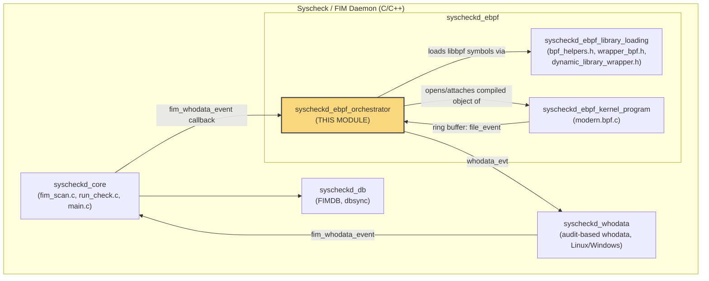
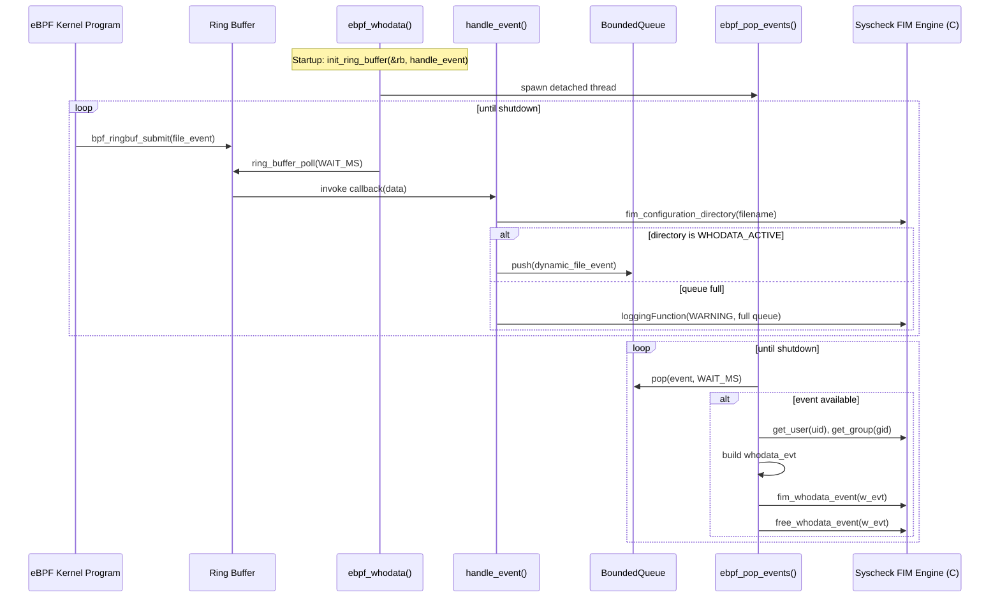
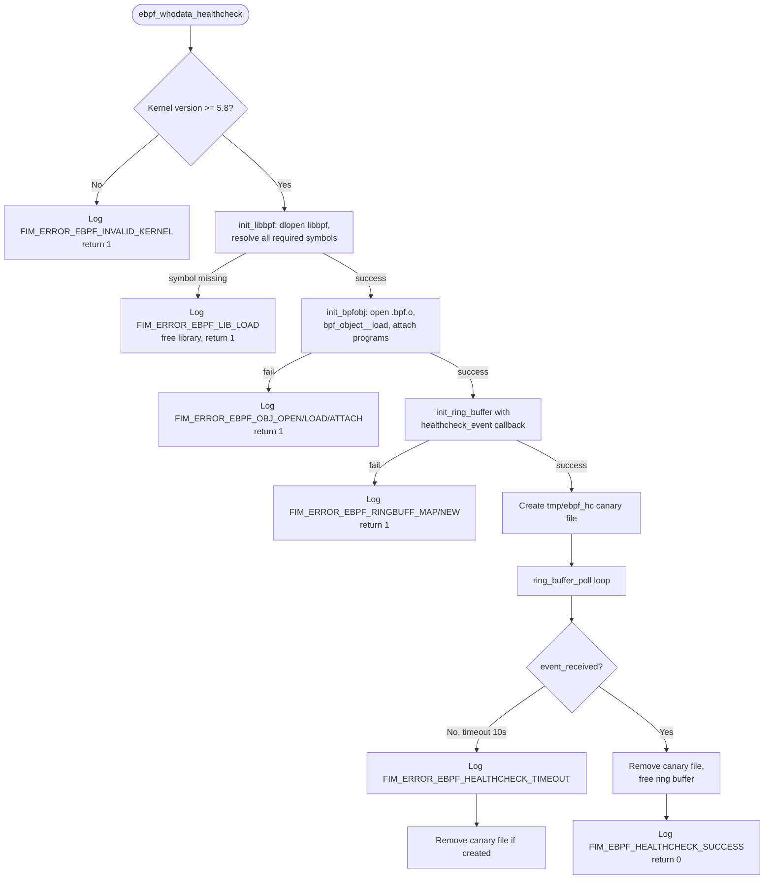
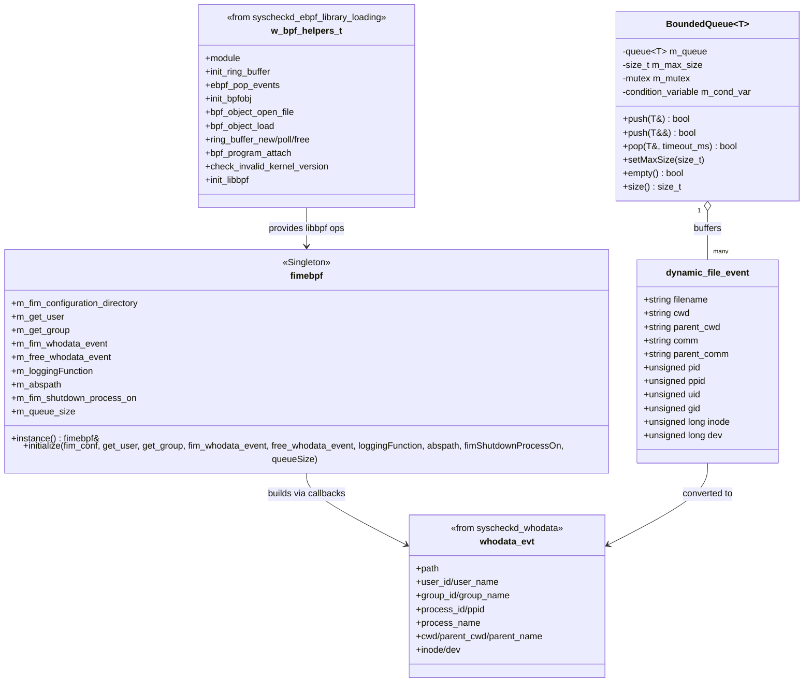

# Syscheckd eBPF Orchestrator

## Introduction

The **Syscheckd eBPF Orchestrator** is the runtime coordination layer of Wazuh's File Integrity Monitoring (FIM) eBPF whodata backend on Linux. It sits between the low-level eBPF kernel program (`modern.bpf.c`) and libbpf loading machinery (`syscheckd_ebpf_library_loading`) on one side, and the core Syscheck/FIM engine (`syscheckd_core`, `syscheckd_whodata`) on the other.

Its responsibilities are:

- **Bootstrapping** the eBPF subsystem: verifying kernel version compatibility, dynamically loading `libbpf` symbols, opening/loading/attaching the compiled BPF object, and setting up a ring buffer to receive kernel events.
- **Bridging kernel and user space**: consuming raw `file_event` records pushed by the kernel program through a ring buffer, converting them into rich `dynamic_file_event` objects, buffering them in a thread-safe `BoundedQueue`, and finally translating them into Syscheck's native `whodata_evt` structures consumed by the FIM engine.
- **Health-checking** the eBPF pipeline at startup by writing a canary file and confirming that a corresponding kernel event round-trips through the ring buffer within a timeout window.
- **Graceful shutdown**, tearing down the ring buffer, BPF object, and dynamically loaded library when the daemon is stopping.

This module is a leaf/detail component of the broader `Syscheck / FIM Daemon (C/C++)` subsystem and is Linux-specific (eBPF is a Linux kernel technology). It has no direct HTTP/API surface — it operates purely as an internal producer/consumer pipeline embedded inside the `syscheck` daemon process.

---

## Position in the System

Related documentation:
- [syscheckd_core.md](syscheckd_core.md) — daemon lifecycle, scan engine, realtime monitoring that calls into whodata.
- [syscheckd_whodata.md](syscheckd_whodata.md) — the audit-based (non-eBPF) whodata alternative and shared `whodata_evt`/`whodata_directory_t` data types.
- [syscheckd_ebpf_library_loading.md](syscheckd_ebpf_library_loading.md) — the low-level `libbpf` dynamic symbol resolution wrappers used by the orchestrator.
- [syscheckd_db.md](syscheckd_db.md) — persistence layer that ultimately stores FIM events derived from whodata.
- [shared_utils.md](shared_utils.md) — generic C++ utility primitives (queues, dispatchers) that inspired/parallel `BoundedQueue`.

---

## Core Components

| Component | File | Purpose |
|---|---|---|
| `fimebpf` (singleton) | `ebpf_whodata.hpp` | Holds function pointers injected from the C FIM engine (config lookup, user/group resolution, event callbacks, logging, path resolution, shutdown check) and orchestration state (queue size). |
| `BoundedQueue<T>` | `bounded_queue.hpp` | Thread-safe, size-bounded FIFO queue with blocking `pop` (with timeout) and non-blocking `push`; used to decouple the ring-buffer polling thread from the event-processing thread. |
| `ebpf_whodata()` | `ebpf_whodata.cpp` | Main entry point that runs the eBPF whodata monitoring loop: initializes the ring buffer, spawns the popping thread, and polls until shutdown. |
| `ebpf_whodata_healthcheck()` | `ebpf_whodata.cpp` | Standalone startup validation routine that loads libbpf, attaches the BPF object, and confirms an actual kernel event can be observed within a timeout. |
| `handle_event()` | `ebpf_whodata.cpp` | Ring buffer sample callback for normal operation; filters events by FIM directory configuration and enqueues them. |
| `healthcheck_event()` | `ebpf_whodata.cpp` | Ring buffer sample callback used only during health-check; detects the canary file event. |
| `init_libbpf()` / `init_bpfobj()` / `init_ring_buffer()` | `ebpf_whodata.cpp` | Bootstrapping helpers: resolve libbpf symbols, open/load/attach the compiled `.bpf.o`, and create the ring buffer bound to the `rb` BPF map. |
| `ebpf_pop_events()` | `ebpf_whodata.cpp` | Worker function (run on a detached thread) that pops `dynamic_file_event`s from the `BoundedQueue`, converts them to `whodata_evt`, and forwards them to the FIM engine callback. |
| `fimebpf_initialize()` (C ABI) | `ebpf_whodata.cpp` | C-linkage initialization function called from the Syscheck daemon (C code) to inject callbacks/dependencies into the `fimebpf` singleton. |

---

## Architecture

The orchestrator follows a **Facade + Singleton + Producer/Consumer** design:

- `fimebpf` is a **Singleton Facade** exposing C-injected dependencies (from the daemon's C codebase) to the C++ eBPF code, avoiding tight coupling and enabling unit-test mocking (see `syscheckd_ebpf_library_loading` wrappers and `linux/ebpf_wrappers.c` test doubles).
- `bpf_helpers` (a `w_bpf_helpers_t`, defined in `syscheckd_ebpf_library_loading`) stores dynamically resolved libbpf function pointers, loaded once via `dlopen`-style resolution (`DefaultDynamicLibraryWrapper`).
- The **kernel ⇄ user-space bridge** uses two threads:
  1. **Ring-buffer polling thread** (main thread of `ebpf_whodata()`): calls `ring_buffer_poll()`, which synchronously invokes `handle_event()` for each new kernel record.
  2. **Event-processing thread** (`ebpf_pop_events`, detached): blocks on `BoundedQueue::pop()` with a timeout, converts data, and calls into the Syscheck FIM engine.

```mermaid
graph LR
    subgraph "Kernel Space"
        BPFPROG["eBPF Program<br/>(modern.bpf.c)<br/>kprobes: vfs_open, vfs_unlink,<br/>security_inode_setattr"]
        RINGBUF["BPF Ring Buffer (rb map)"]
        BPFPROG -->|bpf_ringbuf_reserve/submit| RINGBUF
    end

    subgraph "User Space: syscheckd_ebpf_orchestrator"
        POLL["ring_buffer_poll loop<br/>(ebpf_whodata)"]
        HANDLE["handle_event() callback"]
        BQ["BoundedQueue&lt;dynamic_file_event&gt;<br/>(kernelEventQueue)"]
        POPTHREAD["ebpf_pop_events()<br/>(detached worker thread)"]
        FIMEBPF["fimebpf singleton<br/>(injected callbacks)"]
    end

    subgraph "Syscheck FIM Engine"
        WEVT["whodata_evt"]
        CALLBACK["fim_whodata_event()"]
    end

    RINGBUF -->|poll| POLL
    POLL --> HANDLE
    HANDLE -->|fim_configuration_directory filter| FIMEBPF
    HANDLE -->|push dynamic_file_event| BQ
    BQ -->|pop w/ timeout| POPTHREAD
    POPTHREAD -->|get_user/get_group, build| WEVT
    POPTHREAD -->|invoke via FIMEBPF| CALLBACK
    WEVT --> CALLBACK

    style POLL fill:#cde,stroke:#333
    style POPTHREAD fill:#cde,stroke:#333
    style BQ fill:#ffe,stroke:#333
```

---

## Data Flow: Normal Whodata Monitoring

---

## Startup / Health-check Flow

Before enabling eBPF-based whodata monitoring in production, Syscheck invokes `ebpf_whodata_healthcheck()` to validate that the entire pipeline (kernel compatibility, libbpf availability, BPF object load/attach, ring buffer delivery) works end-to-end.

Key detail: the healthcheck deliberately writes and deletes a temporary file (`tmp/ebpf_hc`) whose path is matched by `healthcheck_event()` inside the kernel-triggered ring buffer callback — this is the only reliable way to prove the kernel→user-space delivery path is functional without depending on unrelated filesystem activity.

---

## Component Interaction Diagram

---

## Concurrency Model

| Thread | Function | Behavior |
|---|---|---|
| Main eBPF thread | `ebpf_whodata()` | Runs `ring_buffer_poll()` in a loop with a 500 ms (`WAIT_MS`) timeout; exits when `fimShutdownProcessOn()` returns true. |
| Event worker thread | `ebpf_pop_events()` (detached) | Blocks on `kernelEventQueue.pop()` with the same 500 ms timeout; converts and dispatches events; also checks shutdown flag each iteration. |
| Kernel callback context | `handle_event()` / `healthcheck_event()` | Invoked synchronously from within `ring_buffer_poll()` on the polling thread — must be fast and non-blocking (only a queue push). |

The `BoundedQueue` mutex/condition-variable pair is the sole synchronization primitive between the two threads, making backpressure explicit: if the queue is full, `handle_event()` drops the event and logs a one-time warning (`ebpf_kernel_queue_full_reported` latch) rather than blocking the polling thread — this protects the ring buffer consumer from being starved by a slow FIM engine.

---

## Error Handling & Logging

All fallible operations funnel through the injected `m_loggingFunction` (of type `modules_log_level_t, const char*`), which is the standard Wazuh logging bridge. Notable failure modes:

- **Invalid kernel version** (< 5.8): eBPF ring buffers require a modern kernel; the orchestrator refuses to proceed.
- **libbpf symbol resolution failure**: any missing symbol (e.g., `bpf_object__open_file`, `ring_buffer__new`) aborts initialization and frees the loaded library handle.
- **BPF object open/load/attach failure**: reported with the underlying `strerror(errno)` for diagnosability.
- **Ring buffer map lookup failure** (`bpf_object__find_map_fd_by_name` for `"rb"`): indicates a mismatch between the compiled BPF object and the expected map name.
- **Healthcheck timeout** (10 seconds): the canary event was not observed — likely a permissions or eBPF verifier issue.
- **Queue saturation**: warned once per queue-full condition to avoid log flooding, using the `ebpf_kernel_queue_full_reported` flag.

---

## Dependencies

- **[syscheckd_ebpf_kernel_program](syscheckd_ebpf_kernel_program.md)** — supplies the compiled `.bpf.o` (`modern.bpf.c`) with kprobes on `vfs_open`, `vfs_unlink`, and `security_inode_setattr`, and defines the `file_event` struct read by `handle_event`.
- **[syscheckd_ebpf_library_loading](syscheckd_ebpf_library_loading.md)** — provides `bpf_helpers.h` / `wrapper_bpf.h` type definitions and the `DynamicLibraryWrapper` / `DefaultDynamicLibraryWrapper` abstraction used to dynamically resolve `libbpf` symbols at runtime (avoiding a hard link-time dependency).
- **[syscheckd_whodata](syscheckd_whodata.md)** — defines `whodata_evt` and is the ultimate consumer of orchestrator output via `fim_whodata_event()`; this module is the eBPF-based alternative to the audit-based whodata implementation there.
- **[syscheckd_core](syscheckd_core.md)** — the daemon lifecycle (`main.c`, `fim_shutdown`) that decides when to start/stop eBPF monitoring and supplies the `fim_configuration_directory` lookup and shutdown signal (`fimShutdownProcessOn`).
- **[shared_utils](shared_utils.md)** — `BoundedQueue` mirrors design patterns found in the broader shared C++ utilities (e.g., `TSafeQueue`, `threadSafeQueue.h`), though it is a self-contained header local to this module for FIM-specific use.

---

## Summary

The Syscheckd eBPF Orchestrator is a compact but critical piece of infrastructure: it turns raw, high-volume kernel filesystem events captured by eBPF kprobes into structured, throttled, and enriched `whodata_evt` records that the rest of Syscheck's FIM pipeline already understands. By isolating kernel interaction (ring buffer polling), dynamic library loading, and event transformation behind a singleton facade (`fimebpf`) and a bounded producer/consumer queue, it keeps the eBPF-specific complexity contained and testable, while presenting the same `whodata_evt` contract used by the audit-based whodata backend.
