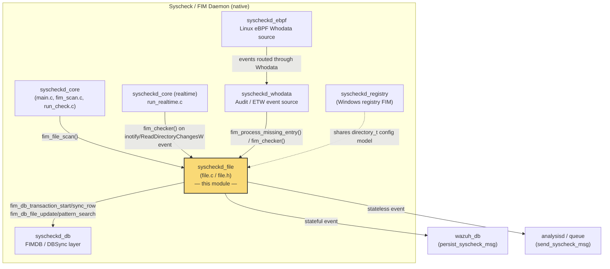
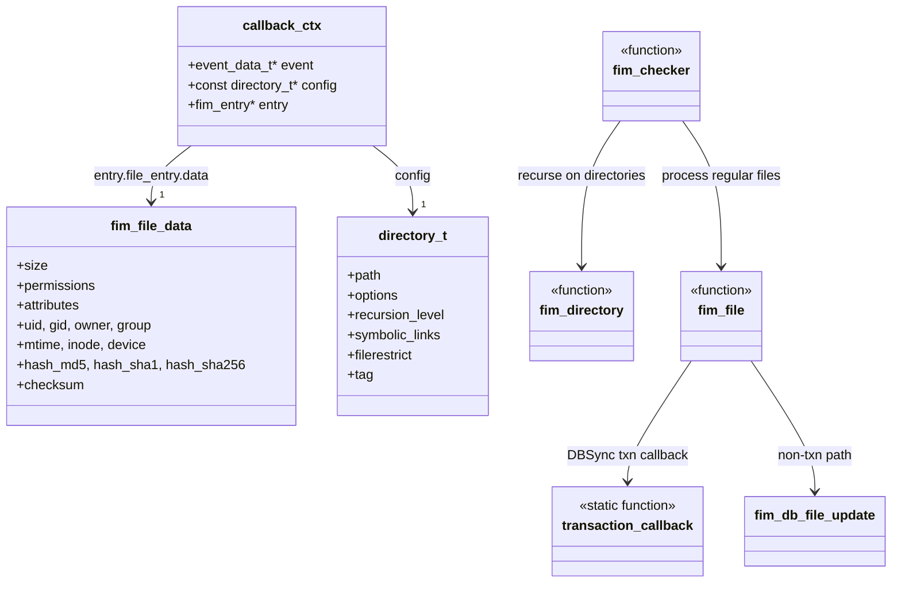
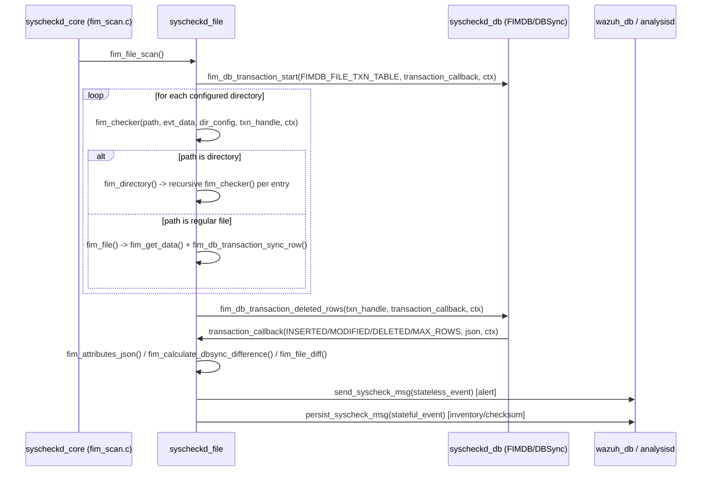
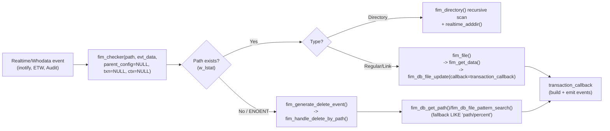

# Syscheckd File Module

## 1. Purpose and Overview

The **`syscheckd_file`** module is the **regular-file scanning engine** of the Wazuh **Syscheck (File Integrity Monitoring / FIM) daemon**. It is responsible for:

- Walking the configured directory tree(s) and evaluating every file/directory against Syscheck configuration (recursion depth, ignore/restrict rules, filesystem exclusions).
- Collecting file metadata and cryptographic checksums (size, permissions, owner/group, timestamps, MD5/SHA1/SHA256) into `fim_file_data` structures.
- Persisting scan results into the FIM database via DBSync transactions (see [`syscheckd_db.md`](syscheckd_db.md)).
- Generating **stateless** (alert) and **stateful** (inventory/checksum) JSON events for file additions, modifications, and deletions, and forwarding them to the analysis/persistence pipeline.
- Handling deletion detection, both through direct filesystem checks and DBSync's transactional "deleted rows" mechanism (important for symlink range deletions and missing-entry reconciliation).

This module is one of several sibling components inside the native Syscheck/FIM daemon (see [`syscheckd_core.md`](syscheckd_core.md) for the daemon lifecycle that drives it). It is invoked by the core scan loop (`fim_scan.c`) and by the real-time (`syscheckd_core`'s `run_realtime.c`) and Whodata (see [`syscheckd_whodata.md`](syscheckd_whodata.md)) subsystems whenever a filesystem path needs to be (re)evaluated.

## 2. Architecture Overview

### 2.1 Component Placement

### 2.2 Internal Structure

## 3. Data Flow

### 3.1 Scheduled Scan Flow (`fim_file_scan`)

### 3.2 Real-time / Whodata / Missing-Entry Flow

## 4. Core Components

### 4.1 Configuration Resolution

| Function | Responsibility |
|---|---|
| `fim_configuration_directory(key)` | Finds the most specific `directory_t` configuration entry (longest matching prefix) applicable to a given path. Used by nearly every other function in the module to look up scan options, recursion level, restrictions, and tags. |
| `fim_check_depth(path, configuration)` | Computes the recursion depth of `path` relative to its monitored root, used to enforce `recursion_level`. |
| `fim_check_ignore(file_name, path_type)` | Applies `syscheck.ignore` literal and `syscheck.ignore_regex` regex exclusion lists. |
| `fim_check_restrict(file_name, restriction)` | Applies the `restrict` regex configured for a directory (only matching files are monitored). |
| `fim_get_real_path(dir)` | Resolves the effective path to scan, accounting for symbolic-link following (`CHECK_FOLLOW`) and broken links. |

### 4.2 Metadata & Checksum Collection

| Function | Responsibility |
|---|---|
| `fim_get_data(file, configuration, statbuf)` | Builds a `fim_file_data` structure: size, permissions (POSIX mode or Windows ACL JSON), attributes, owner/group, mtime, inode/device, and MD5/SHA1/SHA256 hashes (skipped for symlinks, empty files, or files over `file_max_size`). |
| `fim_get_checksum(data)` | Serializes all relevant `fim_file_data` fields into a canonical string and computes its SHA1 as the entry's `checksum`, used for change detection and DBSync integrity comparisons. |
| `init_fim_data_entry(data)` / `free_file_data(data)` | Lifecycle helpers for `fim_file_data` allocation/cleanup (including Windows ACL `cJSON` object). |

### 4.3 Traversal & Dispatch

| Function | Responsibility |
|---|---|
| `fim_checker(path, evt_data, parent_configuration, dbsync_txn, ctx)` | The central dispatcher. Resolves configuration, enforces mode consistency (scheduled vs. real-time vs. Whodata), checks recursion depth, `lstat`s the path, and routes to `fim_file` (regular files/links) or `fim_directory` (directories). Handles deleted-path detection outside of scheduled scans. |
| `fim_directory(dir, evt_data, configuration, dbsync_txn, ctx)` | Opens a directory and calls `fim_checker` recursively for every entry, building full paths and handling Windows path-length limits and lower-casing. |
| `fim_file(path, configuration, evt_data, txn_handle, txn_context)` | Collects file data via `fim_get_data`, then either performs a DBSync **transactional sync row** (during full scans, `txn_handle != NULL`) or an immediate **non-transactional update** with `fim_db_file_update` (real-time/Whodata single-file events), both driving `transaction_callback`. |
| `fim_file_scan()` | Entry point for the scheduled full scan: opens a DBSync transaction, iterates all monitored directories (also registering real-time watches when applicable), then triggers `fim_db_transaction_deleted_rows` to detect and report files removed since the last scan. |

### 4.4 Deletion Handling

| Function | Responsibility |
|---|---|
| `fim_process_missing_entry(pathname, mode, w_evt)` | Entry point used when a path is suspected missing (e.g., from Whodata or reconciliation); validates configuration/mode and delegates to `fim_handle_delete_by_path`. |
| `fim_generate_delete_event(file_path, evt_data, configuration)` | Thin wrapper invoked by DBSync's deleted-row callback and by direct-deletion detection in `fim_checker`. |
| `fim_handle_delete_by_path(path, evt_data, config, to_delete, fallback_cb)` | Looks up the entry in the FIM DB (`fim_db_get_path`); if `to_delete`, removes it and emits a delete event via the shared `transaction_callback`; if not found and `fallback_cb` is set, falls back to a `LIKE 'path/%'` pattern search (`fim_db_file_pattern_search`) to catch orphaned children (e.g., after symlink retargeting). |
| `fim_link_delete_range(config)` | Specialized deletion routine for a symbolic link that changed target: removes all DB entries whose path is prefixed by the *old* link target, validating via `fim_db_remove_validated_path` that they still belong to the given configuration before deleting. |
| Callback: `fim_db_remove_entry` | DBSync-agnostic callback that turns a raw path string into a delete event (used by pattern-search fallback). |
| Callback: `fim_db_process_missing_entry` | Callback used when re-validating an entry that DBSync reports as present but which must be re-checked on disk. |
| Callback: `fim_db_remove_validated_path` | Callback used by `fim_link_delete_range` — only deletes an entry if its *current* configuration matches the one passed in context (guards against deleting entries that migrated to a different directory config). |

### 4.5 Event Construction — `transaction_callback`

`transaction_callback` (static/`STATIC` for unit testing) is the single point where DBSync results become Wazuh events. Its responsibilities:

1. Resolve the affected `path` (from the `fim_entry` in context, or from the DBSync JSON for deletions).
2. Resolve/attach the `directory_t` configuration if not already known.
3. Compute a content diff via `fim_file_diff` when `CHECK_SEECHANGES` is enabled (skipped for deletions, where `fim_diff_process_delete_file` cleans up stored diffs instead).
4. Map the DBSync `ReturnTypeCallback` (`INSERTED` / `MODIFIED` / `DELETED` / `MAX_ROWS`) to a Wazuh `fim_event_type` (`FIM_ADD` / `FIM_MODIFICATION` / `FIM_DELETE`).
5. Build the **stateless event** (`collector: file`, `module: fim`) containing `data.event` (type, timestamp, changed fields) and `data.file` (attributes via `fim_attributes_json`, path, mode, optional `content_changes`, `audit`, `tags`).
6. Duplicate the file attributes into a **stateful event** (`file`, `checksum.hash.sha1`) representing the current inventory state for persistence.
7. Compute `changed_attributes`/`previous` values via `fim_calculate_dbsync_difference` when old data is present; suppresses events with no actual attribute changes.
8. Dispatch: `send_syscheck_msg(stateless_event)` for alerting (subject to `report_event`/`notify_scan`), and `persist_syscheck_msg(stateful_event)` for inventory storage.

## 5. Key Data Structures

- **`callback_ctx`** (`file.h`): the context object threaded through almost every function and DBSync callback — bundles the triggering `event_data_t`, the resolved `directory_t` configuration, and (optionally) the `fim_entry` being processed.
- **`fim_file_data`**: per-file metadata/checksum snapshot (declared in the shared `syscheck.h` header, populated by `fim_get_data`).
- **`directory_t`**: the monitored-directory configuration (declared in `syscheck-config.h`, part of [`Syscheck_Config`](Syscheck_Config.md) in the Configuration Data Structures module) — carries scan options bitmask, recursion level, restriction/ignore regex, tags, and symlink metadata.

## 6. Integration Points

| Related Module | Relationship |
|---|---|
| [`syscheckd_core.md`](syscheckd_core.md) | Owns the daemon lifecycle, scheduled scan orchestration (`fim_scan.c` calls `fim_file_scan()`), and real-time dispatch (`run_realtime.c` calls `fim_checker()` on filesystem events). |
| [`syscheckd_db.md`](syscheckd_db.md) | Provides the DBSync/FIMDB primitives consumed here: `fim_db_transaction_start/sync_row/deleted_rows`, `fim_db_file_update`, `fim_db_get_path`, `fim_db_file_pattern_search`. |
| [`syscheckd_whodata.md`](syscheckd_whodata.md) | Supplies who-data context (`whodata_evt`) attached to events via `fim_audit_json`, and triggers `fim_checker`/`fim_process_missing_entry` on audit-detected changes. |
| [`syscheckd_registry.md`](syscheckd_registry.md) | Sibling component handling the Windows Registry equivalent of this file-scanning logic; shares the `directory_t`/event-model conventions. |
| [`syscheckd_ebpf.md`](syscheckd_ebpf.md) | On Linux, supplies low-level file events that are funneled through the Whodata subsystem into this module's checker functions. |
| [`Syscheck_Config.md`](Syscheck_Config.md) | Defines the `directory_t`, `syscheck_config`, and related structures that configure this module's behavior (recursion, checks, ignore/restrict rules). |
| `wazuh_db` daemon | Receiving end of `persist_syscheck_msg` (stateful/inventory events) — see the top-level `wazuh_db` module tree entry. |
| Wazuh Modules Daemon (`wm_syscollector`/analysis pipeline) | Receiving end of `send_syscheck_msg` (stateless/alert events) which are forwarded into the alerting pipeline. |

## 7. Notable Design Points

- **Dual-mode file update**: `fim_file` supports both a *transactional* path (bulk scheduled scans, using `fim_db_transaction_sync_row` so all changes commit atomically together with deletion detection) and a *direct* path (single real-time/Whodata events, using `fim_db_file_update`). Both converge on the same `transaction_callback` for event generation, ensuring consistent event shape regardless of trigger source.
- **Mode consistency enforcement**: `fim_checker` explicitly rejects processing a path under the wrong trigger mode (e.g., a real-time event for a directory configured for Whodata-only monitoring) to avoid duplicate/incorrect events, except in scheduled mode, which always processes using the parent's original configuration to keep DB state accurate.
- **Symlink safety**: `fim_get_real_path` synchronizes access to `syscheck.fim_symlink_mutex` when resolving symlink targets, and `fim_link_delete_range`/`fim_db_remove_validated_path` guard against wrongly deleting entries that have since moved to a different monitored path when a symlink target changes.
- **Cross-platform abstraction**: Windows-specific paths (ACL JSON via `w_get_file_permissions`/`decode_win_acl_json`, file attributes via `w_get_file_attrs`, UTF-8 path conversion) are isolated behind `#ifdef WIN32` blocks while sharing the same core traversal/event logic as POSIX systems.

## 8. Note on Sub-Module Documentation

Given its small, tightly-coupled scope (a single `.c`/`.h` pair implementing one cohesive responsibility — file scanning and event generation), this module is documented as a single file rather than split into sub-modules. Related sibling responsibilities within the Syscheck/FIM daemon are documented separately: [`syscheckd_core.md`](syscheckd_core.md) (lifecycle/orchestration), [`syscheckd_db.md`](syscheckd_db.md) (persistence layer), [`syscheckd_whodata.md`](syscheckd_whodata.md) (who-data event sources), [`syscheckd_registry.md`](syscheckd_registry.md) (Windows registry FIM), and [`syscheckd_ebpf.md`](syscheckd_ebpf.md) (Linux eBPF event source).
