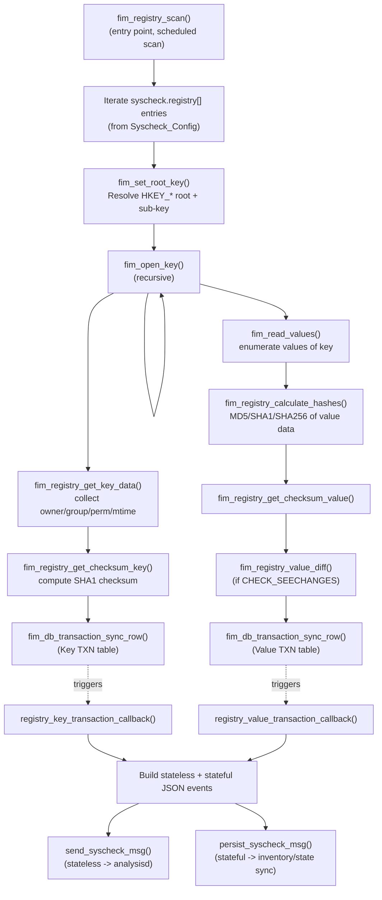
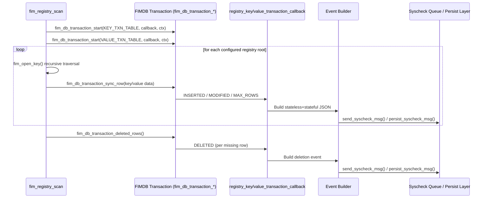
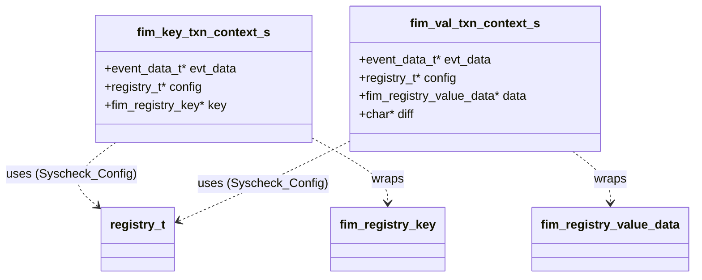
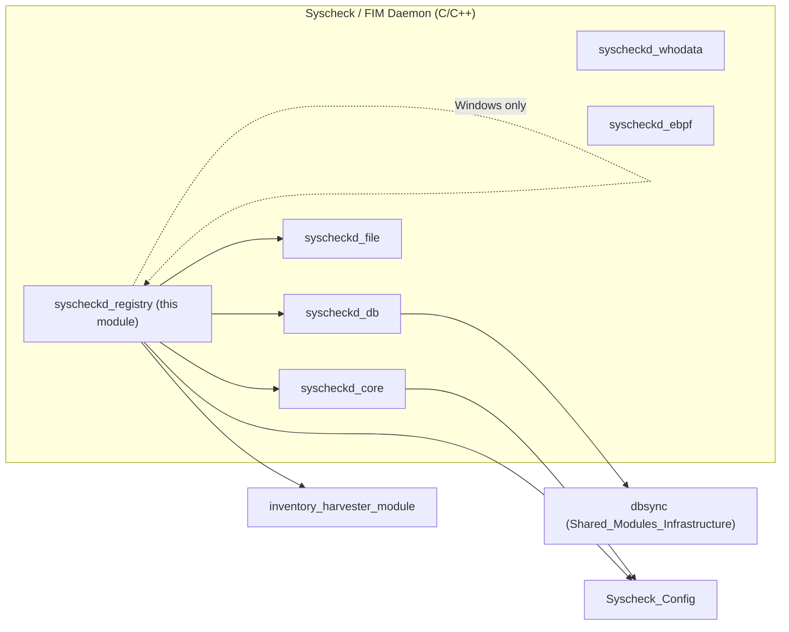

# Syscheckd Registry Module

## 1. Introduction and Purpose

The **Syscheckd Registry** module implements **Windows Registry File Integrity Monitoring (FIM)** for the Wazuh agent. It is the Windows-only counterpart of the filesystem monitoring logic found in [`syscheckd_file`](syscheckd_file.md), and it is compiled exclusively under `WIN32` (the entire implementation is guarded by `#ifdef WIN32 ... #endif`).

Its responsibilities are to:

- Recursively **scan configured registry keys and their values**, honoring the same kind of configuration primitives used for file monitoring (recursion level, ignore lists, restrict regexes, `check_*` options).
- **Detect additions, modifications, and deletions** of registry keys/values by synchronizing scan results against the local FIM database via **DBSync transactions**.
- **Compute checksums** (SHA1) and, optionally, content hashes (MD5/SHA1/SHA256) of registry values to detect changes.
- Build and emit both **stateless events** (sent to `analysisd` through the syscheck queue for real-time alerting) and **stateful events** (persisted for state/inventory synchronization), including calculation of `changed_attributes`/`previous` fields when values differ from previous scans.
- Support the same set of protections used elsewhere in Syscheck: **ignore lists/regexes**, **restrict filters**, and **recursion-level enforcement**, applied specifically to registry hives (`HKLM`, `HKCR`, `HKCU`, `HKU`, `HKCC`).

This module is one of the five children of the [`Syscheck / FIM Daemon`](syscheckd_core.md) domain (alongside `syscheckd_core`, `syscheckd_db`, `syscheckd_ebpf`, `syscheckd_file`, and `syscheckd_whodata`), and it depends heavily on shared configuration types and database services provided by sibling modules.

## 2. Architecture Overview

### 2.1 Component Map

| File | Core Components | Role |
|---|---|---|
| `src/syscheckd/src/registry/registry.c` | `fim_registry_get_checksum_key` (and many internal helpers) | Registry scanning engine: key/value traversal, checksum/hash computation, DBSync transaction callbacks, event construction |
| `src/syscheckd/src/registry/registry.h` | `fim_key_txn_context_s` / `fim_key_txn_context_t`, `fim_val_txn_context_s` / `fim_val_txn_context_t` | Public interface and transaction-context structures shared between the scanning engine and DBSync callbacks |

### 2.2 High-Level Data Flow

### 2.3 DBSync Transaction Model

Registry scanning is transactional: each scan opens two DBSync transactions (one for keys, one for values) via `fim_db_transaction_start`, feeds rows during the recursive scan through `fim_db_transaction_sync_row`, and finally calls `fim_db_transaction_deleted_rows` to detect entries present in the DB but missing from the current scan (i.e., deletions). This pattern mirrors the transactional scanning approach used by the file-monitoring engine and the DBSync core described in [`syscheckd_db`](syscheckd_db.md) and [`dbsync_core_implementation`](dbsync.md).

## 3. Core Functionality

### 3.1 Registry Scan Entry Point — `fim_registry_scan()`

The scan is driven by the global `syscheck.registry[]` array (populated by [`Syscheck_Config`](Syscheck_Config.md), specifically the `registry_t` structures declared in `syscheck-config.h`). For every non-empty entry:

1. `fim_set_root_key()` splits the configured path into a `HKEY` root handle (`HKEY_LOCAL_MACHINE`, `HKEY_CLASSES_ROOT`, `HKEY_CURRENT_CONFIG`, `HKEY_USERS`) and the remaining sub-key path.
2. `fim_open_key()` is invoked recursively to walk the registry tree.
3. Two DBSync transactions (key-level and value-level) accumulate scan results and, at the end, `fim_db_transaction_deleted_rows` is used twice to raise deletion events for keys/values no longer present.

### 3.2 Recursive Traversal — `fim_open_key()`

For each key encountered, this function:

- Resolves the applicable `registry_t` configuration via `fim_registry_configuration()` (longest-prefix match against `syscheck.registry[]`, filtered by architecture).
- Skips the key in **scheduled mode** if a more specific configuration exists (mirrors the "most specific rule wins" pattern used for directories).
- Applies **recursion-level** (`fim_registry_validate_recursion_level`) and **ignore-list** (`fim_registry_validate_ignore`) checks before opening the key.
- Recurses into all sub-keys (`RegEnumKeyEx`) before processing the current key's own data ("children first" ordering).
- Applies a **restrict** regex check (`fim_registry_validate_restrict`) using `configuration->restrict_key`.
- Builds a `fim_registry_key` structure via `fim_registry_get_key_data()` and submits it into the active DBSync key transaction.
- If the key has values (`value_count > 0`), delegates to `fim_read_values()`.

### 3.3 Value Enumeration — `fim_read_values()`

Iterates all values of a key using `RegEnumValue`, and for each value:

- Resolves configuration and applies ignore/restrict filters (value-scoped, using `syscheck.value_ignore*` and `configuration->restrict_value`).
- Computes content hashes with `fim_registry_calculate_hashes()` (MD5/SHA1/SHA256, according to `CHECK_MD5SUM`/`CHECK_SHA1SUM`/`CHECK_SHA256SUM` flags), handling `REG_SZ`, `REG_EXPAND_SZ`, `REG_MULTI_SZ`, `REG_DWORD`, and generic binary types.
- Computes the value checksum with `fim_registry_get_checksum_value()`.
- If `CHECK_SEECHANGES` is set, generates a content diff via `fim_registry_value_diff()` (delegating to the FIM diff subsystem shared with file monitoring).
- Pushes the row into the value-level DBSync transaction (`fim_db_transaction_sync_row`), which will synchronously trigger `registry_value_transaction_callback` if the row represents a change.

### 3.4 Checksum Computation

- **`fim_registry_get_checksum_key`** *(explicitly listed core component)*: builds a canonical string from `permissions:uid:owner:gid:group:mtime[:architecture]` and hashes it with `OS_SHA1_Str` to populate `fim_registry_key.checksum`. This checksum is the basis for detecting key metadata changes and is embedded into both event payloads and the FIM database.
- **`fim_registry_get_checksum_value`**: analogous checksum for values, based on `type:size:md5:sha1:sha256`.
- **`fim_registry_calculate_hashes` / `fim_registry_init_digests` / `fim_registry_update_digests` / `fim_registry_final_digests`**: a staged OpenSSL `EVP_MD_CTX`-based pipeline that computes MD5/SHA1/SHA256 digests incrementally over the raw registry value data, adapting to each `REG_*` value type.

### 3.5 Event Construction (DBSync Callbacks)

`registry_key_transaction_callback` and `registry_value_transaction_callback` are invoked by the DBSync transaction engine (see [`syscheckd_db`](syscheckd_db.md)) whenever a row is `INSERTED`, `MODIFIED`, `DELETED`, or hits `MAX_ROWS`. Both callbacks follow the same structure:

1. Recover `path`/`architecture` (and `value` for values) either from the in-memory scan context (`fim_key_txn_context_t`/`fim_val_txn_context_t`) or, for deletions, from the JSON row returned by DBSync.
2. Resolve/reuse the applicable `registry_t` configuration.
3. Map the DBSync result type to a FIM event type (`FIM_ADD`, `FIM_MODIFICATION`, `FIM_DELETE`).
4. Build a **stateless event** JSON (`collector: registry_key` or `registry_value`, `module: fim`) containing the current attributes, computed `hive`/`key`/`architecture`, `mode` (scheduled/realtime/whodata), and — when applicable — `previous` attributes and `changed_fields` (via `fim_calculate_dbsync_difference_key` / `fim_calculate_dbsync_difference_value`).
5. Duplicate the registry attributes into a **stateful event** JSON, add a `checksum.hash.sha1`, and persist it via `persist_syscheck_msg()` for state/inventory synchronization (consumed downstream by the [`inventory_harvester_module`](inventory_harvester_module.md) FIM registry elements, e.g. `RegistryKeyElement`/`RegistryValueElement`).
6. Send the stateless event to `analysisd` via `send_syscheck_msg()` when `notify_scan` is active and the event is flagged for reporting.

### 3.6 Filtering & Validation Helpers

| Function | Purpose |
|---|---|
| `fim_registry_configuration` | Longest-prefix match of a registry path against `syscheck.registry[]`, filtered by architecture (`ARCH_32BIT`/`ARCH_64BIT`) |
| `fim_registry_validate_recursion_level` | Rejects keys deeper than `configuration->recursion_level` |
| `fim_registry_validate_ignore` | Checks both literal (`syscheck.key_ignore`/`value_ignore`) and regex-based (`*_ignore_regex`) ignore lists |
| `fim_registry_validate_restrict` | Applies an `OSMatch` restrict regex (`restrict_key`/`restrict_value`) |
| `fim_set_root_key` | Parses `HKEY_LOCAL_MACHINE`, `HKEY_CLASSES_ROOT`, `HKEY_CURRENT_CONFIG`, `HKEY_USERS` prefixes into a `HKEY` handle + sub-key string |
| `get_registry_hive_abbreviation` / `get_registry_key` (static) | Produce short hive abbreviations (`HKLM`, `HKCR`, `HKCU`, `HKU`, `HKCC`) and the bare key path for event enrichment (`hive`, `key` fields) |

### 3.7 Memory Management

`fim_registry_free_key`, `fim_registry_free_value_data`, and `fim_registry_free_entry` release heap-allocated `fim_registry_key`/`fim_registry_value_data`/`fim_entry` structures (paths, permission strings/JSON, owner/group strings), preventing leaks across the (potentially very large) recursive scan.

## 4. Key Data Structures (`registry.h`)

- **`fim_key_txn_context_t`** (`fim_key_txn_context_s`) — carries per-transaction state passed to `registry_key_transaction_callback`: the event metadata (`evt_data_t`, e.g. mode and report flag), the resolved `registry_t` configuration, and a pointer to the currently-scanned `fim_registry_key` (NULL during deletion callbacks, in which case data is recovered from the DBSync JSON payload).
- **`fim_val_txn_context_t`** (`fim_val_txn_context_s`) — analogous structure for value events, additionally carrying the computed content `diff` string (produced by the FIM diff subsystem when `CHECK_SEECHANGES` is enabled).

These two structures are the *contract* between the recursive scanner (`registry.c`) and the DBSync transaction callback mechanism, and are Windows-specific counterparts to the file-based transaction contexts used in [`syscheckd_core_scan_engine`](syscheckd_core.md).

## 5. External Dependencies & Related Modules

The registry module does not operate in isolation; it composes services and data types owned by several other modules:

| Dependency | Module | How it's used |
|---|---|---|
| `syscheck_config`, `registry_t`, `fim_registry_key`, `fim_registry_value_data`, `event_data_t` | [`Syscheck_Config`](Syscheck_Config.md) | Defines all configuration and entry data structures consumed throughout `registry.c`/`registry.h` |
| `fim_db_transaction_start` / `fim_db_transaction_sync_row` / `fim_db_transaction_deleted_rows` | [`syscheckd_db`](syscheckd_db.md) | Provides the transactional synchronization engine (backed by DBSync) driving change detection |
| `send_syscheck_msg`, `persist_syscheck_msg` | [`syscheckd_core`](syscheckd_core.md) | Deliver stateless events to the agent queue (→ `analysisd`) and stateful events to the persistence/inventory pipeline |
| `fim_registry_value_diff` | [`syscheckd_file`](syscheckd_file.md) (FIM diff subsystem) | Produces human-readable content diffs for modified registry values |
| `OS_SHA1_Str`, OpenSSL `EVP_MD_CTX` APIs | Shared crypto utilities (`os_crypto`) | Checksum/hash computation for keys and values |
| `decode_win_acl_json`, `get_registry_permissions`, `get_registry_user`, `get_registry_group`, `get_registry_mtime` | `shared/syscheck_op.c` (see [`Unit_Tests_-_Shared_Library`](test_syscheck_op.md) for related coverage) | Windows-specific attribute extraction (ACLs, owner, group, modification time) |
| Registry key/value inventory elements | [`inventory_harvester_module`](inventory_harvester_module.md) (`RegistryKeyElement`, `RegistryValueElement`, `FimRegistryInventoryHarvester`) | Downstream consumer of the stateful registry events persisted here |
| `wdb_fim_insert_entry2` and related FIM tables | [`wazuh_db`](wazuh_db.md) | Backing store for FIM registry rows synchronized through DBSync transactions |

## 6. Testing

Unit test coverage for this module lives under `Unit_Tests_-_Syscheck_FIM`, specifically:

- `test_registry.c` (`test_registry` suite) — covers hash calculation, key/value transaction callbacks (insert/modify/delete/max-rows), configuration resolution, ignore/restriction validation, and root-key parsing.
- `test_events.c` (`test_registry_events` suite) — covers `fim_calculate_dbsync_difference_key`/`_value` and the JSON attribute builders (`fim_registry_key_attributes_json`, `fim_registry_value_attributes_json`).

See [`Unit_Tests_-_Syscheck_FIM`](test_registry.md) for details.

## 7. Summary Diagram: Module Placement

