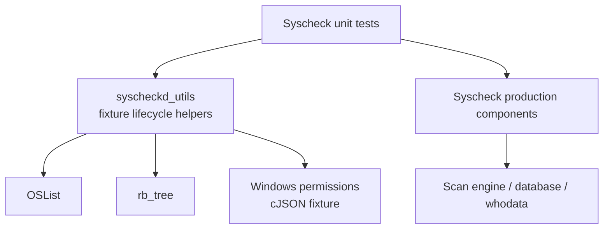
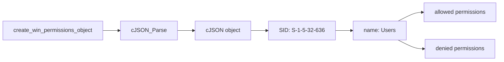
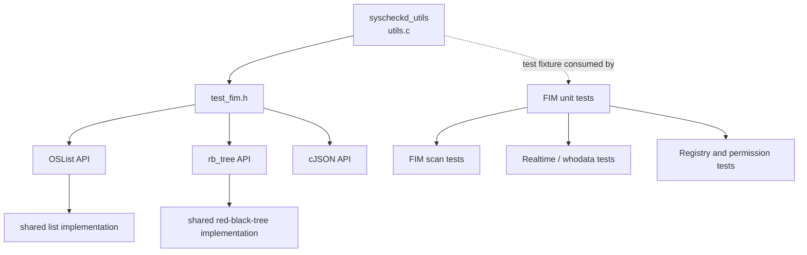

# `syscheckd_utils`

`syscheckd_utils` is a small test-support module for the Syscheck/FIM unit-test suite. It does not implement file-integrity monitoring, persistence, or event processing. Instead, `src/unit_tests/syscheckd/utils.c` provides repeatable setup and teardown callbacks for the two mutable data structures most commonly shared by FIM tests: `OSList` and `rb_tree`. It also provides a reusable cJSON fixture representing Windows file-permission data.

The production architecture and scan behavior are documented in [`syscheckd_core`](syscheckd_core.md), [`syscheckd_core_scan_engine`](syscheckd_core_scan_engine.md), [`syscheckd_db`](syscheckd_db.md), and [`syscheckd_whodata`](syscheckd_whodata.md) where available.

## Scope and role

The module sits below unit tests rather than below the runtime Syscheck daemon:



The helpers isolate allocation and release concerns from individual tests. A test receives an initialized object through CMocka's `void **state`, exercises the production code, and then releases the object through the matching teardown callback.

## Source layout

| Source | Responsibility |
|---|---|
| `src/unit_tests/syscheckd/utils.c` | Fixture lifecycle callbacks and Windows-permissions JSON construction |
| `src/unit_tests/syscheckd/test_fim.h` | Included declarations and dependencies for the test fixture; it supplies the list/tree and cJSON APIs |
| `src/unit_tests/syscheckd/*` | Consumers of the callbacks, including FIM scan, realtime, registry, and whodata tests |

The module exposes four setup/teardown functions and one fixture factory:

| Function | Behavior | Return/value |
|---|---|---|
| `setup_os_list(void **state)` | Calls `OSList_Create()`, stores the result in `*state` | `0` on success, `-1` if allocation returns `NULL` |
| `teardown_os_list(void **state)` | Reads `*state` and calls `OSList_Destroy()` | `0` |
| `setup_rb_tree(void **state)` | Calls `rbtree_init()`, stores the result in `*state` | `0` on success, `-1` if initialization returns `NULL` |
| `teardown_rb_tree(void **state)` | Reads `*state` and calls `rbtree_destroy()` | `0` |
| `create_win_permissions_object(void)` | Parses a static JSON document with `cJSON_Parse()` | A `cJSON *`, or `NULL` if parsing fails |

## Fixture lifecycle

Both setup callbacks follow the same contract: allocate the fixture, fail the test setup if allocation fails, and publish the pointer through CMocka state. Both teardown callbacks deliberately delegate destruction to the owning data-structure API.

```mermaid
sequenceDiagram
    participant C as CMocka test runner
    participant U as syscheckd_utils
    participant D as Data-structure API
    participant T as Test body

    C->>U: setup_*(&state)
    U->>D: Create/init()
    alt allocation succeeds
        D-->>U: object pointer
        U-->>C: state = object; return 0
        C->>T: execute test with state
        C->>U: teardown_*(&state)
        U->>D: Destroy(object)
        D-->>U: released
        U-->>C: return 0
    else allocation fails
        D-->>U: NULL
        U-->>C: return -1
        C-->>T: setup failure; test body is skipped
    end
```

### `OSList` fixture

`setup_os_list` creates an empty `OSList` with `OSList_Create`. The helper does not add entries, configure callbacks, or impose a maximum size; tests remain responsible for populating and configuring the list for their scenario. `teardown_os_list` passes the stored pointer to `OSList_Destroy`, allowing the shared list implementation to release its nodes and internal resources.

This fixture is useful for tests that model ordered collections of monitored paths, directory links, or other FIM working state. The actual list semantics belong to the shared data-structure implementation, documented through [`shared_lib_data_structures`](shared_lib_data_structures.md) and [`test_list_op`](test_list_op.md).

### `rb_tree` fixture

`setup_rb_tree` initializes an empty red-black tree with `rbtree_init` and stores it in CMocka state. It does not install a comparison function, seed keys, or attach disposal callbacks; those policies are controlled by the tree API and the consuming test. `teardown_rb_tree` invokes `rbtree_destroy` on the initialized tree.

The fixture supports tests requiring indexed lookup or ordered key state. Tree balancing and operation-level behavior are outside this module; see [`test_rbtree_op`](test_rbtree_op.md).

## Windows-permissions JSON fixture

`create_win_permissions_object` parses a static document with one SID key, `S-1-5-32-636`, mapped to a `Users` access-control entry. The entry separates permissions into `allowed` and `denied` arrays.



The fixture's semantic shape is:

```json
{
  "S-1-5-32-636": {
    "name": "Users",
    "allowed": [
      "delete", "read_control", "write_dac", "write_owner", "synchronize",
      "read_data", "write_data", "append_data", "read_ea", "write_ea",
      "execute", "read_attributes", "write_attributes"
    ],
    "denied": [
      "read_control", "synchronize", "read_data", "read_ea",
      "execute", "read_attributes"
    ]
  }
}
```

The three macros in the source (`BASE_WIN_ALLOWED_ACE`, `BASE_WIN_DENIED_ACE`, and `BASE_WIN_ACE`) assemble this document at compile time. Because the function returns a parsed tree, callers own the result and must release it with `cJSON_Delete` after the test. The factory itself does not retain global state.

The fixture is intended for permission decoding and comparison tests in the shared Syscheck helpers, not as a complete Windows security descriptor. Related permission behavior is covered by [`test_syscheck_op`](test_syscheck_op.md) and the production FIM data path in [`syscheckd_db_items`](syscheckd_db_items.md).

## Dependency and interaction view



The module has no runtime dependency on `syscheckd` daemon startup, filesystem watchers, auditd, eBPF, or the Wazuh database. Those systems are exercised by the tests that consume these fixtures and are documented separately.

## Error handling and ownership

- Setup returns `-1` only when the underlying allocator/initializer returns `NULL`; no partial object is published to `state`.
- Setup returns `0` after storing a valid pointer in `*state`.
- Teardown always returns `0` and assumes the test framework supplied a valid initialized state.
- `create_win_permissions_object` forwards the parser result. A `NULL` result indicates malformed fixture text or parser allocation failure.
- Ownership is local to the caller: list/tree fixtures are released by their teardown callbacks; cJSON results must be explicitly deleted by the test.

## Test usage pattern

Typical CMocka registration uses the setup and teardown as fixture callbacks:

```c
const struct CMUnitTest tests[] = {
    cmocka_unit_test_setup_teardown(test_fim_case,
                                    setup_os_list,
                                    teardown_os_list),
};
```

For a tree fixture, substitute `setup_rb_tree` and `teardown_rb_tree`. A permissions test typically creates the JSON object inside the test, validates or transforms it, and calls `cJSON_Delete` before returning.

## Maintenance guidance

When changing these helpers, preserve the pairing between each setup and teardown function and keep fixture data deterministic. If the shared list/tree APIs change their ownership contract, update the callbacks and all dependent tests together. If the Windows permission schema changes, update the fixture and the permission tests that assert allowed/denied entries.

For broader changes, follow the dependency chain to [`syscheckd_core`](syscheckd_core.md), [`syscheckd_core_realtime`](syscheckd_core_realtime.md), [`syscheckd_whodata_audit`](syscheckd_whodata_audit.md), and [`wazuh_db_fim_syscollector`](wazuh_db_fim_syscollector.md) instead of expanding this test-utility document with production implementation details.

