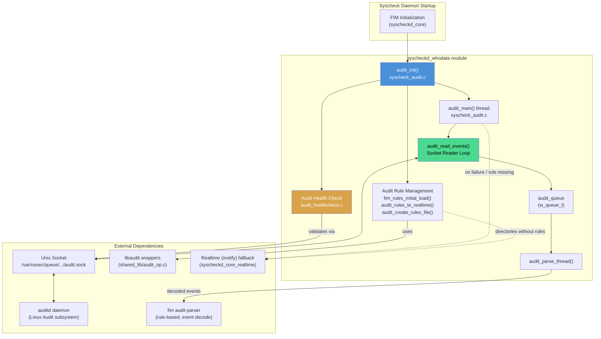
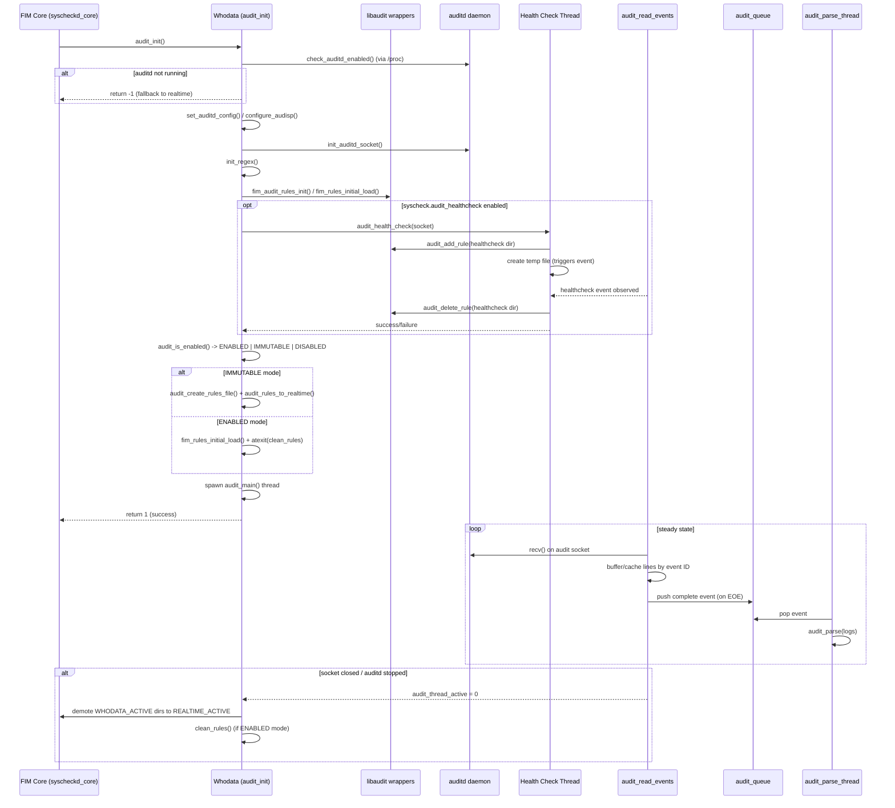
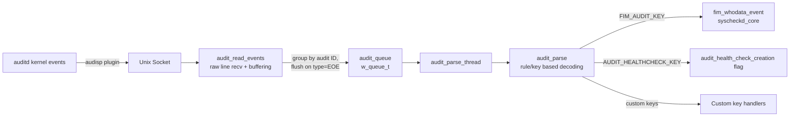

# Syscheckd Whodata Module

## 1. Introduction and Purpose

The **Whodata** module is a specialized component of the Wazuh **Syscheck (FIM — File Integrity Monitoring)** daemon that provides **"who-data"** capabilities on Linux systems: the ability to identify **which user, process, and command** triggered a file system change (create, modify, delete, rename, permission change), rather than just detecting *that* a change occurred.

On Linux, this module implements the whodata mechanism using the **Linux Audit subsystem (`auditd`)**. It is the Linux-specific counterpart to the Windows whodata implementation (SACL-based), and complements the generic real-time monitoring (`inotify`) and periodic-scan mechanisms of Syscheck.

Responsibilities of this module include:
- Verifying that `auditd` is installed, running, and properly configured to forward events to Wazuh via a Unix socket (`audisp`/`auditd` plugin).
- Adding, validating and reloading the **audit rules** needed to watch FIM-configured directories.
- Running a **health check** at startup to confirm that audit events are actually being received before relying on them.
- Continuously **reading raw audit log lines** from the audit socket, buffering/caching multi-line events, and dispatching complete events for parsing.
- Gracefully **falling back to real-time (`inotify`) monitoring** for any directory whose audit rule could not be installed, or when the audit thread stops (`auditd` restarted/stopped, socket closed, etc.).

This module works closely with:
- `syscheckd_ebpf` — an alternative (eBPF-based) whodata implementation for kernels that support it (see [syscheckd_ebpf module](syscheckd_ebpf.md)).
- `syscheckd_core` — the main FIM scan engine that consumes whodata events (see [syscheckd_core module](syscheckd_core.md)).
- `syscheckd_file` and `syscheckd_registry` — which process the file/registry level events generated as a consequence of whodata detections.
- `Syscheck_Config` (`src/config/syscheck-config.h`) — defines the `whodata`, `directory_t`, and `syscheck_config` structures consumed by this module (see [Syscheck_Config](Syscheck_Config.md)).
- `shared_lib` (`src/shared/audit_op.c`) — low level libaudit wrappers used to add/delete/search audit rules (see [shared_lib module](shared_lib.md)).

## 2. Architecture Overview

The Whodata module (Linux/Audit implementation) is organized around three cooperating areas: **initialization & rule management**, **event ingestion**, and **health verification**. These map to the two source files and one header that constitute the module.

### Key architectural points

1. **Single entry point (`audit_init`)**: Called once during FIM startup. It performs a sequence of validations (auditd running → socket/plugin configured → socket connected → regex engine ready → rules loaded → optional health check → audit mode detection) before spawning the long-lived reader thread.
2. **Health check gate**: Before trusting the audit pipeline, the module creates a temporary file under a well-known health-check path and adds a temporary audit rule; if the corresponding audit event is not observed within a timeout, whodata initialization is aborted.
3. **Producer/consumer event pipeline**: The socket-reading loop (`audit_read_events`) acts as the producer, buffering and caching multi-line raw audit records keyed by audit event ID (correlating lines belonging to the same event via `type=EOE`), and pushes completed event blocks onto `audit_queue`. A separate `audit_parse_thread` consumes and parses them, decoupling I/O from parsing/processing.
4. **Graceful degradation**: Any directory that cannot get a working audit rule (rule conflicts, immutable audit mode, thread termination) is automatically demoted from `WHODATA_ACTIVE` to `REALTIME_ACTIVE`, ensuring FIM coverage is never silently lost.
5. **Audit modes**: The module distinguishes `AUDIT_ENABLED` (rules can be added/removed dynamically) from `AUDIT_IMMUTABLE` (rules must be pre-loaded via a rules file and cannot change until reboot), adapting its rule-loading strategy (`fim_rules_initial_load` vs. `audit_create_rules_file` + `audit_rules_to_realtime`) accordingly.

## 3. Component Breakdown

Given the module's tight cohesion (only 2 `.c`/`.h` files with strongly interdependent responsibilities — rule setup, health check, and the event reader all share global state such as `audit_mutex`, `audit_thread_active`, and `audit_queue`), the detailed documentation is kept in a single sub-module file rather than split further:

- **[syscheckd_whodata_audit.md](syscheckd_whodata_audit.md)** — Full details on:
  - Audit daemon detection and `audisp`/`auditd` socket configuration (`check_auditd_enabled`, `set_auditd_config`, `configure_audisp`)
  - Rule lifecycle management (`fim_rules_initial_load`, `audit_create_rules_file`, `audit_rules_to_realtime`, `fim_audit_rules_init`)
  - The health-check sub-system (`audit_health_check`, `audit_healthcheck_thread`)
  - The event ingestion pipeline (`audit_main`, `audit_read_events`, `audit_parse_thread`)
  - Data structures (`whodata_directory_t`, `audit_data_t`)

## 4. High-Level Process Flow

The following sequence diagram illustrates the end-to-end flow from FIM startup to steady-state event processing:

## 5. Data Flow: Audit Event to FIM Event

## 6. Key Global State

The module relies on several shared global variables/synchronization primitives (declared in `syscheck_audit.h` and defined in `syscheck_audit.c`) to coordinate between the initialization thread, the reader thread, the parser thread, and the health-check thread:

| Symbol | Type | Purpose |
|---|---|---|
| `audit_mutex` / `audit_thread_active` | `pthread_mutex_t` / `atomic_int_t` | Guards startup synchronization and signals the reader thread's running state |
| `audit_rules_mutex` | `pthread_mutex_t` | Protects concurrent access to rule add/delete operations |
| `audit_db_consistency` / `audit_db_consistency_flag` | `pthread_cond_t` / `volatile int` | Ensures the FIM database baseline is consistent before the audit thread starts reloading rules |
| `audit_queue` | `w_queue_t*` | Producer/consumer queue between the socket reader and the parser thread |
| `audit_parse_thread_active` | `atomic_int_t` | Controls the lifecycle of the parsing thread |
| `hc_thread_active` / `audit_health_check_creation` | `atomic_int_t` | Coordinate the health-check thread and detect whether the test event was observed |
| `count_reload_retries` | `unsigned int` | Tracks how many times audit rules have been reloaded (used to bound retry behavior) |

## 7. Related Modules

- **[syscheckd_whodata_audit.md](syscheckd_whodata_audit.md)** — Detailed sub-module documentation for this module's components.
- **[Syscheck_Config](Syscheck_Config.md)** — Configuration structures (`syscheck_config`, `directory_t`, `whodata`) that drive which directories are monitored in whodata mode and with what options (`WHODATA_ACTIVE`, `REALTIME_ACTIVE`).
- **[syscheckd_core](syscheckd_core.md)** — The main FIM daemon lifecycle and scan engine that invokes `audit_init` and consumes whodata-generated events via `fim_whodata_event`.
- **[syscheckd_ebpf](syscheckd_ebpf.md)** — Alternative, kernel-eBPF-based whodata mechanism used as another option to the Audit-based approach implemented here.
- **[syscheckd_file](syscheckd_file.md)** and **[syscheckd_registry](syscheckd_registry.md)** — Consume the file/registry events ultimately produced from parsed whodata data.
- **[shared_lib](shared_lib.md)** — Provides low-level `audit_op.c` wrappers (`audit_add_rule`, `audit_delete_rule`, `audit_get_rule_list`, `audit_restart`, `search_audit_rule`) used extensively by this module.
- **[test_audit_healthcheck](test_audit_healthcheck.md)**, **[test_audit_parse](test_audit_parse.md)**, **[test_audit_rule_handling](test_audit_rule_handling.md)**, **[test_syscheck_audit](test_syscheck_audit.md)** — Unit test suites covering this module's health check, parsing, rule handling, and core audit lifecycle logic respectively.
