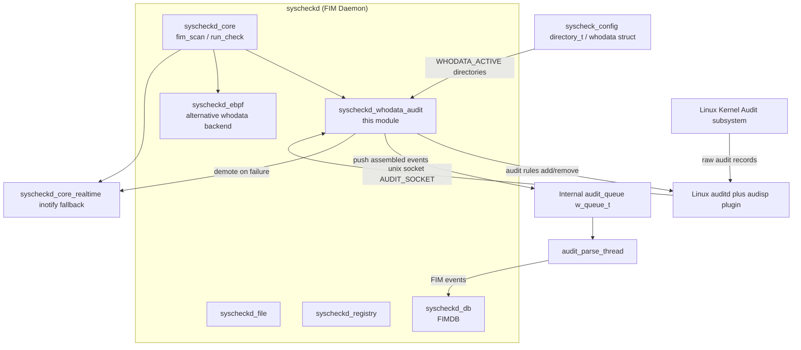
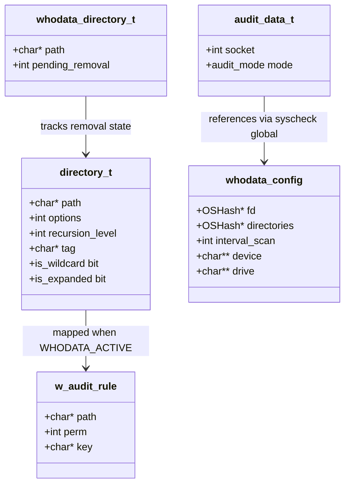
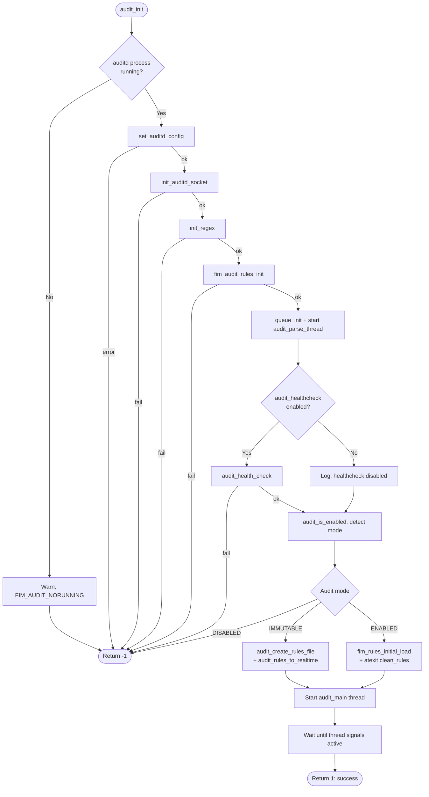
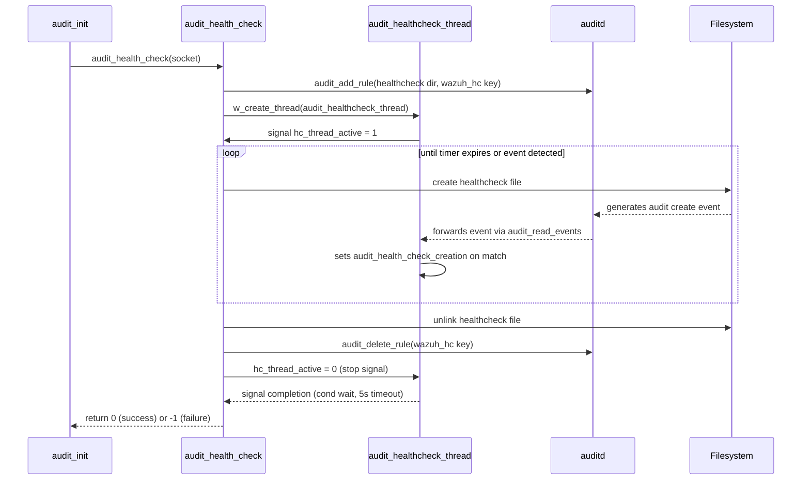
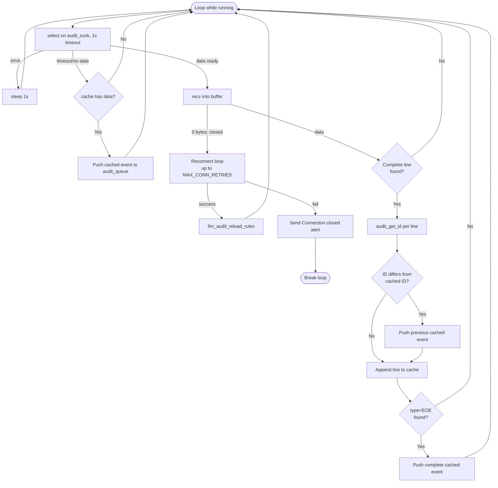
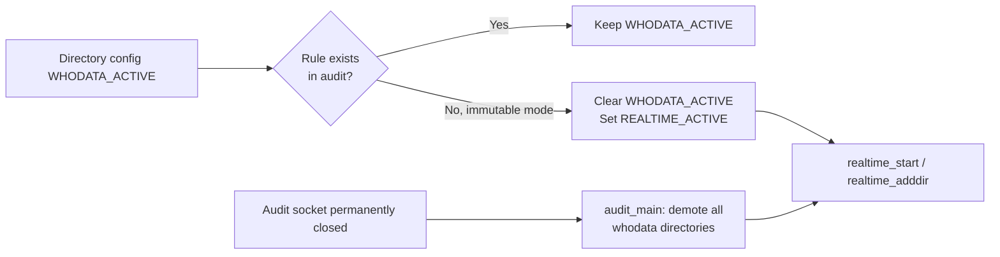
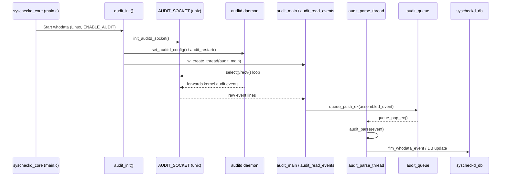

# Syscheckd Whodata Audit Module

## Introduction

The **Syscheckd Whodata Audit** module is the Linux-specific "who-data" subsystem of Wazuh's File Integrity Monitoring (FIM) daemon (`syscheckd`). It integrates with the Linux Audit subsystem (`auditd`) to capture **who** (user, process) performed a file system change, in addition to **what** changed. This enriches FIM alerts with attribution data (PID, UID, process name, command line) that plain inotify-based real-time monitoring cannot provide.

The module is responsible for:
- Verifying that `auditd` is installed, running, and properly configured to forward events to Wazuh via a Unix socket (`audisp`/`auditd` plugin).
- Adding and removing Linux Audit watch rules (`-w <path> -p wa -k wazuh_fim`) for directories configured with the `whodata` option.
- Performing a **health check** at startup to make sure that audit events actually reach the daemon before relying on this mode.
- Continuously reading raw audit events from the audit socket, buffering/caching partial records, and dispatching complete events for parsing.
- Falling back to realtime (inotify) monitoring for directories whose audit rules cannot be established or when the audit connection is lost.
- Reloading rules if they are externally deleted/tampered with, and cleaning them up on daemon shutdown.

This module is part of the [Syscheck / FIM Daemon (C/C++)](Syscheck___FIM_Daemon_(C_C++).md) parent module, alongside its siblings `syscheckd_core`, `syscheckd_db`, `syscheckd_ebpf` (the Linux eBPF-based alternative to audit), `syscheckd_file`, and `syscheckd_registry`.

---

## Purpose and Scope

| Concern | Description |
|---|---|
| **Startup validation** | Detects `auditd`, checks/repairs its plugin configuration, opens the audit netlink/unix socket. |
| **Health check** | Confirms the audit pipeline is functioning end-to-end before enabling whodata for real. |
| **Rule management** | Adds "watch" rules per configured directory; detects rules removed by users/other tools; reloads them periodically. |
| **Event ingestion** | Non-blocking `select()`-driven read loop that assembles multi-line audit records into complete events using an internal cache keyed by audit event ID. |
| **Dispatch** | Pushes assembled event strings onto an internal queue (`audit_queue`) consumed by a dedicated parser thread (`audit_parse_thread`). |
| **Graceful degradation** | Switches monitored directories back to `REALTIME_ACTIVE` (inotify) if audit rules cannot be applied or if the audit connection drops permanently. |

This module only compiles on Linux (`#ifdef __linux__`) and only when audit support is enabled (`#ifdef ENABLE_AUDIT`).

---

## Core Components

### Files and Symbols

| File | Symbol | Role |
|---|---|---|
| `src/syscheckd/src/whodata/syscheck_audit.h` | `whodata_directory_t` | Lightweight struct tracking a directory path pending removal from audit rules. |
| `src/syscheckd/src/whodata/syscheck_audit.c` | `audit_data_t` (`_audit_data_s`) | Internal struct bundling the audit socket FD and the detected audit mode (`AUDIT_DISABLED`/`AUDIT_ENABLED`/`AUDIT_IMMUTABLE`), passed to the main audit thread. |
| `src/syscheckd/src/whodata/syscheck_audit.c` | `timeval` (usage) | Used for `select()` timeout control in the event-reading loop. |
| `src/syscheckd/src/whodata/audit_healthcheck.c` | `timespec` (usage) | Used for timed condition waits (`pthread_cond_timedwait`) while waiting for the healthcheck thread to end. |

### Key Functions (from the referenced source, not exhaustive of the whole subsystem)

- `check_auditd_enabled()` – scans `/proc` for a running `auditd` process.
- `set_auditd_config()` / `configure_audisp()` – ensures the audisp/audit plugin configuration file points Wazuh's socket, restarts audit if configuration changed.
- `init_auditd_socket()` – connects to the Unix domain socket where audit events are forwarded.
- `audit_create_rules_file()` – writes a persistent rules file for **immutable** audit mode and symlinks it into `/etc/audit/rules.d/`.
- `audit_rules_to_realtime()` – for directories whose rule could not be verified (immutable mode), demotes them to `REALTIME_ACTIVE`.
- `audit_init()` – top-level orchestration: validates auditd, configures the socket, runs healthcheck, loads rules, and spawns the audit reading thread.
- `audit_main()` (static) – thread entry point that waits for DB consistency, optionally starts a rule-reload thread, then blocks in `audit_read_events()` until the daemon shuts down or the connection dies; on exit it converts whodata directories back to realtime and cleans regex/rules.
- `audit_read_events()` – the core `select()`-based loop that reads raw audit lines, correlates them by event ID, assembles multi-line records, and pushes completed events to `audit_queue` for the parser thread.
- `audit_parse_thread()` – pops assembled event strings from `audit_queue` and calls `audit_parse()` (defined elsewhere in the whodata parsing logic).
- `audit_health_check()` / `audit_healthcheck_thread()` (in `audit_healthcheck.c`) – creates/deletes a temporary watched file and confirms that the corresponding audit "create" event is received within a timeout window, validating the full audit → Wazuh event pipeline.
- `fim_manipulated_audit_rules()`, `fim_audit_rules_init()`, `fim_rules_initial_load()` (declared in the header, implemented in sibling files) – rule lifecycle management referenced by `audit_init()`.

---

## Architecture

### Relationship to Sibling Modules

- **`syscheckd_ebpf`**: an alternative, more modern whodata implementation for Linux based on eBPF probes, avoiding the audit subsystem entirely. Both modules provide equivalent attribution data but via different kernel interfaces; only one is typically active depending on configuration/kernel capabilities.
- **`syscheckd_core_realtime`**: the inotify-based fallback. The audit module actively demotes directories to this mode (`REALTIME_ACTIVE`) whenever audit rules cannot be guaranteed (e.g., immutable audit mode without a matching rule, or persistent audit socket failure).
- **`syscheckd_core`**: owns the global `syscheck_config` (see [Configuration Data Structures](Configuration_Data_Structures_(C_Headers).md) → `Syscheck_Config`), including the `directory_t` list and the `whodata` struct that stores open file descriptors and per-directory state consulted by this module.
- **`syscheckd_db`**: consumes FIM events produced after the parser thread processes assembled audit records, ultimately persisting file state changes.
- Shared low-level utilities used by this module (mutexes, atomic ints, queues) come from [Agent & Manager Native Daemons (C)](Agent_&_Manager_Native_Daemons_(C).md) — specifically `src/headers/atomic.h`, `src/headers/queue_op.h`, and `src/shared/audit_op.c` (`audit_add_rule`, `audit_delete_rule`, `audit_get_rule_list`, `search_audit_rule`, etc.).

---

## Data Structures

- **`whodata_directory_t`**: used internally when a directory's whodata monitoring must be torn down (e.g. rule deletion in progress), tracking whether removal is `pending_removal`.
- **`audit_data_t`** (`_audit_data_s`): passed into the audit reading thread (`audit_main`), carrying the live socket descriptor and the detected `audit_mode` (`AUDIT_DISABLED`, `AUDIT_ENABLED`, `AUDIT_IMMUTABLE`) which determines whether rules are added live via netlink or written to a rules file for immutable mode.
- **`w_audit_rule`** (from shared `audit_op.h`, see [Agent & Manager Native Daemons](Agent_&_Manager_Native_Daemons_(C).md)): generic representation of an audit watch rule (path, permission mask, key) used both for adding rules and for querying/comparing existing ones (`search_audit_rule`).
- **`directory_t`** and **`whodata`** (from `src/config/syscheck-config.h`, see [Configuration Data Structures](Configuration_Data_Structures_(C_Headers).md) → `Syscheck_Config`): the configuration-side structures that declare which directories should be monitored in whodata mode (`WHODATA_ACTIVE` bit in `options`) and hold the open file descriptor hash used across FIM.

---

## Process Flows

### 1. Audit Subsystem Initialization (`audit_init`)

### 2. Audit Health Check

### 3. Event Reading and Assembly (`audit_read_events`)

### 4. Rule Reload & Fallback to Realtime

---

## Component Interaction

---

## Configuration Dependencies

The whodata audit module reads and mutates fields on the shared global `syscheck_config` structure (see [Configuration Data Structures (C Headers)](Configuration_Data_Structures_(C_Headers).md) → `Syscheck_Config`):

- `syscheck.directories` — `OSList` of `directory_t`; each entry's `options` bitmask determines `WHODATA_ACTIVE` vs `REALTIME_ACTIVE`.
- `syscheck.wildcards` — expanded wildcard directory entries also eligible for whodata → realtime demotion.
- `syscheck.audit_key` — list of custom audit keys accepted in addition to the default `wazuh_fim` key.
- `syscheck.audit_healthcheck` — toggles whether `audit_health_check()` runs during startup.
- `syscheck.restart_audit` — controls whether misconfiguration triggers an automatic `auditd` restart.
- `syscheck.queue_size` — sizes the internal `audit_queue`.
- `syscheck.directories_lock` / `syscheck.fim_realtime_mutex` — concurrency guards shared with `syscheckd_core_realtime` when demoting directories.

---

## Concurrency Model

| Thread | Responsibility | Synchronization |
|---|---|---|
| Main FIM thread | Calls `audit_init()` once at startup | Blocks on `audit_thread_started` condition until the audit thread signals readiness |
| `audit_main` (audit reading thread) | Waits for DB consistency signal, then runs `audit_read_events()` for the lifetime of the daemon | `audit_mutex` + `audit_db_consistency` condition variable; `audit_thread_active` atomic flag |
| `audit_healthcheck_thread` | Temporary thread used only during startup healthcheck | `audit_hc_mutex` + `audit_hc_cond`; `hc_thread_active` / `audit_health_check_creation` atomics |
| `audit_parse_thread` | Consumes `audit_queue` and parses raw event text into FIM events | Queue's own internal locking (`w_queue_t`); `audit_parse_thread_active` atomic flag |
| Rule reload thread (`audit_reload_thread`, started conditionally) | Periodically verifies/reapplies audit rules | `audit_rules_mutex` |

All flag transitions use `atomic_int_t` (see [Agent & Manager Native Daemons](Agent_&_Manager_Native_Daemons_(C).md) → `src/headers/atomic.h`) to avoid race conditions between the health check, main audit thread, and shutdown sequence.

---

## Error Handling & Resilience

- **auditd not running** → `audit_init()` fails fast (`FIM_AUDIT_NORUNNING`), causing the caller in `syscheckd_core` to fall back to realtime/inotify for all directories.
- **Socket misconfiguration** → `set_auditd_config()` detects SHA1 drift in the audisp plugin config and reconfigures/restarts audit if `syscheck.restart_audit` is enabled; otherwise it warns and continues without whodata.
- **Health check failure** → treated as fatal for whodata; `audit_init()` returns -1 so whodata is disabled for the run, but the FIM daemon itself continues operating with realtime monitoring.
- **Socket disconnect during runtime** → `audit_read_events()` attempts up to `MAX_CONN_RETRIES` reconnects with a short backoff; on success it triggers `fim_audit_reload_rules()`; on permanent failure it sends an internal alert message and lets `audit_main()` clean up, demoting all whodata directories to realtime.
- **Externally deleted rules** → detected via periodic reload logic (`fim_manipulated_audit_rules`, `audit_rules_to_realtime`), automatically demoting the affected directory rather than silently losing coverage.
- **Immutable audit mode** — since live netlink rule changes are disallowed, the module persists rules to a file (`audit_create_rules_file`) and symlinks them for `auditctl -R`/boot-time loading, while any directory not confirmed as covered is demoted to realtime for the current session.

---

## Related Documentation

- [Syscheck / FIM Daemon (C/C++)](Syscheck___FIM_Daemon_(C_C++).md) — parent module; covers `syscheckd_core` (scan engine, realtime), `syscheckd_db` (FIMDB), `syscheckd_ebpf` (alternative Linux whodata backend), `syscheckd_file`, and `syscheckd_registry`.
- [Configuration Data Structures (C Headers)](Configuration_Data_Structures_(C_Headers).md) — defines `syscheck_config`, `directory_t`, and `whodata` used throughout this module.
- [Agent & Manager Native Daemons (C)](Agent_&_Manager_Native_Daemons_(C).md) — provides the shared `audit_op.c`/`audit_op.h` primitives (`audit_add_rule`, `audit_delete_rule`, `search_audit_rule`, `w_audit_rule`), queue/atomic utilities, and OS networking helpers (`os_net.c`) used for the Unix domain socket connection.
