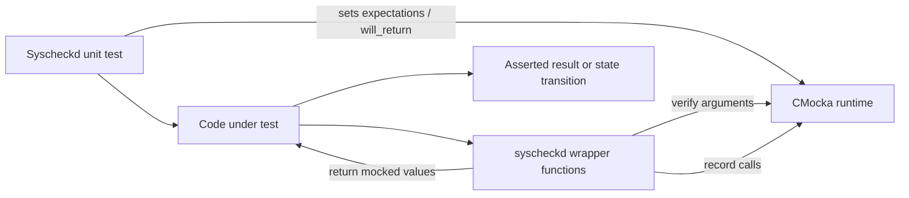
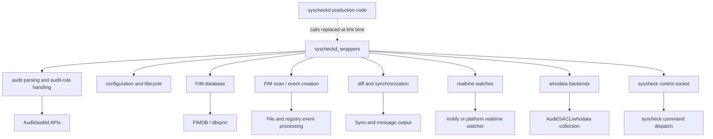
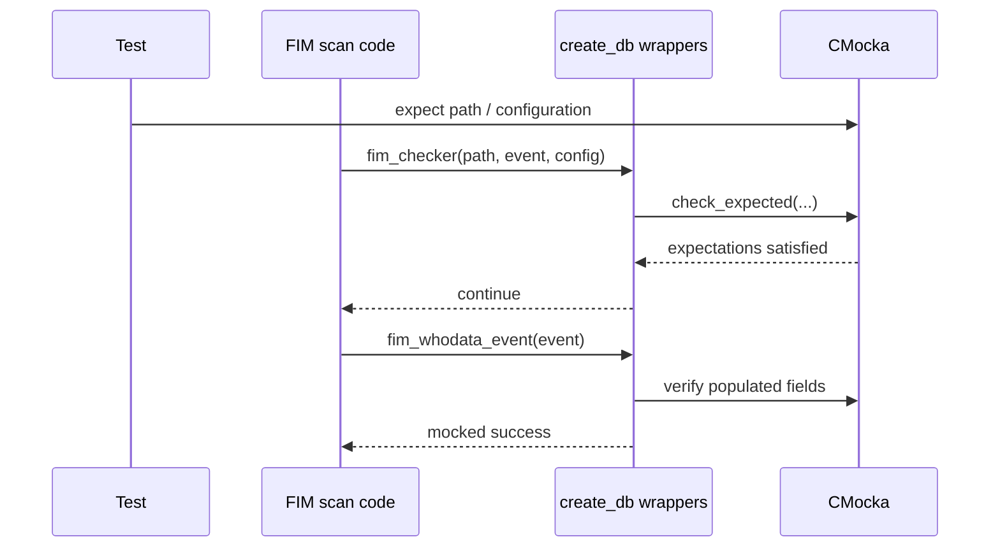
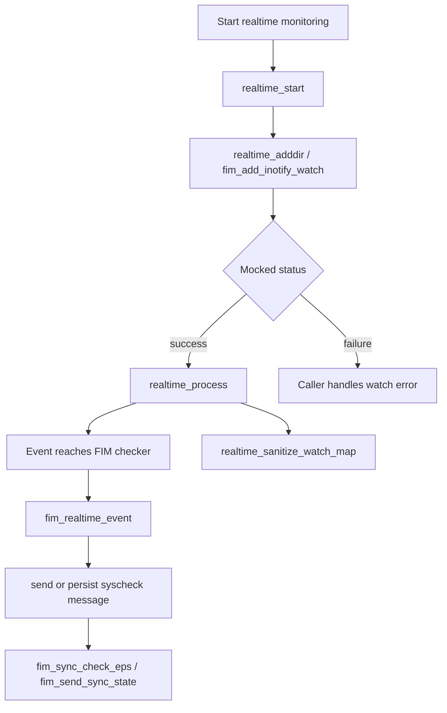
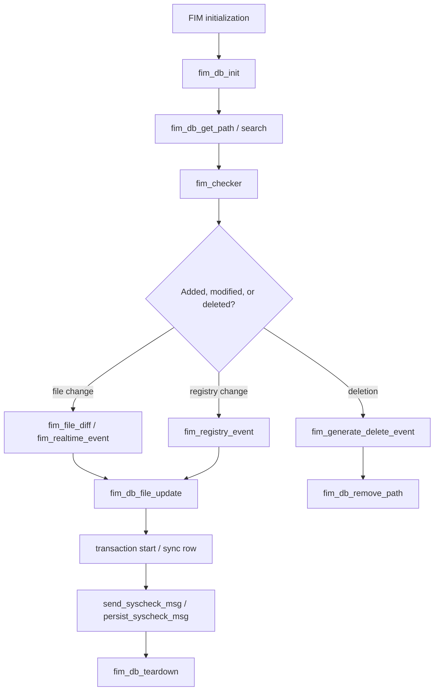
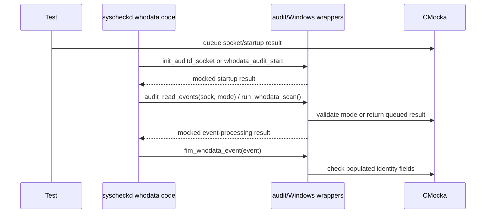
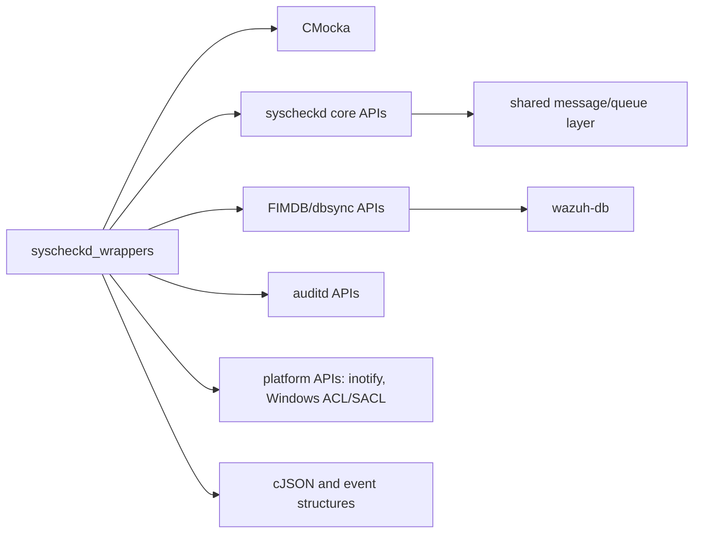

# `syscheckd_wrappers`

`syscheckd_wrappers` is the CMocka test-double layer for the Wazuh file integrity monitoring daemon (`syscheckd`). It replaces filesystem, registry, whodata, realtime-monitoring, FIM database, synchronization, and daemon-control functions during unit tests. The wrappers do not implement production behavior; they expose observable call points and configurable return values so tests can isolate the code under test and exercise success and failure branches deterministically.

The module belongs to the test infrastructure represented by `Unit_Test_Wrappers_&_Mocks`. Its primary production counterpart is documented in [syscheckd_core.md](syscheckd_core.md), with persistence details in [syscheckd_db.md](syscheckd_db.md), realtime/whodata behavior in [syscheckd_whodata.md](syscheckd_whodata.md), and the FIM scan tests in [fim_file_tests.md](fim_file_tests.md), [fim_realtime_whodata_tests.md](fim_realtime_whodata_tests.md), and [fim_missing_entry_tests.md](fim_missing_entry_tests.md).

## Scope and role

The wrappers provide four kinds of test control:

1. **Call verification** – `function_called()`, `check_expected()`, `check_expected_ptr()`, and `check_expected_*()` assert that a dependency was invoked with the expected arguments.
2. **Return injection** – `mock()`, `mock_type()`, and `mock_ptr_type()` return values queued by a test.
3. **Output injection** – wrappers such as `syscom_dispatch`, `audit_read_events`, and `fim_db_read_line_from_file` write mocked data through output parameters.
4. **Expectation helpers** – functions such as `expect_fim_checker_call`, `expect_realtime_adddir_call`, and `expect_fim_db_remove_path` package common CMocka setup.

## Architecture

The files are organized by the production subsystem they replace rather than by a shared runtime object.

At link time, the test build resolves production symbols to functions named `__wrap_<symbol>`. The wrapper headers and linker configuration are outside the supplied source snippets, but the naming convention and CMocka calls show that these are link-time interception functions, not alternate production implementations.

## Wrapper families

### Audit parsing and audit-rule management

`audit_parse_wrappers.c` defines `__wrap_audit_parse`. It records invocation with `function_called()` and intentionally ignores the buffer contents. This is useful when a caller's responsibility is only to dispatch an audit record.

`audit_rule_handling_wrappers.c` covers whodata audit-rule lifecycle:

- `__wrap_fim_rules_initial_load()` and `__wrap_fim_audit_reload_rules()` record lifecycle calls.
- `__wrap_add_whodata_directory(path)` and `__wrap_remove_audit_rule_syscheck(path)` verify the target path.
- `__wrap_fim_manipulated_audit_rules()` returns a test-selected integer, allowing tests to model changed or unchanged rules.

These functions support the audit paths described by [syscheckd_whodata.md](syscheckd_whodata.md) and the audit-rule tests in [test_audit_rule_handling.md](test_audit_rule_handling.md).

### Configuration and event construction

`config_wrappers.c` provides `__wrap_free_whodata_event`. It normally checks the event pointer being released, controlled by the global `OSHash_Add_ex_check_data`. Tests can disable that check while testing cleanup paths where the pointer is not expected to be registered.

The same file supplies mocked JSON configuration accessors:

- `__wrap_getRootcheckConfig()`
- `__wrap_getSyscheckConfig()`
- `__wrap_getSyscheckInternalOptions()`

Each returns a queued `cJSON *`, allowing configuration tests to supply valid, missing, or malformed configuration trees without reading live configuration files.

`create_db_wrappers.c` isolates event and scan construction. `fim_checker` validates path, event data, and directory configuration; `fim_realtime_event` validates a changed file; and `fim_registry_event` returns a queued result. `fim_whodata_event` checks populated whodata fields—process, user, path, and, on non-Windows builds, group, audit/effective IDs, inode, and parent process ID—then returns success. The file also intercepts transaction start, row synchronization, deleted-row processing, delete-event generation, Windows startup, and object cleanup.

### FIM database wrappers

`fim_db_wrappers.c` replaces the FIM database abstraction and its dbsync initialization. It covers:

- database initialization and teardown: `fim_db_init`, `fim_db_teardown`, `_imp__dbsync_initialize`;
- path removal and path lookup: `fim_db_remove_path`, `fim_db_get_path`;
- file updates and searches: `fim_db_file_update`, `fim_db_file_pattern_search`, `fim_db_file_inode_search`;
- temporary-file loading and cleanup: `fim_db_read_line_from_file`, `fim_db_clean_file`;
- file, inode, and registry row counts;
- integrity and shutdown checks: `fim_run_integrity`, `is_fim_shutdown`.

Database wrappers validate selected parameters and return `FIMDBErrorCode` or integer values from CMocka's mock queue. `fim_db_read_line_from_file` additionally writes a mocked buffer to its output argument. `expect_wrapper_fim_db_init`, `expect_fim_db_get_path`, `expect_fim_db_file_pattern_search`, and related helpers make expected storage limits, paths, patterns, and results explicit.

The production persistence boundary is the FIM database described in [syscheckd_db.md](syscheckd_db.md); these wrappers let tests validate callers without opening SQLite/dbsync state.

### Diff, registry, and synchronization wrappers

`fim_diff_changes_wrappers.c` intercepts file-diff generation and deletion processing. It verifies the filename and supplies a mocked diff string or status. On Windows, it also intercepts registry-value diff generation and checks key name, value name, raw value bytes, and registry data type.

`registry.c` makes registry scanning a no-op and allows a mocked JSON event from `fim_dbsync_registry_value_json_event`. This keeps registry-specific tests focused on the caller's handling of scan results.

`fim_sync_wrappers.c` verifies the complete synchronization message passed to `fim_sync_push_msg`. Together with the message wrappers in [shared_wrappers.md](shared_wrappers.md), this separates FIM event generation from transport and queue behavior.

### Periodic checks, output, and state synchronization

`run_check_wrappers.c` models the periodic scan/check loop's external effects:

- `send_log_msg` validates a log message and returns a mocked status;
- `send_syscheck_msg` and `persist_syscheck_msg` record message emission;
- `fim_sync_check_eps` records synchronization-rate checking;
- `fim_send_sync_state(location, msg)` validates both state destination and payload.

The `expect_fim_send_sync_state_call` helper expresses the two-argument state message contract. The wrappers therefore allow tests to distinguish “scan completed,” “state synchronized,” “message persisted,” and “log message failed” without contacting remoted or wazuh-db.

### Realtime monitoring

`run_realtime_wrappers.c` isolates watch management:

- `realtime_adddir` and `fim_add_inotify_watch` validate the directory and return a queued status;
- `realtime_start` returns success by default;
- `realtime_process` and `realtime_sanitize_watch_map` record lifecycle calls.

`expect_realtime_adddir_call` combines path matching with the desired return code. This supports tests for adding watches, watch failures, queue processing, and stale-watch cleanup without depending on an actual inotify descriptor. See [syscheckd_core.md](syscheckd_core.md) for the production realtime loop.

### Auditd and Windows whodata backends

`syscheck_audit_wrappers.c` models auditd startup and event reading. `init_auditd_socket` returns a mocked socket result; `audit_read_events` validates the mode and writes a mocked socket value through `audit_sock`.

`win_whodata_wrappers.c` provides the Windows equivalents: `run_whodata_scan` and `set_winsacl` return test-selected results, while `whodata_audit_start` is a fixed successful startup. `set_winsacl` verifies both directory and configuration pointers. These platform-specific seams allow shared tests to cover setup failures, ACL changes, and scan results without modifying host security policy.

### Syscheck command dispatch

`syscom_wrappers.c` intercepts `syscom_dispatch`. It validates the command string, writes a mocked output string through `output`, and returns a mocked output length/status. This supports tests for manager/agent commands such as configuration retrieval and restart handling while avoiding the daemon's command socket.

## Representative process flows

### Realtime file-change flow

### Database-backed scan flow

### Whodata audit flow

## Contracts and testing considerations

- `check_expected` checks values; `check_expected_ptr` checks pointer identity. Tests must queue expectations with the matching CMocka macro.
- `mock()` and `mock_type(T)` consume values from the wrapper's return queue. Missing or incorrectly typed queued values cause the test to fail rather than silently selecting production behavior.
- Output parameters are intentionally mutated by wrappers. Tests should initialize valid output pointers before invoking callers and assert both the returned status and written value.
- Several wrappers are deliberately fixed-success or no-op seams (`realtime_start`, `whodata_audit_start`, registry scan, and `free_entry`). Tests should use the configurable wrappers when failure behavior is part of the scenario.
- Windows-only registry-diff code is compiled under `WIN32`; non-Windows whodata checks are guarded by `#ifndef WIN32`.
- `OSHash_Add_ex_check_data` is shared mutable test state. Tests that disable it should restore it before teardown to avoid affecting later cleanup assertions.

## Dependency map

The module is intentionally coupled to signatures and structures from `syscheckd`, the FIM database, and shared platform APIs. It should be updated whenever those production signatures change; a successful compile is important because the wrappers are part of the link-time test contract.

## Related documentation

- [syscheckd_core.md](syscheckd_core.md) – daemon lifecycle, scanning, and realtime processing.
- [syscheckd_db.md](syscheckd_db.md) – FIM database and dbsync persistence.
- [syscheckd_whodata.md](syscheckd_whodata.md) – auditd, eBPF, and Windows whodata paths.
- [fim_file_tests.md](fim_file_tests.md) – file scan and transaction-oriented tests.
- [fim_realtime_whodata_tests.md](fim_realtime_whodata_tests.md) – realtime and whodata test coverage.
- [test_audit_rule_handling.md](test_audit_rule_handling.md) – audit-rule lifecycle tests.
- [shared_wrappers.md](shared_wrappers.md) – shared transport, filesystem, hashing, and synchronization mocks.

