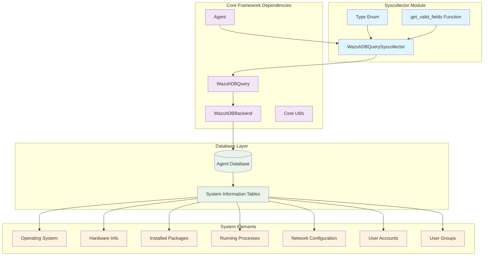
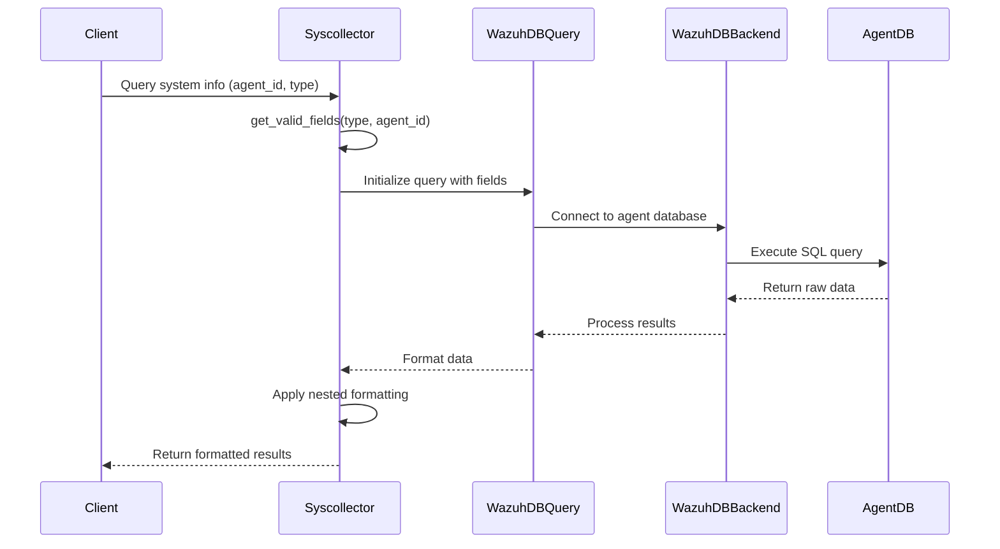

# Syscollector Module

The **Syscollector** module is a specialized component within Wazuh's security monitoring framework that provides comprehensive system inventory and monitoring capabilities. It enables the collection, storage, and querying of detailed system information from monitored agents, including hardware specifications, installed software, running processes, network configurations, and user accounts.

## Overview

The syscollector module serves as a critical component for asset discovery and system monitoring within the Wazuh ecosystem. It provides standardized interfaces for querying various types of system information collected from agents, supporting both security monitoring and compliance reporting use cases.

### Key Features

- **Multi-platform System Inventory**: Collects comprehensive system information from Windows and Linux agents
- **Real-time Data Access**: Provides efficient querying mechanisms for system data stored in agent databases
- **Flexible Data Formatting**: Supports both flat and nested data structures for different consumption patterns
- **Type-safe Operations**: Implements enumerated types for consistent system element categorization
- **Database Integration**: Seamlessly integrates with Wazuh's database infrastructure for scalable data storage

## Architecture



## Core Components

### Type Enumeration

The `Type` enum defines the different categories of system elements that can be collected and queried:

```python
class Type(Enum):
    OS = 'os'                    # Operating system information
    HARDWARE = 'hardware'        # Hardware specifications
    PACKAGES = 'packages'        # Installed software packages
    PROCESSES = 'processes'      # Running processes
    PORTS = 'ports'             # Network ports and connections
    NETADDR = 'netaddr'         # Network addresses
    NETPROTO = 'netproto'       # Network protocols
    NETIFACE = 'netiface'       # Network interfaces
    HOTFIXES = 'hotfixes'       # System hotfixes (Windows)
    USERS = 'users'             # User accounts
    GROUPS = 'groups'           # User groups
```

### WazuhDBQuerySyscollector Class

The main query class that extends the base `WazuhDBQuery` functionality for system collector data:

**Key Features:**
- **Agent-specific Queries**: Targets specific agent databases for system information
- **Nested Data Support**: Transforms flat database records into hierarchical structures
- **Date Field Handling**: Properly processes timestamp fields like scan times
- **Flexible Output Formats**: Supports both array and single-object responses

**Configuration:**
- **Backend**: Uses `WazuhDBBackend` for agent-specific database connections
- **Default Sorting**: Orders results by `scan_id` by default
- **Nested Fields**: Supports nesting for fields like `scan`, `os`, `ram`, `cpu`, `local`, `remote`, `tx`, `rx`

## Data Flow



## System Element Types

### Operating System Information
- **Table**: `sys_osinfo`
- **Key Fields**: hostname, OS version, architecture, build information
- **Platform-specific**: Different field sets for Windows vs Linux systems

### Hardware Information
- **Table**: `sys_hwinfo`
- **Key Fields**: CPU details, memory information, board serial numbers
- **Metrics**: CPU cores, frequency, RAM total/free/usage

### Software Packages
- **Table**: `sys_programs`
- **Key Fields**: package name, version, vendor, installation details
- **Metadata**: format, priority, section, architecture, source

### Running Processes
- **Table**: `sys_processes`
- **Key Fields**: PID, process name, state, parent PID, command line
- **Details**: user/group information, memory usage, timing data

### Network Configuration
Multiple tables for comprehensive network information:
- **Ports** (`sys_ports`): Active network connections and listening ports
- **Addresses** (`sys_netaddr`): IP addresses and network configuration
- **Protocols** (`sys_netproto`): Network protocol information
- **Interfaces** (`sys_netiface`): Network interface details and statistics

### User Management
- **Users** (`sys_users`): User account information, authentication details
- **Groups** (`sys_groups`): Group definitions and memberships

## Integration Points

### Agent Management Integration
The syscollector module integrates closely with the [Agent Management](agent_management.md) system:
- Uses `Agent` class for OS detection and agent validation
- Leverages agent database connections for data retrieval
- Supports agent-specific field mappings based on platform

### Database Connectivity
Utilizes the [Database Connectivity](database_connectivity.md) infrastructure:
- `WazuhDBBackend` for agent database connections
- `WazuhDBQuery` base class for query construction and execution
- Automatic connection management and resource cleanup

### Core Framework Integration
Built upon the [Core Framework](core_framework.md) components:
- Inherits validation and error handling from base classes
- Uses common utilities for data transformation and formatting
- Follows framework patterns for result standardization

## Usage Patterns

### Basic System Information Query
```python
# Query OS information for a specific agent
query = WazuhDBQuerySyscollector(
    array=True,
    nested=True,
    agent_id="001",
    table="sys_osinfo",
    fields=get_valid_fields(Type.OS, "001")[1]
)
result = query.run()
```

### Process Monitoring
```python
# Get running processes with nested formatting
query = WazuhDBQuerySyscollector(
    array=True,
    nested=True,
    agent_id="001",
    table="sys_processes",
    fields=get_valid_fields(Type.PROCESSES)[1],
    sort={"fields": ["pid"], "order": "asc"}
)
processes = query.run()
```

### Network Inventory
```python
# Query network interfaces
query = WazuhDBQuerySyscollector(
    array=True,
    nested=True,
    agent_id="001",
    table="sys_netiface",
    fields=get_valid_fields(Type.NETIFACE)[1]
)
interfaces = query.run()
```

## Field Mapping and Validation

The module implements dynamic field mapping based on:
- **Element Type**: Different field sets for each system element category
- **Agent Platform**: Windows vs Linux specific fields for OS information
- **Database Schema**: Mapping between API field names and database columns

### Platform-Specific Handling
```python
def get_valid_fields(element_type: Type, agent_id: str = None) -> dict:
    # OS fields vary by platform
    if element_type == Type.OS:
        agent_obj = Agent(agent_id)
        agent_obj.get_basic_information()
        os_name = agent_obj.get_agent_os_name()
        
        # Return Windows or Linux specific field mapping
        return windows_fields if 'Windows' in os_name else linux_fields
```

## Data Transformation

### Nested Structure Support
The module supports transforming flat database records into nested JSON structures:

```python
# Flat database record
{
    'scan_id': 123,
    'scan_time': '2024-01-01 12:00:00',
    'cpu_name': 'Intel Core i7',
    'cpu_cores': 8,
    'ram_total': 16777216
}

# Nested output
{
    'scan': {
        'id': 123,
        'time': '2024-01-01 12:00:00'
    },
    'cpu': {
        'name': 'Intel Core i7',
        'cores': 8
    },
    'ram': {
        'total': 16777216
    }
}
```

## Performance Considerations

### Query Optimization
- **Indexed Fields**: Queries typically use `scan_id` for efficient sorting
- **Agent-Specific**: Database connections target specific agent databases
- **Field Selection**: Supports selective field retrieval to minimize data transfer

### Memory Management
- **Connection Cleanup**: Automatic database connection management
- **Streaming Results**: Supports pagination for large result sets
- **Data Formatting**: Lazy evaluation of nested structure transformation

## Error Handling

The module implements comprehensive error handling:
- **Agent Validation**: Verifies agent existence before querying
- **Database Connectivity**: Handles connection failures gracefully
- **Field Validation**: Validates requested fields against available schema
- **Type Safety**: Ensures proper type handling for different data elements

## Security Considerations

### Access Control
- **Agent-Specific Access**: Queries are scoped to specific agent databases
- **Field Filtering**: Supports selective field access based on permissions
- **Input Validation**: Validates all input parameters to prevent injection attacks

### Data Privacy
- **Sensitive Information**: Handles user account data with appropriate care
- **Audit Trail**: Maintains query logs for security monitoring
- **Encryption**: Leverages database-level encryption for data at rest

## Related Modules

- **[Agent Management](agent_management.md)**: Agent lifecycle and information management
- **[Database Connectivity](database_connectivity.md)**: Database connection and query infrastructure
- **[Core Framework](core_framework.md)**: Base classes and utilities
- **[Security Modules](security_modules.md)**: Related security monitoring components (SCA, Syscheck, Rootcheck)

## Future Enhancements

### Planned Features
- **Real-time Updates**: Support for streaming system changes
- **Custom Collectors**: Extensible framework for custom system information collection
- **Advanced Analytics**: Integration with machine learning for anomaly detection
- **Cross-Platform Normalization**: Enhanced field mapping for consistent cross-platform queries

### Performance Improvements
- **Caching Layer**: Implementation of intelligent caching for frequently accessed data
- **Batch Operations**: Support for bulk queries across multiple agents
- **Compression**: Data compression for large inventory datasets