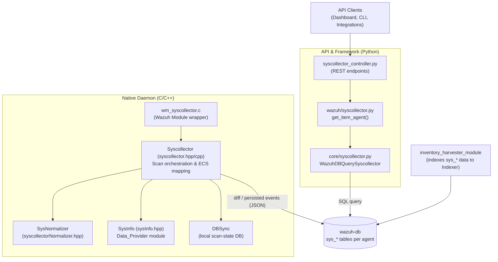
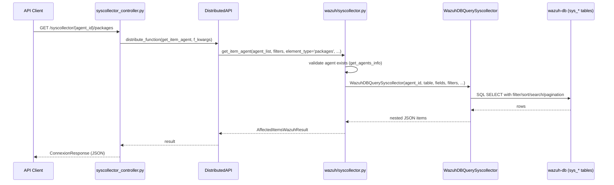
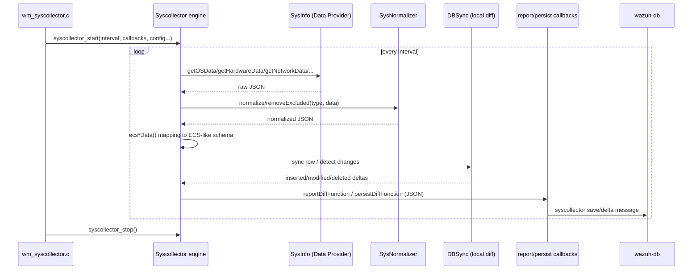

# Syscollector Module

## 1. Introduction and Purpose

The **Syscollector module** is Wazuh's system inventory subsystem. It periodically collects a broad set of
system-state information from monitored endpoints — operating system details, hardware specs, installed
packages, running processes, open network ports, network interfaces/protocols/addresses, Windows hotfixes,
local users and groups — and makes that inventory available both:

- **On the agent/manager side**, through a native C++ module (`wm_syscollector`) that gathers raw data via the
  [System Information Data Provider](System_Information_Data_Provider_(C++).md), diffs it against previous
  scans, and persists/reports the changes.
- **On the management API side**, through a Python REST layer that exposes stored syscollector data (read from
  `wazuh-db` per-agent databases) to API consumers (Wazuh dashboard, integrations, CLI tools).

In short, this module answers the question *"What does this agent's operating system, hardware, and software
inventory look like right now, and what changed since the last scan?"*

## 2. Architecture Overview

The module is split into two cooperating halves that communicate indirectly through `wazuh-db`:

**Data flow summary:**
1. The native `Syscollector` engine (started/stopped via `syscollector_start`/`syscollector_stop`) periodically
   scans the host using the platform-specific `SysInfo` implementation from the
   [System Information Data Provider](System_Information_Data_Provider_(C++).md) module.
2. Results are normalized (`SysNormalizer`), mapped into ECS-like JSON, diffed via an internal `DBSync`
   instance, and reported/persisted through callbacks wired up by the parent
   [Wazuh_Modules_Daemon](Wazuh_Modules_Daemon_(C).md) (`wm_syscollector.c`).
3. Diff/persist events are ultimately sent to `wazuh-db`, which stores them in per-agent `sys_*` tables (see
   [wazuh_db](wazuh_db.md) and the `wdb_syscollector.c` parser).
4. The [inventory_harvester_module](Advanced_Security_Modules_(C++_Inventory_&_Vulnerability).md) separately
   consumes this data to index it into the Wazuh Indexer for search/visualization.
5. On the management side, the REST API (`syscollector_controller.py`) delegates to the framework layer
   (`wazuh/syscollector.py`), which queries `wazuh-db` directly through `WazuhDBQuerySyscollector` and returns
   paginated/filterable/sortable JSON results to API clients.

## 3. Sub-modules

This module is documented in two focused sub-modules reflecting its two-language, two-tier architecture:

| Sub-module | Description | Documentation |
|---|---|---|
| **Syscollector API & Framework** | Python REST controller, business-logic layer, and `WazuhDBQuerySyscollector` used to read syscollector inventory data from `wazuh-db` for API consumers. | [syscollector_module_api_framework.md](syscollector_module_api_framework.md) |
| **Syscollector Native Daemon** | C++ engine (`Syscollector` singleton) and `SysNormalizer` that perform the actual periodic system scans, normalize/exclude data per OS, and report/persist diffs. | [syscollector_module_native_daemon.md](syscollector_module_native_daemon.md) |

## 4. Relationship to Other Modules

- **[System_Information_Data_Provider_(C++)](System_Information_Data_Provider_(C++).md)**: Supplies the
  low-level, per-platform `SysInfo` implementation (`sysInfo.hpp`) that the native Syscollector engine calls to
  actually gather OS, hardware, network, package, port, process, user and group data.
- **[Wazuh_Modules_Daemon_(C)](Wazuh_Modules_Daemon_(C).md)**: Hosts `wm_syscollector.c`/`.h`, the wazuh-modules
  wrapper that configures and starts/stops the native `Syscollector` C++ engine as one of many wodules
  (`wm_sys_t`, `wm_sys_state_t`).
- **[wazuh_db](wazuh_db.md)**: Stores syscollector inventory in per-agent `sys_*` SQLite tables
  (`wdb_syscollector.c`) and is the read target of `WazuhDBQuerySyscollector` and the write target of the
  native daemon's diff/persist callbacks.
- **[Advanced_Security_Modules_(C++_Inventory_&_Vulnerability)](Advanced_Security_Modules_(C++_Inventory_&_Vulnerability).md)**:
  The `inventory_harvester_module` reads the same `sys_*` data from `wazuh-db` to index it into the Wazuh
  Indexer, powering the Inventory UI in the dashboard.
- **[agent_module](agent_module.md)**: Agent records (`Agent`, `get_agents_info`) are used by
  `framework/wazuh/syscollector.py` to validate the requested `agent_id` and to determine OS type when building
  valid select fields.
- **[framework_core_communication](framework_core_communication.md)**: Provides `WazuhDBBackend` and the
  underlying `WazuhDBConnection`/socket machinery used by `WazuhDBQuerySyscollector` to talk to `wazuh-db`.
- **[framework_core_utils](framework_core_utils.md)**: Supplies shared utilities such as
  `WazuhDBQuery`, `plain_dict_to_nested_dict`, and `get_fields_to_nest` used to build nested JSON responses.
- **[Shared_Modules_Infrastructure_(C++)](Shared_Modules_Infrastructure_(C++).md)**: The native Syscollector
  engine uses the shared `DBSync` component for local diff/change detection between consecutive scans.
- **[experimental_controller](experimental_controller.md)** and **overview_module**: Provide overlapping/aggregate
  endpoints (e.g., `get_hardware_info`, `get_os_info` across multiple agents) that internally call into the same
  syscollector data.

## 5. Typical Request Flow (API Read Path)

## 6. Typical Scan Flow (Native Daemon Write Path)

## 7. Key Design Notes

- **Per-agent tables**: Each agent has its own `wazuh-db` database; `WazuhDBBackend` and `WazuhDBQuerySyscollector`
  are constructed per `agent_id` and route SQL to the correct per-agent socket connection.
- **OS-dependent schema**: `get_valid_fields(Type.OS, agent_id)` inspects `Agent.get_agent_os_name()` to pick
  between Windows-specific and Linux-specific OS field mappings before querying.
- **Nested field reconstruction**: Flat DB columns (e.g. `os_version`, `tx_packets`) are reassembled into nested
  JSON (`os.version`, `tx.packets`) via `get_fields_to_nest`/`plain_dict_to_nested_dict` for API consistency
  with the rest of the Wazuh API.
- **Singleton engine**: The native `Syscollector` class is a singleton (`Syscollector::instance()`), configured
  once at start-up with feature toggles (`hardware`, `os`, `network`, `packages`, `ports`, `processes`,
  `hotfixes`, `groups`, `users`) and a scan interval, and destroyed cleanly via `destroy()`.
- **ECS mapping & ID stability**: The native engine computes primary keys and a stable hash ID per record
  (`getPrimaryKeys`, `calculateHashId`) to support reliable diffing and downstream indexing.
