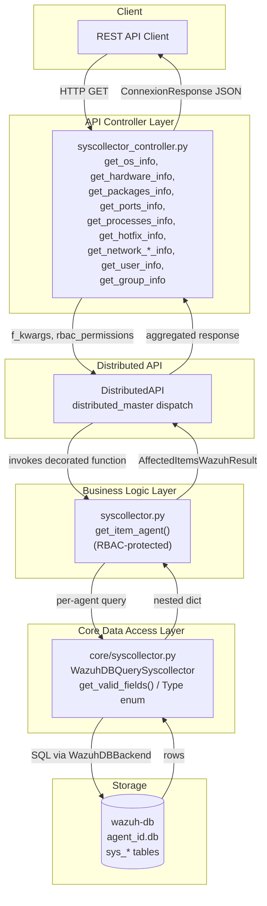
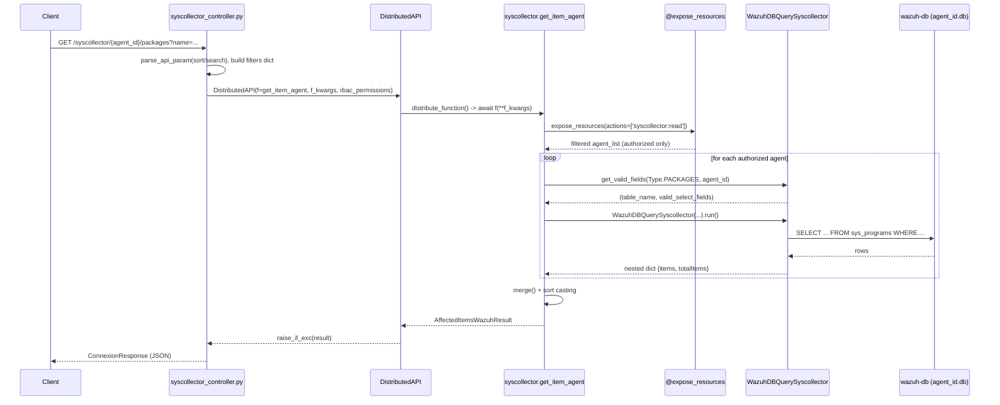
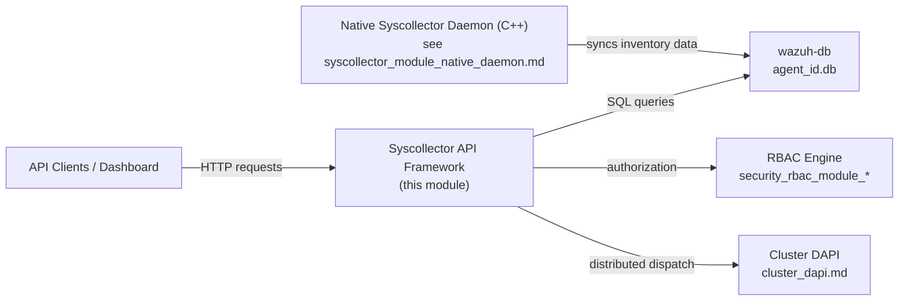

# Syscollector Module — API Framework

## 1. Introduction and Purpose

The **Syscollector API Framework** is the Python-based layer of Wazuh that exposes **system inventory data** — collected by the native Syscollector daemon running on each agent — through the Wazuh REST API. It answers questions such as: *"What operating system, hardware, packages, network interfaces, ports, processes, hotfixes, users, and groups does agent X currently have?"*

This module is the **thin, request/response-oriented counterpart** to the native C++ Syscollector daemon (documented separately in [syscollector_module_native_daemon.md](syscollector_module_native_daemon.md)), which is responsible for actually gathering inventory data on the endpoint and syncing it into `agent_id.db` via `wazuh-db`. The API Framework never collects data itself — it only **queries the already-synced SQLite tables** (`sys_osinfo`, `sys_hwinfo`, `sys_programs`, `sys_processes`, `sys_ports`, `sys_netaddr`, `sys_netproto`, `sys_netiface`, `sys_hotfixes`, `sys_users`, `sys_groups`) that live in each agent's database on the manager.

The module follows the classic three-layer pattern used throughout the Wazuh Framework:

1. **API Controller layer** — HTTP-facing, connexion/FastAPI-style async handlers that validate/normalize query parameters and dispatch requests through the Distributed API (DAPI).
2. **Business logic layer** — RBAC-protected, agent-oriented functions that orchestrate querying and result aggregation.
3. **Core data-access layer** — Direct `wazuh-db` query builders that know the actual database schema (table names, column names, nested-field structure) for every inventory element type.

## 2. Architecture Overview

### Request Flow (Sequence)

## 3. Core Components

| File | Responsibility |
|---|---|
| `api/api/controllers/syscollector_controller.py` | 11 async HTTP handlers (one per inventory element type), parameter parsing/validation, DAPI dispatch |
| `framework/wazuh/syscollector.py` | `get_item_agent()` — single generic, RBAC-protected entry point used by **all** controller handlers |
| `framework/wazuh/core/syscollector.py` | `Type` enum, `get_valid_fields()` field-mapping table, `WazuhDBQuerySyscollector` query-builder class |

Because all eleven controller endpoints funnel into the **same** `get_item_agent()` function (differentiated only by the `element_type` parameter), this module does not need further sub-module decomposition — it is a single, cohesive read pipeline.

### 3.1 API Controller Layer (`syscollector_controller.py`)

Each function (`get_os_info`, `get_hardware_info`, `get_hotfix_info`, `get_packages_info`, `get_ports_info`, `get_processes_info`, `get_network_address_info`, `get_network_interface_info`, `get_network_protocol_info`, `get_user_info`, `get_group_info`) follows an identical pattern:

1. Accept a single `agent_id` path parameter plus pagination/sorting/searching query parameters (`offset`, `limit`, `sort`, `search`, `select`, `q`, `distinct`) and element-specific filters (e.g., `vendor`, `name`, `architecture` for packages; `pid`, `state`, `protocol` for ports).
2. Build a `filters` dict from element-specific query parameters (including "nested" dotted fields like `tx.packets`, `local.ip` read directly from `request.query_params`).
3. Assemble `f_kwargs` including a fixed `element_type` string (`'os'`, `'hardware'`, `'packages'`, `'processes'`, `'ports'`, `'netaddr'`, `'netproto'`, `'netiface'`, `'hotfixes'`, `'users'`, `'groups'`).
4. Instantiate `DistributedAPI(f=syscollector.get_item_agent, f_kwargs=..., request_type='distributed_master', rbac_permissions=request.context['token_info']['rbac_policies'])` — see [cluster_dapi.md](cluster_dapi.md) for details on distributed request handling.
5. Await `dapi.distribute_function()`, unwrap with `raise_if_exc`, and return as `ConnexionResponse` via `json_response`.

This controller depends on shared API request-parsing utilities documented in [api_core_infrastructure_request_utils.md](api_core_infrastructure_request_utils.md) (`parse_api_param`, `remove_nones_to_dict`).

### 3.2 Business Logic Layer (`framework/wazuh/syscollector.py`)

`get_item_agent()` is the single generic aggregator:

- Decorated with `@expose_resources(actions=['syscollector:read'], resources=['agent:id:{agent_list}'])`, delegating authorization to the RBAC engine documented in [security_rbac_module_engine.md](security_rbac_module_engine.md) and [security_rbac_module_service.md](security_rbac_module_service.md).
- Validates each requested agent ID against `get_agents_info()` (agent existence cache — see [agent_module_core.md](agent_module_core.md)), raising `WazuhResourceNotFound(1701)` for unknown agents.
- Resolves the target table and column mapping via `get_valid_fields(Type(element_type), agent_id=agent)`.
- Executes a `WazuhDBQuerySyscollector` context-managed query per agent, tagging each returned item with its `agent_id`.
- Accumulates results into an `AffectedItemsWazuhResult` (shared result wrapper — see [framework_core_utils.md](framework_core_utils.md)), tracking both fully successful and partially failed (per-agent) queries.
- Post-processes numeric-vs-string sort casting so that, e.g., sorting on a numeric field does not fall back to lexicographic string ordering.
- Merges/sorts the final combined list via `merge()`.

### 3.3 Core Data Access Layer (`framework/wazuh/core/syscollector.py`)

- **`Type` enum**: `OS, HARDWARE, PACKAGES, PROCESSES, PORTS, NETADDR, NETPROTO, NETIFACE, HOTFIXES, USERS, GROUPS` — one value per Syscollector inventory dimension, matching the tables persisted by the native daemon (see [syscollector_module_native_daemon.md](syscollector_module_native_daemon.md)).
- **`get_valid_fields(element_type, agent_id)`**: returns `(table_name, valid_select_fields_dict)`. For `Type.OS`, it special-cases Windows vs. Linux agents (different `sys_osinfo` column sets) by first loading basic agent info via `Agent(agent_id).get_basic_information()` (from [agent_module_core.md](agent_module_core.md)) to detect the OS family.
- **`WazuhDBQuerySyscollector`**: extends the generic `WazuhDBQuery` (see [framework_core_utils.md](framework_core_utils.md)) with:
  - A fixed `WazuhDBBackend(agent_id)` connection target (per-agent database, not the global one) — backend and socket/connection primitives documented in [framework_core_communication.md](framework_core_communication.md).
  - `nested_fields = ['scan', 'os', 'ram', 'cpu', 'local', 'remote', 'tx', 'rx']` used to reconstruct dotted/nested JSON output (e.g., `os.version`, `ram.total`, `tx.packets`) from flat SQL columns.
  - `date_fields = {'scan.time', 'install_time'}` for proper date formatting.
  - Overridden `_format_data_into_dictionary()` that nests fields via `plain_dict_to_nested_dict`/`get_fields_to_nest` and optionally returns a single dict instead of an array (`array=False`, used for singleton element types like `os` and `hardware`).

## 4. Data Model / Element Types

| `element_type` | DB Table | Notable Filters | Cardinality |
|---|---|---|---|
| `os` | `sys_osinfo` | — | Single object |
| `hardware` | `sys_hwinfo` | — | Single object |
| `hotfixes` | `sys_hotfixes` | `hotfix` | Array |
| `netaddr` | `sys_netaddr` | `iface`, `proto`, `address`, `broadcast`, `netmask` | Array |
| `netiface` | `sys_netiface` | `adapter`, `type`, `state`, `name`, `mtu`, `tx.*`, `rx.*` | Array |
| `netproto` | `sys_netproto` | `iface`, `type`, `gateway`, `dhcp` | Array |
| `packages` | `sys_programs` | `vendor`, `name`, `architecture`, `format`, `version` | Array |
| `ports` | `sys_ports` | `pid`, `protocol`, `tx_queue`, `state`, `process`, `local.*`, `remote.ip` | Array |
| `processes` | `sys_processes` | `pid`, `state`, `ppid`, `egroup`, `euser`, `fgroup`, `name`, `nlwp`, `pgrp`, `priority`, `rgroup`, `ruser`, `sgroup`, `suser` | Array |
| `users` | `sys_users` | — | Array |
| `groups` | `sys_groups` | — | Array |

## 5. Integration with the Rest of the System

- **Upstream data producer**: the native daemon (`syscollector_start`/`syscollector_stop`, `Syscollector` class, `SysNormalizer`) — see [syscollector_module_native_daemon.md](syscollector_module_native_daemon.md) — collects OS, hardware, network, package, port, process, hotfix, user, and group data on the agent and pushes it to `wazuh-db` via the `WazuhDBQuerySyscollector`'s underlying tables.
- **Sibling API modules** using the identical Controller→Business-Logic→Core pattern include [rootcheck_module.md](rootcheck_module.md), [sca_module_details.md](sca_module_details.md), [ciscat_module.md](ciscat_module.md), and [syscheck_module.md](syscheck_module.md) — all of which query agent-scoped `wazuh-db` tables similarly.
- **Cross-cutting infrastructure**: authentication/authorization middleware, logging, and validators are shared with the rest of the API framework — see [api_core_infrastructure_middleware.md](api_core_infrastructure_middleware.md), [api_core_infrastructure_auth_config.md](api_core_infrastructure_auth_config.md), and [api_core_infrastructure_request_utils.md](api_core_infrastructure_request_utils.md).
- **Agent identity & metadata**: agent existence/OS-family checks rely on [agent_module_core.md](agent_module_core.md) (`Agent`, `get_agents_info`).
- **Distributed execution**: all requests are routed to the agent's actual manager node in a cluster via the DAPI, documented in [cluster_dapi.md](cluster_dapi.md).

## 6. Error Handling

- `WazuhResourceNotFound(1701)` — raised per-agent when the requested `agent_id` does not exist in `get_agents_info()`; captured into the result's failed-items list rather than aborting the whole request (partial success model, consistent with `AffectedItemsWazuhResult` semantics — see [framework_core_utils.md](framework_core_utils.md)).
- `WazuhDBBackend` (see [framework_core_communication.md](framework_core_communication.md)) raises `WazuhError(2007)` if the agent's database file does not exist yet (e.g., agent has never connected/synced).

## 7. Summary

This module is intentionally a lean, single-responsibility read pipeline: the controller layer adapts HTTP semantics, the business logic layer adds RBAC and multi-agent aggregation, and the core layer knows how to translate an "inventory element type" into the correct `wazuh-db` SQL query with correct nested-field reconstruction. It has no sub-modules because all three files form one indivisible request-handling chain — for a broader look at how this fits into the entire Syscollector feature (including the native inventory-gathering side), see [syscollector_module_native_daemon.md](syscollector_module_native_daemon.md).
