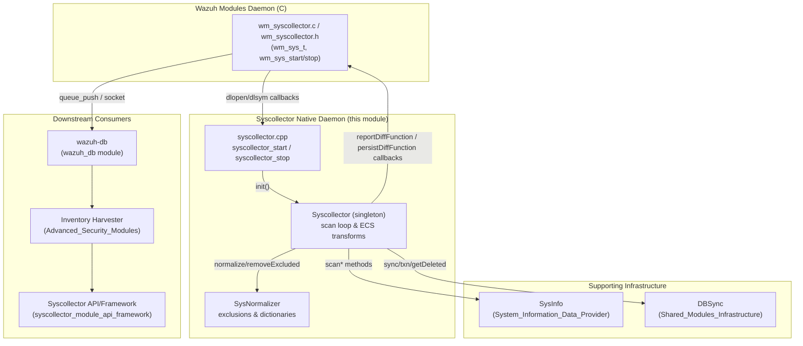
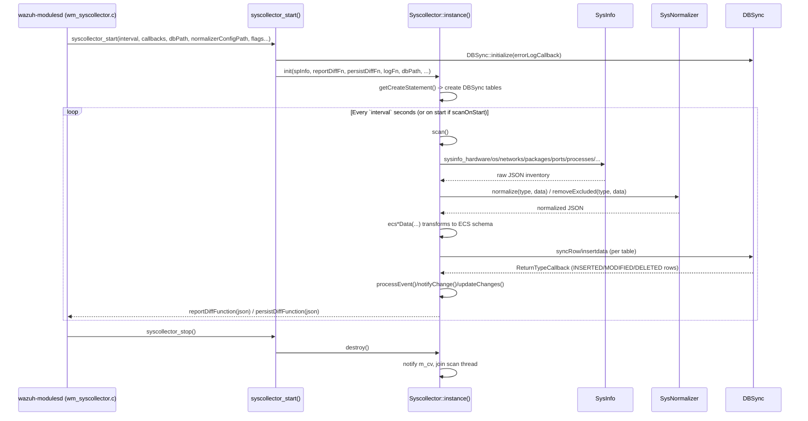
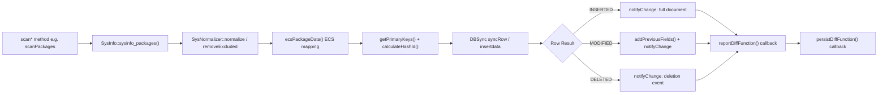
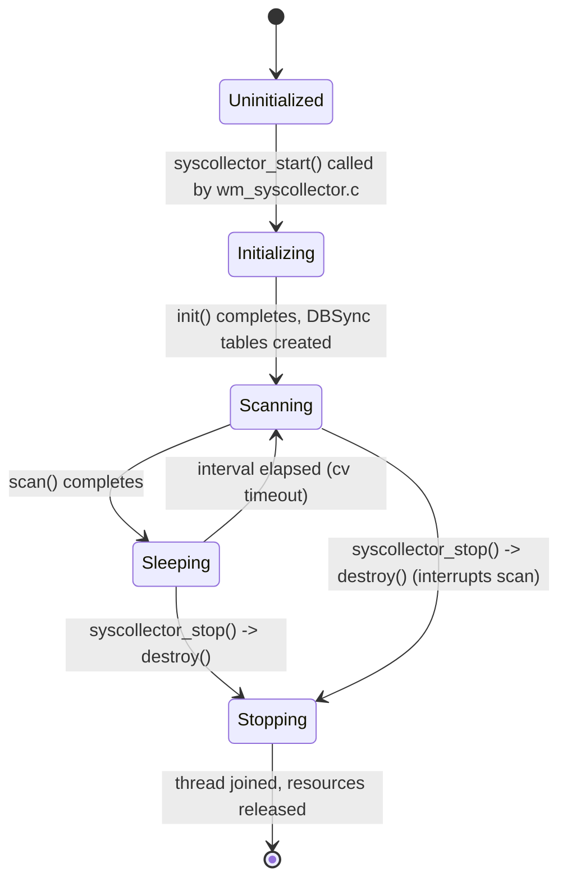
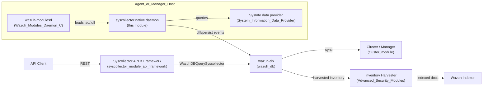

# Syscollector Module — Native Daemon (C++)

## Introduction

The **Syscollector Native Daemon** module is the C++ implementation core of Wazuh's system inventory collector. It runs as a shared library loaded by the Wazuh Modules daemon (`wazuh-modulesd`) and is responsible for periodically scanning a monitored endpoint (agent or manager) for hardware, operating system, network, package, port, process, hotfix, group, and user inventory data. It normalizes this data, computes deltas against the last known state using DBSync, and reports/persists changes so they can be forwarded to the manager (and ultimately indexed for querying through the Syscollector API — see [syscollector_module_api_framework.md](syscollector_module_api_framework.md)).

This module represents the **native/engine layer** of the broader Syscollector capability. It is one of two children of the parent `syscollector_module`, the other being the API/Framework layer that exposes collected data through the Wazuh REST API and Python framework.

## Purpose & Core Functionality

The native daemon module provides:

1. **Scheduled system scanning** — hardware, OS, network, packages, ports, processes, hotfixes, groups, and users, using the platform-agnostic [`SysInfo`](System_Information_Data_Provider_(C++).md) data provider.
2. **Data normalization** — via `SysNormalizer`, which applies configurable exclusion rules and value dictionaries (OS/architecture aliases, etc.) so that inventory fields are consistent across platforms.
3. **Change detection & synchronization** — using [`DBSync`](Shared_Modules_Infrastructure_(C++).md) to persist scan snapshots in a local SQLite database and compute per-row insert/modify/delete deltas.
4. **ECS-style data transformation** — converting raw provider output into Elastic Common Schema (ECS)-like JSON documents suitable for indexing (hardware, OS, packages, processes, ports, network interfaces/protocols/addresses, users, groups, hotfixes).
5. **Event emission** — reporting diffs and persisting state through callback functions supplied by the parent `wazuh-modulesd` daemon, which in turn forwards them to `wazuh-db` / the inventory harvester pipeline.
6. **Lifecycle management** — clean start/stop semantics exposed as a C API (`syscollector_start`, `syscollector_stop`) so the module can be dynamically loaded/unloaded by the modules daemon.

## Core Components

| Component | File | Responsibility |
|---|---|---|
| `Syscollector` | `include/syscollector.hpp` | Singleton engine class implementing the scan loop, ECS transformation, DBSync integration, and change notification. |
| `SysNormalizer` | `include/syscollectorNormalizer.hpp` | Loads normalization configuration (exclusions & dictionaries) and applies them to scanned data per OS/type. |
| `syscollector_start` / `syscollector_stop` | `src/syscollector.cpp` | C-linkage entry points used by `wazuh-modulesd` (`wm_syscollector.c`) to initialize and tear down the module. |

## Architecture



## Component Relationships & Data Flow



## Class Design — `Syscollector`

`Syscollector` is a **thread-safe singleton** (Meyers' singleton pattern) that owns:

- A `SysInfo` provider (`m_spInfo`) abstracting OS-specific data collection (see [System_Information_Data_Provider_(C++).md](System_Information_Data_Provider_(C++).md)).
- A `DBSync` instance (`m_spDBSync`) for persisting and diffing scan snapshots (see [Shared_Modules_Infrastructure_(C++).md](Shared_Modules_Infrastructure_(C++).md)).
- A `SysNormalizer` instance (`m_spNormalizer`) for platform-specific value normalization.
- Callback function members (`m_reportDiffFunction`, `m_persistDiffFunction`, `m_logFunction`) injected at `init()` time by the caller (the C wrapper in `syscollector.cpp`, ultimately from `wm_syscollector.c`).
- A condition variable/mutex pair (`m_cv`, `m_mutex`) plus `m_stopping` flag implementing a cancellable sleep loop (`syncLoop`) for graceful shutdown.

```mermaid
classDiagram
    class Syscollector {
        -shared_ptr~ISysInfo~ m_spInfo
        -function~void(string)~ m_reportDiffFunction
        -function~void(string)~ m_persistDiffFunction
        -function~void(level,string)~ m_logFunction
        -unique_ptr~DBSync~ m_spDBSync
        -unique_ptr~SysNormalizer~ m_spNormalizer
        -unsigned int m_intervalValue
        -bool m_scanOnStart
        -bool m_hardware, m_os, m_network, m_packages
        -bool m_ports, m_portsAll, m_processes, m_hotfixes
        -bool m_groups, m_users, m_notify, m_stopping
        +instance() Syscollector&
        +init(spInfo, reportDiffFn, persistDiffFn, logFn, dbPath, normalizerConfigPath, normalizerType, interval, scanOnStart, hardware, os, network, packages, ports, portsAll, processes, hotfixes, groups, users, notifyOnFirstScan)
        +destroy()
        -scan()
        -scanHardware() -scanOs() -scanNetwork()
        -scanPackages() -scanHotfixes() -scanPorts()
        -scanProcesses() -scanGroups() -scanUsers()
        -syncLoop(lock)
        -ecsSystemData(data, createFields) json
        -ecsHardwareData(data, createFields) json
        -ecsPackageData(data, createFields) json
        -ecsProcessesData(data, createFields) json
        -ecsPortData(data, createFields) json
        -ecsNetworkInterfaceData(data, createFields) json
        -ecsNetworkProtocolData(data, createFields) json
        -ecsNetworkAddressData(data, createFields) json
        -ecsUsersData(data, createFields) json
        -ecsGroupsData(data, createFields) json
        -ecsHotfixesData(data, createFields) json
        -updateChanges(table, values)
        -notifyChange(result, data, table)
        -processEvent(result, data, table)
        -getPrimaryKeys(data, table) string
        -calculateHashId(data, table) string
        -addPreviousFields(current, previous) json
    }
    class SysNormalizer {
        -map~string,json~ m_typeExclusions
        -map~string,json~ m_typeDictionary
        +SysNormalizer(configFile, target)
        +normalize(type, data)
        +removeExcluded(type, data)
        -getTypeValues(configFile, target, type)$ map~string,json~
    }
    Syscollector --> SysNormalizer : owns
    Syscollector --> "ISysInfo" : uses
    Syscollector --> "DBSync" : uses
```

## Scan & ECS Transformation Pipeline

Each inventory category follows the same pattern: **collect → normalize → ECS-transform → diff via DBSync → emit event**.



Supported inventory categories and their corresponding ECS transform methods:

| Category | Scan Method | ECS Transform |
|---|---|---|
| Hardware | `scanHardware()` | `ecsHardwareData()` |
| Operating System | `scanOs()` | `ecsSystemData()` |
| Network (interfaces/protocols/addresses) | `scanNetwork()` | `ecsNetworkInterfaceData()`, `ecsNetworkProtocolData()`, `ecsNetworkAddressData()` |
| Packages | `scanPackages()` | `ecsPackageData()` |
| Hotfixes (Windows) | `scanHotfixes()` | `ecsHotfixesData()` |
| Ports | `scanPorts()` | `ecsPortData()` |
| Processes | `scanProcesses()` | `ecsProcessesData()` |
| Groups | `scanGroups()` | `ecsGroupsData()` |
| Users | `scanUsers()` | `ecsUsersData()` |

## Configuration & Lifecycle

`init()` accepts granular toggles (`hardware`, `os`, `network`, `packages`, `ports`, `portsAll`, `processes`, `hotfixes`, `groups`, `users`) plus scheduling parameters (`interval`, `scanOnStart`) and a `notifyOnFirstScan` flag controlling whether the very first scan emits full "insert" events for baseline synchronization. These parameters map directly onto the `wm_sys_t` configuration structure parsed from `ossec.conf` by the parent `Wazuh_Modules_Daemon_(C)` (`wm_syscollector.c`/`.h`).



### C API Boundary (`syscollector.cpp`)

The file `src/syscollector.cpp` exposes the only two symbols visible to the C caller (`wm_syscollector.c`), wrapped in `extern "C"`:

- **`syscollector_start(...)`** — Wraps raw C function-pointer callbacks (`send_data_callback_t`, `log_callback_t`) into `std::function` lambdas, initializes `DBSync` global error logging, constructs a `SysInfo` instance, and calls `Syscollector::instance().init(...)`. Any exception during initialization is caught and reported through the error-log callback rather than propagating across the C/C++ boundary (important since the module is loaded via `dlopen` by `wazuh-modulesd`).
- **`syscollector_stop()`** — Delegates to `Syscollector::instance().destroy()`, which signals the internal condition variable to interrupt the sleep/scan loop and performs a clean shutdown.

This mirrors the pattern used by other native C++ modules embedded in the C-based `Wazuh_Modules_Daemon_(C)` (e.g., `content_manager_start/stop`, `inventory_harvester_start/stop`, `vulnerability_scanner_start/stop`) — see [Wazuh_Modules_Daemon_(C).md](Wazuh_Modules_Daemon_(C).md) and [Advanced_Security_Modules_(C++_Inventory_&_Vulnerability).md](Advanced_Security_Modules_(C++_Inventory_&_Vulnerability).md).

## System Context



## Relationship to Sibling Module

The **syscollector_module** parent groups this native daemon together with `syscollector_module_api_framework`. While this module (`syscollector_module_native_daemon`) is responsible for **collecting, normalizing, and persisting** inventory data on the endpoint, the sibling module exposes that data for **querying** through:

- `framework/wazuh/core/syscollector.py::WazuhDBQuerySyscollector` — queries `wazuh-db` for the data this native module ultimately writes.
- `framework/wazuh/syscollector.py::get_item_agent` — high-level business logic wrapper.
- `api/api/controllers/syscollector_controller.py` — REST endpoints (`get_hardware_info`, `get_os_info`, `get_packages_info`, `get_ports_info`, `get_processes_info`, `get_network_*`, `get_hotfix_info`, `get_user_info`, `get_group_info`).

See [syscollector_module_api_framework.md](syscollector_module_api_framework.md) for details on that side of the pipeline.

## Dependencies Summary

| Dependency | Module | Purpose |
|---|---|---|
| `ISysInfo` / `SysInfo` | [System_Information_Data_Provider_(C++).md](System_Information_Data_Provider_(C++).md) | Cross-platform system data collection (hardware, OS, network, packages, ports, processes, users, groups, hotfixes). |
| `DBSync` | [Shared_Modules_Infrastructure_(C++).md](Shared_Modules_Infrastructure_(C++).md) | Local SQLite-backed snapshot storage and row-level change (insert/modify/delete) detection between scans. |
| `wm_syscollector.c` / `wm_syscollector.h` | [Wazuh_Modules_Daemon_(C).md](Wazuh_Modules_Daemon_(C).md) | Hosts the module inside `wazuh-modulesd`, parses XML configuration into `wm_sys_t`, invokes `syscollector_start`/`syscollector_stop`, and forwards diff/persist callbacks to the message queue / `wazuh-db` socket. |
| Inventory Harvester | [Advanced_Security_Modules_(C++_Inventory_&_Vulnerability).md](Advanced_Security_Modules_(C++_Inventory_&_Vulnerability).md) | Consumes syscollector-produced events (via `wazuh-db`) to build indexer documents (`InventoryHardwareHarvester`, `InventoryPackageHarvester`, etc.). |
| `wazuh_db` daemon | [wazuh_db module tree] | Persists synchronized inventory state server-side and answers `WazuhDBQuerySyscollector` queries from the API layer. |

## Key Design Notes

- **Singleton lifecycle tied to dynamic loading**: Because `wazuh-modulesd` loads/unloads this module as a shared library, the singleton pattern combined with explicit `init()`/`destroy()` (rather than constructor/destructor-driven RAII) allows re-initialization within the same process across module reload cycles.
- **Callback injection decouples transport**: The module has no direct knowledge of message queues or sockets — it only knows about the `reportDiffFunction`/`persistDiffFunction`/`logFunction` callbacks, allowing `wm_syscollector.c` to control how/where events are ultimately sent (e.g., to the agent's message queue or directly to `wazuh-db` for managers).
- **Normalization is data-driven**: `SysNormalizer` loads its exclusion/dictionary rules from an external configuration file (`normalizerConfigPath`) keyed by `normalizerType` (e.g., OS family), keeping platform-specific normalization logic out of the C++ code.
- **Graceful shutdown**: The `m_cv`/`m_mutex`/`m_stopping` triad ensures `destroy()` can interrupt a sleeping scan loop promptly without needing to wait a full scan interval, which is important for responsive daemon shutdown/restart in `wazuh-modulesd`.
