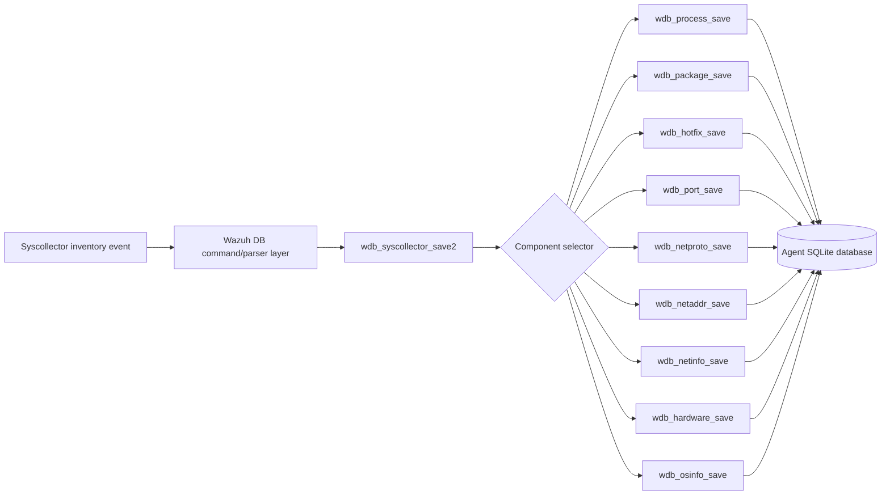
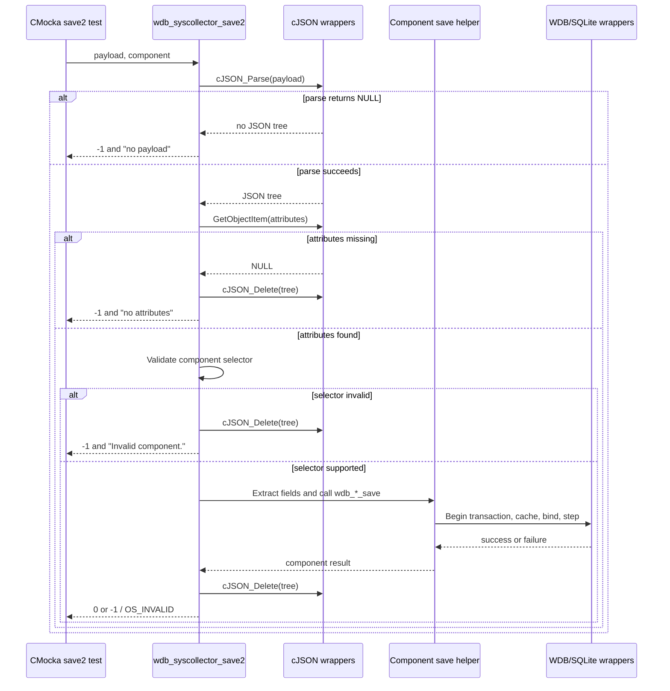
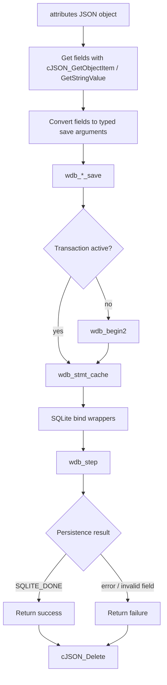
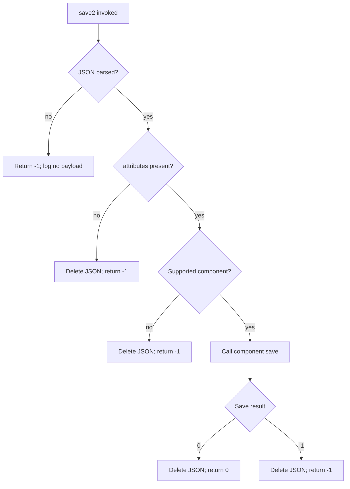
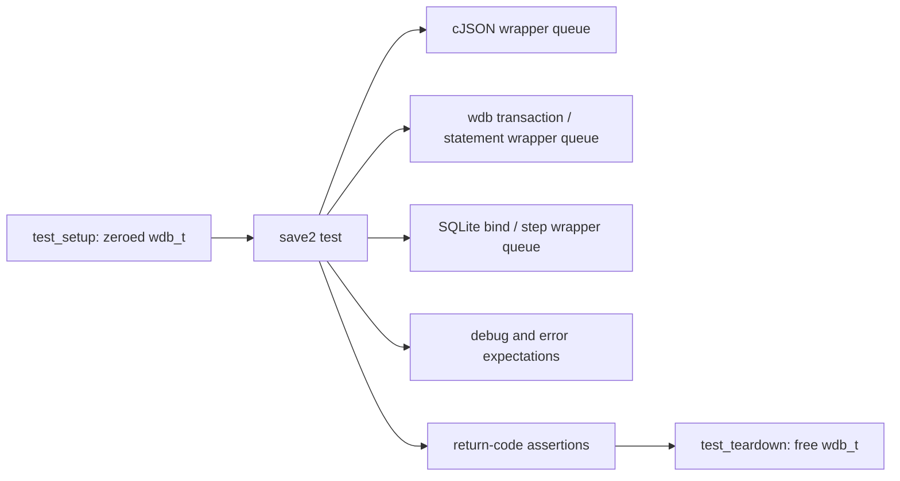

# `syscollector_save2_tests`

## Introduction

`syscollector_save2_tests` documents the CMocka tests for `wdb_syscollector_save2()`, the JSON ingestion entry point in `src/unit_tests/wazuh_db/test_wdb_syscollector.c`. The tests verify that a syscollector JSON payload is parsed, its `attributes` object is located, the requested inventory component is dispatched to the correct `wdb_*_save()` routine, and the parsed JSON tree is released on every exercised path.

The module is part of the broader [`test_wdb_syscollector`](test_wdb_syscollector.md) test file and the [`Unit_Tests_-_Wazuh_DB`](Unit_Tests_-_Wazuh_DB.md) suite. Fixture allocation, typed inventory objects, SQLite binding policies, and reusable mock scripts are described in [`test_wdb_syscollector_test_infrastructure`](test_wdb_syscollector_test_infrastructure.md). Production persistence responsibilities belong to [`wazuh_db_fim_syscollector`](wazuh_db_fim_syscollector.md).

## Position in the system

`wdb_syscollector_save2()` is the boundary between JSON-formatted inventory events and the typed Wazuh DB persistence helpers. The test module does not open a database or parse real JSON; CMocka wrappers provide deterministic parser nodes, attributes, transaction results, statement-cache results, SQLite bindings, and step codes.

The production relationship and database schema are intentionally not duplicated here; see [`wazuh_db_fim_syscollector`](wazuh_db_fim_syscollector.md).

## Test responsibilities

The save2-specific cases cover three dispatcher guards and nine supported component routes:

| Area | Component constant | Delegated save routine | Cases |
|---|---|---|---|
| Payload parsing | Any | `cJSON_Parse` | `test_wdb_syscollector_save2_parser_json_fail` |
| Attribute extraction | Any | `cJSON_GetObjectItem` | `test_wdb_syscollector_save2_get_attributes_fail` |
| Selector validation | Invalid selector `0` | None | `test_wdb_syscollector_save2_fail` |
| Process inventory | `WDB_SYSCOLLECTOR_PROCESSES` | `wdb_process_save` | failure, invalid/missing attributes, success |
| Package inventory | `WDB_SYSCOLLECTOR_PACKAGES` | `wdb_package_save` | failure and success |
| Hotfix inventory | `WDB_SYSCOLLECTOR_HOTFIXES` | `wdb_hotfix_save` | failure and success |
| Port inventory | `WDB_SYSCOLLECTOR_PORTS` | `wdb_port_save` | failure and success |
| Network protocol | `WDB_SYSCOLLECTOR_NETPROTO` | `wdb_netproto_save` | failure and success |
| Network address | `WDB_SYSCOLLECTOR_NETADDRESS` | `wdb_netaddr_save` | failure and success |
| Network interface | `WDB_SYSCOLLECTOR_NETINFO` | `wdb_netinfo_save` | failure and success |
| Hardware inventory | `WDB_SYSCOLLECTOR_HWINFO` | `wdb_hardware_save` | failure and success |
| Operating-system information | `WDB_SYSCOLLECTOR_OSINFO` | `wdb_osinfo_save` | failure and success |

The user and group save routines are tested elsewhere in the parent file, but are not dispatched by the save2 cases listed for this module.

## Dispatcher flow

The tests model the common control flow below. The payload passed by the test is `NULL`, but the cJSON wrapper supplies the scripted parse result and object nodes.

## Component interaction model

Each supported route follows the same high-level contract, while the number and types of extracted fields differ by component.

The component helper scripts in the parent test file provide the low-level expectations for ordered binding, null normalization, statement caching, and SQLite result handling. This module only asserts that `save2` reaches the appropriate route and propagates its result.

## Failure semantics

The dispatcher-level failure cases establish these invariants:

1. A failed `cJSON_Parse` is reported as `-1`, logs `at wdb_syscollector_save2(): no payload`, and does not proceed to attribute extraction.
2. A parsed tree without the expected attributes object is reported as `-1`, logs `at wdb_syscollector_save2(): no attributes`, and is deleted.
3. An unsupported component selector is reported as `-1`, logs `at wdb_syscollector_save2(): Invalid component.`, and is deleted.
4. A supported route returns the delegated save result. The tests use `-1` for transaction or persistence failure and `0` for successful insertion.
5. Every parsed-tree test expects `cJSON_Delete`, including component failures and successful saves.

## Process-specific validation coverage

The process route has the most detailed JSON extraction script. Its tests cover:

- transaction-start failure before the insert can execute;
- missing or invalid extracted values, producing `OS_INVALID`;
- successful extraction and insertion;
- integer and 64-bit numeric attributes, including a large `start_time` fixture value (`5294967296`);
- text fields such as process name, command, users, groups, and checksum.

This complements the lower-level process insert tests documented by the parent module. It verifies the JSON-to-typed-argument path rather than only the SQL binding contract.

## Test doubles and lifecycle

The cases use the minimal `test_setup`/`test_teardown` fixture, which allocates a zeroed `wdb_t`. cJSON, SQLite, Wazuh DB, and logging functions are intercepted through wrappers. The test scripts use `will_return()` to queue values and `expect_*()`/`expect_function_call()` to verify calls.

The extended fixture and reusable `configure_wdb_*` helpers are shared infrastructure and are documented in [`test_wdb_syscollector_test_infrastructure`](test_wdb_syscollector_test_infrastructure.md).

## Maintenance guidance

When adding a new save2 component or changing a component payload:

- add a dispatcher success and delegated-failure case;
- script the expected cJSON attribute access order;
- verify that the component constant maps to the intended `wdb_*_save` function;
- retain a `cJSON_Delete` expectation on both success and failure paths;
- update the parent [`test_wdb_syscollector`](test_wdb_syscollector.md) documentation if the inventory coverage changes;
- update production/schema references in [`wazuh_db_fim_syscollector`](wazuh_db_fim_syscollector.md) rather than copying persistence details into this test document.

Ordered wrapper expectations are deliberate: a mismatch usually indicates a changed JSON field contract, dispatch mapping, or persistence function signature.

## Related documentation

- [`test_wdb_syscollector`](test_wdb_syscollector.md) — complete syscollector unit-test module.
- [`test_wdb_syscollector_test_infrastructure`](test_wdb_syscollector_test_infrastructure.md) — fixtures, binding policies, and mock configuration helpers.
- [`wazuh_db_fim_syscollector`](wazuh_db_fim_syscollector.md) — production syscollector persistence and database relationships.
- [`Unit_Tests_-_Wazuh_DB`](Unit_Tests_-_Wazuh_DB.md) — parent Wazuh DB test suite.
