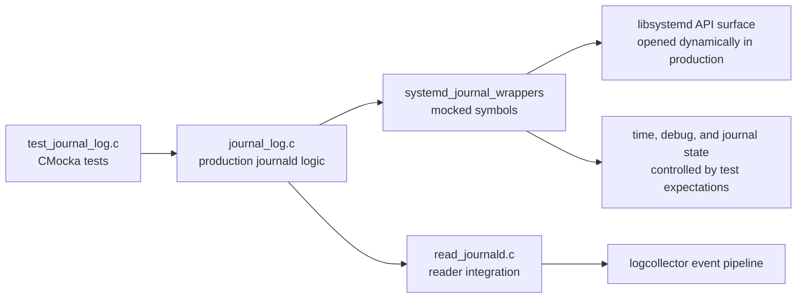
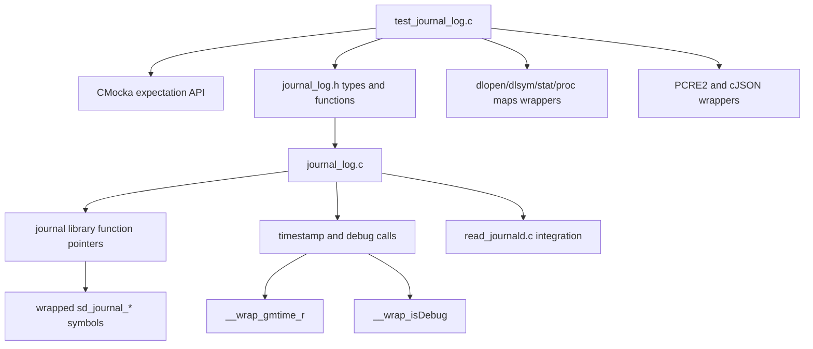
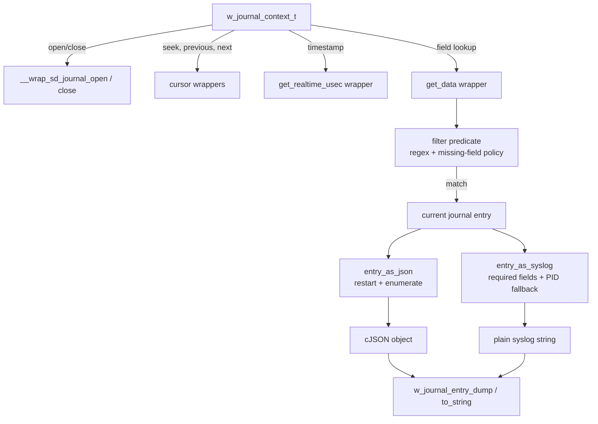
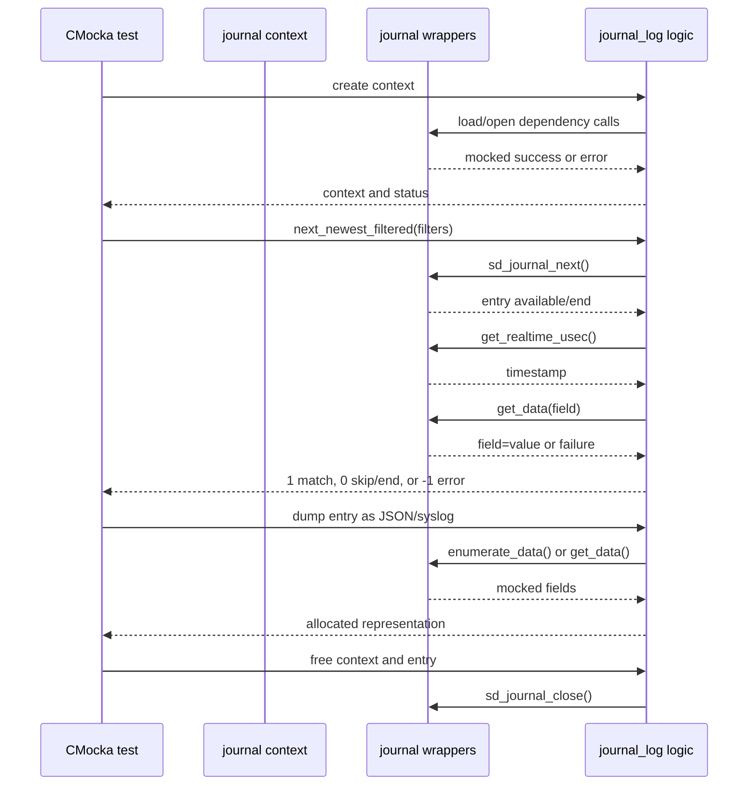
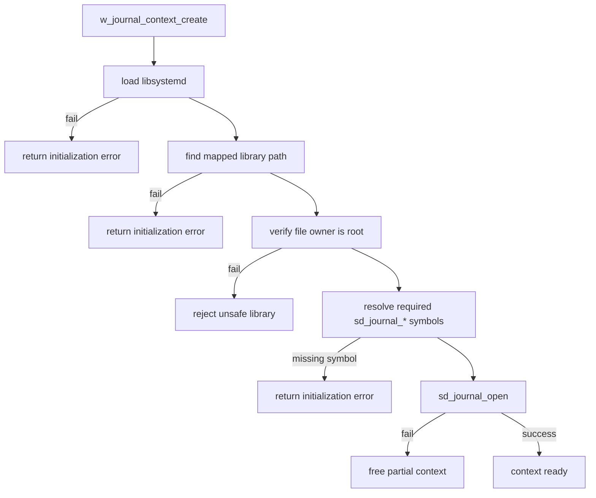
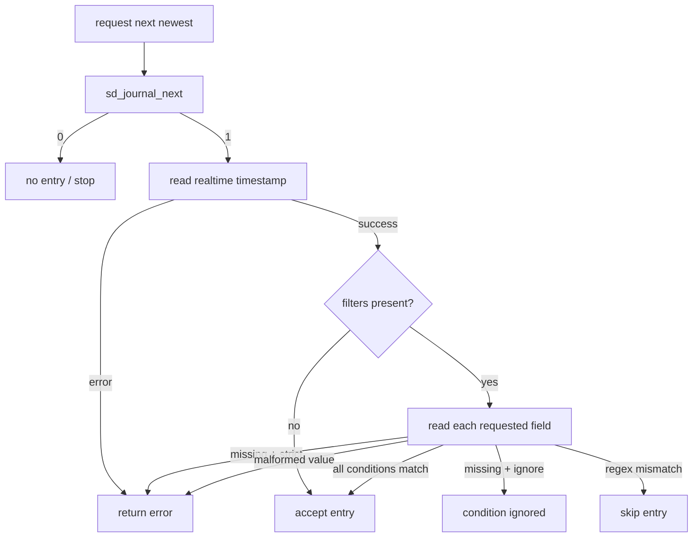
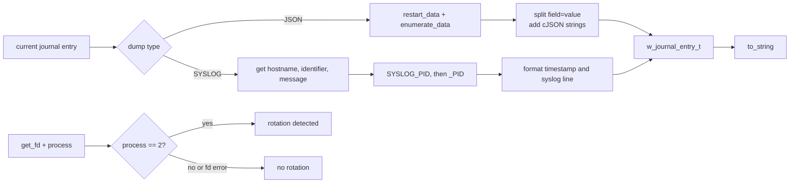

# Systemd journal wrappers

The `systemd_journal_wrappers` module is the CMocka test-double layer for Wazuh's journald integration. It replaces the dynamically loaded `libsystemd` functions, selected time functions, and the debug-mode query with deterministic mocks. The wrappers let `test_journal_log.c` exercise journal initialization, cursor movement, filtering, entry conversion, and rotation detection without requiring a live systemd journal.

This is test infrastructure, not the production journald reader. The production behavior is implemented by `src/logcollector/journal_log.c` and `src/logcollector/read_journald.c`; this module supplies the controlled dependencies used by their unit tests. The broader journald test area is described by [`logcollector_journald`](logcollector_journald.md).

## Scope and position in the test system

The wrappers are defined in `src/unit_tests/logcollector/test_journal_log.c`, alongside the tests that consume them. They intercept calls made through the function pointers loaded by the journald library loader and provide CMocka expectations through `expect_*`, `will_return`, and `function_called`.

The test file also uses neighboring wrappers for `dlopen`/`dlsym`, `stat`, `/proc/self/maps`, PCRE2, cJSON, and stdio. Those dependencies are outside this module's symbol set but are required to make library loading and output conversion reproducible.

## Wrapped interfaces

| Wrapper | Dependency represented | Test-controlled behavior |
|---|---|---|
| `__wrap_sd_journal_open` | `sd_journal_open` | Returns the mocked status code. |
| `__wrap_sd_journal_close` | `sd_journal_close` | Records a required call with `function_called()`. |
| `__wrap_sd_journal_previous`, `__wrap_sd_journal_next` | Cursor movement | Return a mocked cursor result. `next` is also used to distinguish an available entry from end-of-journal. |
| `__wrap_sd_journal_seek_tail` | Seek to newest journal position | Returns a mocked status code. |
| `__wrap_sd_journal_seek_realtime_usec` | Seek by realtime timestamp | Returns a mocked status code. |
| `__wrap_sd_journal_get_realtime_usec` | Read current entry timestamp | Writes the mocked microsecond timestamp when non-negative; otherwise returns an error. |
| `__wrap_sd_journal_get_cutoff_realtime_usec` | Read journal oldest/newest bounds | Writes the mocked lower bound (`from`) when non-negative. |
| `__wrap_sd_journal_get_data` | Read one journal field | Verifies the requested field, returns a mocked status, and supplies a `field=value` buffer plus its length on success. |
| `__wrap_sd_journal_restart_data` | Reset field enumeration | Returns a mocked status code. |
| `__wrap_sd_journal_enumerate_data` | Enumerate journal fields | Supplies one mocked `field=value` buffer and length while the mocked return value is positive. |
| `__wrap_sd_journal_process` | Detect journal changes | Returns a mocked systemd process result; the tests treat result `2` as rotation. |
| `__wrap_sd_journal_get_fd` | Obtain journal polling descriptor | Returns a mocked descriptor or failure. |
| `__wrap_gmtime_r` | Convert journal time for syslog output | Returns a mocked `struct tm` pointer when configured, otherwise delegates to the real function. |
| `__wrap_isDebug` | Wazuh debug-level query | Returns the mocked boolean/int value used by filtered traversal logging. |

The wrappers deliberately preserve the calling convention expected by the production function-pointer table. They do not emulate systemd's journal storage or field semantics; each test supplies only the result needed for the branch under test.

## Architecture and dependencies

Initialization tests additionally model the security and loading checks around `libsystemd.so.0`: opening the library, locating its mapped path through `/proc/self/maps`, confirming root ownership with `stat`, resolving every required symbol with `dlsym`, and opening the journal. This keeps failures attributable to a specific initialization stage.

## State and data flow

The central object is `w_journal_context_t`, which owns the journal handle and the current cursor timestamp. Filters and dumped entries are separately allocated and explicitly freed by the tests.

Field data is represented in the same shape expected from systemd, such as `MESSAGE=text` or `_HOSTNAME=node`. `get_field_ptr` splits at the first equals sign and returns an allocated value; malformed data is rejected, while an empty value such as `FIELD=` is valid.

## Component interactions

`sd_journal_close` is a call expectation rather than a return-value stub. Consequently, lifecycle tests verify that successful contexts release their journal handle and that cleanup is safe for null contexts.

## Process flows

### Library and context initialization

The tests cover each failure boundary independently, including `dlopen`, mapped-path discovery, ownership validation, symbol resolution, null output pointers, and journal-open failure.

### Navigation and filtering

Timestamp seeking follows a related path: the code reads journal cutoff information, rejects timestamps in the future or before the available range, seeks by realtime microseconds, advances to the first suitable entry, and updates the context timestamp. The test suite supplies each systemd result to exercise those branches.

### Entry conversion and rotation detection

Syslog conversion requires hostname and message; a missing identifier becomes `unknown`, and the PID lookup falls back from `SYSLOG_PID` to `_PID`. Missing required fields, invalid time conversion, and invalid dump types produce null results. JSON conversion rejects empty or malformed enumeration data and cleans up the partially built cJSON object.

## Test contract and maintenance guidance

1. Configure every `will_return` and `expect_*` in the same order as the production call sequence. CMocka queues return values, so an omitted value can make a later assertion appear to fail in an unrelated wrapper.
2. Match the requested field in `__wrap_sd_journal_get_data`. The wrapper asserts the expected field name before returning data, which detects incorrect fallback or field ordering.
3. Treat wrapper-owned buffers as borrowed. `get_data` and `enumerate_data` point at mocked strings and only report their lengths; the production code must not free them.
4. Free contexts, filters, filter lists, entries, cJSON objects, and strings according to the ownership established by the production API. The close wrapper ensures journal-handle cleanup is tested.
5. Keep security-path tests when changing library loading. Root ownership and symbol validation are part of the initialization contract, not incidental setup.
6. When adding a new dynamically loaded systemd symbol, update the production loader expectations and the wrapper/test setup together.
7. When changing output formatting, update both the mocked fields and the expected JSON/syslog strings; the tests intentionally cover missing fields, empty fields, malformed fields, and PID fallback.

## Related modules

- [`logcollector_journald`](logcollector_journald.md) — journald configuration and production-facing integration context.
- [`logcollector`](logcollector.md) — logcollector subsystem overview.
- `src/logcollector/journal_log.c` — production journald context, navigation, filtering, and conversion logic.
- `src/logcollector/read_journald.c` — reader loop that consumes journal entries.
- `src/unit_tests/logcollector/test_journal_log.c` — wrapper definitions and the tests that define this module's executable contract.
