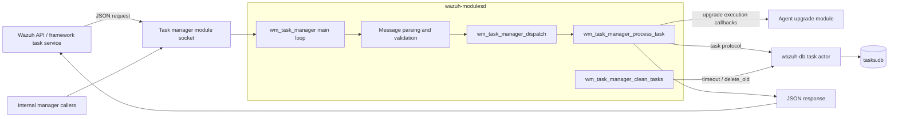
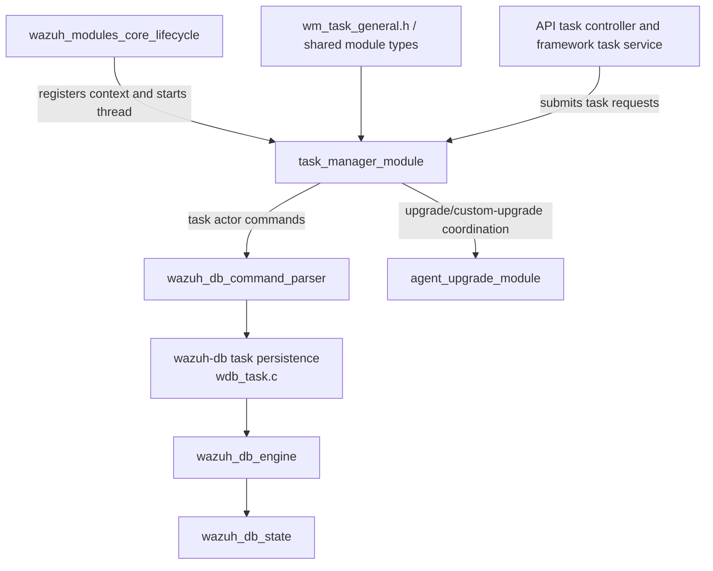
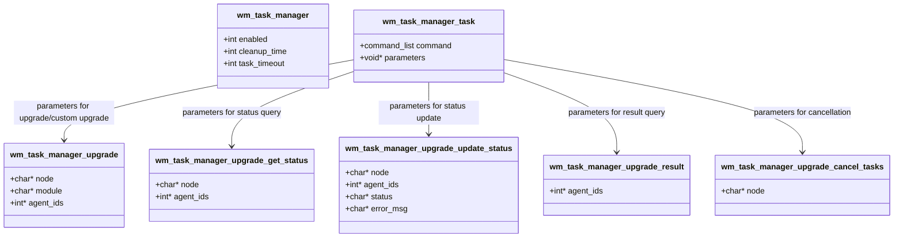
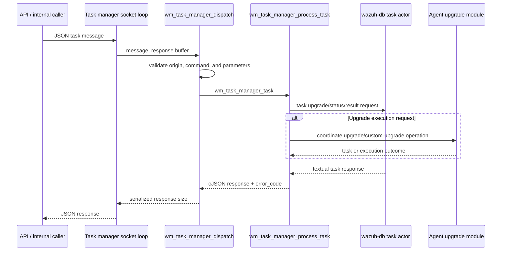
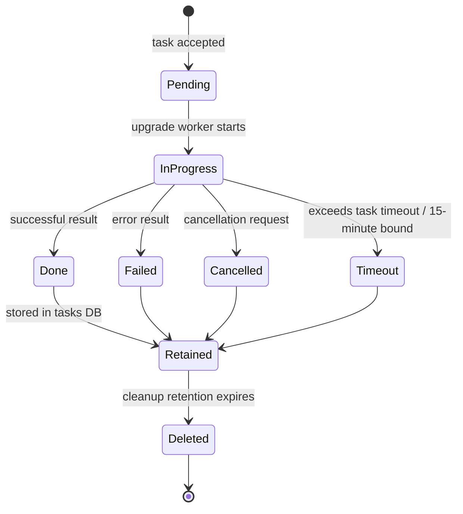

# Task Manager Module

## Introduction

The **task manager module** is the task-control and task-state coordination component hosted by `wazuh-modulesd`. It receives structured requests over its module socket, validates and dispatches upgrade-related task commands, communicates with `wazuh-db` for durable task state, and periodically cleans up stale task records.

The module is deliberately separate from the [agent upgrade module](agent_upgrade_module.md): the task manager owns the task-management protocol and persistence orchestration, while the agent-upgrade module performs package validation, transfer, installation, and agent-side upgrade execution. The database-side command grammar and SQL implementation are documented in [wazuh_db_command_parser.md](wazuh_db_command_parser.md) and [wazuh_db_state.md](wazuh_db_state.md).

## Purpose and scope

| Concern | Responsibility |
|---|---|
| Module lifecycle | Read XML configuration, expose `WM_TASK_MANAGER_CONTEXT`, and run the module worker loop. |
| Request handling | Receive JSON task requests, validate their command and parameters, dispatch them, and return JSON responses. |
| Task coordination | Represent upgrade, status, result, status-update, custom-upgrade, and cancellation operations. |
| Persistence boundary | Translate task operations into `wazuh-db` `task` actor requests. |
| Maintenance | Mark long-running `IN_PROGRESS` tasks as timed out and delete records older than the configured retention period. |

It does not own the upgrade transfer protocol, package files, SQLite schema, or the REST API. The API and framework layers are upstream callers; see the task endpoint documentation represented by `task_controller.py` / `framework/wazuh/task.py` in the module tree.

## Position in the system

The module is registered as a default manager module by the common modules lifecycle. That lifecycle, thread model, configuration loading, and `wm_context` contract are documented in [wazuh_modules_core_lifecycle.md](wazuh_modules_core_lifecycle.md).

### Dependencies

The dependency on `wazuh-db` is an IPC/protocol dependency, not a direct in-process dependency. The task manager sends requests through the standard Wazuh database communication path; `wdb_parse_task_*` handlers then call the task persistence functions. This keeps task orchestration independent of SQLite details.

## Core data model

All public structures in the supplied core header are declared in `src/wazuh_modules/task_manager/wm_task_manager.h`.

### Configuration

`wm_task_manager` contains three runtime controls:

- `enabled` — whether the module starts and accepts work.
- `cleanup_time` — retention period used by the cleanup worker.
- `task_timeout` — threshold used to identify tasks that have remained in progress too long.

The header defines the operational defaults and safety bound used by the implementation:

| Constant | Value | Meaning |
|---|---:|---|
| `WM_TASK_MAX_IN_PROGRESS_TIME` | `900` seconds | Fifteen-minute upper bound for an `IN_PROGRESS` task. |
| `WM_TASK_CLEANUP_DB_SLEEP_TIME` | `86400` seconds | Daily cleanup cadence. |
| `WM_TASK_DEFAULT_CLEANUP_TIME` | `604800` seconds | One-week default retention period. |

The exact XML tags are parsed by `wm_task_manager_read`, using the shared module configuration structures and XML helpers. Invalid or absent values are handled at configuration time rather than in the task command path.

### Commands and errors

`wm_task_manager_task.command` is a discriminator from the shared `command_list` type. The test and database parser inventories show the supported task families:

| Command family | Parameter structure | Functionality |
|---|---|---|
| `upgrade` / `upgrade_custom` | `wm_task_manager_upgrade` | Start or coordinate an upgrade for one or more agents, optionally targeting a node and module. |
| `upgrade_get_status` | `wm_task_manager_upgrade_get_status` | Retrieve task status for selected agents/node. |
| `upgrade_update_status` | `wm_task_manager_upgrade_update_status` | Persist a status transition and optional error message. |
| `upgrade_result` | `wm_task_manager_upgrade_result` | Retrieve the result associated with agent task IDs. |
| `upgrade_cancel_tasks` | `wm_task_manager_upgrade_cancel_tasks` | Cancel pending upgrade tasks for a node. |
| Maintenance commands | module configuration / database parameters | Set timeout state and delete old task records. |

The `error_code` enum provides stable translation points between parser, database, and response layers: invalid message, invalid command, missing task, database error, database parse/request errors, and unknown failure are distinguished from `WM_TASK_SUCCESS`.

## Request and response flow

`wm_task_manager_dispatch` is the protocol boundary. Its contract is to analyze the complete incoming message and populate the response. `wm_task_manager_process_task` is the command boundary: it receives an already represented task and invokes the appropriate operation. Keeping these stages distinct allows parser tests to exercise malformed messages independently from database and command tests.

The database protocol itself is line-oriented and uses a `task` actor. The relevant operations are documented in [wazuh_db_command_parser.md](wazuh_db_command_parser.md), which describes `upgrade`, `upgrade_custom`, `upgrade_get_status`, `upgrade_update_status`, `upgrade_result`, `upgrade_cancel_tasks`, `set_timeout`, and `delete_old` as task actor commands. The task manager should therefore be treated as a JSON-to-task-protocol adapter and coordinator.

## Task lifecycle and cleanup

`wm_task_manager_clean_tasks` is a maintenance thread or worker entry point. Its two responsibilities are explicitly documented in the header:

1. Set tasks that have remained `IN_PROGRESS` beyond the configured limit to `TIMEOUT`.
2. Delete entries older than the configured retention period.

The cleanup cadence is daily by default. Database errors are not silently equivalent to “no task”: the error enum and the command tests distinguish no-task, database, parse, and request failures so callers can diagnose persistence or protocol problems.

## Component interaction details

### Module lifecycle integration

`WM_TASK_MANAGER_CONTEXT` supplies the common `wazuh-modulesd` runtime with the task manager’s start, stop, destroy, dump, and query hooks as applicable. `wm_task_manager_read` builds the module configuration during the common configuration phase. The common lifecycle then runs the module in its own managed thread; see [wazuh_modules_core_lifecycle.md](wazuh_modules_core_lifecycle.md) for startup, signal handling, and shutdown behavior.

### Agent-upgrade integration

The task manager tracks the administrative task around an upgrade; it does not implement package transfer. The agent-upgrade module owns the manager/agent upgrade roles, validation, secure remoted commands, WPK handling, and installer execution. See [agent_upgrade_module.md](agent_upgrade_module.md) for that workflow. Task manager status and result commands provide the durable coordination surface used to report that work.

### Wazuh DB integration

The task manager is a client of the `task` actor in `wazuh-db`. The database layer owns transactions, task tables, cleanup queries, timeout updates, and task-ID lookup. The task manager only needs the request/response contract. Query counters and timing are collected by `wazuh_db_state`; see [wazuh_db_state.md](wazuh_db_state.md) for the telemetry model.

## Error handling and observability

The module’s error taxonomy is intentionally layered:

- **Message errors**: malformed or incomplete input.
- **Command errors**: unsupported task command or invalid command parameters.
- **Data errors**: requested task does not exist.
- **Database errors**: failure executing, parsing, or requesting a database operation.
- **Unknown errors**: fallback for failures not covered by the preceding categories.

The unit-test inventory under `src/unit_tests/wazuh_modules/task_manager/` covers these boundaries: initialization and socket failures, dispatch parsing failures, database request/response failures, command-level success and failure, cleanup, status decoding (`PENDING`, `IN_PROGRESS`, `DONE`, `CANCELLED`, `TIMEOUT`, and legacy values), and response field validation. These tests are the most direct behavioral specification for the message schema because the supplied production component is a public header rather than the implementation translation units.

## Source and related documentation

- `src/wazuh_modules/task_manager/wm_task_manager.h` — public structures, constants, lifecycle entry points, dispatch, processing, and cleanup contracts.
- [Wazuh Modules Core Lifecycle](wazuh_modules_core_lifecycle.md) — module registration, thread lifecycle, configuration, and shutdown.
- [Agent Upgrade Module](agent_upgrade_module.md) — upgrade execution, package transfer, validation, and agent-side behavior.
- [Wazuh DB Command Parser](wazuh_db_command_parser.md) — `task` actor wire protocol and database dispatch.
- [Wazuh DB State](wazuh_db_state.md) — task query counters and timing telemetry.

