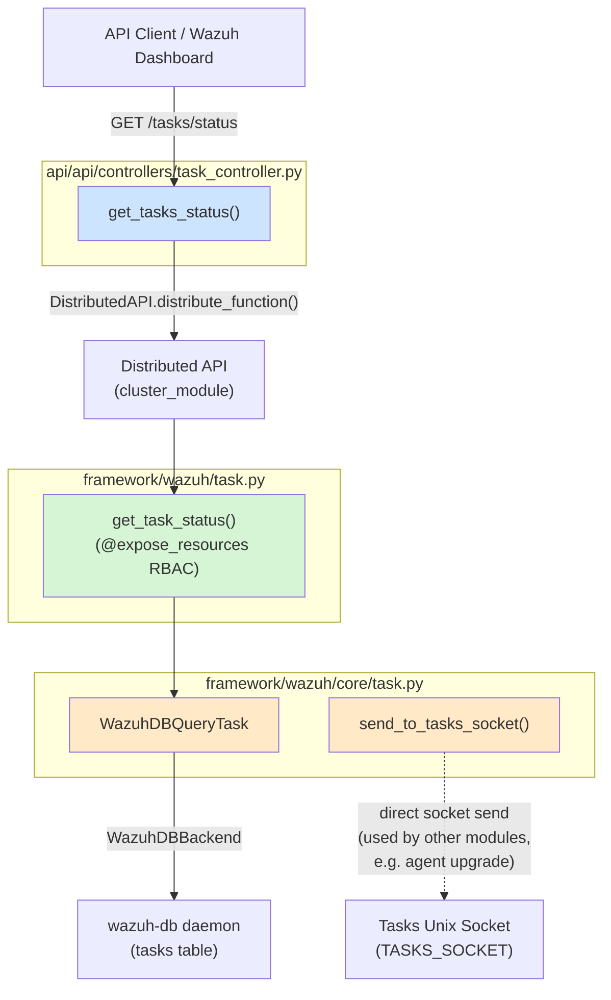
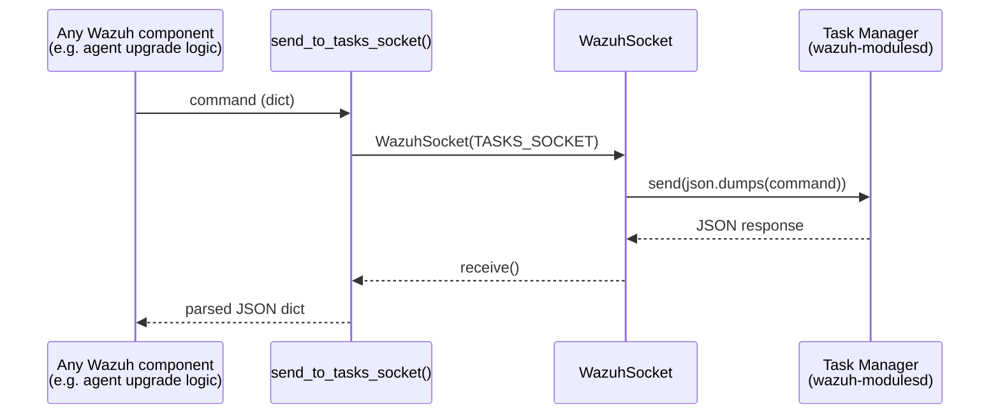
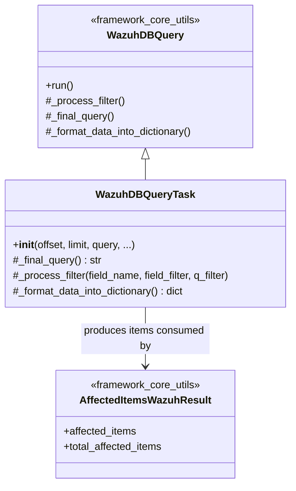

# Task Module

## 1. Introduction and Purpose

The **Task Module** provides the Wazuh API and framework with the ability to **query the status of asynchronous background tasks** tracked by the Wazuh Task Manager (`wazuh-modulesd`'s task manager and `wazuh-db`'s `tasks` table). Typical tasks tracked through this mechanism include agent upgrade operations, but the module is generic enough to report the status of any task recorded in the `tasks` table (task id, agent id, node, module, command, timestamps, status, and error message).

This module is intentionally small and thin: it exposes a single read-only capability — **"get the status of one or more tasks"** — and acts as the bridge between:

- The **REST API layer** (HTTP endpoint `GET /tasks/status`)
- The **Framework business logic layer** (RBAC-protected service function)
- The **Core data-access layer** (a `WazuhDBQuery` specialization that queries `wazuh-db`, plus a low-level helper to talk directly to the tasks Unix socket)

Because of its size and single responsibility, the Task Module is documented as a single, cohesive unit rather than being split into sub-modules.

## 2. Architecture Overview

The module follows the standard three-layer pattern used throughout the Wazuh Python codebase: **API Controller → Framework Service → Core Data Access**. Each layer has a single, focused responsibility and delegates downward.

### Request flow

1. A client calls `GET /tasks/status`, optionally filtering by `tasks_list`, `agents_list`, `command`, `node`, `module`, `status`, plus generic pagination/search/sort/query parameters.
2. `task_controller.get_tasks_status` builds a keyword-argument dictionary and wraps the framework function `wazuh.task.get_task_status` inside a `DistributedAPI` request (see [cluster_module.md](cluster_module.md) for the Distributed API and cluster-forwarding mechanism), always executed as `local_master` since task data lives in the master's `wazuh-db`.
3. `wazuh.task.get_task_status` is decorated with `@expose_resources` (RBAC action `task:status`) — see [security_rbac_module.md](security_rbac_module.md) for how resource authorization is enforced — and delegates the actual query construction/execution to `WazuhDBQueryTask`.
4. `WazuhDBQueryTask` (in `framework/wazuh/core/task.py`) extends the generic `WazuhDBQuery` engine (see [framework_core_utils.md](framework_core_utils.md)) to build a SQL query scoped to the `tasks` table, apply filters (`agent_list`, `task_list`, and generic filters), and execute it through `WazuhDBBackend`.
5. Results are normalized: `create_time`/`last_update_time` timestamps are converted to ISO date strings, and `agent_id` is zero-padded to 3 digits for consistency with the rest of the API.
6. The response is packaged into an `AffectedItemsWazuhResult` (see [framework_core_utils.md](framework_core_utils.md)) and returned as JSON.

### Secondary capability: direct socket communication

`send_to_tasks_socket()` in `framework/wazuh/core/task.py` is a low-level helper that opens a `WazuhSocket` (see [framework_core_communication.md](framework_core_communication.md)) to the `TASKS_SOCKET` and sends an arbitrary JSON command, returning the parsed JSON response. Unlike `WazuhDBQueryTask` — which only *reads* task status from `wazuh-db` — this function is used by *other* modules (most notably the [Agent Upgrade Module](agent_upgrade_module.md) inside `Wazuh_Modules_Daemon_(C)`, whose task manager component listens on this socket) to *create and update* tasks. It is included in this module because it shares the same conceptual domain (task lifecycle) and the same source file as the read-side query class.

## 3. Core Components

| Component | File | Responsibility |
|---|---|---|
| `get_tasks_status` | `api/api/controllers/task_controller.py` | Connexion-bound async controller for `GET /tasks/status`; parses HTTP query parameters, builds the `DistributedAPI` request, returns a `ConnexionResponse`. |
| `get_task_status` | `framework/wazuh/task.py` | RBAC-protected framework function; orchestrates the query via `WazuhDBQueryTask`, post-processes results (date formatting, agent id padding), and wraps them in `AffectedItemsWazuhResult`. |
| `WazuhDBQueryTask` | `framework/wazuh/core/task.py` | Concrete `WazuhDBQuery` subclass targeting the `tasks` table; defines available fields, custom filter handling for `agent_list`/`task_list`, the final SQL query shape, and dictionary/date formatting of results. |
| `send_to_tasks_socket` | `framework/wazuh/core/task.py` | Generic helper to send a JSON command to the tasks Unix socket and receive a JSON response; used for task creation/update operations elsewhere in the system. |

### 3.1 `task_controller.get_tasks_status`

- Entry point for the REST API (`GET /tasks/status`).
- Accepts pagination (`offset`, `limit`), filtering (`tasks_list`, `agents_list`, `command`, `node`, `module`, `status`, `q`), and generic search/select/sort parameters.
- Delegates execution to the framework layer through `DistributedAPI`, forcing `request_type='local_master'` because task bookkeeping is centralized on the master node's `wazuh-db`.
- Relies on RBAC context injected by the [API core infrastructure](api_core_infrastructure.md) (`request.context['token_info']['rbac_policies']`).

### 3.2 `task.get_task_status`

- Decorated with `@expose_resources(actions=["task:status"], resources=["*:*:*"], post_proc_kwargs={'exclude_codes': [1817]})`, tying this operation into the RBAC engine documented in [security_rbac_module.md](security_rbac_module.md).
- Instantiates `WazuhDBQueryTask` as a context manager, runs it, and receives `{'items': [...], 'totalItems': N}`.
- Normalizes each returned item's `agent_id` to a 3-digit zero-padded string (consistent with agent identifiers used across the API).
- Returns an `AffectedItemsWazuhResult` with descriptive success/partial/failure messages.

### 3.3 `core.task.WazuhDBQueryTask`

- Table: `tasks`. Fields: `task_id`, `agent_id`, `node`, `module`, `command`, `create_time`, `last_update_time`, `status`, `error_message`.
- Default sort field: `task_id`; date fields (`create_time`, `last_update_time`) are automatically converted from epoch timestamps to the standard Wazuh date format.
- Overrides `_process_filter` to translate the pseudo-filters `agent_list` and `task_list` into `agent_id IN (...)` / `task_id IN (...)` SQL clauses; all other filters fall back to the generic `WazuhDBQuery` behavior.
- Overrides `_final_query` to wrap the base query with `WHERE task_id IN (...) LIMIT :limit OFFSET :offset`.
- Uses `WazuhDBBackend(query_format='task')` to communicate with `wazuh-db` — see [framework_core_communication.md](framework_core_communication.md) for the underlying socket/connection primitives (`WazuhDBConnection`, etc.) and [framework_core_utils.md](framework_core_utils.md) for the generic `WazuhDBQuery`/`WazuhDBBackend` machinery this class specializes.

### 3.4 `core.task.send_to_tasks_socket`

- Opens a `WazuhSocket` to `common.TASKS_SOCKET`, sends a JSON-encoded command, and returns the decoded JSON reply.
- Raises `WazuhInternalError(1121)` if the socket connection cannot be established.
- Consumed by task-producing components (e.g., the agent upgrade task manager) rather than by the read path described above; included here because it lives in the same core file and belongs to the same "tasks" domain.

## 4. Data Model

## 5. Dependencies on Other Modules

| Dependency | Used for | Documentation |
|---|---|---|
| `wazuh.core.cluster.dapi.dapi.DistributedAPI` | Forwarding the request to the master node and orchestrating sync/async execution | [cluster_module.md](cluster_module.md) |
| `wazuh.rbac.decorators.expose_resources` | Enforcing RBAC permissions on the `task:status` action | [security_rbac_module.md](security_rbac_module.md) |
| `wazuh.core.utils.WazuhDBQuery`, `WazuhDBBackend`, `get_date_from_timestamp` | Generic SQL query building and date formatting utilities | [framework_core_utils.md](framework_core_utils.md) |
| `wazuh.core.results.AffectedItemsWazuhResult` | Standard result wrapper used across the framework | [framework_core_utils.md](framework_core_utils.md) |
| `wazuh.core.wazuh_socket.WazuhSocket` | Low-level Unix socket abstraction used by `send_to_tasks_socket` | [framework_core_communication.md](framework_core_communication.md) |
| `wazuh.core.common` (`DATABASE_LIMIT`, `TASKS_SOCKET`, `DATE_FORMAT`) | Shared constants | [framework_core_utils.md](framework_core_utils.md) |
| API request utilities (`api.util`, `api.controllers.util`) | Query-parameter parsing and response formatting | [api_core_infrastructure.md](api_core_infrastructure.md) |

## 6. Related Modules

- **[Agent Upgrade Module](agent_upgrade_module.md)** (part of `Wazuh_Modules_Daemon_(C)`) — the primary producer of tasks tracked through this module; it uses the tasks socket (conceptually the counterpart of `send_to_tasks_socket`) to create/update/query upgrade tasks in the `wazuh-db` `tasks` table.
- **[Stats Module](stats_module.md)** — another small, single-purpose framework module following the same API→framework→core layering pattern.
- **[Manager Module](manager_module.md)** — exposes related operational/status endpoints on the manager, following the same architectural pattern.
