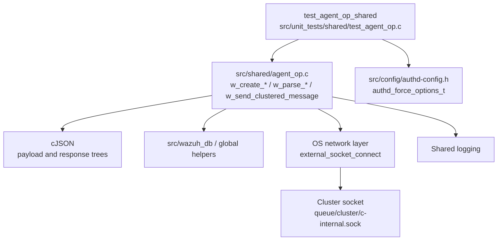
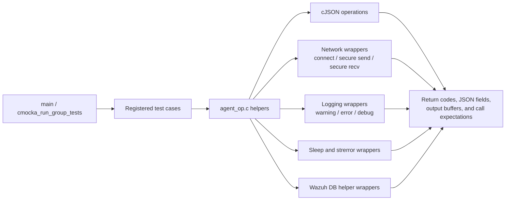
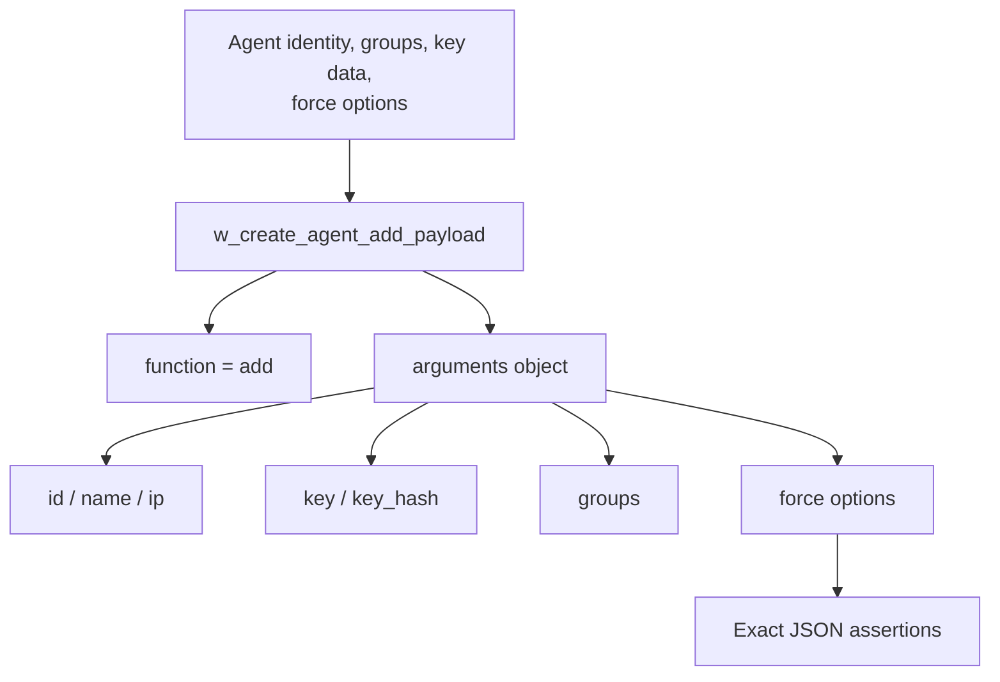
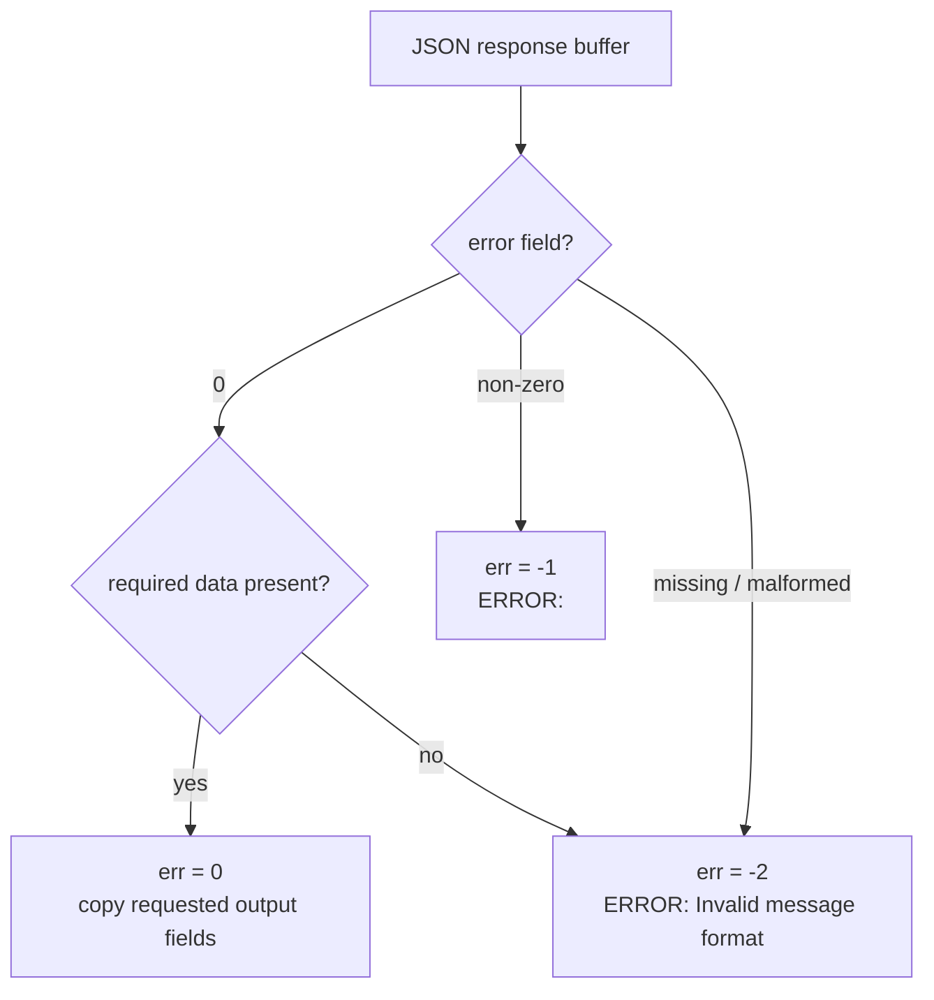
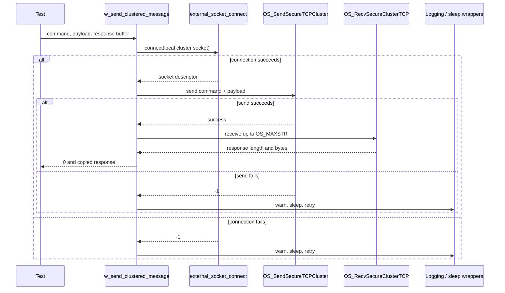
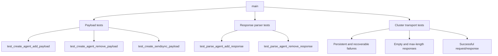

# `test_agent_op_shared`

## Introduction

`test_agent_op_shared` is the CMocka unit-test module for the shared agent-operation helpers in `src/shared/agent_op.c`. It verifies three related contracts: construction of JSON commands for agent management, parsing of agent-management responses, and reliable delivery of commands through the local cluster socket.

The tests isolate JSON handling, socket I/O, retry timing, error logging, and Wazuh DB/cluster dependencies with wrappers. Production responsibilities are described in [shared_lib_networking.md](shared_lib_networking.md) and the broader agent-management path is covered by [agent_module.md](agent_module.md); this document focuses on how the test module validates those boundaries.

## Module position

The module is a leaf under **Unit Tests – Shared Library** and targets the shared agent-operation utility used by agent management and clustered manager workflows.



## Responsibilities under test

| Production helper | Contract exercised by the tests |
|---|---|
| `w_create_agent_add_payload` | Builds an `add` command with agent identity, IP, groups, key material, and serialized force options. |
| `w_create_agent_remove_payload` | Builds a `remove` command containing the agent ID and purge flag. |
| `w_create_sendsync_payload` | Wraps a daemon name and optional nested message for synchronization. |
| `w_parse_agent_add_response` | Extracts the new agent ID/key and maps API errors or malformed data to stable error codes/messages. |
| `w_parse_agent_remove_response` | Maps successful, API-error, and malformed remove responses to stable outcomes. |
| `w_send_clustered_message` | Connects to the local cluster socket, sends a command, receives a bounded response, and retries recoverable failures. |

The source declares the helper prototypes directly with `extern`, allowing the test binary to call the production symbols without exposing a separate public header for every helper.

## Test-harness architecture



The suite does not require a running manager, cluster, socket server, or Wazuh DB. CMocka `will_return`, `expect_value`, and `expect_string` calls provide deterministic external results and verify the exact arguments passed by the implementation.

### Included dependencies

| Dependency | Test role |
|---|---|
| `shared.h` | Shared constants, socket/message limits, and helper declarations. |
| `sec.h` | Authentication and agent-key structures used by payload creation. |
| `manage_agents.h` | Agent-management data definitions. |
| `cJSON` | Inspects generated payloads and supplies JSON response input. |
| `os_net` wrappers | Simulate connection, secure cluster send, and secure cluster receive. |
| `wdb_global_helpers` wrappers | Isolate database-related helper seams included by `agent_op.c`. |
| libc wrappers | Control `sleep`, `strerror`, and string behavior in failure paths. |
| debug wrappers | Assert or suppress expected diagnostic messages. |

## Agent payload construction

### Add payload

`test_create_agent_add_payload` supplies an agent name, IPv4 address, two groups, key and SHA-1 key hash, ID, and an `authd_force_options_t` value. It verifies that the returned JSON contains:

```json
{
  "function": "add",
  "arguments": {
    "groups": "Group1,Group2",
    "key": "1234",
    "key_hash": "7110eda4d09e062aa5e4a390b0a572ac0d2c0220",
    "id": "001",
    "force": {
      "disconnected_time": {"enabled": false, "value": 0},
      "enabled": true,
      "key_mismatch": false,
      "after_registration_time": 0
    }
  }
}
```

The test checks the command name and the important argument fields, then prints the nested `force` object unformatted and compares its exact serialization. This makes the nested option names and boolean/number representation part of the regression contract.



### Remove and synchronization payloads

`test_create_agent_remove_payload` verifies `function = "remove"`, the string agent ID, and integer `purge`. `test_create_sendsync_payload` covers both supported message states:

1. A daemon name with a null message produces a payload with `daemon_name` and no `message` object.
2. A daemon name with a remove payload embeds that payload under `message`.

```mermaid
graph LR
    REMOVE[w_create_agent_remove_payload] --> R[{function: remove, arguments: id, purge}]
    R --> SYNC[w_create_sendsync_payload]
    DAEMON[daemon_name] --> SYNC
    NULL[NULL message] --> SYNC
    SYNC --> OUT1[daemon_name only]
    R --> OUT2[daemon_name + nested message]
```

The remove and sendsync cases are compiled only on non-Windows builds, matching the production platform guard in the test source.

## Response parsing

Both parser tests use JSON strings rather than a live API. They validate the distinction between a successful response, an explicit service error, and an invalid response shape.



### Add response

`test_parse_agent_add_response` verifies that a successful response copies `data.id` and `data.key` into caller-provided buffers. It also verifies that either output pointer may be null, allowing callers to request only the ID or only the key. Missing `data`, missing `id`, and missing `key` are treated as invalid format (`-2`), while `{"error":9009,"message":"ERROR_MESSAGE"}` becomes `-1` and `ERROR: ERROR_MESSAGE`.

### Remove response

`test_parse_agent_remove_response` verifies:

| Input | Result |
|---|---|
| `{"error":0}` | `0` |
| `{"error":9009,"message":"ERROR_MESSAGE"}` | `-1`, `ERROR: ERROR_MESSAGE` |
| Response without a valid error field | `-2`, `ERROR: Invalid message format` |

The parser tests also set permissive expectations for logging because diagnostics are implementation details while the return code and formatted error buffer are the externally relevant contract.

## Clustered-message delivery

`w_send_clustered_message` is tested as a request/response operation over `queue/cluster/c-internal.sock`.



The test source models `CLUSTER_SEND_MESSAGE_ATTEMPTS` attempts and expects a one-second delay between retries. A successful attempt terminates the loop; persistent connection or send failure logs `Could not send message through the cluster after '10' attempts.` and returns `-2`.

### Delivery scenarios

| Test scenario | Simulated condition | Expected behavior |
|---|---|---|
| Connection error | `external_socket_connect` returns `-1` for every attempt | Warn, sleep, retry, then return `-2`. |
| Send error | Secure send returns `-1` | Warn with `OS_SendSecureTCPCluster()`, retry, then return `-2` if persistent. |
| Cluster error | Receive returns `-2` | Warn `Cluster error detected`, retry; persistent failure returns `-1`. |
| Receive error | Receive returns `-1` | Warn with `OS_RecvSecureClusterTCP()`, retry; persistent failure returns `-1`. |
| Empty response | Receive returns `0` | Debug-log `Empty message from local client.` and return `-1`. |
| Oversized response | Receive returns `OS_MAXLEN` | Error-log `Received message > 65536` and return `-1`. |
| Normal success | Receive returns response length | Copy response and return `0`. |
| Recovery after failure | First attempt fails, next succeeds | Sleep once, then return success with the response. |

The recovery tests cover failure at each stage—connect, send, cluster-level receive result, and ordinary receive error—so retry behavior is not accidentally coupled to one particular failure source.

## Test inventory and process flow



`main` registers the payload and parser tests on every platform. The remove, sendsync, and clustered transport cases are registered inside `#ifndef WIN32`, yielding a smaller platform-appropriate suite on Windows.

## Maintenance guidance

This is a contract-level unit test, not a cluster integration test. When changing `agent_op.c`, update the JSON field assertions and wrapper expectations together. In particular:

- Preserve the distinction between `-1` service/API errors and `-2` invalid message formats unless the public contract changes.
- Keep caller-provided output buffers optional where the parser supports null pointers.
- Treat `OS_MAXSTR` as the receive buffer bound and reject the `OS_MAXLEN` overflow sentinel.
- Preserve bounded retries and the one-second retry delay; an unbounded loop would block manager operations.
- Ensure response bytes are copied into the caller’s `response` buffer only after a valid positive receive length.
- Free every generated cJSON tree, including nested payloads, after assertions.

The most relevant neighboring references are [shared_lib_networking.md](shared_lib_networking.md), [agent_module.md](agent_module.md), [cluster_module.md](cluster_module.md), [test_sendmsg_remoted.md](test_sendmsg_remoted.md), and [wazuh_db_global.md](wazuh_db_global.md). These documents describe the shared socket, agent-management, cluster, and database layers without duplicating their implementation details here.
