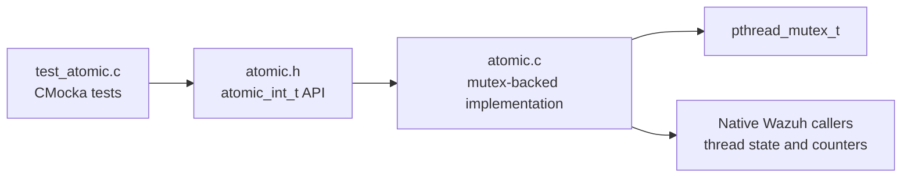
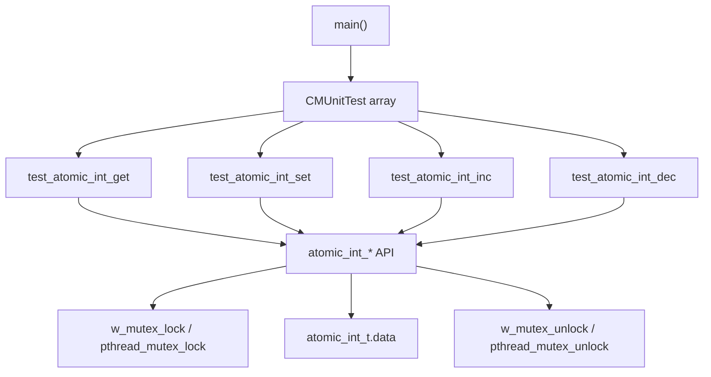
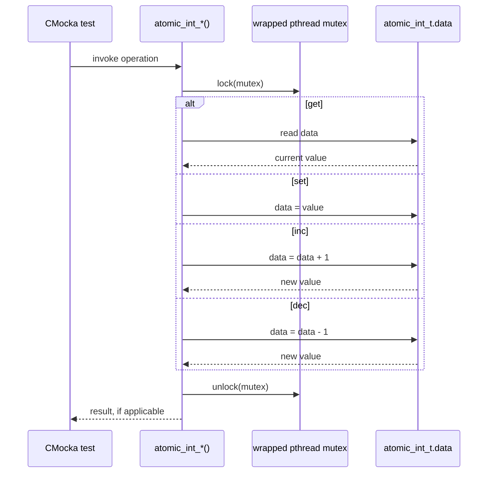
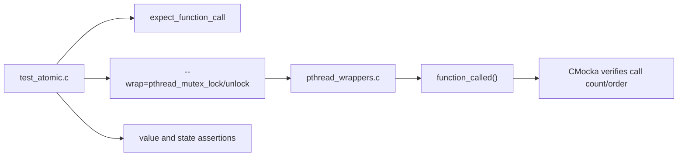
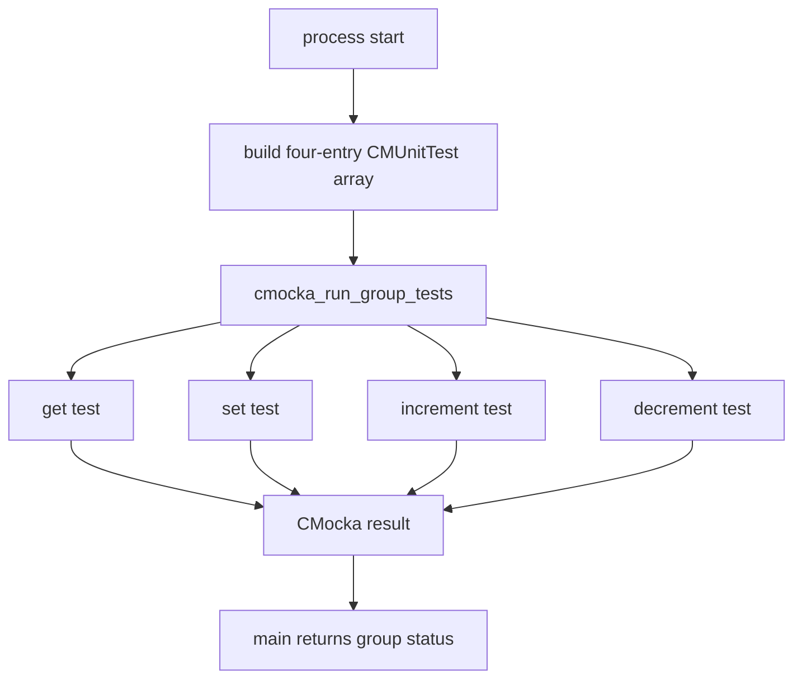
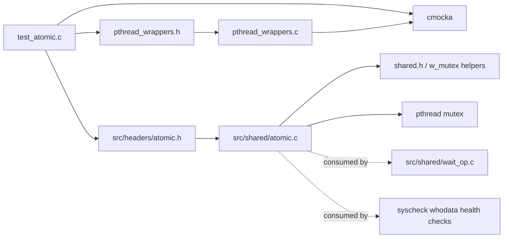

# `test_atomic_shared`

`test_atomic_shared` documents the CMocka unit test for Wazuh's mutex-backed atomic integer helper. The test verifies initialization, reads, writes, increments, and decrements for `atomic_int_t`, while using wrapped pthread mutex functions to prove that each operation is synchronized.

The source test is `src/unit_tests/shared/test_atomic.c`. The production API is declared in `src/headers/atomic.h` and implemented in `src/shared/atomic.c`.

## Purpose and system position

The atomic helper provides a small shared-library primitive for integer state that may be accessed by multiple threads. It is used by native Wazuh components for flags and counters; for example, wait and health-check code uses `atomic_int_get` and `atomic_int_set`. Broader shared-library responsibilities are described in [shared_lib.md](shared_lib.md).



This module is a unit-test boundary, not a standalone runtime service. It validates the contract of the shared atomic primitive independently from the daemons that consume it.

## Architecture

### Components

| Component | Responsibility |
|---|---|
| `atomic_int_t` | Stores an integer in `data` and owns a `pthread_mutex_t` protecting it. |
| `ATOMIC_INT_INITIALIZER(v)` | Initializes `data` to `v` and initializes the mutex statically. |
| `atomic_int_get` | Locks, copies `data`, unlocks, and returns the copy. |
| `atomic_int_set` | Locks, assigns a new value, and unlocks. |
| `atomic_int_inc` | Locks, increments `data`, captures the new value, unlocks, and returns it. |
| `atomic_int_dec` | Locks, decrements `data`, captures the new value, unlocks, and returns it. |
| `main` | Registers four CMocka tests and runs the test group. |
| `__wrap_pthread_mutex_lock/unlock` | CMocka wrappers that record expected synchronization calls and return success. |



The production implementation asserts that the `atomic_int_t *` argument is non-NULL. The tests use valid objects initialized with `ATOMIC_INT_INITIALIZER(1231)`, so they focus on successful behavior and synchronization rather than assertion failures.

## Operation flow

All four operations use the same critical-section pattern. `get` and `set` return `int` and `void`, respectively; `inc` and `dec` return the value after mutation.



The lock and unlock calls are deliberately placed around both the read and the mutation. This prevents a concurrent caller from observing a partially completed update and makes increment/decrement read-modify-write operations indivisible with respect to other users of the same object.

## Test cases

Each test creates an independent `atomic_int_t` with initial value `1231`, registers one expected mutex lock and one expected mutex unlock, invokes the production function, and checks the result or stored data.

| Test | Invocation | Expected state/result |
|---|---|---|
| `test_atomic_int_get` | `atomic_int_get(&test_variable)` | Returns `1231`; the stored value is unchanged. |
| `test_atomic_int_set` | `atomic_int_set(&test_variable, 2718)` | `data` becomes `2718`. |
| `test_atomic_int_inc` | `atomic_int_inc(&test_variable)` | Returns `1232`; `data` becomes `1232`. |
| `test_atomic_int_dec` | `atomic_int_dec(&test_variable)` | Returns `1230`; `data` becomes `1230`. |

```mermaid
flowchart TD
    Start["test case starts"] --> Init["ATOMIC_INT_INITIALIZER(1231)"]
    Init --> Expect["expect mutex lock + unlock"]
    Expect --> Call{ "operation" }
    Call -->|get| G["return 1231"]
    Call -->|set 2718| S["data = 2718"]
    Call -->|inc| I["data = 1232; return 1232"]
    Call -->|dec| D["data = 1230; return 1230"]
    G --> Verify["CMocka assertions"]
    S --> Verify
    I --> Verify
    D --> Verify
    Verify --> End["test completes"]
```

## Synchronization verification

`src/unit_tests/wrappers/posix/pthread_wrappers.c` implements the wrapped mutex functions using CMocka's `function_called()`. The test's `expect_function_call` statements therefore verify that the implementation performs the expected synchronization calls. The wrapper ignores the mutex pointer and returns `0`; pointer identity is not asserted in this test.

The shared-test CMake configuration registers the executable as `test_atomic` and links it with `--wrap=pthread_mutex_lock` and `--wrap=pthread_mutex_unlock`. The generated/documentation module name is `test_atomic_shared` to match the shared-library test grouping.



## Test registration and execution

`main` creates a `CMUnitTest` array containing the four cases with `cmocka_unit_test`, then passes the array to `cmocka_run_group_tests`. There is no group setup or teardown and no shared fixture state.



## Dependencies and relationships



The test does not exercise caller-specific protocols, daemon lifecycle, or concurrent scheduling. Those behaviors belong to the consuming modules; this test establishes the primitive's local value and locking contract.

## Coverage and limitations

The test covers:

- static initialization of an atomic integer;
- reading an existing value;
- replacing a value;
- incrementing and decrementing by one;
- the expected lock/unlock calls for each operation;
- return values for `get`, `inc`, and `dec`.

It does not cover NULL arguments, mutex acquisition failures, overflow/underflow, contention between real threads, cancellation, recursive locking, or destruction/reinitialization of a mutex. The implementation uses assertions for NULL arguments and does not expose error returns for mutex failures, so those behaviors require separate integration or fault-injection tests.
