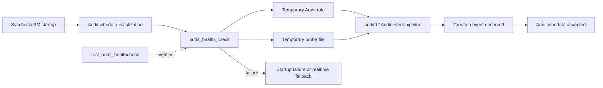
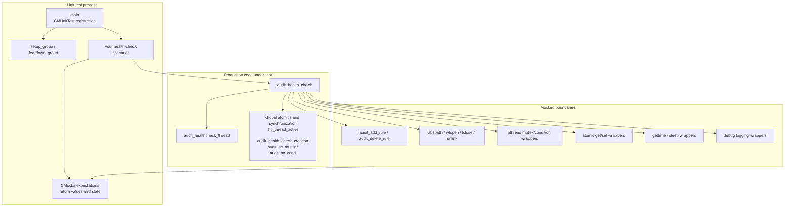
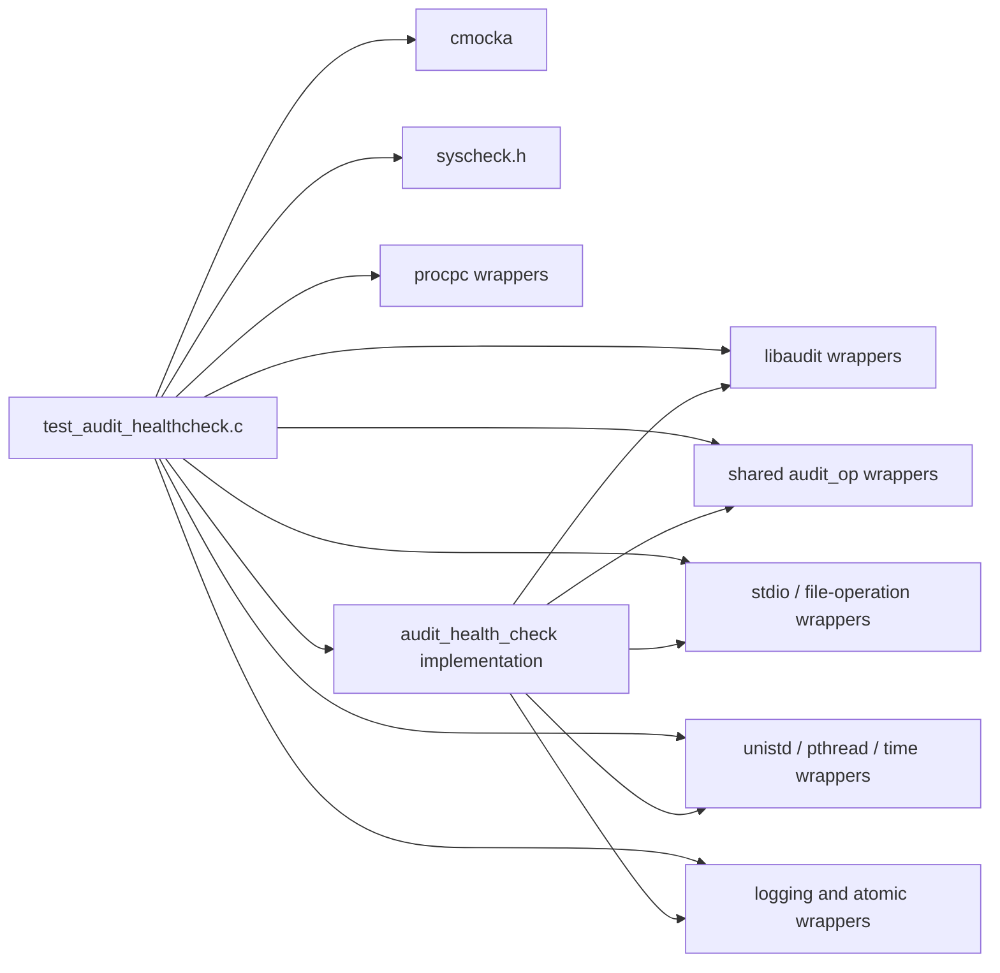

# `test_audit_healthcheck` module

## Introduction

`test_audit_healthcheck` is the CMocka unit-test suite for the Linux Audit health check used by Wazuh's Syscheck/FIM daemon. It verifies that `audit_health_check()` can install a temporary Audit rule, create a probe file, detect the corresponding Audit creation event, and remove all temporary state. The suite also checks the failure paths where the rule cannot be installed, the probe file cannot be created, or no creation event is observed.

The test is a leaf under the Syscheck/FIM test area. Runtime ownership and the complete Audit/whodata lifecycle are documented in [syscheckd_whodata_audit](syscheckd_whodata_audit.md) and [syscheckd_whodata](syscheckd_whodata.md); common CMocka and wrapper conventions are described in [test_infrastructure](test_infrastructure.md).

## Scope and location

| Item | Value |
|---|---|
| Test source | `src/unit_tests/syscheckd/whodata/test_audit_healthcheck.c` |
| Framework | CMocka (`CMUnitTest`, `cmocka_run_group_tests`) |
| Production subject | `src/syscheckd/src/whodata/audit_healthcheck.c` |
| Configuration/state header | `src/syscheckd/include/syscheck.h` |
| Platform focus | Linux Audit/auditd whodata path |
| Test count | Four registered test cases |
| Main synchronization seam | `pthread_cond_timedwait` wrapper |

This suite does not start a real `auditd`, open a real Audit socket, or depend on a live filesystem event. External calls are intercepted by linker wrappers and controlled through CMocka expectations.

## Role in the system

The health check is a startup gate for Audit-based whodata monitoring. It prevents Syscheck from trusting Audit attribution until the complete path from a temporary watch rule through filesystem activity and Audit event processing has been demonstrated. In production, the health check is invoked by the Audit whodata initialization flow described in [syscheckd_whodata_audit](syscheckd_whodata_audit.md).



## Architecture



The test intentionally keeps the production control flow real while replacing side effects. A wrapper's expected call sequence is part of the test contract: it proves, for example, that cleanup occurs after both success and failure and that the health-check worker is marked inactive before `audit_health_check()` returns.

## Components

### Test runner and fixtures

`main()` registers:

- `test_audit_health_check_fail_to_add_rule`
- `test_audit_health_check_fail_to_create_hc_file`
- `test_audit_health_check_no_creation_event_detected`
- `test_audit_health_check_success`

`setup_group()` enables `test_mode`, allowing the production path to use the test-controlled environment. `teardown_group()` clears the global `syscheck` configuration, calls `Free_Syscheck()`, and restores normal mode. The fixture is deliberately small because the suite focuses on one function and uses wrappers for all environmental dependencies.

### Synchronization and state

The test observes four production-level synchronization objects:

| Symbol | Role in the health-check protocol |
|---|---|
| `hc_thread_active` | Indicates whether the temporary health-check worker is active. |
| `audit_health_check_creation` | Indicates that the expected probe-file creation event was observed. |
| `audit_hc_mutex` | Protects worker state and condition-variable coordination. |
| `audit_hc_cond` | Coordinates startup and shutdown of the temporary worker. |

`__wrap_pthread_cond_timedwait()` records that a timed wait was requested and returns immediately. This makes shutdown deterministic while preserving the production call shape. The test uses `__real_atomic_int_set()` and `__real_atomic_int_get()` where it needs to seed or inspect actual atomic state rather than a mocked return value.

### Setup helpers

`prepare_audit_healthcheck_thread()` scripts the expected worker startup:

1. The rule-add operation returns `-EEXIST`, representing an already-present equivalent rule that the production code tolerates.
2. A startup diagnostic is emitted.
3. The mutex is locked.
4. The worker is observed first as inactive, then as active after the condition wait.
5. The mutex is unlocked.

`prepare_post_audit_healthcheck_thread()` scripts common cleanup:

1. Unlink the temporary health-check file.
2. Delete the Audit rule for `AUDIT_HEALTHCHECK_DIR` with `PERMS` and key `wazuh_hc`.
3. Set `hc_thread_active` to zero.
4. Lock, perform the timed condition wait, and unlock.

These helpers make the three worker-based scenarios express only their distinguishing behavior.

## Dependencies



The included wrapper groups represent the production boundaries used by the health check:

- Audit rule operations: `audit_add_rule`, `audit_delete_rule`, and related libaudit interfaces.
- Path and file operations: `abspath`, `wfopen`, `fclose`, and `unlink`.
- Thread coordination: mutexes, condition waits, `gettime`, and `sleep`.
- State and diagnostics: atomic operations and debug logging.

The procpc and general wrapper headers are shared test infrastructure dependencies; this file does not assert a direct procfs behavior for them.

## Data flow

```mermaid
flowchart TD
    Start[Call audit_health_check(123456)] --> Paths[Resolve AUDIT_HEALTHCHECK_DIR\nand AUDIT_HEALTHCHECK_FILE]
    Paths --> Add[Install or reuse temporary Audit rule\nPERMS = AUDIT_PERM_WRITE | AUDIT_PERM_ATTR]
    Add -->|error -1| RuleFail[Log rule failure\nreturn -1]
    Add -->|success or -EEXIST| Worker[Start/coordinate health-check worker]
    Worker --> Create[Open probe file with mode "w"]
    Create --> Close[Close probe file]
    Close --> EventFlag{audit_health_check_creation?}
    EventFlag -->|1| Success[Log health-check success\nreturn 0]
    EventFlag -->|0 after retry window| EventFail[Log creation error\nreturn -1]
    Create -->|cannot open| Retry[Sleep one second\nand retry]
    Retry --> EventFlag
    RuleFail --> Cleanup[Shared cleanup]
    Success --> Cleanup
    EventFail --> Cleanup
    Cleanup --> Unlink[Remove probe file]
    Unlink --> Delete[Delete temporary Audit rule]
    Delete --> Stop[Set worker inactive\nand wait for shutdown]
```

The source shows ten one-second attempts in the file-open and event-wait failure scenarios. The successful case performs one open/close cycle and returns after the creation flag is observed.

## Component interaction

```mermaid
sequenceDiagram
    participant Case as CMocka test case
    participant HC as audit_health_check
    participant Rule as Audit wrappers
    participant Thread as health-check worker state
    participant FS as File wrappers
    participant Clock as sleep/atomic wrappers
    participant Log as debug wrapper

    Case->>HC: Call with test socket 123456
    HC->>Rule: audit_add_rule(...)
    Rule-->>HC: 0 or -EEXIST
    HC->>Thread: lock, inspect active, wait, unlock
    HC->>FS: wfopen(probe, "w")
    alt probe succeeds and event is observed
        FS-->>HC: file handle
        HC->>FS: fclose(handle)
        HC->>Clock: read creation flag = 1
        HC->>Log: FIM_HEALTHCHECK_SUCCESS
        HC-->>Case: 0
    else probe or event fails
        FS-->>HC: null, or file succeeds but flag = 0
        HC->>Clock: sleep(1), retry up to ten times
        HC->>Log: FIM_HEALTHCHECK_CREATE_ERROR
        HC-->>Case: -1
    end
    HC->>FS: unlink(probe)
    HC->>Rule: audit_delete_rule(dir, PERMS, "wazuh_hc")
    HC->>Thread: set active = 0; timed condition wait
```

## Test scenarios and expected contracts

| Test | Stimulus | Expected result and important assertions |
|---|---|---|
| `test_audit_health_check_fail_to_add_rule` | `audit_add_rule` returns `-1`. | Returns `-1`, logs `FIM_AUDIT_HEALTHCHECK_RULE`, and leaves `hc_thread_active` at zero. No worker/file cleanup sequence is started. |
| `test_audit_health_check_fail_to_create_hc_file` | Rule setup succeeds; `wfopen` returns null for all ten attempts; creation flag remains zero. | Returns `-1`, logs the file diagnostic ten times and then `FIM_HEALTHCHECK_CREATE_ERROR`, performs shared cleanup, and ends with an inactive worker. |
| `test_audit_health_check_no_creation_event_detected` | Probe file opens and closes successfully ten times, but creation flag remains zero. | Returns `-1`, retries with one-second sleeps, logs `FIM_HEALTHCHECK_CREATE_ERROR`, and removes the rule/file. |
| `test_audit_health_check_success` | Probe file opens/closes once and creation flag is one. | Returns `0`, logs `FIM_HEALTHCHECK_SUCCESS`, and still performs complete cleanup. |

The tests also validate path resolution for both `AUDIT_HEALTHCHECK_DIR` and `AUDIT_HEALTHCHECK_FILE`, the rule permission mask, the `wazuh_hc` key, and the expected lock/condition sequencing.

## Process flows

### Suite lifecycle

```mermaid
stateDiagram-v2
    [*] --> GroupSetup
    GroupSetup: test_mode = 1
    GroupSetup --> TestSelected
    TestSelected --> RuleFailure
    TestSelected --> FileFailure
    TestSelected --> EventTimeout
    TestSelected --> HealthcheckSuccess
    RuleFailure --> Assertions
    FileFailure --> Assertions
    EventTimeout --> Assertions
    HealthcheckSuccess --> Assertions
    Assertions --> GroupTeardown
    GroupTeardown: clear syscheck; Free_Syscheck(); test_mode = 0
    GroupTeardown --> [*]
```



### Retry and termination behavior

```mermaid
flowchart TD
    Attempt[Attempt to create probe / inspect event] --> Flag{Creation flag set?}
    Flag -- yes --> Pass[Success path]
    Flag -- no --> Count{Attempts remaining?}
    Count -- yes --> Sleep[Mocked sleep(1)] --> Attempt
    Count -- no --> Fail[Failure path]
    Pass --> Cleanup[Unlink file, delete rule, stop worker]
    Fail --> Cleanup
```

The mocked time and condition APIs remove wall-clock and thread-scheduling nondeterminism. The suite therefore checks the retry policy and synchronization calls without waiting for real seconds or relying on auditd delivery.

## Relationship to adjacent modules

- [syscheckd_whodata_audit](syscheckd_whodata_audit.md) explains the production Audit socket, rule lifecycle, event assembly, parser thread, and the health-check's startup position.
- [syscheckd_whodata](syscheckd_whodata.md) covers the broader whodata subsystem and its relationship to realtime monitoring and eBPF.
- [test_audit_parse](test_audit_parse.md) covers parsing and filtering of raw Audit records; it is downstream of the event-detection concern tested here.
- [test_audit_rule_handling](test_audit_rule_handling.md) covers adding, reloading, manipulating, and removing persistent FIM Audit rules.
- [test_syscheck_audit](test_syscheck_audit.md) covers Audit socket setup, event reading, rule-file management, and the Audit thread lifecycle.
- [test_run_check](test_run_check.md) covers broader Syscheck runtime control and fallback behavior.
- [test_infrastructure](test_infrastructure.md) documents the shared wrapper and fixture style used by the unit-test tree.

## Maintenance notes

When changing `audit_health_check()` or its worker protocol, update this suite if any of the following contracts change:

- the temporary rule's path, permissions, or key;
- the number or timing of probe attempts;
- the atomics or condition-variable state transitions;
- cleanup ordering;
- diagnostic message constants;
- the return convention (`0` for a detected event, `-1` for failure).

Because the suite mocks Audit and filesystem behavior, it should be complemented by an integration test when changing Audit plugin configuration, socket transport, or event parsing. Those concerns belong to the adjacent production and test modules linked above.
