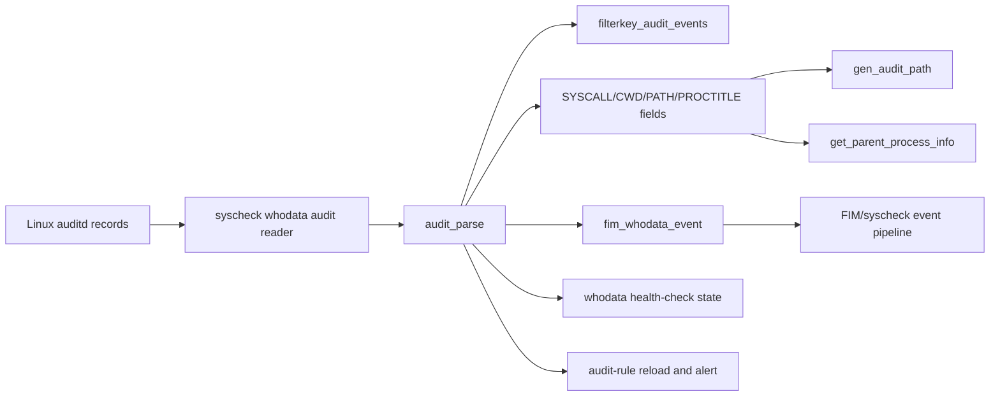
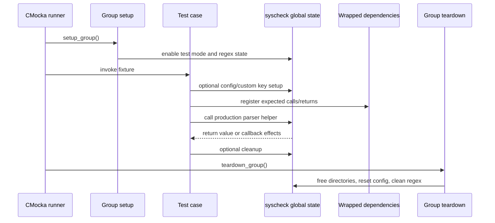
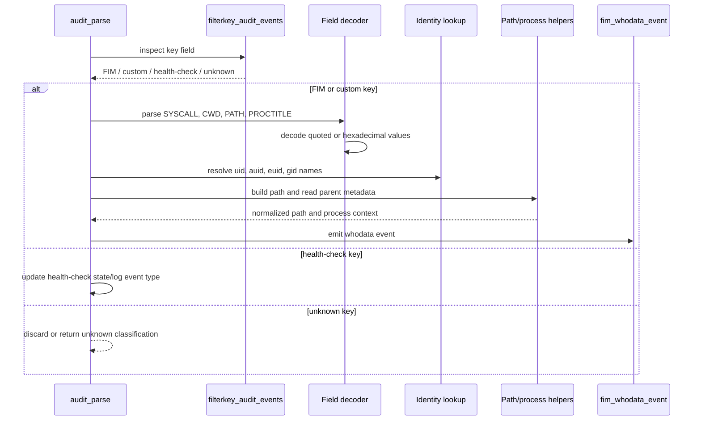
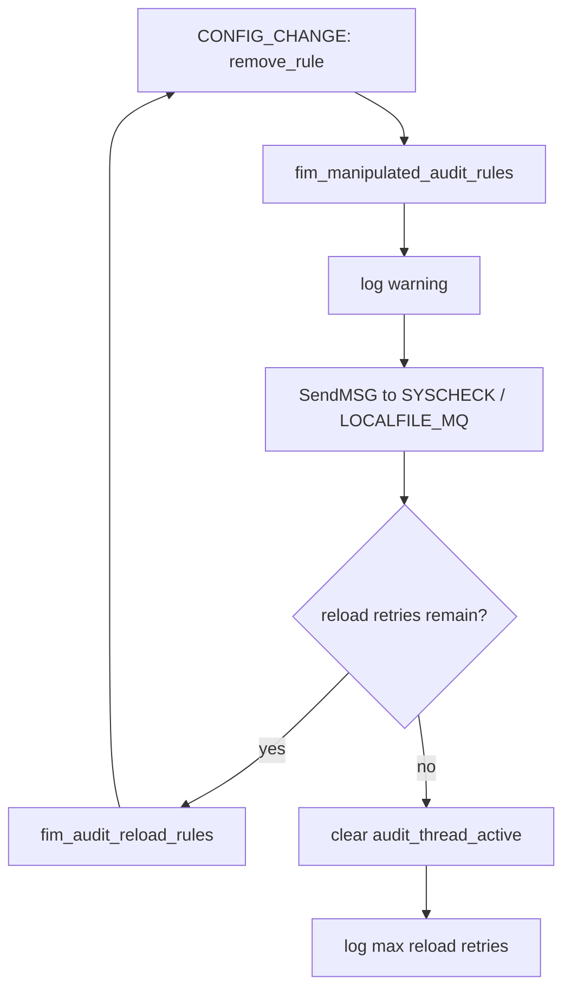
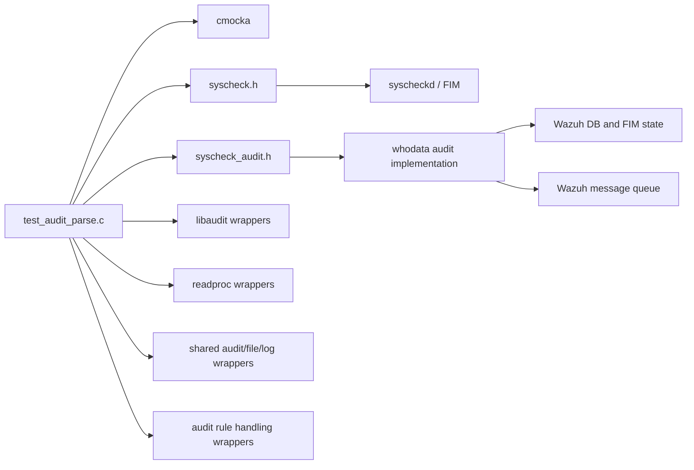

# `test_audit_parse`

`test_audit_parse` is the CMocka unit-test module for the Linux audit-event parsing path used by Wazuh file integrity monitoring (FIM) whodata. It exercises the parser’s classification of audit keys, decoding of quoted and hexadecimal fields, canonical path construction, process-parent lookup, whodata event creation, health-check events, and audit-rule manipulation recovery.

The test source is `src/unit_tests/syscheckd/whodata/test_audit_parse.c`. The implementation under test is supplied by the syscheck whodata audit subsystem; this file provides controlled inputs and verifies observable calls, log messages, state changes, and event payloads. For the surrounding production subsystem, see [syscheckd_whodata](syscheckd_whodata.md), [syscheckd_whodata_audit](syscheckd_whodata_audit.md), [syscheck_module](syscheck_module.md), and [syscheckd_core](syscheckd_core.md).

## Scope and role in the system

The production flow receives records from `auditd`, groups related `SYSCALL`, `CWD`, `PATH`, and `PROCTITLE` records, parses the resulting event, and forwards a normalized whodata event to FIM. This test module isolates the parsing stage while mocking external effects such as passwd/group lookup, `/proc` reads, audit-rule operations, logging, message queues, and FIM callbacks.



## Architecture

The test has four logical layers:

| Layer | Responsibilities | Representative symbols |
|---|---|---|
| Test lifecycle | Initializes regex state, creates temporary syscheck configuration, and releases allocations | `setup_group`, `teardown_group`, `setup_config`, `teardown_config` |
| Input fixtures | Builds realistic audit records and expected parser outcomes | `test_audit_parse*`, `test_filterkey_audit_events*` |
| Parser seams | Exercises the production parser’s key, path, process, and recovery decisions | `filterkey_audit_events`, `gen_audit_path`, `get_parent_process_info`, `audit_parse` |
| Mocked effects | Verifies calls without touching the host or daemon services | `__wrap_fim_whodata_event`, `__wrap_SendMSG`, audit/file/process wrappers |

```mermaid
graph TD
    Main[main / CMUnitTest registry]
    Main --> Group[setup_group / teardown_group]
    Main --> Fixtures[registered test cases]
    Fixtures --> KeyTests[Audit-key classification]
    Fixtures --> PathTests[Path generation]
    Fixtures --> ParentTests[Parent-process lookup]
    Fixtures --> ParseTests[Full audit parsing]
    Group --> Regex[init_regex / clean_regex]
    Group --> Syscheck[global syscheck configuration]
    ParseTests --> Impl[audit_parse implementation]
    KeyTests --> Impl
    PathTests --> Impl
    ParentTests --> Impl
    Impl --> Mocks[CMocka wrappers]
    Mocks --> Audit[libaudit operations]
    Mocks --> Proc[/proc and passwd/group lookups]
    Mocks --> FIM[FIM callback and MQ]
    Mocks --> Logs[debug/warn/error logging]
```

## Test lifecycle and state

`main` registers the tests and invokes `cmocka_run_group_tests`. The group setup enables `test_mode` and initializes audit-related regular expressions. Group teardown clears `syscheck`, frees configuration state, cleans regex resources, and disables test mode.

Tests that need monitored-directory state use `setup_config` to create `/var/test` as an active whodata directory and insert it into `syscheck.directories`. `teardown_config` frees every directory node and destroys the list. Tests for custom audit keys allocate `syscheck.audit_key[0]` and release it through `teardown_custom_key`. Path tests return heap-allocated strings and use `free_string` as their per-test teardown.



## Functional coverage

### Audit-key filtering

`filterkey_audit_events` is tested as the parser’s first routing decision. The fixtures cover:

- `wazuh_fim` → `FIM_AUDIT_KEY`.
- `wazuh_hc` → `FIM_AUDIT_HC_KEY`.
- A configured custom key → `FIM_AUDIT_CUSTOM_KEY`.
- An unmatched key or malformed `key=` field → `FIM_AUDIT_UNKNOWN_KEY`.
- Keys at the beginning or end of a record, a field named `path`, missing whitespace/equal signs, and missing keys.
- Hex-encoded keys containing multiple audit keys separated by the audit separator byte. Matching is verified for the first and second custom key, FIM key, and a key containing the separator character.

The tests also expect the matching debug message (`FIM_AUDIT_MATCH_KEY`) where the implementation reports the selected key.

### Path normalization

`gen_audit_path` combines the audit working directory and path records into an absolute path. The eight fixtures cover absolute paths, `./`, `../`, root-relative paths, a missing second path, and ordinary relative names. Expected results show that the helper normalizes the path against `cwd` and removes redundant relative components.

```mermaid
flowchart TD
    Input[cwd + PATH name(s)] --> Decode{hex encoded?}
    Decode -- yes --> Hex[decode bytes]
    Decode -- no --> Text[use text value]
    Hex --> Join[combine cwd and path components]
    Text --> Join
    Join --> Normalize[resolve ./ and ../; enforce absolute form]
    Normalize --> Canonical[normalized audit path]
```

### Process-parent metadata

`get_parent_process_info` is exercised for both failure and successful wrapper paths. The failure case simulates `readlink` errors for `/proc/<pid>/comm` and `/proc/<pid>/cwd`, verifies diagnostic logging, and confirms empty output strings. The successful fixture verifies the non-error path and safe cleanup of returned buffers. The test intentionally isolates lookup behavior; it does not require a live process with PID `1515`.

### Full audit parsing

The `test_audit_parse*` fixtures model common file operations and malformed input:

| Scenario | What is verified |
|---|---|
| Delete/rm | Deleted file and directory paths, `(null)` path names, parent directory resolution, and whodata payloads |
| Move/mv | Multiple `PATH` records, delete/create pairs, and two emitted events |
| Chmod | Attribute-only changes and missing group-name lookup |
| Hex fields | Hexadecimal `cwd`, path names, executable names, proctitle, and UTF-8 decoding |
| Empty fields | Parser tolerance when optional identity/items fields are absent |
| Directory-rule removal | Audit-rule manipulation warning, MQ alert, and rule reload request |
| Malformed hex | Decode errors while still exercising rule-removal recovery behavior |
| Health check | Creation, deletion, and unrecognized syscall handling for `wazuh_hc` |

For normal FIM events, the tests verify the values passed to `fim_whodata_event`: process ID, parent process ID, user/group IDs, audit/effective IDs, process name, inode, and normalized path. Identity names are checked through mocked passwd/group lookups, while the event retains numeric IDs in its payload.



## Audit-rule manipulation and retry behavior

`test_audit_parse_delete` verifies a single `CONFIG_CHANGE` record with `op="remove_rule"`: the parser calls the manipulation detector, logs the warning, sends an alert through the local-file MQ, and requests an audit-rule reload. `test_audit_parse_delete_recursive` repeats the event until the configured retry limit is reached. It verifies repeated warnings/alerts, reload attempts, deactivation of `audit_thread_active`, and the final “max rules reload retries” message.

Directory removal fixtures additionally verify the monitored-directory informational message and a corresponding whodata event. Invalid hexadecimal directory/path fields are expected to produce decode errors while preserving the recovery path for removed audit rules.



## Dependency relationships

The direct implementation dependencies are represented by headers and wrappers included by the test:

- `syscheckd/include/syscheck.h`: global syscheck configuration, directory structures, FIM event types, lists, and constants.
- `syscheckd/src/whodata/syscheck_audit.h`: audit parsing, key filtering, path construction, process-parent lookup, and audit health/rule interfaces.
- Audit and process libraries: libaudit and `/proc`-related process lookup wrappers.
- Shared audit, file, logging, and rule-handling interfaces: mocked to make the test deterministic.
- CMocka: test registration, assertions, expected calls, and injected return values.

The broader production relationships are documented in [syscheckd_whodata_audit](syscheckd_whodata_audit.md), while shared audit helpers are covered by [shared_lib_system_utils_audit](shared_lib_system_utils_audit.md), data structures by [shared_lib_data_structures](shared_lib_data_structures.md), and FIM persistence by [syscheckd_db](syscheckd_db.md) and [wazuh_db_fim_syscollector](wazuh_db_fim_syscollector.md).



## Test inventory

The registered suite groups naturally into:

1. Audit-key classification: custom, FIM, health-check, unknown, malformed, positional, separator, and hexadecimal cases.
2. Path helpers: `test_gen_audit_path` through `test_gen_audit_path8`.
3. Process lookup: failed and successful parent-process metadata lookup.
4. Parser records: normal delete, move, remove, chmod, empty fields, hexadecimal data, directory deletion, and malformed hexadecimal data.
5. Recovery and health checks: recursive audit-rule reload, health-check create/delete/unknown syscall cases.

`main` is the source of truth for which fixtures execute. Some source-level names in the surrounding module tree are abbreviated; the implementation file also contains explicit malformed-hex directory cases and a failed parent-process test, which are included in this documentation.

## Maintenance guidance

When changing audit parsing:

- Update key-filter tests whenever key syntax, separators, or custom-key matching changes.
- Add paired text and hexadecimal fixtures for every path or process field change.
- Preserve assertions on the complete `fim_whodata_event` payload; these catch normalization and identity regressions that log-only assertions miss.
- Keep external operations mocked. Tests should not depend on host audit rules, `/proc` contents, user databases, or MQ availability.
- For retry logic, verify both the reload path and the terminal retry-limit behavior.
- Run this suite with the syscheck whodata tests, especially [test_audit_healthcheck](test_audit_healthcheck.md), [test_syscheck](test_syscheck.md), and the production-facing [syscheckd_whodata_audit](syscheckd_whodata_audit.md) documentation, because they cover adjacent lifecycle and rule-management behavior.

## Summary

`test_audit_parse` protects the boundary between raw Linux audit records and normalized Wazuh whodata/FIM events. Its strongest guarantees concern exact key routing, robust decoding and path canonicalization, correct identity/process metadata propagation, and safe recovery when audit rules are removed or health-check records arrive.
