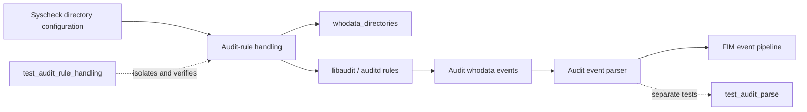
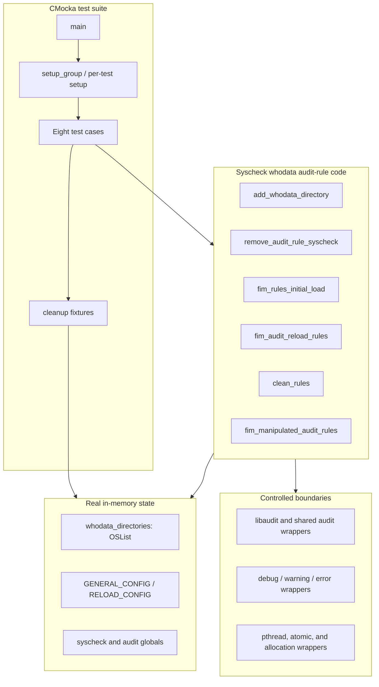
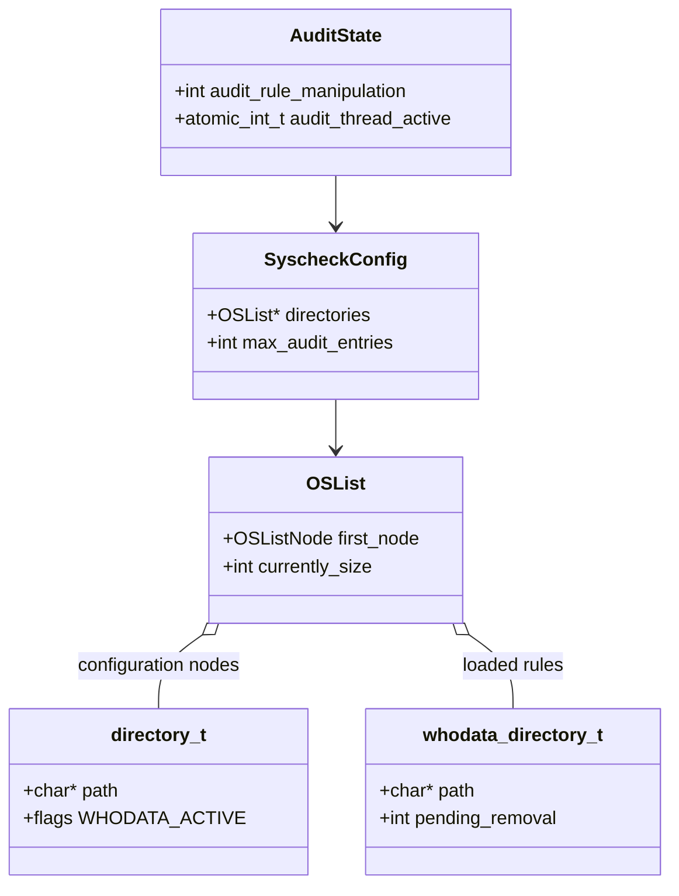
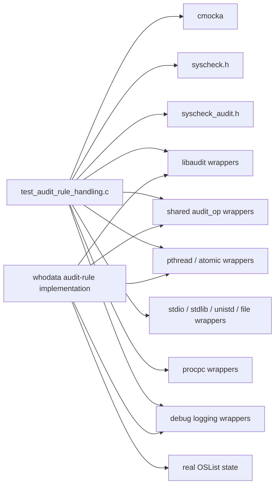
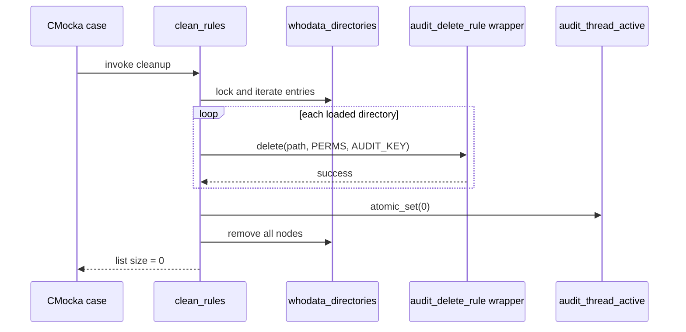
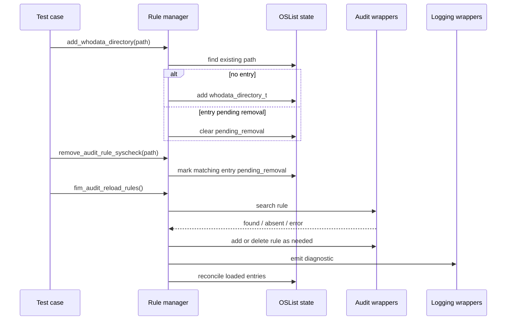
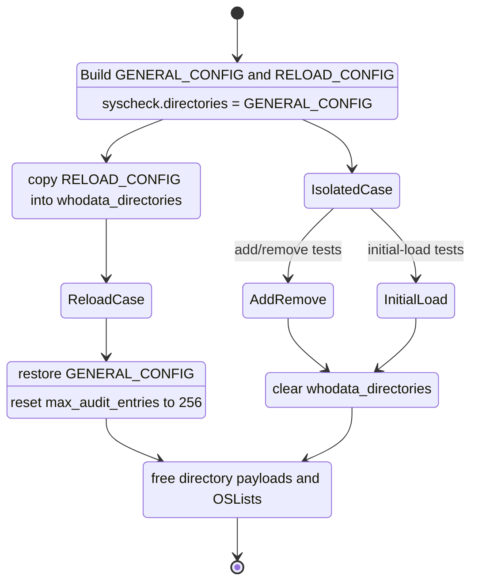

# `test_audit_rule_handling` module

## Introduction

`test_audit_rule_handling` is the CMocka unit-test suite for the Syscheck/FIM whodata audit-rule manager. It verifies how monitored directories are represented, added, marked for removal, initially loaded into Linux Audit, removed during cleanup, and reconciled during a reload. The suite also covers the audit-rule manipulation counter and the maximum-watch limit.

The source is `src/unit_tests/syscheckd/whodata/test_audit_rule_handling.c`. Production ownership belongs to the Syscheck whodata audit subsystem; see [syscheckd_whodata_audit](syscheckd_whodata_audit.md) for the broader reader and rule lifecycle, [syscheckd_whodata](syscheckd_whodata.md) for whodata architecture, and [test_audit_parse](test_audit_parse.md) for the separate event-parsing tests. Shared libaudit behavior is covered by [test_audit_op_shared](test_audit_op_shared.md).

## Scope and location

| Item | Value |
|---|---|
| Test source | `src/unit_tests/syscheckd/whodata/test_audit_rule_handling.c` |
| Framework | CMocka (`CMUnitTest`, `cmocka_run_group_tests`) |
| Production seams | `add_whodata_directory`, `remove_audit_rule_syscheck`, `fim_rules_initial_load`, `clean_rules`, `fim_audit_reload_rules`, `fim_manipulated_audit_rules` |
| Main state | `whodata_directories`, `syscheck.directories`, `syscheck.max_audit_entries`, `audit_rule_manipulation`, `audit_thread_active` |
| Platform focus | Linux Audit/auditd FIM whodata |
| Registered cases | Eight |

The suite does not require a live auditd service or kernel Audit state. libaudit calls, shared Audit helpers, logging, allocation, file, process, and synchronization boundaries are controlled by wrappers and CMocka return values. The production list operations remain real in-memory operations, allowing the tests to assert list contents and pending-removal state.

## Role in the system

For each whodata-enabled directory, Syscheck needs a corresponding Audit watch rule. The tested code keeps an in-memory rule list synchronized with configured directories and with the kernel Audit rule set. A reload can add newly configured directories, remove rules marked as stale, and report capacity or lookup failures.



## Architecture



### Components and responsibilities

| Component | Responsibility |
|---|---|
| `main` | Registers the eight cases and runs them with group setup/teardown. |
| `setup_group` | Builds two synthetic directory configurations, assigns `syscheck.directories`, and initializes the whodata rule list through `fim_audit_rules_init()`. |
| `GENERAL_CONFIG` | Five-directory baseline used by initial-load tests and restored after reload tests. |
| `RELOAD_CONFIG` | Seven-directory configuration used to model additions, removals, duplicates, and capacity exhaustion. |
| `whodata_directories` | Production-style list of `whodata_directory_t` entries. Each entry stores a path and `pending_removal` flag. |
| `teardown_clean_rules_list` | Clears the rule list after isolated add/remove/initial-load cases. The source component list may refer to this helper as `teardown_clean_rules`. |
| `teardown_reload_rules` | Restores baseline configuration, resets `max_audit_entries` to 256, and clears loaded rule entries. |
| Audit wrappers | Script `audit_open`, `audit_get_rule_list`, `audit_close`, `search_audit_rule`, `audit_add_rule`, and `audit_delete_rule` outcomes. |
| Logging wrappers | Assert diagnostics for new rules, duplicates, failures, and watch-limit violations. |

## Data model and ownership



`setup_group` creates seven active `directory_t` objects (`/testdir0` through `/testdir5` and `/etc`). Copies of the first five become `GENERAL_CONFIG`; the original seven become `RELOAD_CONFIG`. Ownership is explicit: teardown frees each directory payload before destroying its list. Whodata entries created by test setup are cleared through the production cleanup path.

The key distinction is between configuration and loaded-rule state:

| State | Meaning |
|---|---|
| `syscheck.directories` | Current configured directories to reconcile. |
| `whodata_directories` | Directories represented in the Audit-rule manager. |
| `pending_removal = 1` | Existing in-memory rule should be deleted during reload. |
| `syscheck.max_audit_entries` | Capacity limit used when adding rules. The fixture default is 256. |

## Dependencies



The wrapper headers are test infrastructure, not production dependencies of the module. They make external behavior deterministic and expose arguments such as rule path, permission mask, and `AUDIT_KEY`. General wrapper conventions are documented in [test_infrastructure](test_infrastructure.md).

## Initial-load flow

`fim_rules_initial_load` opens and reads the Audit rule list, then processes configured directories until the configured capacity is reached. For each directory it searches for an existing matching Audit rule:

```mermaid
flowchart TD
    Start[fim_rules_initial_load] --> Open[audit_open]
    Open --> List[audit_get_rule_list]
    List --> Each[Next configured directory]
    Each --> Capacity{Loaded rules < max_audit_entries?}
    Capacity -- no --> Limit[Log maximum-watch error]
    Capacity -- yes --> Search[search_audit_rule(path)]
    Search -->|1 found| Duplicate[Log duplicate rule]
    Search -->|0 absent| Add[audit_add_rule(path, PERMS, AUDIT_KEY)]
    Search -->|-1 error| SearchError[Log rule lookup error]
    Add -->|positive result| New[Count and log new rule]
    Add -->|-EEXIST| Exists[Log already added]
    Add -->|other error| AddError[Log add warning]
    Duplicate --> Next[Continue]
    New --> Next
    Exists --> Next
    AddError --> Next
    SearchError --> Next
    Limit --> Next
    Next --> Each
    Each --> End[Close audit handle and return total rules]
```

`test_rules_initial_load_new_rules` scripts five distinct outcomes and expects a total of one newly added rule: one successful add, one `-EEXIST`, one generic add failure, one already-present search result, and one search failure. `test_rules_initial_load_max_audit_entries` sets the capacity to one and verifies that the second directory is rejected without a search or add operation.

## Reload and cleanup flow

Reload reconciles `RELOAD_CONFIG` against the currently loaded list. Existing entries marked `pending_removal` are removed when their configured directory is encountered; unmarked entries are retained or reported as duplicates. New paths are added subject to capacity.

```mermaid
flowchart TD
    ReloadStart[fim_audit_reload_rules] --> Mark[Inspect loaded whodata entries]
    Mark --> Open[audit_open and audit_get_rule_list]
    Open --> Config[Iterate RELOAD_CONFIG]
    Config --> Existing{search_audit_rule(path)}
    Existing -- absent --> Capacity{Capacity available?}
    Capacity -- yes --> Add[audit_add_rule]
    Capacity -- no --> CapacityLog[Error/debug capacity message]
    Existing -- present --> Pending{Entry pending_removal?}
    Pending -- yes --> Delete[audit_delete_rule(path, PERMS, AUDIT_KEY)]
    Pending -- no --> Keep[Report duplicate/retain]
    Add --> Continue[Continue reconciliation]
    CapacityLog --> Continue
    Delete --> Continue
    Keep --> Continue
    Continue --> Config
    Config --> Done[Close handle; increment manipulation counter]
```

`test_fim_audit_reload_rules` starts with seven loaded entries, marks the first and third for removal, and verifies that the loaded list shrinks by two. It also covers a successful add, duplicate add (`-EEXIST`), generic add failure, duplicate search, and search failure. The expected delete call uses `PERMS` and `AUDIT_KEY`; the test checks those values explicitly.

`test_fim_audit_reload_rules_full` sets `syscheck.max_audit_entries` to zero to model a full Audit capacity. It expects the first directory to emit an error and subsequent directories to follow the implementation’s debug path, while still completing the reload lifecycle.

`clean_rules` is the bulk cleanup path. It deletes one Audit rule per loaded whodata entry, sets `audit_thread_active` to zero, logs the deletion operation, and empties `whodata_directories`:



## Component interaction



`test_add_whodata_directory` verifies idempotent insertion: the first call creates one entry, and a second call for the same path reuses it and clears `pending_removal`. `test_remove_audit_rule_syscheck` verifies that removal is deferred by marking the entry rather than immediately deleting the kernel rule. This deferred model lets reload perform the actual reconciliation under the production locking protocol.

## Test cases and contracts

| Test | Setup/stimulus | Contract verified |
|---|---|---|
| `test_add_whodata_directory` | Empty loaded list; add `/some/path` twice. | One entry exists; duplicate path is reused; pending removal is cleared. |
| `test_remove_audit_rule_syscheck` | Insert `/some/path`. | Matching entry becomes `pending_removal = 1`. |
| `test_fim_manipulated_audit_rules` | Counter starts at `2`. | Calls return `2`, `1`, `0`, then remain at `0`; decrement is mutex-protected. |
| `test_rules_initial_load_new_rules` | Five configured directories; mixed Audit outcomes. | New-rule count is `1`; duplicate, lookup, add, and diagnostic branches are correct. |
| `test_rules_initial_load_max_audit_entries` | Capacity is `1`. | First rule loads; next path is rejected and emits the watch-limit error. |
| `test_clean_rules` | Seven reload directories are loaded by fixture setup. | Every loaded rule is deleted, the thread-active flag is cleared, and list size becomes `0`. |
| `test_fim_audit_reload_rules` | Seven reload directories; two entries marked pending. | Two stale entries are deleted; additions, duplicates, failures, and manipulation state are handled. |
| `test_fim_audit_reload_rules_full` | Capacity is `0`. | Reload handles a full rule set and emits the expected first-error/subsequent-debug diagnostics. |

## Process and fixture lifecycle



The setup helpers also register expected lock calls. Those expectations document that list and global-state operations are synchronized with pthread read/write locks and a mutex. The tests therefore validate both logical outcomes and the synchronization boundary without starting an audit thread.

## Maintenance notes

- Keep `PERMS` and `AUDIT_KEY` assertions aligned with the production rule contract. Changes to either should update the reload and cleanup expectations.
- When changing capacity handling, update both the one-entry initial-load test and the zero-capacity reload test; they cover distinct logging paths.
- Preserve real `OSList` state in these tests. Mocking the list would remove coverage of duplicate-path reuse, pending removal, and post-cleanup size assertions.
- Add wrapper expectations when production code introduces a new libaudit or locking call. An unexpected wrapper call should fail the suite and expose the contract change.
- Use [test_audit_parse](test_audit_parse.md) for parser behavior and [test_run_check](test_run_check.md) for scan/runtime coordination; avoid expanding this suite into those responsibilities.

## References

- [syscheckd_whodata_audit](syscheckd_whodata_audit.md) — production Audit socket, rule, and event-reader lifecycle.
- [syscheckd_whodata](syscheckd_whodata.md) — whodata subsystem architecture.
- [test_audit_parse](test_audit_parse.md) — audit record parsing and rule-manipulation recovery tests.
- [test_audit_op_shared](test_audit_op_shared.md) — shared libaudit helper contracts and wrapper behavior.
- [test_run_check](test_run_check.md) — FIM scan/runtime coordination tests.
- [test_infrastructure](test_infrastructure.md) — common CMocka and wrapper conventions.
