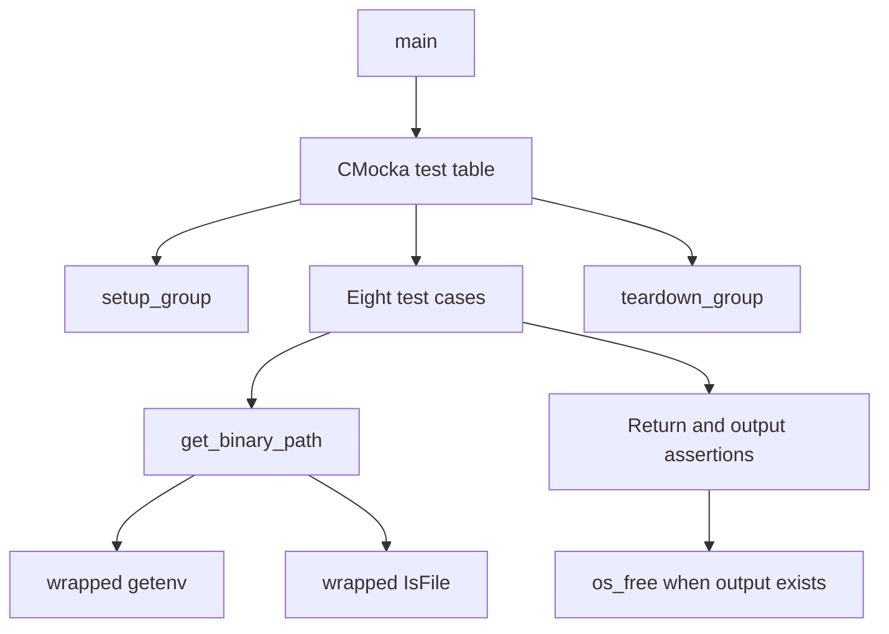
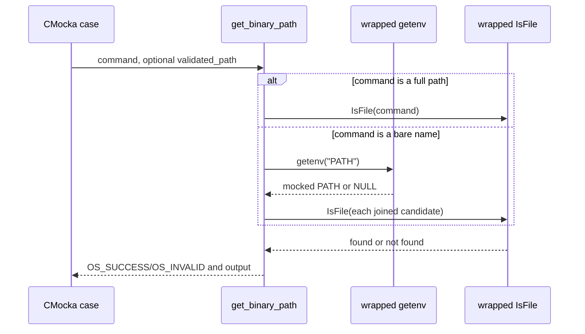
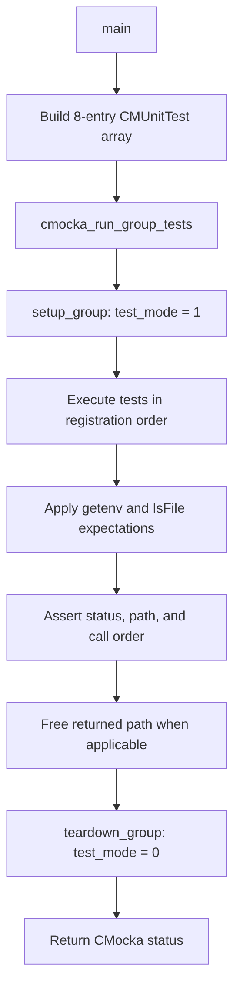
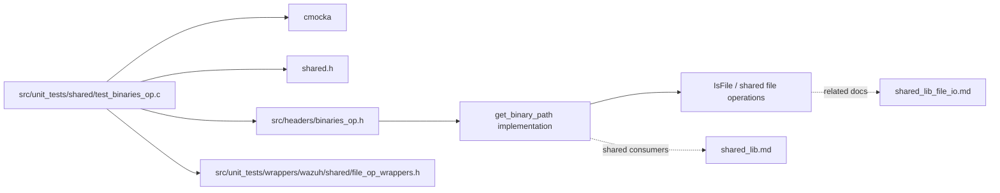

# `test_binaries_op_shared`

`test_binaries_op_shared` is the CMocka unit-test module for Wazuh’s shared binary-path resolver, `get_binary_path`. It verifies direct-path validation, `PATH` traversal, platform-specific path separators, not-found behavior, and operation when the caller does not request the resolved path.

The test source is [`src/unit_tests/shared/test_binaries_op.c`](src/unit_tests/shared/test_binaries_op.c). The production declaration is supplied by `src/headers/binaries_op.h`; file existence is abstracted through the shared file-operation API. This document focuses on the test contract. Shared file primitives and their broader consumers are documented in [shared_lib_file_io.md](shared_lib_file_io.md) and [shared_lib.md](shared_lib.md).

## Purpose and system position

Binary lookup is a small but widely reusable system boundary: callers provide either an executable name such as `uname` or a path, and `get_binary_path` returns a usable path when the target exists. The test isolates that boundary from the host filesystem and environment so results are deterministic on both Unix-like and Windows builds.

```mermaid
flowchart LR
    Caller[Native Wazuh caller] --> Resolver[get_binary_path]
    Resolver --> Direct{Input contains path?}
    Direct -->|yes| IsFile[IsFile(file)]
    Direct -->|no| Env[getenv("PATH")]
    Env --> Split[Platform-specific PATH split]
    Split --> Join[Join directory + command]
    Join --> IsFile
    IsFile -->|found| Success[OS_SUCCESS + resolved path]
    IsFile -->|not found| Fallback[OS_INVALID + original command]
```

The module belongs to the shared-library unit-test suite. It does not launch binaries or test process execution; it verifies path resolution before an eventual caller performs execution.

## Architecture

### Components

| Component | Responsibility |
|---|---|
| `CMUnitTest` | CMocka descriptor type used to register the test cases. |
| `main` | Registers eight tests and runs them with `cmocka_run_group_tests`. |
| `setup_group` | Enables global `test_mode`, causing environment access to use the test wrapper. |
| `teardown_group` | Restores `test_mode` to zero after the group completes. |
| `get_binary_path` | Production API under test; validates a direct path or searches `PATH`. |
| `__wrap_getenv` / `wrap_getenv` | Supplies deterministic `PATH` values and checks that the resolver asks for `PATH`. |
| `__wrap_IsFile` | Simulates file existence and records each candidate path examined. |
| `os_free` | Releases the output allocated by `get_binary_path`. |



### Isolation boundaries

The test wrapper replaces `getenv` only while `test_mode` is enabled. Outside test mode it delegates to the real environment function. `IsFile` is also wrapped through the shared file-operation wrappers, allowing the test to assert both the candidate path and the simulated result without touching the actual filesystem.



## Resolution behavior covered by the tests

### Full-path input

`test_get_binary_path_full_path_found` passes `/home/test/uname` on Unix-like builds and `c:\home\test\uname` on Windows builds. When `IsFile` reports success, the resolver returns `OS_SUCCESS` and returns the same path.

`test_get_binary_path_full_path_not_found` uses the same direct path but makes `IsFile` fail. The expected result is `OS_INVALID`; the output still contains the original full path. This preserves useful diagnostic information even when validation fails.

No `PATH` lookup is expected for either direct-path case.

### Bare command and first `PATH` entry

`test_get_binary_path_first` supplies the command `uname` and a one-entry `PATH`:

- Unix-like: `/home/test`
- Windows: `c:\home\test`

The resolver must request `getenv("PATH")`, join the first directory with the command using `/` or `\`, validate that candidate, and return it with `OS_SUCCESS`.

### Search across multiple entries

`test_get_binary_path_usr_bin` supplies two `PATH` entries and makes the first candidate fail:

- Unix-like: `/home/test:/usr/bin`
- Windows: `c:\home\test;c:\usr\bin`

The resolver must continue in order and return the second candidate. The test verifies every `IsFile` call, making search order part of the contract.

### Not found and missing environment

`test_get_binary_path_not_found` makes every candidate fail. It expects `OS_INVALID` and an output value equal to the original bare command, `uname`.

`test_get_binary_path_envpath_null` makes `getenv("PATH")` return `NULL`. The resolver must fail cleanly with `OS_INVALID` and preserve `uname` as the output. This covers systems where the process environment does not expose `PATH`.

```mermaid
flowchart TD
    Start[command] --> Full{Full path?}
    Full -->|yes| CheckDirect[IsFile(command)]
    CheckDirect -->|found| ReturnDirect[OS_SUCCESS + command]
    CheckDirect -->|missing| ReturnInvalidPath[OS_INVALID + command]
    Full -->|no| GetPath[getenv("PATH")]
    GetPath -->|NULL| ReturnInvalidName[OS_INVALID + command]
    GetPath -->|value| Next[Take next PATH entry]
    Next --> Candidate[Join entry and command]
    Candidate --> Check[IsFile(candidate)]
    Check -->|found| ReturnCandidate[OS_SUCCESS + candidate]
    Check -->|missing and entries remain| Next
    Check -->|missing and exhausted| ReturnInvalidName
```

### Optional output pointer

`test_get_binary_path_first_validated_null` and `test_get_binary_path_not_found_validated_null` pass `NULL` as the output pointer. They verify that lookup still returns the correct status and does not require a destination for the resolved string:

- an existing first candidate returns `OS_SUCCESS`;
- no candidate found returns `OS_INVALID`.

These tests distinguish path validation from result-string ownership. When a non-NULL output pointer is supplied, the test frees the returned allocation with `os_free`; when it is NULL, no cleanup is required by the test.

## Platform variants

The source uses `#ifdef TEST_WINAGENT` to compile equivalent cases for Windows and non-Windows targets.

| Concern | Unix-like build | Windows build |
|---|---|---|
| Directory separator | `/` | `\\` |
| `PATH` separator | `:` | `;` |
| Direct-path example | `/home/test/uname` | `c:\\home\\test\\uname` |
| Search examples | `/home/test:/usr/bin` | `c:\\home\\test;c:\\usr\\bin` |
| File wrapper | `__wrap_IsFile` | `__wrap_IsFile` |

The behavioral contract is platform-neutral: preserve input paths, search entries from left to right, stop at the first existing candidate, and report `OS_INVALID` when no candidate can be validated.

## Test execution flow

`main` constructs the following CMocka table:

1. `test_get_binary_path_full_path_found`
2. `test_get_binary_path_full_path_not_found`
3. `test_get_binary_path_first`
4. `test_get_binary_path_usr_bin`
5. `test_get_binary_path_not_found`
6. `test_get_binary_path_first_validated_null`
7. `test_get_binary_path_not_found_validated_null`
8. `test_get_binary_path_envpath_null`

The whole group uses `setup_group` and `teardown_group`; individual tests do not use per-test fixtures.



## Dependencies and references



The test’s direct dependencies are intentionally narrow. It does not validate the semantics of `IsFile`, environment parsing in the operating system, or downstream process execution. Those responsibilities should be documented and tested in the shared file-I/O and caller modules.

## Coverage limits

The module does not cover empty command strings, empty `PATH` entries, quoted or escaped directory names, duplicate entries, trailing separators, excessively long paths, allocation failure, malformed path encodings, symlink policy, executable permission checks, or concurrent calls. It also uses mocked `IsFile` outcomes, so it cannot establish that the production filesystem implementation classifies a real file correctly.

The strongest guarantees provided by this module are therefore lookup ordering, path construction for the two supported platform conventions, status propagation, fallback output values, and safe handling of a missing `PATH` or NULL output destination.
