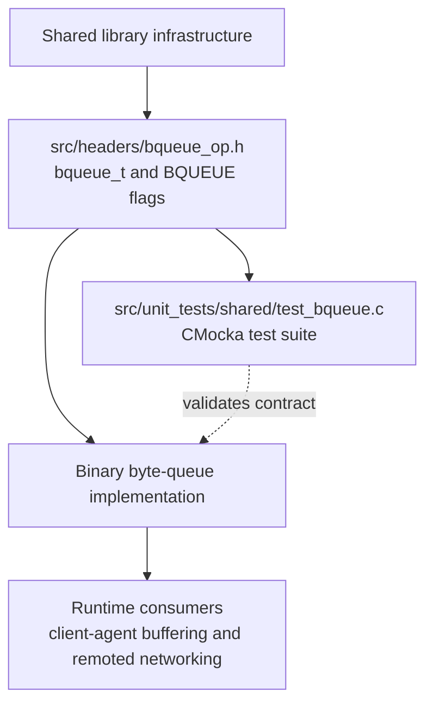
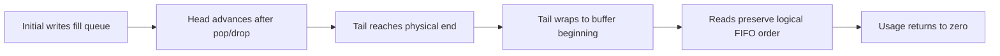
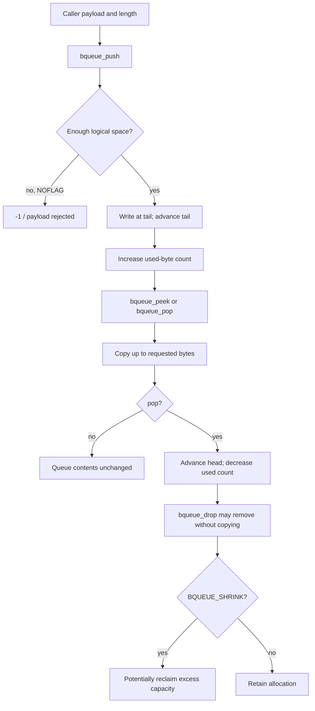
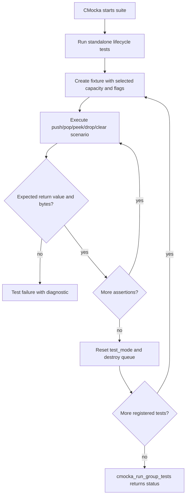

# `test_bqueue_shared`

`test_bqueue_shared` is the CMocka unit-test module for Wazuh’s shared binary queue, implemented through `src/unit_tests/shared/test_bqueue.c` and declared by `src/headers/bqueue_op.h`. It validates the queue as a byte-stream buffer: initialization and destruction, bounded writes, FIFO reads, non-destructive peeking, explicit dropping, usage accounting, clearing, circular wraparound, and capacity expansion/shrink behavior.

The queue’s production contract and structure are documented in [`headers_concurrency.md`](headers_concurrency.md). This file focuses on the test design and the behaviors evidenced by `test_bqueue.c`; the main production consumer and network framing flow are described in [`remoted_networking.md`](remoted_networking.md) and [`test_netbuffer_remoted.md`](test_netbuffer_remoted.md).

## Module position



The test suite is a leaf under the shared-library unit tests. It does not exercise a daemon or socket directly. Instead, it verifies the reusable queue primitive that higher-level modules use for stream buffering. For the network-level use of `peek` followed by `drop`, see [`remoted_networking.md`](remoted_networking.md).

## Architecture and test harness

```mermaid
flowchart LR
    Main[main()] --> Registry[CMUnitTest registry]
    Registry --> Lifecycle[Lifecycle tests]
    Registry --> Basic[Basic push/pop tests]
    Registry --> Inspect[peek/drop/used/clear tests]
    Registry --> Circular[Circular-buffer tests]
    Registry --> Growth[Expansion and shrink tests]

    Lifecycle --> API[bqueue_init / bqueue_destroy]
    Basic --> API2[bqueue_push / bqueue_pop]
    Inspect --> API3[bqueue_peek / bqueue_drop / bqueue_used / bqueue_clear]
    Circular --> API2
    Growth --> API2

    Setup[Per-test setup fixture] --> Queue[bqueue_t fixture]
    Queue --> Cases[Assertions on return codes, bytes, and usage]
    Cases --> Teardown[Per-test teardown fixture]
```

The suite uses CMocka’s `cmocka_unit_test` and `cmocka_unit_test_setup_teardown` macros. The test file does not define mocks or wrappers of its own; it calls the queue API directly and uses `test_mode = 1` in fixtures so allocation/error paths can be tested deterministically.

## Components

| Component | Responsibility |
|---|---|
| `CMUnitTest` | CMocka test descriptor type used to register the suite. |
| `main` | Registers 18 test cases and runs them with `cmocka_run_group_tests`. |
| `test_setup_2` | Creates a 2-byte queue with `BQUEUE_NOFLAG`. |
| `test_setup_3` | Creates a 3-byte queue with `BQUEUE_NOFLAG`; used for ordinary operation and full-buffer checks. |
| `test_setup_20` | Creates a 20-byte queue with `BQUEUE_NOFLAG`; used for cross-pointer and expansion scenarios. |
| `test_setup_1024` | Creates a 1025-byte queue with `BQUEUE_SHRINK`; used to fill a 1024-byte logical payload and test rollover. |
| `test_teardown` | Resets `test_mode`, destroys the fixture, and closes each setup/teardown test. |
| `MESSAGE` | Constant two-byte payload, `"AB"`, used to make byte ordering and capacity boundaries explicit. |

The standalone lifecycle tests intentionally do not use a fixture because they test construction and destruction themselves. All operational tests assert that the setup produced a non-null `bqueue_t` before interacting with it.

## Queue behavior covered

### Lifecycle and minimum capacity

`test_bqueue_init_fail` verifies that a one-byte queue is rejected. `test_bqueue_init_ok` verifies that a two-byte queue is valid. `test_bqueue_destroy_fail` checks that destroying `NULL` is tolerated, while `test_bqueue_destroy_ok` confirms normal destruction.

The tests also establish the expected return convention: successful initialization returns a non-null queue, successful operations generally return `0` or a byte count, and invalid/full operations return `-1` where the API reports failure.

### Push and pop semantics

The basic tests establish these rules:

- `bqueue_push` accepts a payload when sufficient space exists and returns `0`.
- A push into a full queue with `BQUEUE_NOFLAG` fails with `-1` (`test_bqueue_push_fail_non_space`).
- `bqueue_pop` returns the number of bytes actually removed, not necessarily the requested buffer size.
- Popping an empty queue returns `0` (`test_bqueue_push_second_pop_fail`).
- Bytes leave the queue in insertion order (`test_bqueue_push_pop_ok`).

`BQUEUE_WAIT` is passed in `test_bqueue_push_pop_used_ok` and `test_bqueue_push_clear_ok` to cover the flag at call sites, while the assertions remain focused on the resulting byte count and queue state.

### Peek, drop, usage, and clear

```mermaid
sequenceDiagram
    participant Test as Test case
    participant Q as bqueue_t

    Test->>Q: bqueue_push("AB", 2)
    Test->>Q: bqueue_peek(buffer, 3)
    Q-->>Test: 2 bytes; contents remain queued
    Test->>Q: bqueue_drop(2)
    Q-->>Test: 0; used becomes 0
    Test->>Q: bqueue_peek(buffer, 3)
    Q-->>Test: 0; queue is empty
```

`test_bqueue_push_peek_drop_ok` verifies that `peek` copies bytes without consuming them and that `drop` consumes exactly the inspected bytes. `test_bqueue_push_second_peek_empty` verifies that a second peek after dropping the available bytes returns `0`. `test_bqueue_push_peek_drop_fail` verifies that dropping more bytes than currently used returns `-1`.

`test_bqueue_push_pop_used_ok` confirms that `bqueue_used` reports zero after a read. `test_bqueue_push_clear_ok` confirms that `bqueue_clear` removes all queued bytes and resets usage to zero without destroying the queue.

### Circular storage and pointer crossing



`test_bqueue_push_pop_full_buff` fills the logical 1024-byte payload with repeated `AB` chunks, then pops every chunk and checks the final contents and empty state. This catches an implementation that miscounts a full buffer or loses bytes at the end of the storage area.

`test_bqueue_push_pop_rollover` fills 1022 bytes, pops three bytes (`"ABA"`), pushes `"12345"`, and then drains the remaining old bytes followed by the wrapped payload. It specifically verifies that the tail can cross the physical end of the backing buffer while preserving FIFO order.

`test_bqueue_push_drop_cross_pointers` creates a queue where head and tail point into different portions of the circular storage. It drops six bytes, pushes `"12345"` and `"67890"`, then verifies that the remaining old bytes precede the new bytes.

### Expansion and shrink configuration

`test_bqueue_push_drop_to_expand` exercises the 20-byte fixture through a sequence of writes, a six-byte drop, additional writes, and partial reads. The scenario forces the implementation to reconcile free space split across the end and beginning of the buffer, and verifies the resulting byte stream (`"789"`, `"01"`, then `"2345678"`).

The 1025-byte fixture uses `BQUEUE_SHRINK`. Together with the large rollover test, it validates the configuration used for a queue that may grow while receiving data and later reclaim storage. The exact shrink threshold and internal pointer representation belong to the production implementation and are documented centrally in [`headers_concurrency.md`](headers_concurrency.md).

## Data-flow model



This is a byte-stream model rather than an item-queue model: the tests deliberately pop partial lengths and validate sequences that cross the storage boundary. Callers must therefore track framing separately when the queue contains multiple messages; the queue itself only preserves bytes and counts.

## Test inventory

| Area | Tests |
|---|---|
| Construction | `test_bqueue_init_fail`, `test_bqueue_init_ok`, `test_bqueue_destroy_fail`, `test_bqueue_destroy_ok` |
| Push | `test_bqueue_push_fail`, `test_bqueue_push_fail_non_space`, `test_bqueue_push_ok` |
| Pop and usage | `test_bqueue_push_pop_ok`, `test_bqueue_push_second_pop_fail`, `test_bqueue_push_pop_used_ok` |
| Peek and drop | `test_bqueue_push_second_peek_empty`, `test_bqueue_push_peek_drop_ok`, `test_bqueue_push_peek_drop_fail` |
| Reset | `test_bqueue_push_clear_ok` |
| Full capacity and rollover | `test_bqueue_push_pop_full_buff`, `test_bqueue_push_pop_rollover` |
| Cross-pointer and growth behavior | `test_bqueue_push_drop_cross_pointers`, `test_bqueue_push_drop_to_expand` |

## Process flow



## Maintenance notes

- Preserve the small fixture sizes (`2`, `3`, and `20`) because they expose full-buffer and pointer-crossing behavior with minimal operations.
- Preserve the `1025` allocation with `BQUEUE_SHRINK`; it is intentionally just above the 1024-byte scenario.
- When changing queue return codes or flag semantics, update both this suite and the shared contract in [`headers_concurrency.md`](headers_concurrency.md).
- Changes to consumers should be checked against [`test_netbuffer_remoted.md`](test_netbuffer_remoted.md), especially the `peek` → socket write → `drop(sent_bytes)` interaction.
- The suite uses a static two-byte payload and does not validate thread scheduling or condition-variable wakeups. Those concerns belong to the broader queue/concurrency tests documented in [`headers_concurrency.md`](headers_concurrency.md).

## Related modules

- [`headers_concurrency.md`](headers_concurrency.md) — shared queue types, fields, flags, and generic byte-buffer contract.
- [`remoted_networking.md`](remoted_networking.md) — production use of `bqueue_t` for outbound socket buffering.
- [`test_netbuffer_remoted.md`](test_netbuffer_remoted.md) — network-buffer tests that exercise queue behavior through framing and non-blocking sends.
- [`shared_lib_data_structures.md`](shared_lib_data_structures.md) — neighboring shared data structures and their common implementation context.
