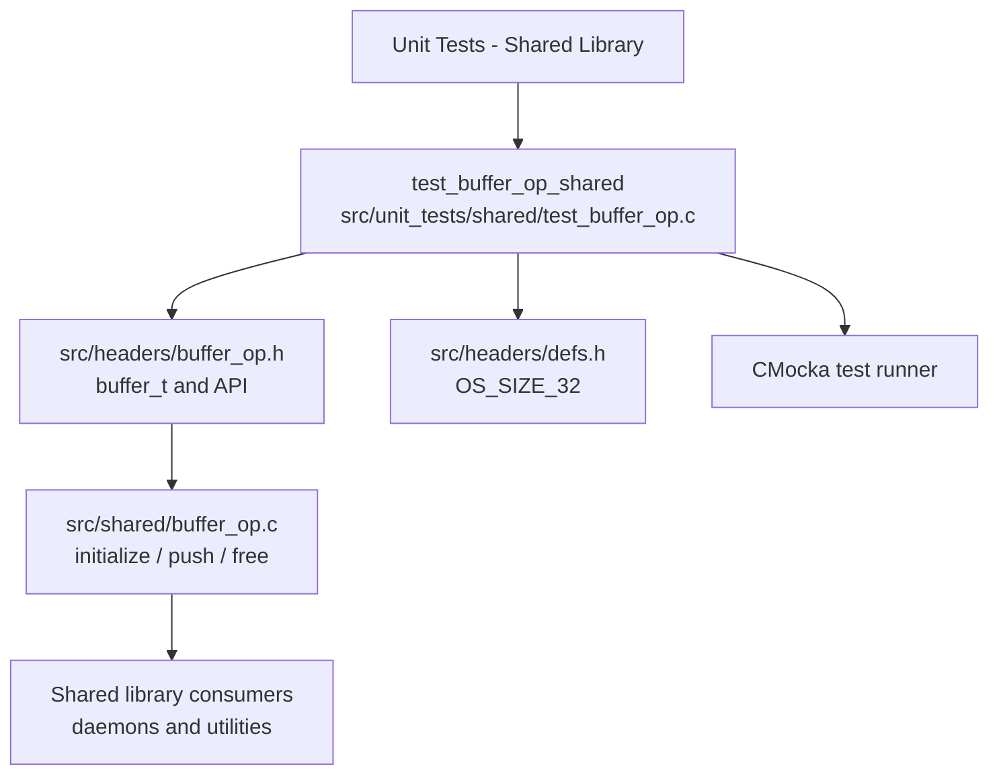
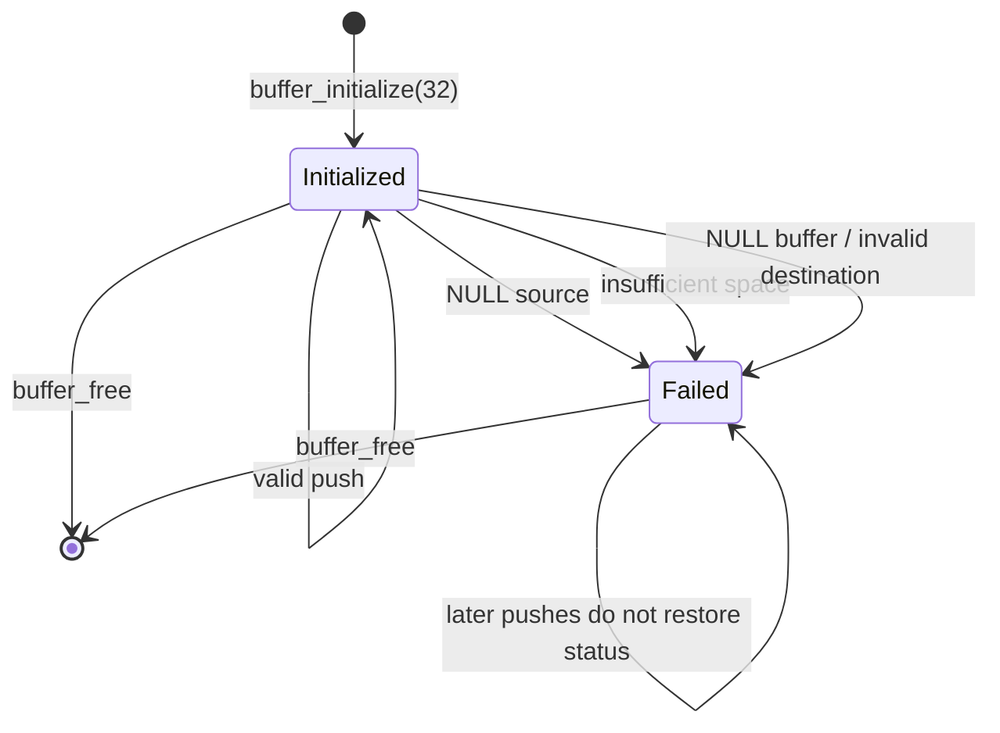
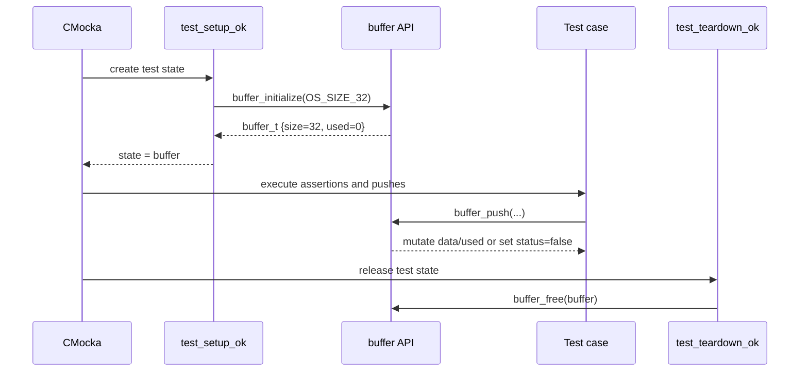

# `test_buffer_op_shared`

## Introduction

`test_buffer_op_shared` is the CMocka unit-test module for Wazuh’s fixed-capacity byte buffer in `src/shared/buffer_op.c`. It verifies initialization, append semantics, null-input handling, capacity protection, multi-part appends, and cleanup. The test is a leaf under the shared-library unit tests; the production buffer is a reusable low-level utility rather than a standalone daemon component.

For the broader utility-layer context, see [shared_lib.md](shared_lib.md). Related shared-library test patterns are documented in [test_agent_op_shared.md](test_agent_op_shared.md).

## Module position



## Production API and state model

`buffer_t` contains:

| Field | Meaning |
|---|---|
| `data` | Heap-allocated character storage. |
| `size` | Allocated capacity in bytes. |
| `used` | Number of bytes appended so far. |
| `status` | Operational flag initialized to `TRUE`; invalid input or insufficient capacity changes it to `FALSE`. |

The public API is declared in `src/headers/buffer_op.h`:

- `buffer_initialize(size)` allocates the structure and its data area, sets `used` to zero, records `size`, and marks the buffer active.
- `buffer_push(buffer, src, src_size)` appends bytes without reallocating.
- `buffer_free(buffer)` releases the data area and structure, and safely accepts `NULL`.



The append guard is strict: `buffer->size - buffer->used > src_size`. Consequently, the implementation rejects a write that would exactly consume all allocated bytes. Rejected writes leave `used` and existing data unchanged and set `status` to `FALSE`. The tests primarily assert the preserved data and counters; they do not currently assert `status`.

## Test lifecycle and component interaction

Every registered test uses the same setup and teardown callbacks:



`OS_SIZE_32` comes from `src/headers/defs.h`, so all scenarios use a 32-byte destination. The test uses `strlen()` for normal source lengths and CMocka assertions for counters and string contents.

## Test cases

| Test | Scenario | Expected contract |
|---|---|---|
| `test_buffer_null` | `buffer_push(NULL, NULL, 0)` | Safe no-op; no crash. |
| `test_buffer_src_null` | Null source with zero length | `used` remains `0`; capacity remains `32`. |
| `test_buffer_src_null_with_size` | Null source with size `11000` | `used` remains `0`; invalid input is rejected. |
| `test_buffer_overrun` | Source is larger than the empty 32-byte buffer | No bytes are written; `used == 0`. |
| `test_buffer_overrun_bad_size` | Long source but caller supplies length `5` | Exactly five bytes (`hello`) are appended, demonstrating that `src_size`, not source-string length, controls the copy. |
| `test_buffer_ok` | One valid append | `hello_world` is stored and `used` equals its length. |
| `test_buffer_multiple_push_ok` | Append `hello`, `_`, then `world` | Data is concatenated in order as `hello_world`. |
| `test_buffer_multiple_push_bad_size` | Append `hello`, then a 64-byte string | Existing `hello` remains intact and the oversized second append is rejected. |

The last case is present in the source but is not included in the `tests[]` array in `main`; therefore it is not executed by the current binary unless registered elsewhere by the build system. This is a documentation and coverage concern, not a production behavior claim.

## Append data flow

```mermaid
flowchart TD
    CALL[buffer_push(buffer, src, src_size)] --> VALID{buffer != NULL?}
    VALID -->|no| RETURN[Return without mutation]
    VALID -->|yes| SOURCE{src != NULL?}
    SOURCE -->|no| FAIL[status = FALSE]
    SOURCE -->|yes| SPACE{size - used > src_size\nand data != NULL?}
    SPACE -->|no| FAIL
    SPACE -->|yes| COPY[memcpy(data + used, src, src_size)]
    COPY --> COUNT[used += src_size]
    COUNT --> DONE[Preserve data and status]
```

This utility is deliberately non-growing: callers must choose an adequate capacity and handle the `status` flag after pushes. It also does not add a terminating NUL byte as part of `buffer_push`; the current tests use string assertions only because the copied examples contain a zero-initialized byte after the written region.

## Coverage and maintenance notes

- The suite covers success, invalid source, null buffer, oversized append, caller-supplied length, and ordered accumulation.
- The tests validate `data`, `used`, and `size`, but should also validate `status` after each rejected operation and after successful operations.
- A boundary test for `src_size == size - used` is valuable because the implementation uses `>` rather than `>=`.
- The `test_buffer_multiple_push_bad_size` registration should be reviewed so the intended oversized multi-push scenario is actually run.
- `test_setup_ok` does not assert that `buffer_initialize` returned a non-null pointer; adding that assertion would make allocation failure visible to the fixture rather than causing a later dereference.
- `test_teardown_ok` exercises the normal ownership path. `buffer_free(NULL)` is implemented defensively but is not directly tested here.

## Related components

| Component | Relationship |
|---|---|
| [shared_lib.md](shared_lib.md) | Parent shared-library architecture and consumers. |
| `src/headers/buffer_op.h` | Buffer structure and public function declarations. |
| `src/shared/buffer_op.c` | Implementation under test. |
| [headers_data_structures.md](headers_data_structures.md) | Neighboring native header/data-structure documentation. |
| [test_bqueue_shared.md](test_bqueue_shared.md) | Related shared-library bounded-buffer/queue tests, where available. |
