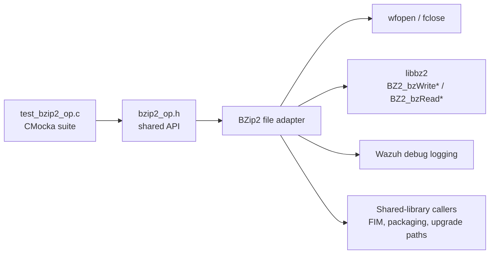
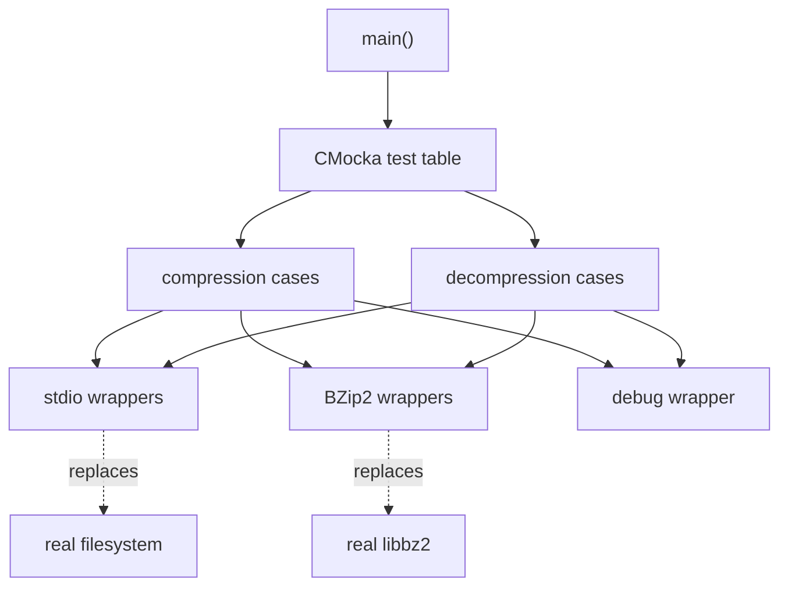
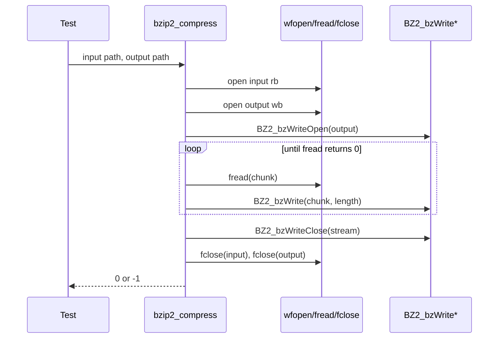
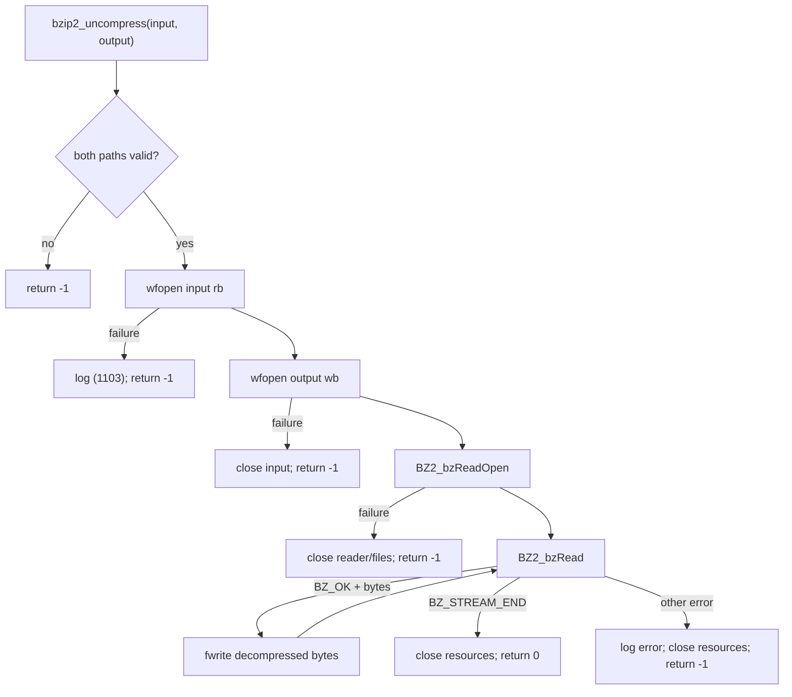
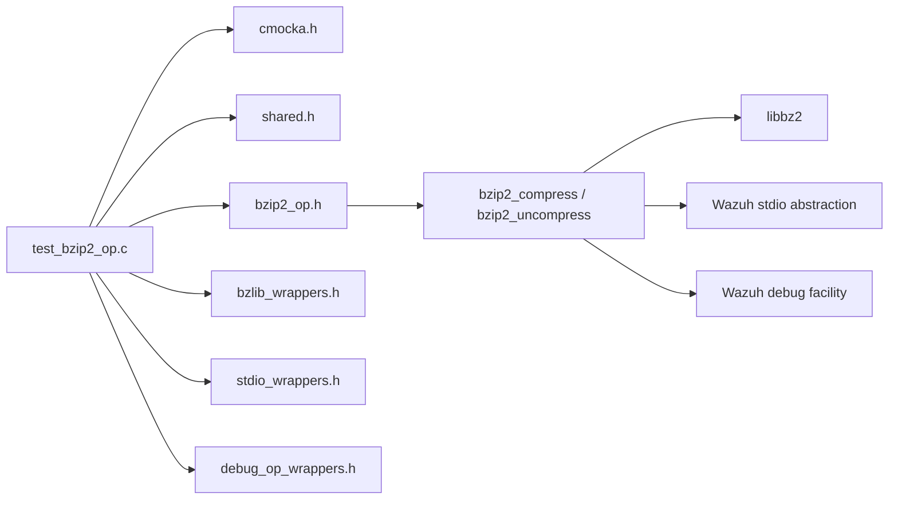
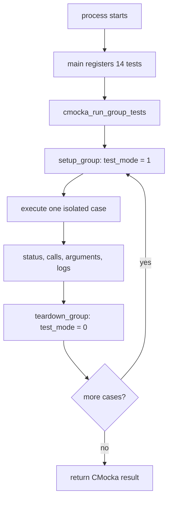

# `test_bzip2_op_shared`

`test_bzip2_op_shared` is the CMocka unit-test module for Wazuh’s shared BZip2 file adapter. It verifies the two file-to-file operations exposed by `bzip2_op.h`: `bzip2_compress` and `bzip2_uncompress`. The suite covers argument validation, input/output file handling, BZip2 stream initialization, read/write failures, successful streaming, diagnostics, and cleanup.

The test source is `src/unit_tests/shared/test_bzip2_op.c`. The production adapter is represented by `src/headers/bzip2_op.h` and its corresponding shared-library implementation. Because only the test component is included in this documentation input, implementation behavior is described from the observable calls and assertions in the test.

## Purpose and system position

The adapter is a low-level file transformation boundary. Compression opens an ordinary input file and a BZip2 output stream; decompression opens a BZip2 input stream and writes the expanded bytes to an ordinary output file. The unit test isolates that boundary from the filesystem, libbz2, and Wazuh logging through wrappers.

Compression-related consumers should link to the relevant module documentation, such as [shared_lib.md](shared_lib.md), [syscheckd_core_scan_engine.md](syscheckd_core_scan_engine.md), or [agent_upgrade_module.md](agent_upgrade_module.md), rather than duplicating this adapter’s test details.

## Architecture

### Components

| Component | Responsibility |
|---|---|
| `main` | Registers all fourteen cases and runs the CMocka group. |
| `CMUnitTest` | Describes each test case for CMocka. |
| `setup_group` | Enables global `test_mode`, allowing wrapper-controlled behavior. |
| `teardown_group` | Resets `test_mode` after the group completes. |
| `test_bzip2_compress_*` | Verifies compression validation, file opening, BZip2 initialization, writes, and success. |
| `test_bzip2_uncompress_*` | Verifies decompression validation, file opening, BZip2 initialization, reads, and success. |
| `wfopen`/stdio wrappers | Simulate file descriptors and open/close failures without touching disk. |
| BZip2 wrappers | Control stream handles, status codes, input buffers, and byte counts. |
| debug wrappers | Assert error messages emitted by the adapter. |

## Compression flow

The expected compression sequence is: validate both paths, open the source with `rb`, open the destination with `wb`, initialize a BZip2 writer over the destination stream, repeatedly read source bytes with `fread`, pass non-empty chunks to `BZ2_bzWrite`, close the BZip2 writer, close both files, and return success. Any failed stage returns `-1` after the resources already acquired are closed.

The compression cases establish these branches:

- `test_bzip2_compress_nullfile` and `test_bzip2_compress_nullfilebz2` require `-1` for a null input or output path.
- `test_bzip2_compress_firstfopenfail` verifies input-open failure and the `(1103)` diagnostic.
- `test_bzip2_compress_secondfopenfail` verifies that an opened input is closed when output opening fails.
- `test_bzip2_compress_bzWriteOpen` verifies BZip2 writer initialization failure and cleanup of both files.
- `test_bzip2_compress_BZ2_bzWrite` verifies a write error after a successful initialization and cleanup of the writer and files.
- `test_bzip2_compress_success` models one non-empty read/write followed by an empty read and expects `0`.

The test does not assert a compressed byte sequence or compression ratio. The compressed representation is an implementation detail; the suite instead validates control flow and return semantics.

## Decompression flow

Decompression mirrors the file lifecycle in the opposite direction: validate paths, open the BZip2 source with `rb`, open the ordinary destination with `wb`, initialize a BZip2 reader, repeatedly read decompressed chunks with `BZ2_bzRead`, write returned bytes with `fwrite`, stop at `BZ_STREAM_END`, close the BZip2 reader and both files, and return `0`. A BZip2 read error returns `-1` after cleanup.

The decompression cases cover null paths, first and second file-open failures, `BZ2_bzReadOpen` failure, a successful stream ending in `BZ_STREAM_END`, and a `BZ_MEM_ERROR` from `BZ2_bzRead`. The success case models an 11-byte read followed by an end-of-stream read and verifies corresponding `fwrite` calls.

## Dependencies and mocked boundaries

The wrappers are part of the test architecture, not production dependencies. They let each test prescribe exact arguments and return values using `expect_*` and `will_return`, making failures deterministic:

- `wfopen` returns synthetic handles `1` and `2`, or `NULL` to model open failure.
- `BZ2_bzWriteOpen` and `BZ2_bzReadOpen` return both a status code and synthetic stream handle.
- `BZ2_bzWrite` and `BZ2_bzRead` model successful and failing stream operations.
- `fread` and `fwrite` control chunk contents and lengths.
- `fclose`, `BZ2_bzWriteClose`, and `BZ2_bzReadClose` verify cleanup paths.
- `_mdebug2` verifies user-visible diagnostic formatting.

## Test lifecycle and process flow

There is no per-test fixture allocation in this file. Each case defines its synthetic paths and wrapper expectations locally. Group setup only enables test mode, and group teardown restores it, so tests remain independent except for the controlled global flag.

## Coverage matrix

| Area | Cases | Expected result |
|---|---|---|
| Null compression paths | `compress_nullfile`, `compress_nullfilebz2` | `-1` |
| Compression file opens | `compress_firstfopenfail`, `compress_secondfopenfail` | `-1`, correct diagnostic/cleanup |
| Compression BZip2 setup/write | `compress_bzWriteOpen`, `compress_BZ2_bzWrite` | `-1`, stream and file cleanup |
| Compression success | `compress_success` | `0` |
| Null decompression paths | `uncompress_nullfile`, `uncompress_nullfilebz2` | `-1` |
| Decompression file opens | `uncompress_firstfopenfail`, `uncompress_secondfopenfail` | `-1`, correct cleanup |
| Decompression BZip2 setup | `uncompress_bzReadOpen` | `-1`, reader and file cleanup |
| Decompression stream success | `uncompress_bzReadsuccess` | `0`, writes data and handles stream end |
| Decompression stream failure | `uncompress_bzReadfail` | `-1`, error diagnostic and cleanup |

## Limitations and maintenance notes

The supplied test covers the adapter’s primary control-flow and cleanup contract, but it does not establish behavior for truncated/corrupt BZip2 data, short `fwrite` results, `fread` errors, very large files, binary data containing embedded NUL bytes, or exact compression compatibility across libbz2 versions. Those cases should be added if the adapter’s implementation exposes corresponding guarantees.

When changing the adapter, preserve the wrapper call order expected by the tests unless the resource lifecycle is intentionally redesigned. In particular, failure paths must close every already-open file or BZip2 stream, and successful paths must close the BZip2 stream before closing its underlying file.

## Related documentation

- [shared_lib.md](shared_lib.md) — shared native-library role and neighboring utility boundaries.
- [shared_lib_file_io.md](shared_lib_file_io.md) — shared file-I/O utilities used by neighboring native paths.
- [syscheckd_core_scan_engine.md](syscheckd_core_scan_engine.md) — a consumer area where compressed file differences are relevant.
- [agent_upgrade_module.md](agent_upgrade_module.md) — agent upgrade functionality with related package workflows.
