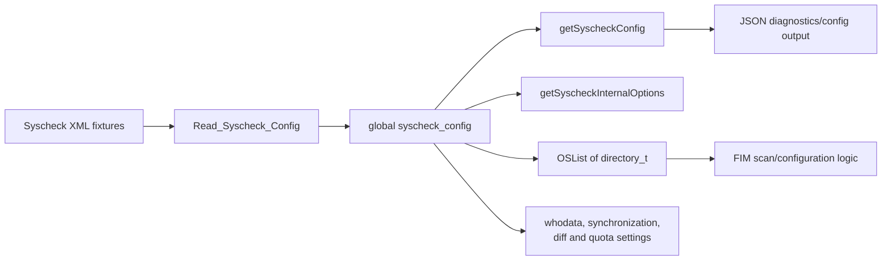
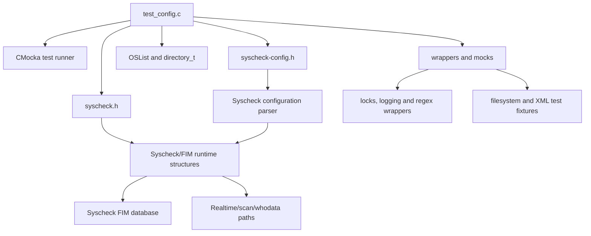
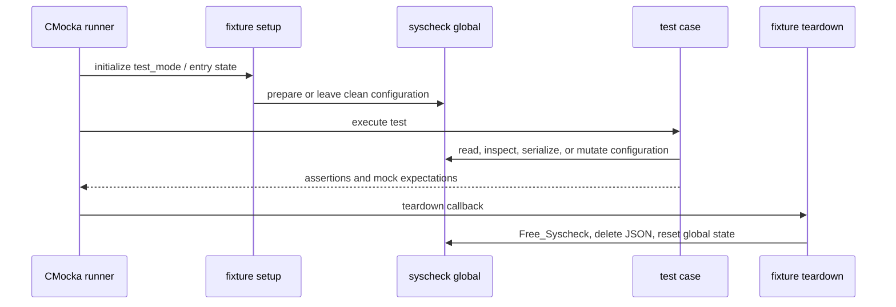
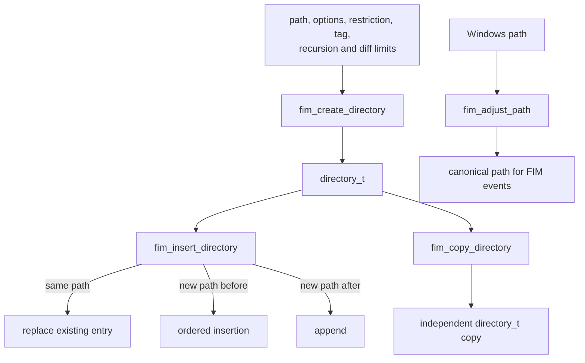
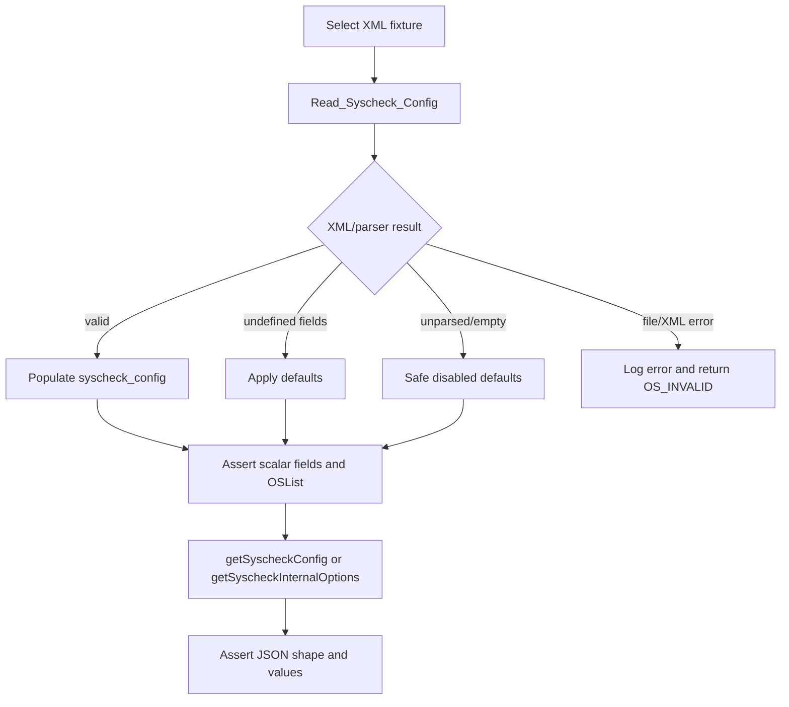

# `test_config` — Syscheck/FIM configuration tests

`test_config` is the CMocka unit-test module for the Syscheck daemon's configuration lifecycle and the small FIM directory helpers used while configuration is built. It verifies XML configuration loading, defaulting, validation, JSON exposure, directory-list behavior, and Windows path normalization without starting a real Syscheck scan.

The production behavior under test belongs to the [Syscheck daemon core](syscheckd_core.md), [FIM database](syscheckd_db.md), [Syscheck file layer](syscheckd_file.md), and [Syscheck registry layer](syscheckd_registry.md). This document describes only the test module and its contracts.

## Location and test entry point

| Item | Value |
|---|---|
| Source | `src/unit_tests/syscheckd/test_config.c` |
| Framework | CMocka (`CMUnitTest`) |
| Entry point | `main()` |
| Test state | Global `syscheck` configuration and per-test `entry_struct_t` fixtures |
| Configuration API exercised | `Read_Syscheck_Config`, `getSyscheckConfig`, `getSyscheckInternalOptions` |
| FIM helpers exercised | `fim_create_directory`, `fim_copy_directory`, `fim_insert_directory`, `fim_adjust_path` |

## Role in the system

The test module sits below the Syscheck configuration parser and beside the FIM scan/runtime tests. Configuration is read from XML, converted into the global `syscheck_config`, and then exposed through JSON APIs. Directory entries are represented as ordered `OSList` nodes and later consumed by the FIM scan engine.



## Architecture and dependencies



The test includes wrappers for pthread locks, regular-expression matching, and debug/error logging. These wrappers make synchronization and error paths observable while keeping the test deterministic. The test does not use the API layer or the Wazuh database directly; those consumers are documented in their respective module pages.

## Test harness lifecycle

There are two fixture families:

1. Configuration tests use `setup_read_config()` and `restart_syscheck()`.
2. Directory helper tests use `setup_entry()` and `teardown_entry()`.



`restart_syscheck()` switches to mock mode, expects the lock operations used by cleanup, deletes any JSON object stored in CMocka state, frees the global configuration, and zeroes it. This reset is important because `Read_Syscheck_Config()` mutates global state rather than returning a self-contained object.

## Configuration loading contract

The `Read_Syscheck_Config()` tests cover three outcomes:

| Scenario | Expected result | Main contract checked |
|---|---:|---|
| Complete valid fixture | `0` | Explicit values populate the global structure, including directories and whodata settings. |
| Missing/undefined optional values | `0` | Parser applies production defaults without creating optional lists or commands. |
| Empty/unparsed fixture | `1` | Configuration remains in safe disabled/default state and has no directory nodes. |
| Missing XML file | `OS_INVALID` | Parser reports an XML read error through the logging wrapper. |

The complete fixture verifies, among other values, filesystem exclusions, scan frequency, ignore and no-diff lists, synchronization, audit/whodata provider, remote prefilter command, event-rate limits, disk quota, file-size quota, and file-entry limits. It also verifies that a large directory configuration is capped at the supported per-line/list behavior.

The undefined/default fixture establishes observable defaults such as:

- frequency of `43200` seconds;
- synchronization interval of `600` seconds;
- process priority `10`;
- maximum event rate `200` in the standard configuration path;
- absent ignore, no-diff, scan scheduling, and prefilter collections when not configured.

The empty fixture checks the defensive startup profile: Syscheck is disabled, the directory list exists but is empty, and default scan/diff/synchronization settings are retained. Exact defaults differ for manager/agent and Windows-agent builds; the assertions document those compile-time variants.

## JSON serialization contract

`getSyscheckConfig()` converts the current configuration into a JSON object shaped as:

```text
{
  "syscheck": {
    "disabled": "no|yes",
    "frequency": number,
    "directories": [...],
    "ignore": [...],
    "nodiff": [...],
    "diff": { "disk_quota": {...}, "file_size": {...} },
    "whodata": {...},
    "synchronization": {...},
    "file_limit": {...},
    "max_eps": number,
    "process_priority": number
  }
}
```

The tests verify that configured values retain their public representation (`yes`/`no` strings, numeric limits, arrays, and nested objects), that absent optional values remain absent or `null`, and that platform-specific registry and audit fields are emitted only where supported.

`getSyscheckConfig_no_directories()` confirms a notable platform distinction: non-Windows builds return `NULL` when no directories are configured, while Windows-agent builds still return a JSON object containing disabled/default configuration and empty registry data.

`getSyscheckInternalOptions()` separately verifies the internal JSON view. It contains `internal.syscheck` settings and a `rootcheck` section, and is intentionally distinct from the user-facing Syscheck configuration JSON.

## FIM directory helper behavior



### `fim_create_directory`

The constructor test verifies that path, tag, wildcard state, and other supplied metadata are retained. A deliberately oversized `filerestrict` pattern exercises the regex compile-size error path; the helper still returns a usable directory entry while reporting the problem through the error logger.

### `fim_insert_directory`

The list insertion tests cover the three ordering cases:

- an existing path is replaced by the new entry;
- a lexically earlier path is inserted before the current first node;
- a later path is appended as the last node.

The tests also verify ownership cleanup through `OSList_CleanNodes()` and `free_directory()`.

### `fim_copy_directory`

Copying `NULL` returns `NULL`. Copying a populated `directory_t` produces a non-null entry preserving path, tag, wildcard state, recursion level, options, and diff-size metadata. The fixture owns and frees the resulting copy.

### `fim_adjust_path` (Windows)

The normalization tests verify that:

- `C:\\windows\\sysnative\\test` becomes `c:\\windows\\system32\\test`;
- an already-normalized `system32` path is unchanged;
- `syswow64` is unchanged;
- unrelated paths are unchanged.

The conversion aligns configuration paths with the paths reported by Windows FIM events. It is a platform-specific compatibility behavior, not a general path canonicalizer.

## Process flows

### Read and inspect configuration



### Cleanup and isolation


## Mocking and observability

The test uses expectations rather than timing-based checks for concurrency-sensitive behavior:

- read/write locks and mutexes prove that configuration access follows the expected synchronization path;
- debug, warning, and error wrappers validate diagnostics without depending on a running daemon logger;
- regex wrappers expose oversized or invalid restriction handling;
- CMocka state owns temporary JSON and directory objects to prevent cross-test contamination.

Because the test is unit-level, filesystem fixtures such as `test_syscheck_max_dir.conf`, `test_syscheck2.conf`, `test_syscheck3.conf`, `test_syscheck_config.conf`, and `test_empty_config.conf` represent parser inputs. They should be kept synchronized with the assertions when configuration schema or defaults change.

## Test inventory

| Area | Tests |
|---|---|
| XML loading | `test_Read_Syscheck_Config_success`, `test_Read_Syscheck_Config_invalid`, `test_Read_Syscheck_Config_undefined`, `test_Read_Syscheck_Config_unparsed` |
| Public JSON | `test_getSyscheckConfig`, `test_getSyscheckConfig_no_audit`, `test_getSyscheckConfig_no_directories` |
| Internal JSON | `test_getSyscheckInternalOptions` |
| Directory parsing | `test_SyscheckConf_DirectoriesWithCommas` |
| Directory construction/listing | `test_fim_create_directory_add_new_entry`, `test_fim_create_directory_OSMatch_Compile_fail_maxsize`, `test_fim_insert_directory_duplicate_entry`, `test_fim_insert_directory_insert_entry_before`, `test_fim_insert_directory_insert_entry_last` |
| Directory copying | `test_fim_copy_directory_null`, `test_fim_copy_directory_return_dir_copied` |
| Windows path handling | `test_fim_adjust_path_no_changes`, `test_fim_adjust_path_convert_sysnative`, `test_fim_adjust_path_convert_syswow64`, `test_fim_adjust_path_convert_system32` |

## Maintenance guidance

When changing Syscheck configuration:

1. Update the XML fixture and the corresponding global-structure assertions together.
2. Update both JSON tests when a field is added, removed, renamed, or changes optionality.
3. Preserve lock expectations when changing configuration access or cleanup paths.
4. Guard platform-specific assertions with the same build macros used by production code.
5. Add focused helper tests for new directory metadata, ordering rules, path transformations, or ownership behavior.

Related behavior is covered by the [Syscheck scan engine](syscheckd_core_scan_engine.md), [Syscheck realtime engine](syscheckd_core_realtime.md), [Syscheck whodata implementation](syscheckd_whodata.md), and [Syscheck FIM database](syscheckd_db.md).
