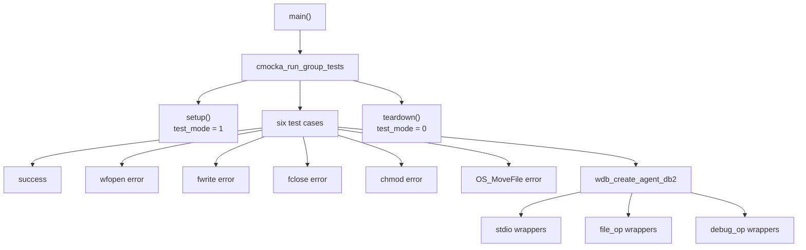
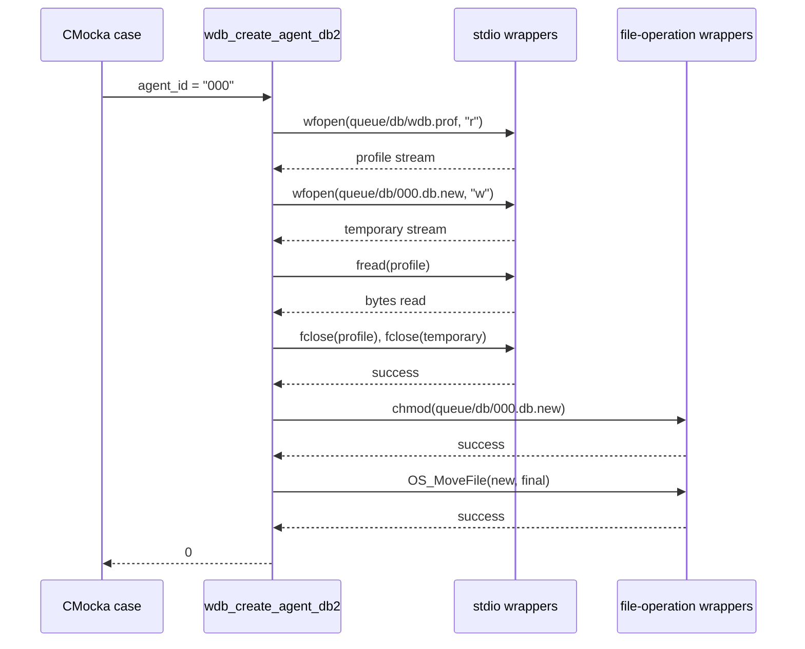
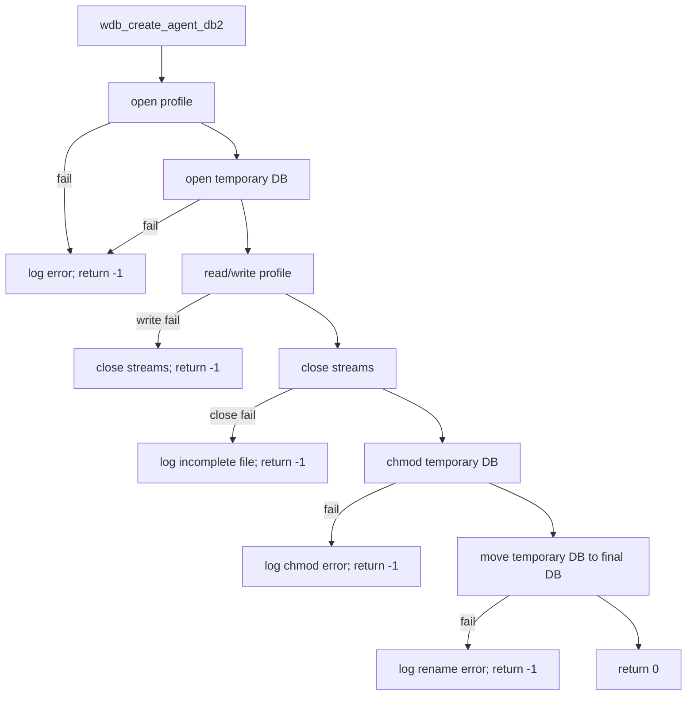

# `test_create_agent_db`

`test_create_agent_db` is a CMocka unit-test module for the Wazuh DB helper `wdb_create_agent_db2()`. It verifies creation of an agent database from the manager database profile, including temporary-file creation, profile copying, file closure, permission setup, and atomic replacement of the final database file.

The source is [`src/unit_tests/wazuh_db/test_create_agent_db.c`](https://github.com/wazuh/wazuh/blob/master/src/unit_tests/wazuh_db/test_create_agent_db.c). The production database lifecycle and SQLite behavior are documented in [wazuh_db](wazuh_db.md), [wazuh_db_engine](wazuh_db_engine.md), and [wazuh_db_daemon_core](wazuh_db_daemon_core.md).

## Purpose and system position

An agent database is materialized beneath `queue/db` using a profile database as its initial content. The test isolates this filesystem-oriented operation from the real filesystem by mocking standard I/O and Wazuh file helpers.

```mermaid
flowchart LR
    T["test_create_agent_db.c"] --> API["wdb_create_agent_db2(\"000\")"]
    API --> P["queue/db/wdb.prof\nprofile input"]
    API --> TMP["queue/db/000.db.new\ntemporary output"]
    TMP --> MODE["chmod temporary file"]
    MODE --> MOVE["OS_MoveFile\n000.db.new → 000.db"]
    MOVE --> DB["queue/db/000.db\nagent database"]
```

The test does not open SQLite, start `wazuh-db`, or validate application tables. It validates the creation protocol and error propagation at the file-operation boundary.

## Architecture

| Component | Responsibility |
|---|---|
| `CMUnitTest` | CMocka test descriptor used to register the cases. |
| `main` | Enables test mode, registers six tests, and runs the group with setup/teardown callbacks. |
| `setup` | Sets the shared `test_mode` flag to `1` before each test. |
| `teardown` | Restores `test_mode` to `0` after each test. |
| `test_wdb_create_agent_db2_ok` | Verifies the complete successful creation and rename flow. |
| `test_wdb_create_agent_db2_wfopen_error` | Verifies failure when the temporary database cannot be opened. |
| `test_wdb_create_agent_db2_fwrite_error` | Verifies failure when copying profile bytes fails. |
| `test_wdb_create_agent_db2_fclose_error` | Verifies failure when the temporary file cannot be closed completely. |
| `test_wdb_create_agent_db2_chmod_error` | Verifies failure when temporary-file permissions cannot be changed. |
| `test_wdb_create_agent_db2_rename_error` | Verifies failure when the temporary file cannot be moved into place. |
| `wdb.h` | Declares the production helper and database path/profile constants. |
| stdio/file/debug wrappers | Provide expectations and controlled return values for I/O, file movement, permissions, and error logging. |



## Successful process flow

For agent ID `000`, the test expects the helper to:

1. Open `queue/db/wdb.prof` in read mode.
2. Open `queue/db/000.db.new` in write mode.
3. Read the profile. The success case uses an empty read, so it focuses on control flow rather than profile contents.
4. Close both streams successfully.
5. Apply permissions to `queue/db/000.db.new` with `chmod`.
6. Move `queue/db/000.db.new` to `queue/db/000.db`.
7. Return `0`.



## Failure behavior

Each failure test sets expectations only through the point being exercised and asserts that `wdb_create_agent_db2()` returns `-1`.

| Case | Injected failure | Expected behavior |
|---|---|---|
| `test_wdb_create_agent_db2_wfopen_error` | Opening `000.db.new` returns `NULL` | Return `-1`, close the profile stream, and log the creation error. |
| `test_wdb_create_agent_db2_fwrite_error` | `fwrite` returns `0` after profile data is read | Return `-1` after closing both streams. |
| `test_wdb_create_agent_db2_fclose_error` | Closing the temporary stream returns `-1` | Return `-1` and log that `000.db.new` was not completed. |
| `test_wdb_create_agent_db2_chmod_error` | `chmod` returns `-1` | Return `-1` and log the permission failure; no move is expected. |
| `test_wdb_create_agent_db2_rename_error` | `OS_MoveFile` returns `-1` | Return `-1` and log the rename failure. |



## Test isolation and mocking

The test includes `wdb.h`, CMocka, and wrapper headers for common helpers, debug logging, file operations, and stdio. Expectations such as `expect_wfopen`, `expect_fread`, `expect_fclose`, `expect_string`, and `will_return` make the test deterministic:

- File paths and modes are checked exactly.
- Stream handles are represented by sentinel pointers `(void *)1` and `(void *)2`.
- `chmod` and `OS_MoveFile` results are injected without touching disk.
- Error-message expectations verify that failure paths report the intended operation.
- `test_mode` allows the wrapped Wazuh helpers to operate in unit-test mode.

This boundary-focused design complements, rather than duplicates, the broader database implementation and test documentation in [wazuh_db_engine](wazuh_db_engine.md), [wazuh_db_global](wazuh_db_global.md), and [wazuh_db_metadata_upgrade](wazuh_db_metadata_upgrade.md).

## Invariants verified

- The profile path is `WDB2_DIR "/" WDB_PROF_NAME`.
- The temporary path is `WDB2_DIR "/000.db.new"`.
- The final path is `WDB2_DIR "/000.db"`.
- A successful result is exactly `0`.
- Any injected open, write, close, permission, or move failure produces `-1`.
- The final move occurs only after the temporary file has been closed and permission setup succeeds.

## Running the tests

Build the repository’s native unit-test targets using the normal Wazuh build configuration, then run the generated `test_create_agent_db` binary or its corresponding CTest target. The exact binary location is build-system dependent. The test requires CMocka but no running daemon or prepared database directory because all filesystem interactions are mocked.

## Related documentation

- [wazuh_db](wazuh_db.md) — overall Wazuh DB subsystem.
- [wazuh_db_engine](wazuh_db_engine.md) — database handles, SQLite execution, transactions, and statement caching.
- [wazuh_db_daemon_core](wazuh_db_daemon_core.md) — daemon lifecycle and runtime context.
- [wazuh_db_global](wazuh_db_global.md) — agent records, groups, labels, and global database operations.
- [wazuh_db_metadata_upgrade](wazuh_db_metadata_upgrade.md) — database metadata and upgrade-related behavior.
- [test_wazuhdb_op](test_wazuhdb_op.md) — unit tests for the Wazuh DB client boundary.
